# 主路线：运动控制 → 物理智能全栈成长路线

**首屏导读**：

- **为谁**：想做人形 / 双足运动控制，并想一路看懂 Physical AI（VLA / World Model / 部署）的算法工程师。
- **怎么走**：L−1 全景入门 → L0–L7 运动控制主干 → L8–L12 Physical AI 全栈扩展，每层都给「读什么 / 做什么 / 输出什么」。
- **五段骨架**：打底（L0–L3）→ 传统控制（L4）→ RL/IL（L5）→ Sim2Real 与全栈出口（L6–L7）→ Transformer · 动作生成 · VLA · 世界模型 · 部署（L8–L12）。

**摘要**：

- **一条主线**：从 L−1 全景到 L7 出口，串通人形 / 双足运动控制；L8–L12 再向上接 Foundation Model、向下接真机部署。
- **L−1 → L3**：机器人技术栈全景与术语，再用数学、运动学、动力学、控制基础打底。
- **L4 → L5**：传统控制主干（LIP/ZMP → Centroidal → MPC → TSID/WBC），再把 RL / IL / 动作重定向接上去。
- **L6 → L7**：sim2real 闭环，以及全栈视角与 2024–2026 前沿地图。
- **L8 → L12**：Transformer / VLM → Action Chunk · Diffusion · Flow Matching · DiT → π0 / GR00T → Cosmos 世界模型 → ONNX / ROS2 / 实时总线上真机。

<a id="roadmap-video"></a>

<figure class="roadmap-video">
<video controls preload="none" playsinline poster="assets/video/roadmap-motion-control-explained-poster.jpg">
<source src="assets/video/roadmap-motion-control-explained.mp4" type="video/mp4">
当前浏览器无法内嵌播放，可<a href="https://imchong.github.io/Robotics_Notebooks/assets/video/roadmap-motion-control-explained.mp4">直接打开视频文件</a>。
</video>
<figcaption><strong>视频讲解</strong>（1:35:35 · 24 章 · 中文配音 + 字幕）：按 L−1 → L0–L7 → L8–L12 逐级讲清每一层的核心要点与原理，自测题在讲解中直接给出答案。<a href="https://imchong.github.io/Robotics_Notebooks/assets/video/roadmap-motion-control-explained.mp4">新标签页打开 / 下载</a> · <a href="https://github.com/ImChong/Robotics_Notebooks/tree/main/media/roadmap-motion-control-video">讲解稿与生成脚本</a></figcaption>
<details class="roadmap-video-chapters">
<summary>章节时间点</summary>
<ol>
<li>00:00 开场：这条路线要回答什么</li>
<li>01:44 全景地图：从 camera image 到 motor torque</li>
<li>05:41 L−1 序言：机器人技术栈全景</li>
<li>08:53 L0 数学与编程基础</li>
<li>12:23 L1 机器人学骨架：FK / IK / Jacobian</li>
<li>16:36 L2 动力学与刚体建模</li>
<li>20:56 L3 控制基础与最优化</li>
<li>27:35 L4 人形运动控制主干：方法链总览</li>
<li>31:01 L4.1 LIP / ZMP：会走路的倒立摆</li>
<li>36:04 L4.2 质心动力学 Centroidal Dynamics</li>
<li>38:48 L4.3 轨迹优化与 MPC</li>
<li>42:09 L4.4 TSID / 全身控制 WBC</li>
<li>45:18 L5 强化学习基础：MDP → PPO</li>
<li>51:56 L5.2 RL 在人形运动控制里的应用</li>
<li>55:50 L5.3 模仿学习：BC · DAgger · DeepMimic · AMP</li>
<li>59:36 L5.4 动作重定向</li>
<li>1:03:42 L6 综合实战：Sim2Real</li>
<li>1:08:15 L7 出口：从运动控制看整个技术栈</li>
<li>1:12:18 L8 Transformer 与表征：从 token 到 VLM</li>
<li>1:15:42 L9 动作生成：Action Chunk · Diffusion · Flow Matching · DiT</li>
<li>1:20:03 L10 VLA / 基础策略：π 系列与 GR00T</li>
<li>1:24:21 L11 世界模型与 Physical AI 平台</li>
<li>1:27:56 L12 部署：从训练好的策略到真机电机</li>
<li>1:31:44 收尾：过滤新工作 · 纵深方向 · 常见卡点 · 全路线回顾</li>
</ol>
</details>
</figure>

## 三句话先懂这条路线

1. **先把传统控制主干打通**：LIP/ZMP → Centroidal → MPC → TSID/WBC。
2. **再把学习方法接上去**：RL/IL 用来补能力，不是替代控制结构。
3. **每一层都要有可运行输出**：代码、实验记录、失败复盘，缺一不可。

> **本路线要回答的终极问题**：一个 Physical AI 系统，从 camera image 到 robot motor torque，中间到底经过了哪些模块？答案见 [Physical AI 全栈视图](#physical-ai-full-stack-view)，逐层展开在 L0–L12。

<a id="roadmap-nav-start"></a>

## 先看哪里（导航）

- 想 **先看一遍视频讲解**：播放页首的 [路线讲解视频](#roadmap-video)（1:35:35，24 章，逐级讲清每层要点与原理）。
- 想 **30 秒先理解整个机器人技术栈**：跳到 [L−1 序言](#l1-序言机器人技术栈全景--怎么读这条路线)。
- 想 **最短可执行路径**：跳到 [最小可执行学习路径（90 天版本）](#最小可执行学习路径90-天版本)。
- 想 **完整路线**：按 L−1 → L0 → … → L7 依次阅读，再进入 L8–L12 的 Physical AI 扩展。
- 想 **先看 Physical AI 全栈地图 / 时间有限只走核心路径**：跳到 [Physical AI 全栈视图](#physical-ai-full-stack-view) 与 [Physical AI Core Path](#physical-ai-core-path)。
- 看到 **新模型 / 新论文不知道要不要学**：先用 [How to filter new Physical AI work](#physical-ai-signal-vs-noise) 过一遍。
- 想 **直接走某个方向**：跳到 [可选纵深](#depth-optional-index)，二十七条独立路线页各自标了适合谁、从主线哪一层衔接。

---

## Physical AI 全栈视图：从 camera image 到 motor torque

<a id="physical-ai-full-stack-view"></a>

**这一节是整条路线的"地图页"。** 本路线以 **Robot Control + Robot Learning + Sim2Real** 为纵向主干（L0–L6），再向上扩展到 **Transformer → 动作生成 → VLA → World Model**（L8–L11），向下落到 **真机部署**（L12）。原有 L0–L7 的编号、标题与内容保持不变，L8–L12 是在其上追加的 Physical AI 扩展层。

### 8 层 + 部署：与本路线章节的对应

| 层 | 这一层要回答什么 | 本路线章节 | 关键节点 |
|----|----------------|-----------|---------|
| **① Robot Fundamentals** | 机器人为什么会动？神经网络最终控制的对象是什么？ | [L0](#l0-数学与编程基础)–[L2](#l2-动力学与刚体建模) | 坐标系 · SO(3) / SE(3) · FK / IK · Jacobian · 刚体 / 接触动力学 · 摩擦 · 执行器 · 状态估计 |
| **② Robot Control** | policy 输出之后，谁把它变成力矩？ | [L3](#l3-控制基础与最优化)–[L4](#l4-人形运动控制主干) | PID / PD · 位置 / 速度 / 力矩控制 · 阻抗 · MIT-style PD · WBC · QP · MPC |
| **③ Robot Learning** | 策略怎么从数据 / 试错里学出来？ | [L5](#l5-强化学习与模仿学习) | MDP → Value → Policy Gradient → Actor-Critic → GAE → PPO；BC · DAgger · DeepMimic · AMP · BeyondMimic · MimicKit |
| **④ Sim2Real** | 仿真里好的策略，为什么真机上会失败？ | [L6](#l6-综合实战) | DR · 观测噪声 · 延迟 · 执行器建模 · SysID · Teacher-Student · Sim2Sim |
| **⑤ Transformer / Representation** | 图像、语言、机器人状态怎么变成同一种"token"？ | [L8](#physical-ai-l8-transformer) | token · embedding · QKV · self / cross-attention · ViT · VLM |
| **⑥ Action Generation** | 为什么现代策略一次输出一段动作，而不是一个动作？ | [L9](#physical-ai-l9-action-generation) | Action Chunk · Diffusion Policy · Flow Matching · DiT · Action Expert |
| **⑦ VLA / Foundation Policy** | 一个模型怎么同时"看懂、听懂、动起来"？ | [L10](#physical-ai-l10-vla) | π0 → π0.5 → 后续 π 模型 · GR00T N1（System 2 / System 1） |
| **⑧ World Model + Physical AI Platform** | 数据不够、真机太贵时，拿什么训练和评测？ | [L11](#physical-ai-l11-world-model) | World Foundation Model · Cosmos · Isaac Sim / Isaac Lab · 合成数据 |
| **Deployment → Real Robot** | 训练好的网络怎么在真机上按时跑起来？ | [L12](#physical-ai-l12-deployment)（系统背景见 [L7.4](#l7-4-system-stack)） | ONNX · TensorRT · ROS2 · ros2_control · Jetson · PREEMPT_RT · CAN / EtherCAT |

### 主干与分支（不是单链）

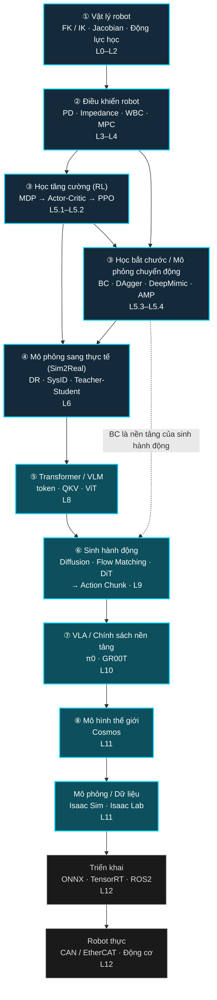

图中只画主干与最关键的一条分支；其余交叉依赖：

- **Simulation → RL**：L11 的仿真平台同样是 L5 RL 训练的场地。
- **Sim2Real → Deployment**：经典 RL 运动策略不经过 VLA，训练后直接走 L12 部署。
- **Control → Real Robot**：无论上层是 PPO 还是 VLA，低层 PD / WBC 始终在环（见 [L3](#policy-vs-low-level-controller)）。
- **Real Robot → Sim2Real**：真机失败回到 [L6 失败来源表](#l6-sim2real-chain) 复盘。

### 一个 Physical AI 系统：从 camera image 到 motor torque

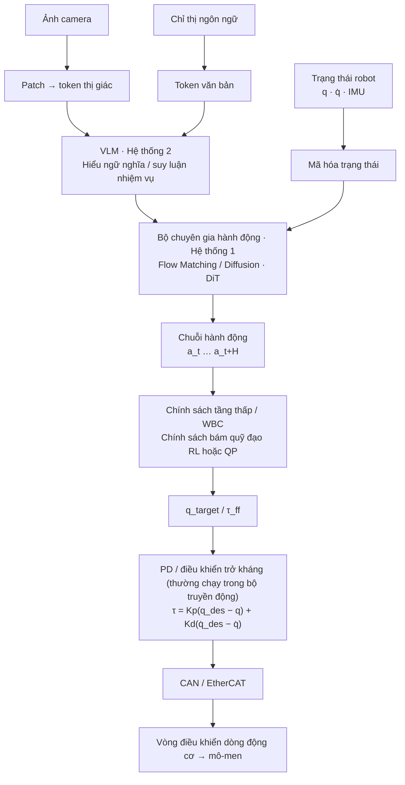

电机编码器与 IMU 的读数再作为下一拍的 Robot state 反馈回来，形成闭环。

| 环节 | 典型频率量级（因平台而异） | 在本路线哪一层 |
|------|--------------------------|--------------|
| VLM 语义理解（System 2） | 较慢；与动作头解耦运行 | L8 / L10 |
| 动作头出 action chunk（System 1） | 端到端网络常 10–50 Hz；GR00T N1 报告约 120 Hz 出 chunk、π0 约 50 Hz 控制 | L9 / L10 |
| 低层 tracking policy / WBC | 平衡与力控需 200–1000 Hz | L4.4 / L5.2 |
| 关节 PD / 电流环 | 驱动器内更高频闭环 | L3 / L12 |

> 频率数字来自站内已有页面：[控制与推理频率解耦](../wiki/concepts/control-inference-frequency-decoupling.md)、[GR00T N1](../wiki/entities/paper-hrl-stack-34-gr00t_n1.md)、[π0](../wiki/entities/paper-pi0.md)。**要点不是具体数字，而是"慢的大模型 + 快的低层控制器"必须分层**——这也是为什么 L3–L4 的控制基础在 VLA 时代仍然不可跳过。

<a id="physical-ai-core-path"></a>

### Physical AI Core Path（时间有限时的最短路径）

如果学习者时间有限，优先按以下顺序，**不要一次学完全部**：

1. Robot Kinematics / Dynamics — [L1](#l1-机器人学骨架) · [L2](#l2-动力学与刚体建模)
2. PD / Torque Control — [L3：Policy ≠ 底层控制器](#policy-vs-low-level-controller)
3. MDP / Actor-Critic — [L5.1](#l5-1-rl-basics)
4. PPO — [PPO](../wiki/methods/ppo.md)
5. DeepMimic / AMP — [L5.3](#l5-3-imitation-learning)
6. Sim2Real — [L6](#l6-综合实战)
7. Transformer / Attention — [L8](#physical-ai-l8-transformer)
8. Diffusion Policy — [L9](#physical-ai-l9-action-generation)
9. Flow Matching / DiT — [L9](#physical-ai-l9-action-generation)
10. π0 / GR00T — [L10](#physical-ai-l10-vla)
11. World Model / Cosmos — [L11](#physical-ai-l11-world-model)
12. Deployment — [L12](#physical-ai-l12-deployment)

建议节奏：**Control → Robot Learning → Sim2Real → Transformer → Action Generation → VLA → World Model**，部署（L12）可在任何一段做完仿真后穿插进行。

<a id="physical-ai-signal-vs-noise"></a>

### How to filter new Physical AI work（Signal vs Noise）

看到一个新模型 / 新论文，先问：

1. 它改变了 Physical AI pipeline 的**哪个模块**（上面 8 层 + 部署中的哪一格）？
2. 是**新的机制**，还是只是新的 model name？
3. 是否**跨机器人 / 跨任务**有效？
4. 是否有 **paper / code / benchmark**？
5. **6–12 个月之后**这个概念是否仍然值得知道？

> **If you cannot place a new work into the roadmap, do not learn it deeply yet.**

**资料选择原则**：每个关键概念最多推荐 **1 个 canonical paper + 1 个官方 project page + 1 个 GitHub + 可选 Hugging Face**，没有对应链接就跳过；优先官方来源，不收二手博客 / 聚合站。L8–L12 的"推荐读什么"都按这个规则写。

---

## L−1 序言：机器人技术栈全景 & 怎么读这条路线

**这一节是给完全没看过机器人的读者准备的"软着陆台阶"。** 资深读者可以直接跳到 [L0 数学与编程基础](#l0-数学与编程基础) 或 [最小可执行学习路径](#最小可执行学习路径90-天版本)。

### 30 秒看懂"一台机器人在干嘛"

把任何机器人——扫地机、机械臂、自动驾驶、人形——拆开看，都在循环跑同一个 4 步：

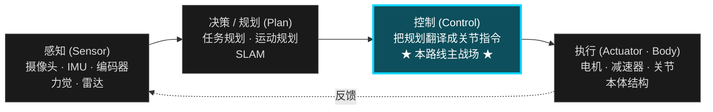

- **感知**：摄像头 / IMU / 编码器 / 力觉 / 雷达 → 让机器人知道"自己在哪、世界长什么样"。
- **决策 / 规划**：高层任务规划、运动规划、SLAM → 决定"要去哪、走哪条路"。
- **控制**：把规划目标变成关节级指令 → 决定"每个关节这一毫秒该出多少力 / 转多少角度"。
- **执行**：电机、减速器、关节、本体结构 → 把指令变成机械运动。

> **本路线只钻第三个盒子：控制。** 其它三盒在 [L7 出口层](#l7-出口从运动控制看整个机器人技术栈) 集中扫盲，给你进入对应子方向的入口。

### 为什么以"人形 / 双足"为主载体

人形 = **高自由度**（20+ 关节）+ **浮动基**（没固定在地面）+ **接触切换**（脚要轮流着地）+ **强不稳定**（重心永远想往外跑）。
学会人形控制，迁移到机械臂、四足、轮式底盘几乎都是降难度，反之不成立。所以人形是当下的"最佳教学载体"。

### 三种读者的不同读法

| 你是谁 | 推荐读法 | 不需要做什么 |
|--------|---------|------------|
| **完全外行**（想搞懂术语，能和工程师对话）| 只读每一 L 的"场景隐喻 / 学完能做什么 / 推荐读什么"和各层「英文缩写速查」 | 不需要写一行代码、不需要做练习 |
| **想入行**（程序员 / 在校生）| 跟 [最小可执行 90 天路径](#最小可执行学习路径90-天版本) → 再按 L0 → L7 全程走，每一层都做"推荐做什么" | 不需要先读完所有论文 |
| **资深从业者**（有相关经验、查漏补缺）| 直接跳 L4 / L5，重点看每层的"常见误区 / 自测题"；用 [可选纵深](#depth-optional-index) 切入研究方向 | 不需要重读 L0–L2 基础 |

### 怎么用每一层

每一个 L（除 L−1 / L7 外）都遵循同一套格式：

1. **场景隐喻** — 一句话比喻，给完全外行用
2. **为什么存在 / 上一层的局限** — 解释这一层为何不可跳过
3. **前置知识 → 核心问题 → 推荐做什么 → 推荐读什么 → 学完输出什么** — 工程化执行清单
4. **常见误区 + 自测题** — 给资深读者快速校准

### 资深读者 skip-to 矩阵

如果你已经在工作中接触过机器人控制，根据你能回答出的问题，可以直接跳到对应 L。**点击下面的按钮直达对应章节：**

<div class="skip-to-buttons" style="display:grid; grid-template-columns:repeat(auto-fit, minmax(260px, 1fr)); gap:12px; margin:18px 0;">
<a class="btn-secondary" href="#l1-机器人学骨架" style="flex-direction:column; padding:14px 18px; text-align:center; border-radius:14px; line-height:1.5;"><strong>我会 NumPy，不懂 SE(3)</strong><span style="opacity:0.7; font-size:0.85em;">→ L1 机器人学骨架</span></a>
<a class="btn-secondary" href="#l2-动力学与刚体建模" style="flex-direction:column; padding:14px 18px; text-align:center; border-radius:14px; line-height:1.5;"><strong>会 Pinocchio FK / Jacobian，不熟 RNEA / CRBA / ABA</strong><span style="opacity:0.7; font-size:0.85em;">→ L2 动力学与刚体建模</span></a>
<a class="btn-secondary" href="#l4-人形运动控制主干" style="flex-direction:column; padding:14px 18px; text-align:center; border-radius:14px; line-height:1.5;"><strong>会固定基逆动力学，浮动基没碰过</strong><span style="opacity:0.7; font-size:0.85em;">→ L4 人形运动控制主干</span></a>
<a class="btn-secondary" href="#l41-lip--zmp" style="flex-direction:column; padding:14px 18px; text-align:center; border-radius:14px; line-height:1.5;"><strong>熟 LQR / MPC，没系统学 LIP / Centroidal / WBC</strong><span style="opacity:0.7; font-size:0.85em;">→ L4.1 LIP / ZMP</span></a>
<a class="btn-secondary" href="#l52-rl-在人形运动控制里的应用" style="flex-direction:column; padding:14px 18px; text-align:center; border-radius:14px; line-height:1.5;"><strong>会 IsaacLab PPO，不知如何和传统控制结合</strong><span style="opacity:0.7; font-size:0.85em;">→ L5.2 RL 在人形运动控制里的应用</span></a>
<a class="btn-secondary" href="#l6-综合实战" style="flex-direction:column; padding:14px 18px; text-align:center; border-radius:14px; line-height:1.5;"><strong>跑通仿真 RL，没做过 sim2real 部署</strong><span style="opacity:0.7; font-size:0.85em;">→ L6 综合实战</span></a>
<a class="btn-secondary" href="#l7-出口从运动控制看整个机器人技术栈" style="flex-direction:column; padding:14px 18px; text-align:center; border-radius:14px; line-height:1.5;"><strong>做过运动控制，想看当下机器人 AI 全景</strong><span style="opacity:0.7; font-size:0.85em;">→ L7 出口与前沿地图</span></a>
</div>

**两条主线不要混着学：**
- **传统控制主线（L0–L4 + L6）：** OCP → LIP/ZMP → Centroidal → MPC → TSID/WBC → State Estimation → Sim2Real
- **Learning-based 主线（L5）：** RL 基础 → locomotion RL → imitation learning / motion prior → motion retargeting → teacher-student
- 优先把传统主线学通，再把 RL / IL 当作扩展层接上去；否则容易只会调超参数、不理解控制结构为什么这样设计。

### 英文缩写速查（L−1 全路线鸟瞰）

| 缩写 | 英文全称 | 简要说明 |
|------|----------|----------|
| DOF | Degrees of Freedom | 机器人能独立运动的方向数；人形常见约 25 DOF。 |
| FK | Forward Kinematics | 关节角 → 末端位姿。 |
| IK | Inverse Kinematics | 末端目标 → 反推关节角。 |
| CoM | Center of Mass | 整机质心；平衡控制的核心状态之一。 |
| ZMP | Zero Moment Point | 接触面内合力矩为零的点；留在支撑多边形内则不易翻倒。 |
| DCM | Divergent Component of Motion | 发散运动分量；用于落点与平衡前瞻。 |
| CP | Capture Point | 踩下即可渐近停稳的落点；常由 DCM 导出。 |
| MPC | Model Predictive Control | 滚动时域内在线求解最优控制。 |
| WBC | Whole-Body Control | 全身多任务力矩分配与约束处理。 |
| TSID | Task-Space Inverse Dynamics | 任务空间逆动力学；WBC 常用实现框架。 |
| PID | Proportional–Integral–Derivative | 经典反馈控制；单关节保底常用。 |
| LQR | Linear Quadratic Regulator | 线性二次最优调节器；平衡 baseline。 |
| RL | Reinforcement Learning | 试错学习策略。 |
| PPO | Proximal Policy Optimization | 常用 on-policy RL 算法。 |
| IL | Imitation Learning | 从示范数据学策略。 |
| BC | Behavior Cloning | 监督模仿；IL 的最简形式。 |
| Sim2Real | Simulation to Reality | 仿真策略迁移真机。 |
| DR | Domain Randomization | 仿真随机化参数以提升真机鲁棒性。 |
| URDF | Unified Robot Description Format | 机器人连杆与关节的 XML 描述格式。 |
| MJCF | MuJoCo XML Format | MuJoCo 仿真用的模型描述格式。 |
| IMU | Inertial Measurement Unit | 惯性测量单元（加速度计 + 陀螺仪等）。 |
| SLAM | Simultaneous Localization and Mapping | 同时定位与建图。 |
| VLA | Vision–Language–Action | 视觉–语言–动作一体大模型路线。 |
| ROS | Robot Operating System | 机器人中间件与通信生态（ROS2 为新一代）。 |

> 各 L 层正文前还有**该层专用**缩写表；外行先扫本表建立「听到能对上号」的肌肉记忆即可。

### 一本贯穿全程的教材：Modern Robotics

[Modern Robotics（Lynch & Park）](../wiki/entities/modern-robotics-book.md) 是本路线 L0–L4 的"语法书"。**它不教人形 locomotion，但它把'位姿 / 速度 / 力 / 动力学'用统一的 twist / screw / wrench 语言讲清楚了。** 后面每一层下面的"推荐读什么"里会指给你具体章节，这里先说一遍它在全程的位置，避免每一层重复引用：

| Modern Robotics 章节 | 接到本路线哪一层 |
|--------------------|----------------|
| Ch 2–3：Configuration Space / Rigid-Body Motions | L0–L1（SE(3) 字母表） |
| Ch 4–6：Forward / Velocity / Inverse Kinematics | L1 |
| Ch 5、Ch 8：Statics / Dynamics of Open Chains | L2 |
| Ch 9：Trajectory Generation | L3 / L4.3 |
| Ch 11：Robot Control | L3 / L4.4 |

> Ch 7（Force Control）、Ch 10（Motion Planning）也很有价值，但相对偏离本路线主干，作为可选。

**官方资源**：[项目页](https://modernrobotics.northwestern.edu/) · [书 PDF 与视频（Northwestern wiki）](https://hades.mech.northwestern.edu/index.php/Modern_Robotics) · [配套代码 NxRLab/ModernRobotics](https://github.com/NxRLab/ModernRobotics)。**不要求读完整本书**——对 Physical AI 路线，重点吃透 **SE(3)、FK / IK、Jacobian、Dynamics** 四块（上表 Ch 2–6、Ch 8）即可。

---

## 最小可执行学习路径（90 天版本）

如果你希望“少而精、尽快跑起来”，可以先只做这 5 件事：

1. 跑通一个 [Locomotion](../wiki/tasks/locomotion.md) 仿真环境（站立 + 前进）。  
2. 实现一个倒立摆 [LQR](../wiki/formalizations/lqr.md) 或简单 [MPC](../wiki/methods/model-predictive-control.md)。  
3. 跑通一个最小 [Whole-Body Control](../wiki/concepts/whole-body-control.md) / [TSID](../wiki/concepts/tsid.md) 示例。  
4. 用 PPO 训练一个基础策略，并阅读 [WBC vs RL](../wiki/comparisons/wbc-vs-rl.md) 做方法取舍。  
5. 完成一次最小 [Sim2Real](../wiki/concepts/sim2real.md) checklist（哪怕只在仿真内做 domain randomization 对比）。  

> 完成这 5 件事后，再回到 L0-L6 补理论，会更快理解“为什么要学这些”。

---

## L0 Khái niệm cơ bản về toán học và lập trình

**Bạn không cần phải đi sâu vào phần này, nhưng bạn không thể bỏ qua nó.**

> **Cảnh ẩn dụ:** Bạn vừa có một con robot, nhưng bạn thậm chí không thể mô tả bằng mã "hướng cánh tay của nó" -L0 Cung cấp cho bạn "từ vựng cấp độ thấp nhất của thế giới robot": vectơ, ma trận, xoay, biến đổi.

> **Tại sao lớp này tồn tại:** Các công thức ở mỗi cấp độ tiếp theo coi "vị trí/vận tốc/lực" là tiếng lóng. KHÔNG L0, mỗi lần đọc một dòng công thức phải kiểm tra ngay tại chỗ.

### Kiểm tra nhanh chữ viết tắt tiếng Anh (L0）

| viết tắt | Tên tiếng Anh đầy đủ | Mô tả ngắn gọn |
|------|----------|----------|
| SE(3) | Nhóm Euclide đặc biệt trong không gian 3D | Nhóm toán học của các tư thế cơ thể cứng nhắc ba chiều (xoay + dịch chuyển). |
| SO(3) | Nhóm trực giao đặc biệt trong 3D | Một nhóm bao gồm các ma trận quay ba chiều;\(R^\top R=I,\ \det R=1\)。 |
| PoE | Sản phẩm của số mũ | Động học thuận được biểu diễn bằng ma trận nhân theo hàm mũ của các trục xoắn ốc. |
| FK | Chuyển tiếp động học | biến khớp → tư thế cuối (L0 Luôn luôn tiếp xúc với các khái niệm trước tiên,L1 đi sâu). |
| QP | Lập trình bậc hai | quy hoạch thứ cấp; theo dõi MPC / WBC dạng tối ưu hóa cơ bản. |
| SVD | Phân tách giá trị số ít | Phân rã giá trị số ít; thường được sử dụng khi hiểu thứ hạng Jacobian và sự dư thừa. |

### kiến thức tiên quyết
- Toán THPT + một chút trực giác tính toán
- Có thể viết Python (có thể đọc, sửa đổi và chạy)

### vấn đề cốt lõi
- Cách sử dụng đại số tuyến tính trong robot (ma trận, vectơ, phép biến đổi)
- Trực giác cho các vấn đề tối ưu hóa là gì?

### Những gì được khuyến khích
- Đặt Python/ NumPy / Pinocchio Một bộ mã môi trường có thể được chạy qua
- Không cần nghiên cứu câu hỏi nhưng cần có cảm nhận và trực giác
- sử dụng Modern Robotics Toàn bộ thư viện Python được hỗ trợ `MatrixExp3`、`MatrixExp6`、`FKinSpace` Đối với loại chức năng tối thiểu này, hãy xác nhận rằng bạn có thể kết nối chỉ số ma trận và chuyển đổi tư thế cơ thể cứng nhắc.

### Đọc gì
- **[Giám tuyển học đại số tuyến tính](../wiki/entities/linear-algebra-curriculum.md)**（L0 Cổng chính):[Georgia Tech *Đại số tuyến tính tương tác*](https://textbooks.math.gatech.edu/ila/) + [Axler *Đại số tuyến tính Thực hiện đúng* 4e（PDF）](https://linear.axler.net/LADR4e.pdf) + [3Blue1Brown trực giác hình học](https://www.3blue1brown.com/topics/linear-algebra);Tài liệu mở rộng (Strang 18.06, v.v.) xem trang giám tuyển
- [Modern Robotics](../wiki/entities/modern-robotics-book.md) Ch 2-3: Không gian cấu hình, Chuyển động cơ thể cứng nhắc
- [SE(3) thể hiện](../wiki/formalizations/se3-representation.md)
- [So sánh các phương pháp biểu diễn xoay (SO(3)）](../wiki/comparisons/so3-rotation-representations.md) — Euler/quaternion/ma trận/so(3) / Ưu nhược điểm 6D và lựa chọn
- [Pinocchio](../wiki/entities/pinocchio.md) / [Crocoddyl](../wiki/entities/crocoddyl.md)
- Nền bù đắp **Cánh tay công nghiệp/tự học không chuyên ngành**：[Hướng dẫn nghiên cứu robot nguồn mở (qqfly)](../wiki/entities/learn-robotics-qqfly-guide.md) Danh sách kiểm tra thực hành lập trình và bắt đầu của Craig

### Kết quả đầu ra sau khi học là gì
- Có thể được sử dụng NumPy Viết các phép toán ma trận đơn giản
- Có thể chạy qua bản demo động học chuyển tiếp của cánh tay robot

### Câu hỏi tự kiểm tra (có thể trả lời sau khi học)
- ma trận xoay \(R\) Tại sao chúng ta không thể thực hiện phép cộng/nội suy trực tiếp? Thay vào đó, bạn sẽ sử dụng cái gì để nội suy giữa hai hướng?
- được cho SE(3) yếu tố \(g = (R, p)\), vectơ \(v\) Biểu diễn trong hệ tọa độ mới là gì?
- chỉ số ma trận \(\exp([\omega]_\times)\) Những ưu điểm và nhược điểm của việc mô tả phép quay với góc/bậc bốn Euler là gì?

<details class="selftest-answers">
<summary>Câu trả lời tham khảo (bấm vào để mở rộng)</summary>

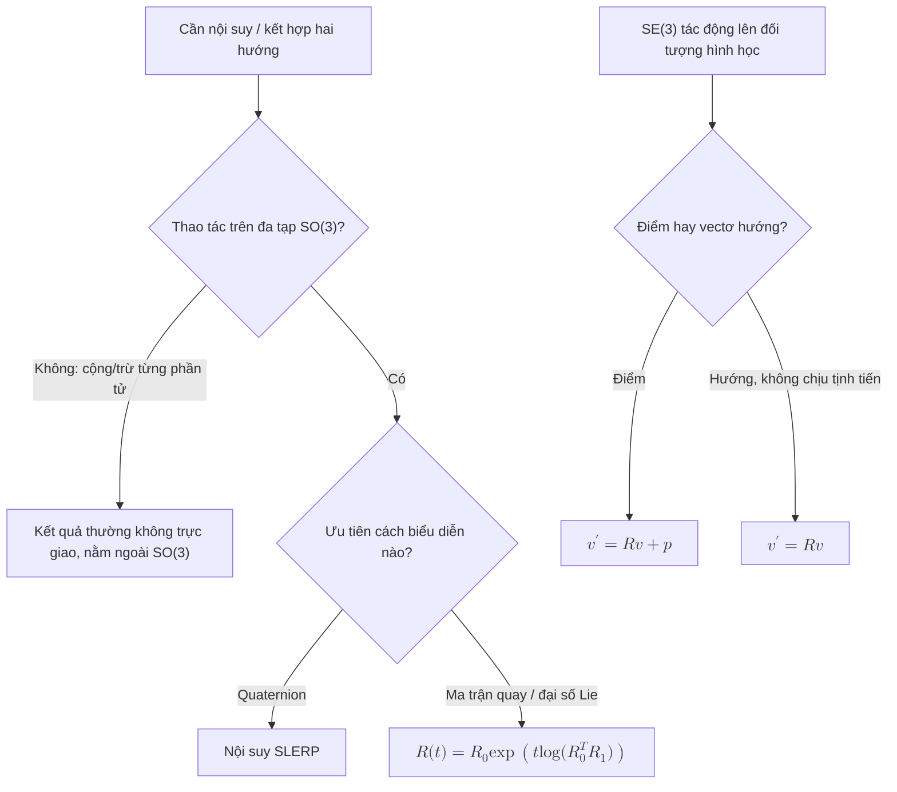

<ol>
<li><strong>Tại sao R không thể thêm/nội suy trực tiếp:</strong> Ma trận xoay thuộc về SO(3) đa dạng (\(R^\top R=I,\ \det R=1\)), không phải là không gian vectơ; sau khi cộng từng phần tử hoặc nội suy tuyến tính, nó thường không còn trực giao và sẽ nhảy ra ngoài SO(3). Hướng nội suy nên được thực hiện trên đa tạp: quaternion SLERP, hoặc trên đại số Lie \(R(t)=R_0\exp\!\big(t\log(R_0^\top R_1)\big)\)。</li>
<li><strong>SE(3) Hành động trên điểm/vectơ:</strong> Dưới tọa độ đồng nhất \(\tilde v' = g\,\tilde v\), khai triển đó là \(v' = Rv + p\)(điểm, có thể dịch); nếu như \(v\) là vectơ hướng tự do (không chịu sự dịch chuyển) thì nó chỉ quay \(v' = Rv\). Điều quan trọng là phải phân biệt giữa "điểm" và "hướng".</li>
<li><strong>Số mũ ma trận/góc Euler/bậc bốn:</strong> Ma trận quay + số mũ ma trận không có điểm kỳ dị, có thể được gộp trực tiếp và thống nhất với đại số xoắn / Lie (PoE、Jacobian dựa trên nó), nhưng 9 số + 6 ràng buộc là dư thừa; Góc Euler chỉ có 3 số, trực quan nhưng có tính kỳ dị khóa vạn năng, không duy nhất và sai phân nội suy; quaternion là 4 số, không có số kỳ dị, hợp số/ SLERP Hiệu quả và ổn định, nhưng độ phủ sóng gấp đôi (\(q\) Và \(-q\) đại diện cho cùng một phép quay). Các biểu thức bậc bốn và chuỗi được sử dụng để tính toán nội bộ trong kỹ thuật FK Chỉ sử dụng ma trận/chỉ số ma trận và góc Euler cho đầu vào và đầu ra mà con người có thể đọc được.</li>
</ol>
</details>

---

## L1 机器人学骨架

**这条是所有后续内容的基座，跳过后面一定会补。**

> **场景隐喻：** 你盯着机器人胳膊关节角度的变化，能不能马上脑补出末端走出的轨迹？L1 教你这个翻译器：关节空间 ↔ 任务空间。

> **上一层的局限：** L0 让你能写矩阵运算，但还不知道"机器人的关节角"和"末端位姿"是什么映射；L1 把这个翻译器搭起来。

### 英文缩写速查（L1）

| 缩写 | 英文全称 | 简要说明 |
|------|----------|----------|
| FK | Forward Kinematics | 关节角 → 末端位姿。 |
| IK | Inverse Kinematics | 末端目标 → 关节角；6R 臂常有多组解。 |
| DH | Denavit–Hartenberg | 经典连杆参数化；本路线更推荐 PoE / twist。 |
| PoE | Product of Exponentials | 螺旋轴 + 矩阵指数描述开链 FK。 |
| \(J\) / Jacobian | Manipulator Jacobian | 关节速度 → 末端 twist 的线性映射。 |
| Twist | Spatial Velocity (6D) | 刚体瞬时速度（角速度 + 线速度）。 |
| Screw | Twist + Pitch | 螺旋运动；PoE 中关节轴即 screw axis。 |
| Wrench | Spatial Force (6D) | 力 + 力矩的六维广义力。 |
| Ad | Adjoint Transformation | 在不同坐标系间变换 twist / wrench 的 \(6\times6\) 矩阵。 |

**这一层建议分三步走，不要一口气啃完：**

1. **L1.1 SE(3)、旋转与刚体变换** — 把"位姿"用数学描述清楚（旋转矩阵、齐次变换、Twist / Screw Axis、矩阵指数 / PoE）。这是后面所有内容的字母表。
2. **L1.2 正逆运动学（FK / IK）** — 关节角 ↔ 末端位姿。先用 PoE 公式手写 FK 验证 Pinocchio 的输出再说。
3. **L1.3 雅可比与速度运动学** — 关节速度 ↔ 末端速度，space Jacobian 与 body Jacobian 的区别；这是 L4 任务空间控制的入门钥匙。

> 这三步共用下方同一份"推荐做什么 / 推荐读什么 / 学完输出什么"清单，按上面的顺序推进即可。

### 前置知识
- L0 内容
- 刚体在三维空间里怎么旋转、怎么描述朝向

### 核心问题
- 机器人每个关节的角度和末端执行器位置是什么关系
- 怎么用数学描述这件事
- 正逆运动学是什么
- 为什么 twist、screw axis、PoE 比只记 D-H 参数更适合接后面的 Pinocchio / TSID / WBC

### 推荐做什么
- 用 Pinocchio 或 Robotics Toolbox 建模一个简单机械臂
- 写出正运动学和逆运动学代码
- 理解雅可比矩阵是什么
- 用 Modern Robotics 的 PoE 公式手写一个 2-3 自由度机械臂的 `FKinSpace` / `JacobianSpace`，再和 Pinocchio 输出对齐

### 推荐读什么
- [Modern Robotics](../wiki/entities/modern-robotics-book.md) Ch 4-6：Forward Kinematics、Velocity Kinematics、Inverse Kinematics
- [正向运动学](../wiki/formalizations/forward-kinematics.md) / [逆运动学](../wiki/formalizations/inverse-kinematics.md) / [雅可比矩阵](../wiki/formalizations/robot-jacobian.md)（深蓝《具身智能基础》08–10）
- [斯坦福《机器人学导论》(B站)](https://www.bilibili.com/video/BV17T421k78T/)
- 跑通 Pinocchio 官方 Tutorial
- [Humanoid Robot](../wiki/entities/humanoid-robot.md)
- [Floating Base Dynamics](../wiki/concepts/floating-base-dynamics.md)

### 学完输出什么
- 能自己建模一个简单机器人并计算正逆运动学
- 能解释雅可比矩阵在机器人里是什么、有什么用
- 能区分 space Jacobian 与 body Jacobian，并知道它们在任务空间控制里如何进入速度/力映射

### 自测题（学完应能答出）
- 给定 space Jacobian \(J_s\)，怎么算 body Jacobian \(J_b\)？两者在任务空间速度控制里的应用差别在哪？
- 6 自由度机械臂的 IK 一般有几组解？"肘部上 / 肘部下"是怎么来的？
- PoE 公式相比 D-H 参数最大的工程优势是什么？为什么 Pinocchio / TSID 都建立在 twist / screw 上？

<details class="selftest-answers">
<summary>参考答案（点击展开）</summary>

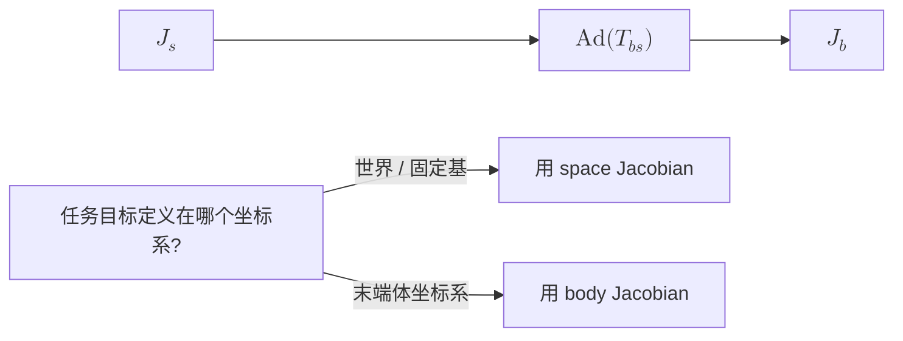

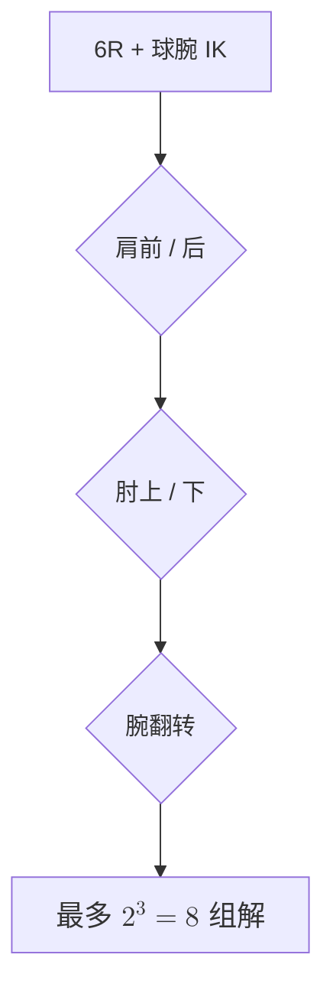

<ol>
<li><strong>space ↔ body Jacobian：</strong> \(J_b = [\mathrm{Ad}_{T_{bs}}]\,J_s\)，其中 \(T_{bs}=T_{sb}^{-1}\)、\([\mathrm{Ad}]\) 为 6×6 伴随矩阵。\(J_s\) 把关节速度映射到"在固定基坐标系下表达的"末端 twist，\(J_b\) 映射到"在末端体坐标系下表达的"twist。目标定义在哪个坐标系就用对应 Jacobian：视觉伺服 / 末端力控常用 \(J_b\)，世界系目标用 \(J_s\)。</li>
<li><strong>IK 解的个数：</strong> 带球型手腕的 6R 机械臂最多 8 组解，来自肩前 / 后、肘上 / 下、腕翻转三个二元选择（\(2^3=8\)）；一般非球腕 6R 最多可达 16 组。"肘上 / 肘下"来自求肘关节角时的 \(\pm\) 二次解——同一末端位姿，肘可朝上拱或朝下拱。</li>
<li><strong>PoE 相比 D-H：</strong> PoE 只需各关节螺旋轴 + 零位姿，几何清晰、无需在每个连杆摆 D-H 坐标系（D-H 对零位 / 坐标选取敏感、对树形与浮动基不友好）；且 PoE 天然用 twist / screw 表达，与速度运动学（Jacobian 的列即变换后的螺旋轴）、wrench、李群 / 李代数、动力学是同一套语言。Pinocchio / TSID 全程基于 twist / wrench / SE(3)，所以 PoE 衔接无缝。</li>
</ol>
</details>

---

## L2 动力学与刚体建模

**从运动学到动力学，是控制机器人最重要的跳跃。**

> **场景隐喻：** 你给机器人一个力矩，它会怎么动？L2 把"几何空间"升级成"力学空间"——从描述位姿过渡到描述运动和力的因果关系。

> **上一层的局限：** L1 运动学只回答"关节角速度 ↔ 末端速度"是怎么映射的，但不能回答"加多大力矩才能让它产生这个加速度"。没有动力学，你只能做位置控制，碰到接触、高速运动、力交互就崩。

### 英文缩写速查（L2）

| 缩写 | 英文全称 | 简要说明 |
|------|----------|----------|
| RNEA | Recursive Newton–Euler Algorithm | 逆动力学：\((q,\dot q,\ddot q)\to\tau\)，\(O(n)\)。 |
| CRBA | Composite Rigid Body Algorithm | 组装质量矩阵 \(M(q)\)，\(O(n^2)\)。 |
| ABA | Articulated Body Algorithm | 正动力学：\(\tau\to\ddot q\)，\(O(n)\)，仿真常用。 |
| FB | Floating Base | 底座不固定；人形躯干为 6 自由度浮动基。 |
| CoM | Center of Mass | 质心位置；与 centroidal 动量紧密相关。 |
| CMM | Centroidal Momentum Matrix | 广义速度 → 6D 质心动量的映射 \(h_g=A_g\dot q\)。 |
| ID | Inverse Dynamics | 给定运动求所需广义力。 |
| FD | Forward Dynamics | 给定广义力求加速度。 |

**这一层建议分两步走：**

1. **L2.1 单刚体 / 固定基开链动力学** — 质量矩阵 \(M(q)\)、科里奥利 / 重力项、正逆动力学（RNEA / CRBA / ABA）。先把 Pinocchio 的 API 跑通，对照 Modern Robotics Ch 8 验证。
2. **L2.2 浮动基与接触动力学** — 把固定基的方法推广到没有固定底座 + 间歇接触的人形机器人。重点：浮动基状态表示、接触约束如何写成 Jacobian、Centroidal Momentum Matrix 的物理意义。

> 重要：进 L4 前 L2.2 必须懂，否则 LIP / Centroidal MPC / WBC 全是"魔法"。

### 前置知识
- L1 内容（运动学）
- 一点微积分和常微分方程直觉

### 核心问题
- 关节力矩怎么驱动机器人运动
- 质量矩阵、重力项、科里奥利项是什么
- 浮动基系统（人形机器人的躯干）为什么不能用固定基方法
- wrench、Jacobian transpose、虚功原理如何把任务空间力映射到关节力矩

### 推荐做什么
- 用 Pinocchio 写一个单刚体动力学正逆动力学 Demo
- 理解 centroidal dynamics 的基本形式
- 理解浮动基系统的状态表示问题
- 用 Modern Robotics Ch 8 的开链动力学接口跑一遍 `InverseDynamics` / `MassMatrix` / `ForwardDynamics`，再对照 Pinocchio 的 RNEA / CRBA / ABA

### 推荐读什么
- [Modern Robotics](../wiki/entities/modern-robotics-book.md) Ch 5、Ch 8：Statics、Dynamics of Open Chains
- Featherstone 《Robot Dynamics》相关章节
- Pinocchio 文档的 Centroidal 部分
- [Floating Base Dynamics](../wiki/concepts/floating-base-dynamics.md)
- [Gravity Compensation](../wiki/concepts/gravity-compensation.md) — $g(q)=\mathrm{RNEA}(q,0,0)$ 的控制用法
- [Centroidal Dynamics](../wiki/concepts/centroidal-dynamics.md)
- [Contact Dynamics](../wiki/concepts/contact-dynamics.md) / [Contact Wrench Cone](../wiki/formalizations/contact-wrench-cone.md)

### Physical AI 视角补充：摩擦 · 执行器 · 状态估计

神经网络最终控制的不是"理想刚体"，而是 **带摩擦、带延迟、带饱和的电机 + 传动**，并且它看到的状态是 **估计值** 而不是真值。这三件事是 L6 sim2real gap 的主要来源，在 L2 先建立概念：

- **摩擦**：库仑 + 粘滞 + Stribeck，减速器越大越明显 → [关节摩擦模型](../wiki/concepts/joint-friction-models.md) / [摩擦补偿](../wiki/concepts/friction-compensation.md)
- **执行器 / 电机**：力矩常数、饱和、带宽、电流环；仿真里常被理想化 → [显式 / 隐式执行器建模](../wiki/concepts/implicit-explicit-actuator-modeling.md) / [Actuator Network](../wiki/methods/actuator-network.md)
- **状态估计**：浮动基位姿 / 速度靠 IMU + 编码器融合，policy 的观测质量取决于它 → [State Estimation](../wiki/concepts/state-estimation.md)

### 学完输出什么
- 能解释正逆动力学在机器人控制里的作用
- 能理解 centroidal dynamics 为什么重要
- 对"这个力矩能让机器人产生什么运动"有直觉
- 能把"任务空间力 / 接触 wrench → 关节力矩"的关系写成 Jacobian transpose 形式

### 自测题（学完应能答出）
- 写出固定基开链机器人动力学方程标准形式，分别解释 \(M(q)\)、\(C(q,\dot q)\dot q\)、\(g(q)\) 的物理意义。
- 为什么浮动基系统的状态需要 \((q, \dot q, \text{base pose}, \text{base vel})\) 而不能只用 \((q, \dot q)\)？
- 给定接触点 Jacobian \(J_c\) 和接触力 \(f_c\)，从接触力到关节力矩的映射是什么？为什么这是 WBC 的核心一步？
- RNEA / CRBA / ABA 分别求什么、计算复杂度差异在哪？Pinocchio 里典型一个 1 kHz 控制循环你会用哪个？

<details class="selftest-answers">
<summary>参考答案（点击展开）</summary>


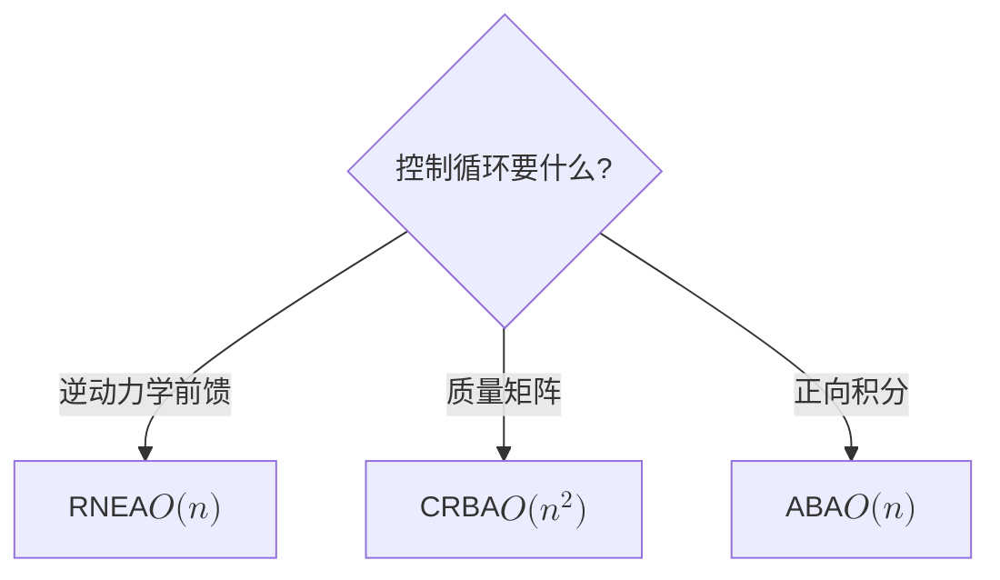

<ol>
<li><strong>固定基动力学标准形式：</strong> \(M(q)\ddot q + C(q,\dot q)\dot q + g(q) = \tau\)。\(M(q)\)：对称正定质量 / 惯量矩阵，刻画产生加速度所需的广义力（惯性）；\(C(q,\dot q)\dot q\)：科里奥利与离心项，源于惯量随构型变化及速度耦合；\(g(q)\)：重力广义力。</li>
<li><strong>浮动基为何需 base 状态：</strong> 浮动基躯干没有固定底座，其 6 维位姿本身是自由变量。只用关节量 \((q,\dot q)\) 无法表达整机在世界中的平移 / 旋转与动量，也写不出 CoM / ZMP / 接触等平衡约束，故状态须含 base pose 与 base vel，总维度约为 \((n+6)\) 位姿 + \((n+6)\) 速度。</li>
<li><strong>接触力到关节力矩：</strong> \(\tau = J_c^\top f_c\)（虚功原理 / Jacobian 转置）。这是 WBC 核心一步：机器人能直接控制的只有关节力矩 \(\tau\)，而平衡靠接触力 \(f_c\)；WBC 在动力学与接触约束下求 \((\ddot q, f_c, \tau)\)，\(J_c^\top\) 正是把"想要的接触力"翻译成"每个关节该出多少力矩"的桥梁。</li>
<li><strong>RNEA / CRBA / ABA：</strong> RNEA 求逆动力学（由 \(q,\dot q,\ddot q\) 得 \(\tau\)），\(O(n)\)；CRBA 求质量矩阵 \(M(q)\)，\(O(n^2)\)；ABA 求正动力学（由 \(\tau\) 得 \(\ddot q\)），\(O(n)\)。1 kHz WBC 循环要的是逆动力学 / 力矩前馈，用 RNEA（需要 \(M\) 喂给 QP 时再配 CRBA）；ABA 主要用于仿真器正向积分。</li>
</ol>
</details>

---

## L3 控制基础与最优化

**没有控制理论，后面的 MPC / WBC / RL 全都接不上。**

> **场景隐喻：** 你已经能算"力矩 ↔ 加速度"了，但现在的问题是：具体每一时刻该输出多少力矩，机器人才能**按你想的**轨迹运动？L3 把"算力矩"升级成"在线决策力矩"。

> **上一层的局限：** L2 动力学告诉你"输入力矩 → 输出加速度"的物理关系，但不告诉你"现在该输入多少力矩"——这是控制器的工作。L3 是 L4 所有方法（LIP / MPC / WBC）的底层语法。

### 英文缩写速查（L3）

| 缩写 | 英文全称 | 简要说明 |
|------|----------|----------|
| OCP | Optimal Control Problem | 最优控制问题；MPC / TrajOpt 的数学外壳。 |
| PID | Proportional–Integral–Derivative | 经典反馈；关节级跟踪保底。 |
| LQR | Linear Quadratic Regulator | 无限时域线性二次最优反馈 \(u=-Kx\)。 |
| MPC | Model Predictive Control | 有限时域滚动优化；可含约束。 |
| QP | Quadratic Programming | 二次规划；WBC / 凸 MPC 的核心求解形式。 |
| HQP | Hierarchical Quadratic Programming | 分层 QP；用零空间实现任务优先级。 |
| PD | Proportional–Derivative | 比例–微分控制；常与 computed torque 联用。 |
| CT | Computed Torque Control | 用逆动力学前馈 + 反馈跟踪期望轨迹。 |

### 前置知识
- L2 内容（动力学）
- 一点数值优化直觉（见 [Numerical Optimization Curriculum](../wiki/entities/numerical-optimization-curriculum.md)）

### 核心问题
- PID / LQR / MPC 分别在解决什么问题
- QP（二次规划）是什么，为什么在机器人控制里到处都是
- 最优控制的核心思想是什么
- 轨迹生成、反馈控制和约束优化分别处在控制栈的哪一层

### 推荐做什么
- 用 Python 写一个倒立摆的 LQR 控制器
- 用 qpOASES 或 OSQP 跑一个简单 QP
- 理解 MPC 的滚动时域思想
- 复现 Modern Robotics Ch 9 的三次/五次时间缩放轨迹，并给一个机械臂末端轨迹加 PD / computed torque tracking

### 推荐读什么
- [Modern Robotics](../wiki/entities/modern-robotics-book.md) Ch 9、Ch 11：Trajectory Generation、Robot Control
- [Underactuated Robotics](https://arxiv.org/abs/1709.10219)（TEDRAKE）
- 《Robotics: Modelling, Planning and Control》- Siciliano 相关章节
- [LQR](../wiki/formalizations/lqr.md)
- [Optimal Control](../wiki/concepts/optimal-control.md)
- [Model Predictive Control (MPC)](../wiki/methods/model-predictive-control.md) / [Trajectory Optimization](../wiki/methods/trajectory-optimization.md)
- [Whole-Body Control](../wiki/concepts/whole-body-control.md) / [HQP](../wiki/concepts/hqp.md) / [零空间控制](../wiki/concepts/null-space-control.md)
- [Numerical Optimization Curriculum](../wiki/entities/numerical-optimization-curriculum.md)（数值优化 L0+ 课程地图）、[CMU Optimal Control 2025](../wiki/entities/cmu-optimal-control-curriculum.md)（16-745 公开录像策展）

<a id="policy-vs-low-level-controller"></a>

### Policy ≠ 底层控制器：从 q_target 到电机力矩

**learning policy 和 low-level controller 不是同一个东西。** 绝大多数人形 RL / VLA 策略并不直接输出电流，而是输出关节目标，再由底层控制器闭环：

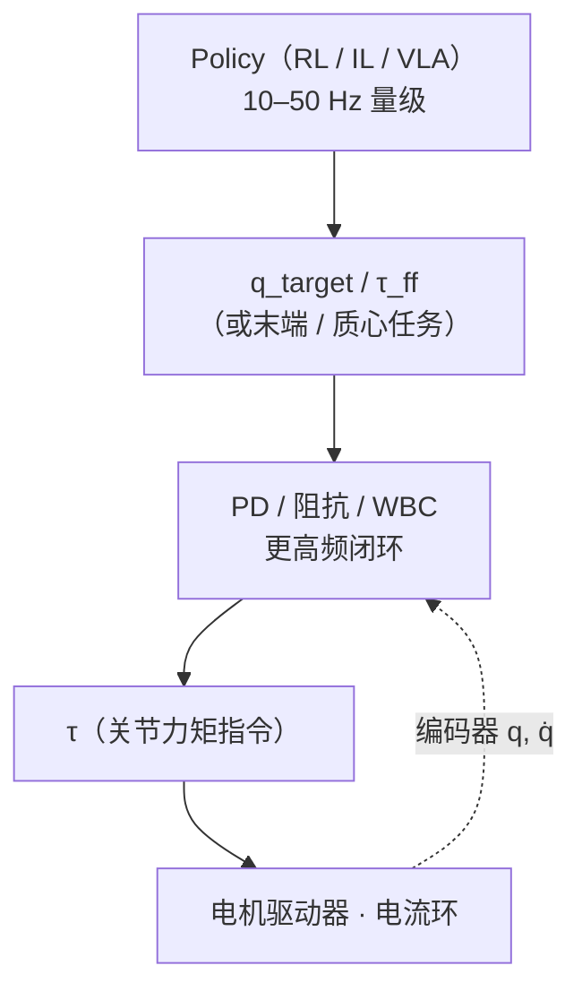

最常见的一层就是关节 PD（"MIT-style PD"，常称 MIT 模式：驱动器同时接收 \(q_{des}, \dot q_{des}, K_p, K_d, \tau_{ff}\) 五个量并在驱动器内闭环；这种接口形式随 [MIT Mini Cheetah](../wiki/entities/mit-mini-cheetah.md) 开源驱动器普及）：

$$\tau = K_p\,(q_{des} - q) + K_d\,(\dot q_{des} - \dot q) + \tau_{ff}$$

| 控制模式 | 上层给什么 | 适合 | 与 policy 的关系 |
|---------|-----------|------|-----------------|
| **Position Control** | \(q_{des}\)（高增益） | 工业臂、慢速精确定位 | 刚性大，接触冲击差 |
| **Velocity Control** | \(\dot q_{des}\) | 轮式、底盘 | 人形关节少用 |
| **Torque Control** | \(\tau\) | WBC / 力控 / 高动态 | 需要准确动力学与电机模型 |
| **Impedance / PD（MIT-style）** | \(q_{des}, K_p, K_d, \tau_{ff}\) | 人形 RL 的主流动作空间 | policy 出 \(q_{des}\)，\(K_p, K_d\) 决定"软硬" |
| **Whole-Body Control / QP / MPC** | 任务空间目标 | 多接触、多任务 | 见 [L4](#l4-人形运动控制主干)，也可作为 policy 的下层 |

- 重点不是公式推导，而是：**同一个 policy 换一套 \(K_p, K_d\) 或控制频率，真机行为就会变**——这是 L6 sim2real 的第一类坑。
- 延伸：[PID Control](../wiki/methods/pid-control.md) · [阻抗控制](../wiki/concepts/impedance-control.md) · [Computed Torque Control](../wiki/methods/computed-torque-control.md) · [人形 RL 的 PD 增益怎么设](../wiki/queries/legged-humanoid-rl-pd-gain-setting.md)

### 学完输出什么
- 能解释 LQR 和 MPC 的区别
- 能理解 QP 在 WBC 里是解决什么问题的
- 能自己搭一个简单模型的 MPC
- 能说明 computed torque、PD、阻抗控制与后续 WBC 任务控制之间的关系

### 自测题（学完应能答出）
- LQR 和 MPC 在什么情况下解出来的控制律完全等价？哪些条件破坏后必须用 MPC？
- 给一个 QP 问题，怎么判断它是不是凸的？为什么 WBC 强烈倾向于凸 QP？
- HQP（Hierarchical QP）的"优先级"是怎么从数学上实现的（提示：null-space projection）？
- 阻抗控制和导纳控制的本质区别是什么？什么时候用前者、什么时候用后者？

<details class="selftest-answers">
<summary>参考答案（点击展开）</summary>

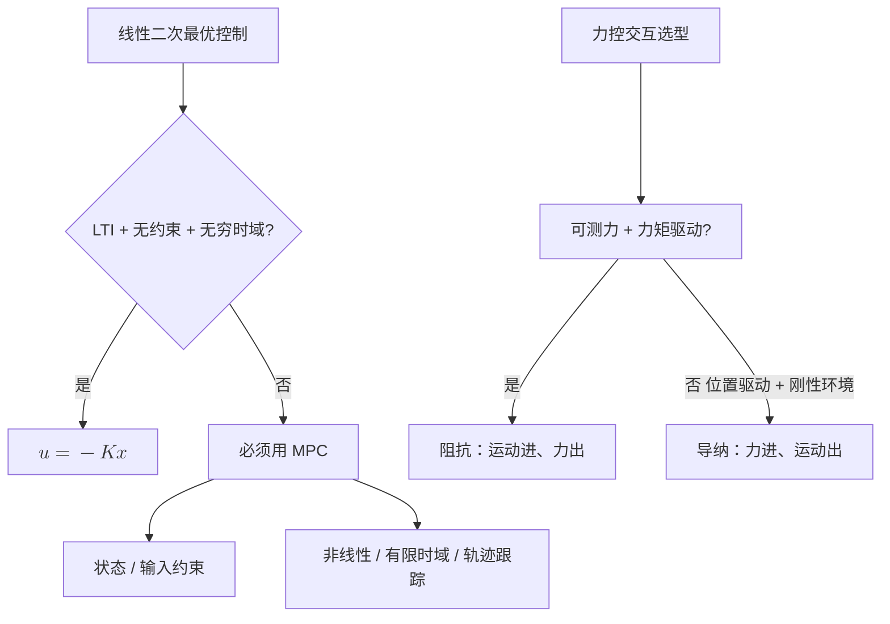

<ol>
<li><strong>LQR 与 MPC 何时等价：</strong> 当系统线性时不变、代价二次、无约束、且 MPC 预测时域趋于无穷时，MPC 的解就是无限时域 LQR 的反馈律 \(u=-Kx\)。一旦出现状态 / 输入约束（最常见）、非线性、有限 / 时变时域或需跟踪参考轨迹，就必须用 MPC。</li>
<li><strong>QP 凸性判定：</strong> 目标函数 Hessian 半正定（\(\tfrac12 x^\top P x\) 中 \(P\succeq 0\)）、约束为线性等式加凸（仿射）不等式，即为凸。WBC 偏好凸 QP，因其有唯一全局最优、求解快且确定性收敛，OSQP / qpOASES 能在 1 kHz 实时求解；非凸会有局部极小、求解时间不可控，对实时安全控制不可接受。</li>
<li><strong>HQP 优先级的数学实现：</strong> 用零空间投影（null-space projection）：先在最高优先级任务里求解，低优先级只能在不破坏高优先级的零空间内优化——\(\dot q = J_1^{+}\dot x_1 + N_1 z\)，其中 \(N_1 = I - J_1^{+}J_1\) 是任务 1 的零空间投影，逐层投影。等价地，多层 QP 把上层最优值作为下层的等式约束（lexicographic 求解）。</li>
<li><strong>阻抗 vs 导纳：</strong> 本质是因果方向相反。阻抗控制"输入运动、输出力"：按位置 / 速度偏差经 \(F=K\Delta x + D\Delta\dot x\) 生成力（力矩驱动器，环境刚则自身柔顺）；导纳控制"输入力、输出运动"：按测得外力生成位置参考（位置驱动器）。环境软 / 未知、需高带宽柔顺与碰撞安全（人形腿）用阻抗；驱动器只能精确位置控制、面对刚性环境且要高位置精度（工业装配）用导纳。</li>
</ol>
</details>

---

## L4 人形运动控制主干

**这是本路线的核心。**

> **场景隐喻：** 你已经能给机械臂做位置控制，但人形机器人没有固定底座、还要随时切换支撑脚——L4 教你把"通用控制理论"重新组织成"专门给人形用"的分层方法链。

> **上一层的局限：** L3 的方法（PID / LQR / MPC / QP）在固定基机器人上很直接，但人形是浮动基 + 间歇接触 + 高维欠驱动，不能直接套；需要专门的简化模型（LIP / Centroidal）和分层结构（MPC + WBC）。

### L4.0 桥段：怎么把 L1–L3 串成 L4 的方法链

L4 是本路线最陡的台阶。**进入 L4.1 前先建立一个"为什么是这个顺序"的心智模型，比直接看每个子方法重要得多。**

人形控制的核心矛盾是：**全身动力学维度太高、非线性强、接触切换密集**——直接拿 L3 学到的通用 LQR / MPC 套不上去。解决方式不是发明新数学，而是按"模型从粗到细、控制从慢到快"两条轴拆分：

| 轴 | 含义 | 实例 |
|---|---|---|
| **模型粒度** | 用多少状态变量描述机器人 | LIP（3 维）→ Centroidal（6 维 momentum + 接触力）→ 全身动力学（n+6 维） |
| **控制频率** | 在哪个时间尺度上做决策 | Footstep / 高层规划（1–10 Hz）→ MPC（50–200 Hz）→ WBC（1 kHz）|

L4 的方法链就是把这两条轴**串联**起来：

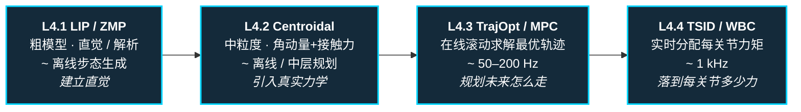

学每个子方法时，始终用三件事检查自己是否真的学懂：

1. **原理**：这个方法的状态、约束、目标函数分别是什么
2. **最小代码**：能不能用一个小例子把核心 loop 跑通
3. **局限性**：什么情况下会失效，为什么还需要下一层方法接上来

**Modern Robotics 在 L4 的位置：**

- Ch 3–5 提供任务空间位姿、twist、Jacobian、wrench 的统一语言
- Ch 8 解释开链动力学，帮助理解 Pinocchio / TSID 中的逆动力学项
- Ch 9 解释轨迹生成，是 MPC / trajectory optimization 的低维入口
- Ch 11 解释 computed torque、motion control、force control，是理解 WBC 任务层的前置材料

> Modern Robotics 本身不是人形 locomotion 教材，不会直接教 LIP/ZMP、centroidal MPC 或浮动基接触切换；它更像是这条主路线的"语法书"。学 L4 时遇到坐标变换、Jacobian、wrench、逆动力学不清楚，就回到对应章节补。

#### 方法谱系对比表（L4 + L5 一览）

这张表回答"这些名词到底是什么关系、各自适用于哪个场景"。**外行能从这里建立第一手心智地图，资深读者能用来核对自己的分类。**

| 方法 | 状态 / 模型粒度 | 主要约束 | 求解器 | 典型频率 | 典型用途 | 典型局限 |
|------|---------------|---------|--------|---------|---------|---------|
| **PID** | 关节角误差 | — | 解析 | 1 kHz+ | 单关节闭环、基础保底 | 不能处理耦合 / 多约束 |
| **LQR** | 线性化状态空间 | — | Riccati 方程 | 100 Hz+ | 平衡控制 baseline、教学 | 模型必须线性化 |
| **LIP / ZMP** | CoM 3 维 + ZMP | 支撑多边形 | Preview Control / 解析 | 离线 / 100 Hz | 平地步态、平衡判据 | 忽略角动量、忽略高度变化 |
| **Capture Point / DCM** | CoM + 散度型动量 | 支撑多边形 | 解析 | 100 Hz | 实时平衡判据、足端落点决策 | 同 LIP 假设 |
| **Centroidal Dynamics** | CoM 动量 6D + 接触力 | 接触力 cone | QP / NLP | 50–200 Hz | 中层 MPC 模型 | 仍非全身，需配 WBC |
| **Trajectory Optimization** | 全身状态轨迹 | 全动力学 + 接触 | DDP / iLQR / IPOPT | 离线 / 慢 | 离线生成参考轨迹 / 跑酷 | 不实时、初值敏感 |
| **MPC** | 简化模型 / Centroidal | 全约束 | OSQP / qpOASES / Crocoddyl | 50–500 Hz | 在线步态 + 接触力规划 | 模型简化误差、实时性挑战 |
| **TSID / WBC** | 全身关节加速度 | 接触 + 关节限位 + 任务优先级 | HQP / 多层 QP | 1 kHz | 把 MPC 参考落到每个关节力矩 | 依赖准确动力学 |
| **PPO**（RL）| 神经网络策略 | reward + curriculum + DR | 梯度 + 仿真数据 | 训练慢 / 部署快 | 端到端步态、跑酷、复杂地形 | sim2real gap、不可解释 |
| **BC / IL** | 神经网络策略 | 监督数据 | SGD | 训练慢 / 部署快 | 操作、复杂动作迁移 | compounding error |
| **DAgger** | BC + 交互式查询 | 同 BC + 在线纠错 | SGD + 仿真查询 | 训练慢 | 缓解 BC compounding | 需要可查询的 expert |
| **AMP / Motion Prior** | RL + 对抗判别器 | reward + style 判别 | 梯度 + 对抗 | 训练慢 / 部署快 | 风格化动作、模仿 MoCap | 数据采集成本高 |
| **Diffusion Policy** | 神经网络生成 action 序列 | 监督数据 | 去噪 | 训练慢 / 部署中等 | 多模态操作、抓取 | 推理延迟、训练数据要求高 |

**怎么读这张表**：
- 上半（PID → WBC）= model-based，从粗到细、从慢到快依次叠
- 下半（PPO 起）= learning-based，通常补 model-based 难处理的部分（高维、难显式建模、风格化）
- 实际系统通常 **混合使用**：MPC + WBC + RL 策略 prior + IL 数据初始化

### L4.1 LIP / ZMP

> **场景隐喻：** 想象你在走钢丝——身体重心必须始终在脚下不大的支撑面内才不会摔倒。LIP/ZMP 就是把这件事数学化。

> **上一层的局限：** L3 给了你 LQR / MPC 这些通用工具，但人形动力学几十个状态变量、非线性强，直接套太重。LIP / ZMP 是一个**极度简化的模型**（把整机当成"会走的倒立摆"），让你用最少假设理解步行和平衡。

#### 英文缩写速查（L4.1）

| 缩写 | 英文全称 | 简要说明 |
|------|----------|----------|
| LIP | Linear Inverted Pendulum | 固定质心高度的线性倒立摆模型。 |
| ZMP | Zero Moment Point | 支撑多边形内的平衡判据点。 |
| DCM | Divergent Component of Motion | \(\xi=x+\dot x/\omega\)；不稳定模态。 |
| CP | Capture Point | 踩下可渐近停稳的落点。 |
| CoM | Center of Mass | 质心；LIP 水平动力学围绕其展开。 |
| CoP | Center of Pressure | 足底压力中心。 |
| SP | Support Polygon | 支撑多边形；ZMP 须留于其内。 |

**前置知识：** [L2 动力学与刚体建模](#l2-动力学与刚体建模) + [L3 控制基础与最优化](#l3-控制基础与最优化)

**核心问题：** 双足机器人怎么在地上走而不倒

**推荐做什么：**
- 实现一个最简单的 ZMP 步态生成
- 用 LIP 模型生成质心轨迹

**推荐读什么：**
- Kajita et al., "Biped walking pattern generation by using preview control of zero-moment point"
- [LIP / ZMP](../wiki/concepts/lip-zmp.md)
- [Capture Point / DCM](../wiki/concepts/capture-point-dcm.md)
- [ZMP / LIP 形式化](../wiki/formalizations/zmp-lip.md)

**学完输出什么：**
- 能解释 ZMP 和支撑多边形的关系
- 能用 LIP 模型生成简单步行轨迹

**自测题：**
- LIP 模型为什么需要假设 CoM 高度固定？这个假设在跳跃 / 上下楼梯时失效成什么样？
- 走路过程中 ZMP 何时会离开支撑多边形？工程上你怎么从数据里发现这件事？
- DCM / Capture Point 相比 ZMP 多解决了什么问题？

<details class="selftest-answers">
<summary>参考答案（点击展开）</summary>

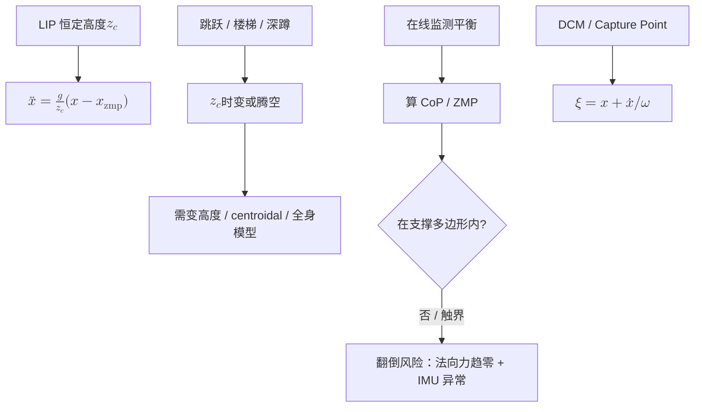

<ol>
<li><strong>LIP 为何假设 CoM 高度固定：</strong> 高度 \(z_c\) 恒定时水平动力学线性化为 \(\ddot x = \tfrac{g}{z_c}\,(x - x_{\mathrm{zmp}})\)，解析可解且 CoM 与 ZMP 成线性关系。跳跃时 CoM 高度剧变甚至腾空（接触力为零）、上下楼梯 / 深蹲时 \(z_c\) 持续变化，该线性关系失效，需要变高度模型或 centroidal / 全身动力学。</li>
<li><strong>ZMP 离开支撑多边形：</strong> ZMP 触及 / 越出支撑多边形即将翻倒（脚绕边缘转动、单边接触），此时该侧足底法向力趋零。工程上用足底力 / 力矩或压力阵列实时算 CoP（接触时 ZMP=CoP），看其是否触界；或检测足底一侧法向力趋零并叠加 IMU 出现非预期角加速度。</li>
<li><strong>DCM / Capture Point 多解决了什么：</strong> 它把 LIP 中不稳定的发散模态单独解出：\(\xi = x + \dot x/\omega\)。它前瞻地回答"想一步刹停脚该踩哪"（Capture Point 即踩下去能让 CoM 渐近停住的落点），把控制聚焦在唯一不稳定的一阶模态上，比仅判断"当前是否稳"的 ZMP 更适合实时落点规划与扰动恢复。</li>
</ol>
</details>

---

### L4.2 Centroidal Dynamics

> **场景隐喻：** LIP 把人形当成一根"会走路的杆子"。但实际上挥手、扭腰、抬腿都会产生角动量，杆子模型解释不了——L4.2 给你一个"既不太重又不太轻"的中间模型。

> **上一层的局限：** L4.1 的 LIP 简化了角动量、忽略了腿摆动质量、把支撑多边形当静态约束；真机走起来这些都不能忽略。Centroidal Dynamics 把整机投影到 6D 的 CoM 动量空间——比 LIP 更精确，又比全身动力学简单。

#### 英文缩写速查（L4.2）

| 缩写 | 英文全称 | 简要说明 |
|------|----------|----------|
| CMM | Centroidal Momentum Matrix | \(h_g=A_g(q)\dot q\)；6D 质心动量映射。 |
| CoM | Center of Mass | 质心位置与动量状态的核心量。 |
| AM | Angular Momentum | 角动量；LIP 忽略、centroidal 显式保留。 |
| LM | Linear Momentum | 线动量。 |
| MOR | Model Order Reduction | 模型降阶；centroidal 相对全身动力学的定位。 |
| Wrench | Spatial Contact Wrench | 接触点 6D 力 / 力矩；驱动动量变化。 |

**前置知识：** [L4.1 LIP / ZMP](#l41-lip--zmp)

**核心问题：** LIP 简化太狠了，真实人形平衡和接触力怎么描述

**推荐做什么：**
- 用 centroidal dynamics 建模人形机器人
- 理解 centroidal momentum matrix 是什么

**推荐读什么：**
- Orin et al., "Centroidal dynamics of a humanoid robot"
- [Centroidal Dynamics](../wiki/concepts/centroidal-dynamics.md)
- [Contact Dynamics](../wiki/concepts/contact-dynamics.md)

**学完输出什么：**
- 能解释 centroidal dynamics 和 LIP 的区别
- 理解线动量、角动量在平衡控制里的作用

**自测题：**
- Centroidal Momentum Matrix \(A_g(q)\) 的维度是多少？它的零空间在物理上意味着什么？
- 为什么 Centroidal Dynamics 是 "model order reduction" 的一种？它损失了原始全身动力学的什么信息？
- 在 MPC 里使用 Centroidal Dynamics vs 全身动力学，求解延迟会差多少量级？

<details class="selftest-answers">
<summary>参考答案（点击展开）</summary>


<ol>
<li><strong>CMM 维度与零空间：</strong> \(A_g(q)\) 为 6×(n+6)（浮动基，n 个关节 + 6 维 base），把广义速度映射到 6 维质心动量（3 线动量 + 3 角动量）：\(h_g = A_g(q)\dot q\)。其零空间是"不改变整机线 / 角动量"的内部自运动（如对称挥臂相互抵消、绕 CoM 的内部重构），即动量守恒下的自由度。</li>
<li><strong>为何是 model order reduction：</strong> 它把 \((n+6)\) 维全身动力学投影到 6 维质心动量空间，只保留"合外力 / 力矩 = 动量变化率"\(\big(\dot h_g = \textstyle\sum \text{wrench} + mg\big)\)，用少量状态抓住平衡最关键的量。损失的是各肢体具体构型 / 关节级分布（同一动量可由无穷多构型实现）、关节限位与碰撞——这些由下层 WBC 补回。</li>
<li><strong>求解延迟差多少：</strong> centroidal（6 维 + 接触力，中等规模凸 QP / NLP）单步求解约亚毫秒到几毫秒，可 50–200 Hz 在线；全身动力学 MPC（\((n+6)\) 维含全约束的非线性 OCP）常几十到上百毫秒，二者约差 1–2 个数量级。故在线层多用 centroidal / 简化模型，全身动力学多用于离线 trajopt 或低频。</li>
</ol>
</details>

---

### L4.3 Trajectory Optimization / MPC

> **场景隐喻：** 上一秒看见脚滑——能不能预判未来 2 秒该往哪儿踩、并实时改步态？MPC 就是这件事的数学化：把"未来一小段时间窗"做成一个滚动求解的优化问题。

> **上一层的局限：** L4.2 的 Centroidal Dynamics 给了你一组方程，但**用这些方程在线规划 CoM 轨迹和接触力**还需要再加一层优化（Trajectory Optimization 或 MPC）。这就是从"模型"到"控制器"的过渡。

#### 英文缩写速查（L4.3）

| 缩写 | 英文全称 | 简要说明 |
|------|----------|----------|
| MPC | Model Predictive Control | 滚动时域最优控制；每步只执行首段控制。 |
| TrajOpt | Trajectory Optimization | 对整段或长时域状态–控制轨迹求最优。 |
| OCP | Optimal Control Problem | 动力学 + 代价 + 约束的优化问题表述。 |
| NLP | Nonlinear Programming | 非线性规划；非凸全身 TrajOpt 常用。 |
| DDP | Differential Dynamic Programming | 微分动态规划；局部 TrajOpt 方法。 |
| iLQR | Iterative Linear Quadratic Regulator | 迭代 LQR；局部线性化 TrajOpt。 |
| RH | Receding Horizon | 滚动时域；MPC 与 TrajOpt 在线化的关键思想。 |

**前置知识：** [L4.2 Centroidal Dynamics](#l42-centroidal-dynamics) + [L3 控制基础与最优化](#l3-控制基础与最优化)

**核心问题：** 整段质心轨迹和接触力怎么规划，MPC 在线怎么做

**推荐做什么：**
- 用 CasADi 或 Crocoddyl 实现一个 centroidal MPC
- 在仿真里跑通一个双足行走 MPC

**推荐读什么：**
- "Convex MPC for Bipedal Locomotion" (Bellicoso et al.)
- [Trajectory Optimization](../wiki/methods/trajectory-optimization.md)
- [Model Predictive Control (MPC)](../wiki/methods/model-predictive-control.md)
- [MPC 调参指南](../wiki/queries/mpc-tuning-guide.md)
- [MPC 求解器选型](../wiki/queries/mpc-solver-selection.md)

**学完输出什么：**
- 能实现一个简化版的 centroidal MPC
- 能解释预测时域、代价函数设计、约束处理的思路

**自测题：**
- 给一个 MPC 跑不稳的现象（例如步态发抖），你的第一手排查顺序是什么？
- Trajectory Optimization 和 MPC 的关键区别是什么？为什么人形里这两个名词经常混用？
- Convex MPC 和 Nonlinear MPC 各适合什么任务？接触切换怎么处理？

<details class="selftest-answers">
<summary>参考答案（点击展开）</summary>

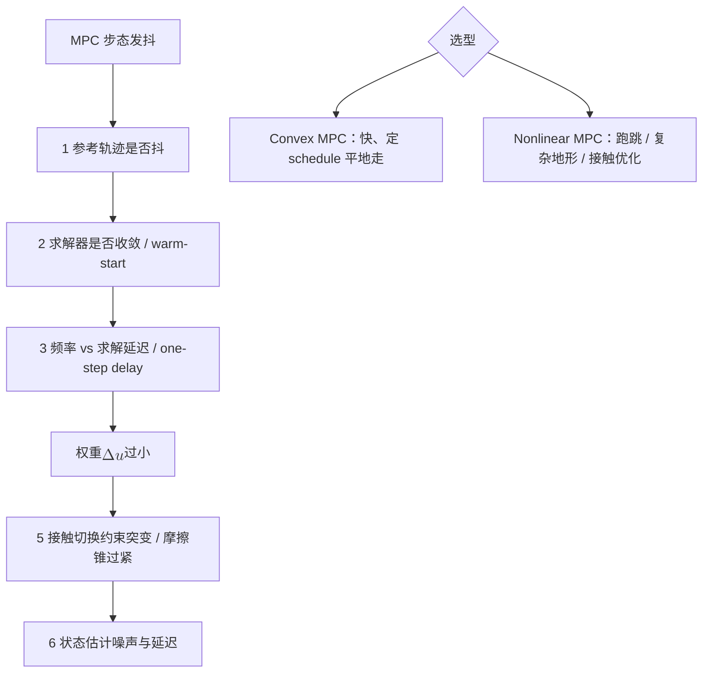

<ol>
<li><strong>MPC 发抖排查顺序：</strong> 由外到内——① 参考是否本身抖（上游 footstep / CoM 轨迹不连续）；② 求解器是否真收敛 / 触迭代上限、有无 warm-start；③ 时序：控制频率、求解延迟、是否补偿 one-step delay；④ 权重：跟踪过硬而平滑 / 正则过软导致控制量高频震荡，加 \(\Delta u\) 惩罚；⑤ 模型 / 约束：接触切换处约束突变、摩擦锥 / ZMP 约束过紧；⑥ 状态估计噪声 / 延迟引入反馈抖动。</li>
<li><strong>TrajOpt 与 MPC 区别：</strong> Trajectory Optimization 多为离线、对整段时域一次求一条最优轨迹（可全身动力学、长时域、初值敏感）；MPC 在线滚动——每周期解短时域 OCP、只执行第一步再重规划（receding horizon），靠反馈抗扰。人形里常混用，是因为 MPC 内核每步解的正是一个小型 trajectory optimization，数学形式（OCP）相同，区别仅在"离线一次 vs 在线滚动 + 是否实时"。</li>
<li><strong>Convex vs Nonlinear MPC：</strong> Convex MPC（线性 / 凸化模型 + 凸约束）求解快、确定性，适合周期性平地行走与高频实时，接触切换靠预先给定的 contact schedule、接触力受摩擦锥线性约束；Nonlinear MPC（全 / 非线性动力学）适合跑跳、复杂地形、需同时优化接触力与姿态，接触切换可用预定时序或互补约束 / 相位优化，代价是非凸、慢、初值敏感。</li>
</ol>
</details>

---

### L4.4 TSID / Whole-Body Control

> **场景隐喻：** MPC 已经告诉你"CoM 要在哪里、足端要到哪里、躯干姿态怎么变"——但人形 25 个关节里，谁先动谁后动？谁让位给安全约束？WBC 是这个仲裁器，每个控制周期都解一个 QP / HQP 来分配每个关节的力矩。

> **上一层的局限：** L4.3 的 MPC 输出的是 CoM / 接触力 / 末端任务参考，**不直接告诉你每个关节出多少力矩**。WBC 就是把上层规划"落到下层执行"的最后一步。

#### 英文缩写速查（L4.4）

| 缩写 | 英文全称 | 简要说明 |
|------|----------|----------|
| TSID | Task-Space Inverse Dynamics | 在动力学与接触约束下求 \(\tau,f\) 的任务空间框架。 |
| WBC | Whole-Body Control | 全身多任务、多约束的实时力矩分配。 |
| HQP | Hierarchical Quadratic Programming | 严格任务优先级的分层 QP。 |
| QP | Quadratic Programming | 加权 WBC 的凸优化内核。 |
| ID | Inverse Dynamics | 给定 \(\ddot q\) 求 \(\tau\)；WBC 等式约束的一部分。 |
| IC | Impedance Control | 力–运动关系整形；接触安全常高优先级。 |

**前置知识：** [L4.3 Trajectory Optimization / MPC](#l43-trajectory-optimization--mpc)

**核心问题：** 上层规划出来的参考轨迹，怎么变成每个关节该出的力

**推荐做什么：**
- 用 TSID 库实现一个全身任务控制器
- 同时处理躯干稳住、足端跟踪、接触约束

**推荐读什么：**
- Del Prete et al., "Prioritized motion-force control of constrained fully-actuated robots"
- [TSID](../wiki/concepts/tsid.md)
- [TSID Formulation](../wiki/formalizations/tsid-formulation.md)
- [Whole-Body Control](../wiki/concepts/whole-body-control.md)
- [WBC 实现指南](../wiki/queries/wbc-implementation-guide.md)
- [WBC 调参指南](../wiki/queries/wbc-tuning-guide.md)

**学完输出什么：**
- 能用 TSID 框架实现一个多层优先级 WBC
- 能解释任务空间目标怎么映射到关节力矩

**自测题：**
- TSID 的 QP 里典型有哪些约束（等式 / 不等式各写 2 条）？目标函数通常长什么样？
- 当上层 MPC 输出的 CoM 参考与 WBC 的接触约束冲突时，会发生什么？怎么用任务优先级处理？
- 阻抗控制为什么常常放在 WBC 任务里的较高优先级层？

<details class="selftest-answers">
<summary>参考答案（点击展开）</summary>

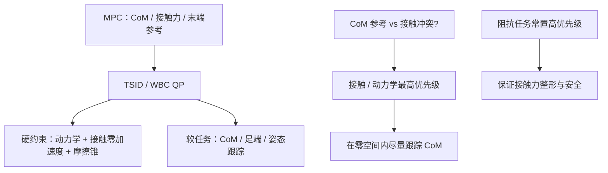

<ol>
<li><strong>TSID 的 QP 约束与目标：</strong> 等式如：① 浮动基动力学一致性 \(M\ddot q + h = S^\top \tau + J_c^\top f\)；② 刚性接触零加速度 \(J_c\ddot q + \dot J_c\dot q = 0\)。不等式如：① 接触力落在摩擦锥内；② 关节力矩 / 位置 / 速度限位（或 ZMP 在支撑多边形内）。目标函数通常是各任务加权二次跟踪误差之和 \(\sum_i w_i\lVert J_i\ddot q + \dot J_i\dot q - \ddot x_i^{\mathrm{des}}\rVert^2\)（CoM、足端、躯干姿态、姿势正则）加上对 \(\tau,f\) 的正则。</li>
<li><strong>CoM 参考与接触约束冲突：</strong> 若接触 / 动力学一致性设为硬约束，WBC 会优先保接触可行，CoM 参考只被"尽量"跟踪，出现稳态误差或被裁剪。处理：用任务优先级——接触 / 动力学放最高（硬约束），CoM 跟踪放较低优先级软任务、在不违反接触的零空间内最优逼近；HQP 严格分层，加权 QP 用大权重近似分层；必要时上层 MPC 据反馈调整参考。</li>
<li><strong>阻抗为何常居高优先级：</strong> 阻抗 / 柔顺直接关系接触稳定与交互安全。若被低优先级位置任务覆盖，易导致接触力失稳、刚性碰撞或接触跳变；把接触 / 末端的阻抗行为放在较高层，可保证无论下层如何优化姿态，接触力始终被良好整形，从而安全、柔顺地与环境交互。</li>
</ol>
</details>

---

## L5 强化学习与模仿学习

**学完 L4 后，你应该已经对 model-based control 有了完整理解。L5 是另一条路：learning-based。**

> **场景隐喻：** L4 是"我已经知道物理 + 知道目标"去算控制律；L5 反过来——让机器人**自己试出来**（RL）或**模仿人学出来**（IL）一个策略。

> **上一层的局限：** L4 的传统控制需要准确建模 + 显式目标函数；对接触切换密集、目标难写成代价函数的任务（跑、跳、复杂地形、操作），开发周期长。RL / IL 用数据补这一段——但不能替代 L4 的结构理解，否则你只会调超参数。

这一阶段最容易踩的坑，是把 RL / IL 当成“跳过建模”的捷径。更稳的学习方式是：
- 把 RL / IL 看成**能力扩展层**，不是替代所有控制结构的万能钥匙
- 始终追问：这个策略学到的是高层决策、低层 tracking，还是把两者混在一起了
- 遇到 sim2real、接触切换、可解释性问题时，回到 L4 的模型与约束视角重新审题

### L5.0 桥梁：从「路牌」到可跑代码的最小闭环

进入 PPO 调参之前，建议先用 **50 行量级脚本** 把 [MDP 五元组](../wiki/formalizations/mdp.md) 与仿真步进对齐——详见 [具身 RL 最小闭环](../wiki/concepts/embodied-rl-minimal-closed-loop.md)。

**策略直觉（岔路口比喻）**：智能体没有标准答案标注，只靠环境反馈迭代；「往右走胜率 501/1000」那块牌子就是 **策略** $\pi(a|s)$。围棋落子是**离散动作**；人形关节力矩/目标是**连续动作**——载体相同，动作空间不同。工程上策略多为神经网络，用 PPO/SAC 等梯度更新。

**MDP 与 POMDP**：

| 要素 | 具身含义 | 真机注意 |
|------|----------|----------|
| $S$ | IMU、关节角、深度/点云等 | 常有噪声与延迟 |
| $A$ | 力矩、关节目标、步态参数 | 多为连续向量 |
| $R$ | 前进、平衡、抓取成功、摔倒惩罚 | 塑造行为的关键杠杆 |
| $P$ | 仿真器或真机动力学 | PyBullet / MuJoCo / Isaac 各不同 |
| $\gamma$ | 远期奖励折扣 | 影响「短视」vs「长远」 |

标准 MDP 假设全状态可观测；真机部署几乎都是 [POMDP](../wiki/formalizations/pomdp.md)——用多帧视觉 + RNN/Transformer 编码隐状态再出动作。

**PPO vs SAC 具身分工（入门速查）**：

| 算法 | 优先场景 | 核心机制 |
|------|----------|----------|
| [PPO](../wiki/methods/policy-optimization.md) | 四足/人形行走、大规模并行仿真 | Clip 限制策略更新幅度，训练稳 |
| [SAC](../wiki/comparisons/ppo-vs-sac.md) | 灵巧手、精细抓取、扰动敏感任务 | 最大熵正则，探索更充分 |

共同准则：**策略单次迭代不能跳变太大**，否则已学行为崩溃。稀疏奖励操作可叠 [HER](../wiki/methods/her.md)。

**最小闭环实验（推荐顺序）**：

1. [PyBullet](../wiki/entities/pybullet.md) KUKA 臂定点：手写 $S,A,R$ + `stepSimulation` 实现 $P$（先不接 RL）。
2. Gymnasium 玩具环境 + PPO，熟悉 on-policy API。
3. Isaac Lab 人形并行训练（见 L5.2）。

深蓝具身智能《具身智能基础》专栏第 4 篇对以上脉络有面向初学者的展开，与 L0–L4 的几何 / 控制主线互补，见 [专栏地图](../wiki/overview/shenlan-embodied-ai-fundamentals-series.md)。

<a id="l5-1-rl-basics"></a>

### L5.1 强化学习基础

> **场景隐喻：** 把机器人扔进仿真器，给它定一个奖励规则（"前进 +1，摔倒 -10"），让它反复试错——它能学出一个策略。L5.1 教你这套"试错训练"框架。

> **上一层的局限：** L4 方法都依赖精确动力学 + 显式目标；当模型不准、或目标难写成代价函数时，RL 用数据驱动绕开建模。

#### 英文缩写速查（L5.1）

| 缩写 | 英文全称 | 简要说明 |
|------|----------|----------|
| RL | Reinforcement Learning | 智能体与环境交互最大化累积奖励。 |
| MDP | Markov Decision Process | RL 的标准序贯决策形式化。 |
| PPO | Proximal Policy Optimization | clip 重要性比，稳定 on-policy 更新。 |
| SAC | Soft Actor–Critic | 最大熵 off-policy；样本效率通常更高。 |
| PG | Policy Gradient | 直接优化策略参数的方法族。 |
| VF | Value Function | 估计状态或状态–动作的长期回报。 |
| TRPO | Trust Region Policy Optimization | 信赖域策略优化；PPO 的前身思想。 |

**前置知识：** L2 + L3 内容（优化直觉）

**核心问题：** RL 怎么让人形机器人自己学会走路

**推荐做什么：**
- 先跑通 [具身 RL 最小闭环](../wiki/concepts/embodied-rl-minimal-closed-loop.md)：[PyBullet](../wiki/entities/pybullet.md) KUKA 定点任务，把 $S,A,R,P$ 与 `stepSimulation` 对齐（可用手写速度控制，不必先上 PPO）
- 用 PPO 在简单环境（gymnasium）里训一个策略；[Cartpole 问题](../wiki/concepts/cartpole.md) 对照 `CartPole-v1` 与 `Isaac-Cartpole-v0` 的动作/奖励/终止差异
- 理解 reward shaping、policy gradient、value function 的意义
- 对照 [MDP](../wiki/formalizations/mdp.md) 五元组，能说清自己环境里的 $S,A,R,P,\gamma$ 各是什么

**推荐读什么：**
- [动手学强化学习（蘑菇书）](../wiki/entities/hands-on-rl-book.md) — 中文 RL 基础与 PPO/SAC 实践（[在线书](https://hrl.boyuai.com/) / [视频课](https://www.boyuai.com/elites/course/xVqhU42F5IDky94x)）
- Spinning Up (OpenAI)
- [Reinforcement Learning](../wiki/methods/reinforcement-learning.md)
- [Policy Optimization](../wiki/methods/policy-optimization.md)
- [PPO vs SAC](../wiki/comparisons/ppo-vs-sac.md)
- [POMDP](../wiki/formalizations/pomdp.md) — 真机部署前必读

**RL 主干概念链（Physical AI 视角只需吃透这一条）：**


PPO 一次迭代里要真正看懂的 8 个概念：**trajectory**（并行环境 rollout）→ **reward** → **TD error** \(\delta_t = r_t + \gamma V(s_{t+1}) - V(s_t)\) → **GAE** → **Advantage** \(\hat A_t\) → **ratio** \(r_t = \pi_\theta / \pi_{old}\) → **clipping** \(\mathrm{clip}(r_t, 1-\epsilon, 1+\epsilon)\) → **policy update**（多 epoch minibatch）。

| 概念 | Canonical paper | 站内卡片 |
|------|----------------|---------|
| PPO | [Proximal Policy Optimization Algorithms（arXiv:1707.06347）](https://arxiv.org/abs/1707.06347) | [PPO](../wiki/methods/ppo.md) |
| GAE | [High-Dimensional Continuous Control Using Generalized Advantage Estimation（arXiv:1506.02438）](https://arxiv.org/abs/1506.02438) | [GAE](../wiki/methods/gae.md) |

工程实现参考：[rsl_rl](https://github.com/leggedrobotics/rsl_rl)（legged_gym / Isaac Lab 人形与足式训练常用的 PPO 实现）。

**学完输出什么：**
- 能解释 PPO 的核心思路
- 能设计一个简单的 RL reward 并训练

**自测题：**
- 解释 PPO 的 clipping 机制为什么能避免 policy 更新过大；clip 阈值太大 / 太小分别会出什么问题？
- 同样数据量下 on-policy（PPO）和 off-policy（SAC）哪个样本效率高？为什么人形 RL 主流仍用 PPO？
- 给一个 reward 函数（前进项 + 平衡项 + 平滑项），如果机器人学到"小跳着前进"而不是"走路"，你会怎么改 reward？

<details class="selftest-answers">
<summary>参考答案（点击展开）</summary>

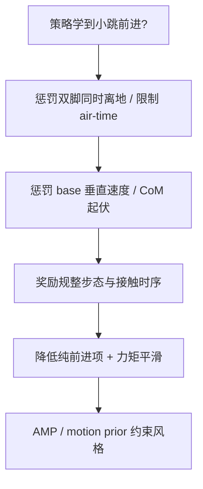

<ol>
<li><strong>PPO 的 clipping：</strong> 用重要性比 \(r=\pi_\theta/\pi_{\mathrm{old}}\)，目标取 \(\min\!\big(r\hat A,\ \mathrm{clip}(r,1-\epsilon,1+\epsilon)\hat A\big)\)。当一步更新让 \(r\) 偏离 1 过多时，clip 截断 advantage 增益，使越出信赖域的更新拿不到额外回报，从而抑制过大的策略跳变（近似信赖域）。\(\epsilon\) 太大：约束太松、更新过激、易崩；太小：更新太保守、收敛慢、样本利用率低。</li>
<li><strong>样本效率与为何仍用 PPO：</strong> 同数据量下 off-policy 的 SAC 更省样本（有 replay buffer 反复利用历史），on-policy 的 PPO 数据用完即弃。但人形 RL 主流仍用 PPO，因为大规模并行仿真（IsaacGym 上万环境）让样本"便宜"、瓶颈在 wall-clock 而非样本数，且 PPO 实现简单、超参鲁棒、与并行 on-policy 采样契合、训练稳定、易加 curriculum / DR。</li>
<li><strong>"小跳前进"如何改 reward：</strong> 多为 reward hack（前进得分未约束接触 / 腾空）。可：① 加同时双脚离地惩罚或限制 feet air-time、要求周期性单脚支撑；② 惩罚 base 垂直速度 / CoM 上下波动；③ 奖励规整步态（步频、足端轨迹、接触时序）；④ 调小纯前进项权重、加力矩 / 能量平滑惩罚抑制爆发弹跳；⑤ 用 AMP / motion prior 约束到"走"的风格。</li>
</ol>
</details>

---

### L5.2 RL 在人形运动控制里的应用

> **场景隐喻：** 通用 RL 算法直接套到人形上往往学不会——需要给它"合适的奖励 / 观测 / 动作空间 + 一堆训练 trick"。L5.2 是把 L5.1 的玩具环境落到真人形 locomotion 的工程细节。

> **上一层的局限：** L5.1 让你在 [CartPole](../wiki/concepts/cartpole.md) 上跑通 PPO；人形 25 DOF + 浮动基的状态空间维度高几个量级，需要 reward shaping、curriculum、early termination、特权信息、teacher-student 等专门技巧。

#### 英文缩写速查（L5.2）

| 缩写 | 英文全称 | 简要说明 |
|------|----------|----------|
| DR | Domain Randomization | 仿真随机化物理 / 传感参数以缩小 sim2real gap。 |
| PD | Proportional–Derivative | 底层关节位置跟踪；RL 常输出 PD 目标。 |
| AMP | Adversarial Motion Priors | 判别器约束策略接近 MoCap 风格。 |
| ET | Early Termination | 摔倒等提前结束 episode，节省训练。 |
| Priv. | Privileged Information | 仅仿真 teacher 可见的额外状态。 |
| T–S | Teacher–Student | 全观测 teacher 蒸馏受限观测 student。 |
| Loco | Locomotion | 移动 / 步行类运动技能。 |

**前置知识：** L5.1 + L4.3/4.4

**核心问题：** RL 怎么和 MPC / WBC 结合，sim2real 怎么做到

**推荐做什么：**
- 用 IsaacGym / IsaacLab 训练一个人形行走策略
- 尝试 RL + WBC 的组合框架

**推荐读什么：**
- "DeepMimic" (Peng et al.)
- "AMP: Adversarial Motion Priors"
- legged_gym / IsaacGymEnvs
- [legged_gym](../wiki/entities/legged-gym.md)
- [Isaac Gym / Isaac Lab](../wiki/entities/isaac-gym-isaac-lab.md)
- [WBC vs RL](../wiki/comparisons/wbc-vs-rl.md)
- [MPC vs RL](../wiki/comparisons/mpc-vs-rl.md)
- [Query：开源运动控制项目导航](../wiki/queries/open-source-motion-control-projects.md)

**PPO 在人形上的四个分支：**

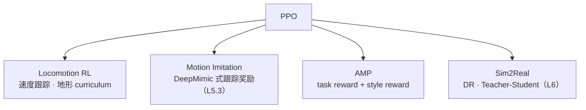

- 训练平台：[Isaac Lab](../wiki/entities/isaac-lab.md)（GPU 并行仿真 + RL 任务框架）；AMP 的奖励结构见 [AMP Reward](../wiki/methods/amp-reward.md)。

**学完输出什么：**
- 能在仿真里训练一个人形行走 RL 策略
- 能解释 RL 和 WBC 各自的优势和局限

**自测题：**
- 人形 RL 通常用 position / velocity / torque 中哪种 action space？为什么 IsaacLab 默认选这种？
- "Privileged information"（特权信息）在 teacher-student 中具体是什么？为什么 student 拿不到？
- AMP / DeepMimic 这类 motion prior 方法和纯 PPO 比，最大的工程优势是什么？

<details class="selftest-answers">
<summary>参考答案（点击展开）</summary>

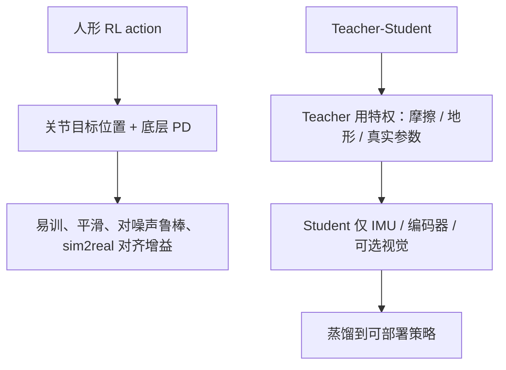

<ol>
<li><strong>action space 选择：</strong> 人形 RL 主流用 position（输出关节目标位置 / 相对默认姿态的偏移，交底层 PD 跟踪）。IsaacLab 默认这种，因为 PD 在高频跟踪、给策略一个低频平滑易学的接口，自带阻尼与稳定性、对网络输出噪声鲁棒，sim2real 时只要对齐 PD 增益即可；直接 torque 高频易抖、对延迟敏感，既难训也难迁移。</li>
<li><strong>特权信息：</strong> 指仿真可得、真机部署拿不到的精确量：真实地面摩擦 / 接触力、地形高度图、机器人质量 / 惯量、外力扰动、精确 base 速度等。teacher 用它训得又快又好；student 只能用真机可得的本体感（IMU、编码器、历史）加可选视觉，通过蒸馏 / 模仿 teacher 学到受限观测下的策略——因为部署时没有这些特权传感。</li>
<li><strong>motion prior 的工程优势：</strong> AMP / DeepMimic 用参考动作（MoCap）作先验，最大优势是免去手工设计复杂 reward——风格 / 自然度由对抗判别器或模仿误差自动提供，省掉大量 reward shaping 与调参，得到自然可迁移的步态；同时缩小探索空间、加速收敛、避免纯 PPO 学出的怪异 gait。</li>
</ol>
</details>

---

<a id="l5-3-imitation-learning"></a>

### L5.3 模仿学习

> **场景隐喻：** 与其让机器人反复试错，不如让它"看人怎么做"——MoCap、遥操作数据进来，机器人直接输出相似动作。

> **上一层的局限：** 纯 RL 在复杂动作（跳舞、操作、跑酷）上探索成本极高、reward 极难写。IL 用人类示范数据给一个**好起点**；但 IL 本身有 compounding error，通常要叠 RL 或 DAgger 才稳。

#### 英文缩写速查（L5.3）

| 缩写 | 英文全称 | 简要说明 |
|------|----------|----------|
| IL | Imitation Learning | 从专家轨迹学习策略。 |
| BC | Behavior Cloning | 监督学习 \(\pi(s)\approx a_{\mathrm{expert}}\)。 |
| DAgger | Dataset Aggregation | 在策略访问状态上请 expert 重新标注。 |
| MoCap | Motion Capture | 人体 / 物体运动捕捉数据。 |
| Retarget | Motion Retargeting | 将示范骨架映射到目标机器人。 |
| ASE | Adversarial Skill Embeddings | 可组合技能嵌入的 IL / RL 框架之一。 |
| Cov. Shift | Covariate Shift | 训练与部署状态分布不一致；BC 核心难点。 |

**前置知识：** L5.1

**核心问题：** 用人类动作数据教机器人做动作

**推荐做什么：**
- 用 MoCap 数据做 motion retargeting（展开见 [L5.4 动作重定向](#l54-动作重定向)）
- 尝试 Behavior Cloning + DAgger

**推荐读什么：**
- "ASE: Adversarial Skill Embeddings"
- "DeepMimic"
- [Imitation Learning](../wiki/methods/imitation-learning.md)
- [Behavior Cloning](../wiki/methods/behavior-cloning.md)
- [DAgger](../wiki/methods/dagger.md)
- [Motion Retargeting](../wiki/concepts/motion-retargeting.md)

**模仿学习谱系（从监督到"参考动作 + 物理仿真 + RL"）：**

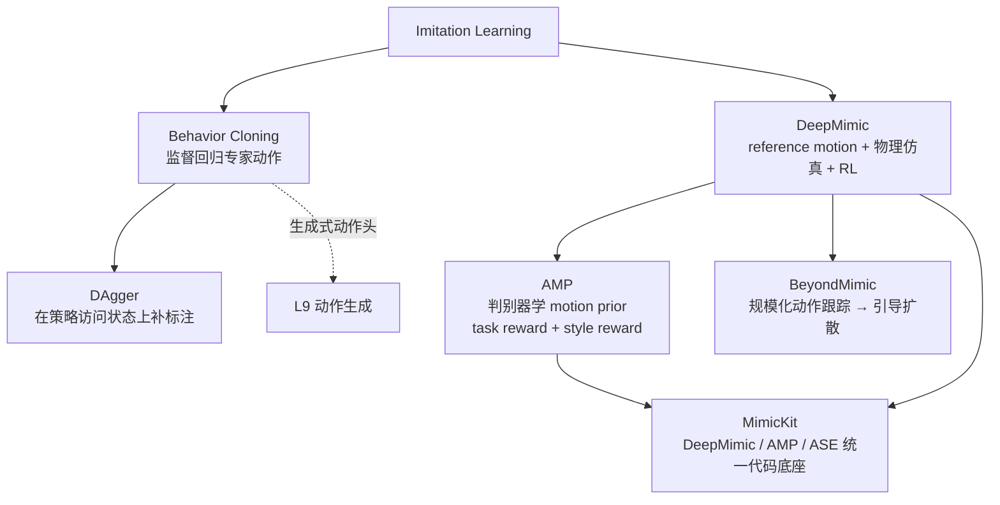

| 方法 | 一句话抓重点 | Canonical paper | Project | Code | 站内卡片 |
|------|-------------|-----------------|---------|------|---------|
| **DeepMimic** | reference motion + physics simulation + RL：跟踪奖励让物理角色复现动捕 | [arXiv:1804.02717](https://arxiv.org/abs/1804.02717) | [项目页](https://xbpeng.github.io/projects/DeepMimic/) | [xbpeng/DeepMimic](https://github.com/xbpeng/DeepMimic) | [DeepMimic](../wiki/methods/deepmimic.md) |
| **AMP** | discriminator 学 motion prior，总奖励 = task reward + style reward，不再逐帧跟踪 | [arXiv:2104.02180](https://arxiv.org/abs/2104.02180) | [项目页](https://xbpeng.github.io/projects/AMP/) | [MimicKit · AMP](https://github.com/xbpeng/MimicKit/blob/main/docs/README_AMP.md) | [AMP Reward](../wiki/methods/amp-reward.md) · [AMP 谱系综述](../wiki/overview/humanoid-amp-motion-prior-survey.md) |
| **BeyondMimic** | 真机人形的规模化动作跟踪 + 用引导扩散组合技能 | [arXiv:2508.08241](https://arxiv.org/abs/2508.08241) | [项目页](https://beyondmimic.github.io/) | [whole_body_tracking](https://github.com/HybridRobotics/whole_body_tracking) | [BeyondMimic](../wiki/methods/beyondmimic.md) |
| **MimicKit** | Peng 团队的模块化运动模仿框架，一套代码跑多种算法 | [arXiv:2510.13794](https://arxiv.org/abs/2510.13794) | — | [xbpeng/MimicKit](https://github.com/xbpeng/MimicKit) | [MimicKit](../wiki/entities/mimickit.md) |
| **DAgger** | 交互式补标注，缓解 BC 的 compounding error | [arXiv:1011.0686](https://arxiv.org/abs/1011.0686) | — | — | [DAgger](../wiki/methods/dagger.md) |

> AMP 官方项目页给出的代码入口是 DeepMimic / MimicKit 仓库，本路线以 MimicKit 中的 AMP 文档为代码链接。

**学完输出什么：**
- 能把一段 MoCap 数据迁移到人形机器人上
- 能解释 DAgger 为什么比纯 BC 更好

**自测题：**
- BC 的 compounding error 在数学上意味着什么（提示：状态分布漂移）？
- DAgger 为什么能缓解 compounding error？需要付出什么额外代价？
- Motion Retargeting 时，骨骼比例不同 + 关节限位不同分别会造成什么问题？工程上如何缓解？

<details class="selftest-answers">
<summary>参考答案（点击展开）</summary>

```mermaid
flowchart TD
  BC[BC 只在专家状态分布上训练] --> Drift[策略误差导致状态漂移]
  Drift --> O1["$$O(\epsilon T^2)$$"]
  DAg[DAgger] --> Roll[在策略访问状态上 roll-out]
  Roll --> Label[Expert 重新标注并聚合数据]
  Label --> O2["$$O(\epsilon T)$$"]
  Ret[Motion Retargeting] --> R1[比例不同：IK 匹配末端 / 接触]
  Ret --> R2[限位不同：裁剪 + 约束优化]
```

<ol>
<li><strong>BC 的 compounding error：</strong> 训练只见专家访问过的状态分布，部署时策略自身的小误差把它带到没见过的状态，误差沿时间累积（covariate shift / 状态分布漂移）。数学上若每步误差为 \(\epsilon\)，总误差随时域 \(T\) 呈 \(O(\epsilon T^2)\) 二次放大——一旦偏离，后续状态分布与训练分布失配，错误自我强化。</li>
<li><strong>DAgger 为何缓解、代价：</strong> DAgger 让策略在自己访问的状态上 roll-out，再请 expert 对这些状态标注正确动作并聚合进数据集迭代，使训练分布逐渐覆盖策略实际遭遇的状态，消除 covariate shift，把误差从 \(O(\epsilon T^2)\) 降到 \(O(\epsilon T)\)。代价：需要一个可随时查询的在线 expert 持续标注（成本高），且在真机上 roll-out 不成熟策略可能不安全。</li>
<li><strong>Motion Retargeting 的两类问题：</strong> 骨骼比例不同——照搬关节角会使末端（手 / 脚）错位、脚穿地 / 打滑，应按比例缩放并用 IK 匹配末端 / 接触关键点而非照抄关节角；关节限位不同——源动作可能超出物理限位致不可行 / 饱和，应裁剪 / 重映射到可行范围或在优化中加限位约束并重分配。工程上多用 IK + 优化的 retargeting（匹配 CoM / 脚接触 / 末端轨迹）并叠加接触与限位约束。</li>
</ol>
</details>

---

### L5.4 动作重定向

> **场景隐喻：** 动捕里那具"人"和你的机器人不是同一副骨架——腿长比例不同、关节更少、限位更严。把人的关节角直接抄过去，机器人会脚滑、穿地、姿态扭曲。L5.4 就是这道"翻译闸"：把人的动作译成机器人**能执行**的参考轨迹。

> **上一层的局限：** L5.3 默认"示范数据已经是机器人能执行的动作"。现实里绝大部分示范来自人（动捕 / 单目视频 / 生成模型），必须先跨骨架映射成机器人参考轨迹，tracking 奖励与 BC 标签才有东西可对齐。这一步的误差会原样传给下游策略，并在 L6 的 sim2real 阶段被继续放大。

#### 英文缩写速查（L5.4）

| 缩写 | 英文全称 | 简要说明 |
|------|----------|----------|
| Retarget | Motion Retargeting | 把人体 / 动物动作映射到目标机器人骨架。 |
| MoCap | Motion Capture | 最常见的参考动作来源。 |
| SMPL | Skinned Multi-Person Linear Model | 常用人体参数化模型；重定向的典型输入。 |
| IK | Inverse Kinematics | 用末端 / 关键点目标反解关节角。 |
| QP | Quadratic Programming | 把重定向写成带约束二次规划的常用求解形式。 |
| GMR | General Motion Retargeting | 关键点 IK + QP 的运动学重定向基线。 |
| NMR | Neural Motion Retargeting | 学习式整段映射，用仿真锚定的配对数据训练。 |
| WBT | Whole-Body Tracking | 重定向产物的下游消费者：全身跟踪训练。 |
| AMP | Adversarial Motion Prior | 用参考动作约束 RL 策略风格的判别式奖励。 |

**前置知识：** L1（FK / IK、SE(3)）+ L2（浮动基与接触）+ L5.3

**核心问题：** 怎么把"人怎么动"翻译成"机器人跟得住"的参考轨迹

**推荐做什么：**
- 先做反例实验：取一段 [AMASS](../wiki/entities/amass.md) / [LAFAN1](../wiki/entities/lafan1-dataset.md) 动作，把人体关节角直接拷到人形 URDF 上播放，量一下脚滑、足底穿透与限位越界——建立"为什么不能不做重定向"的第一手直觉
- 跑通一条运动学基线：关键点 IK + QP（[GMR](../wiki/methods/motion-retargeting-gmr.md) 一类工具），把末端 / 脚接触当代价项、关节限位当硬约束
- 给产物加质量门禁：脚滑速度、穿透深度、关节速度 / 加速度尖峰、根轨迹漂移，先过滤再进训练集
- 把重定向产物接到一个跟踪策略上（[DeepMimic](../wiki/methods/deepmimic.md) / [AMP 奖励](../wiki/methods/amp-reward.md) 风格），用"策略跟不跟得住"反过来验证重定向质量

**推荐读什么：**
- [Motion Retargeting](../wiki/concepts/motion-retargeting.md) — 概念主入口
- [Motion Retargeting Pipeline](../wiki/concepts/motion-retargeting-pipeline.md) — 采集 → 对齐 → 求解 → 筛选的端到端链路
- [Motion Retargeting Objective](../wiki/formalizations/motion-retargeting-objective.md) — 目标函数与约束的形式化
- [GMR vs NMR vs ReActor](../wiki/comparisons/gmr-vs-nmr-vs-reactor.md) — 三条路线选型
- [运动学可行与动力学可行](../wiki/concepts/kinematic-vs-dynamic-feasibility.md) — 本节最容易踩的认知坑
- [Motion Data Quality](../wiki/concepts/motion-data-quality.md)、[人形参考动作数据集对比](../wiki/comparisons/humanoid-reference-motion-datasets.md)
- 想继续深入：[纵深路线：动作重定向](depth-motion-retargeting.md)（Stage 0–6 完整谱系，含四足支线与轨迹编辑器工具链）

**学完输出什么：**
- 能把一段公开 MoCap 重定向到指定人形模型，并给出脚滑 / 穿透 / 限位的量化质量报告
- 能说清运动学优化、学习式映射、物理感知三条路线的取舍，并为"实时遥操作"与"离线批量造训练数据"分别选型
- 能把重定向产物喂进跟踪训练，并判断失败是数据问题还是策略问题

**自测题：**
- 重定向的目标函数通常由哪几项组成？其中哪些必须写成硬约束而不是罚项，为什么？
- 一段重定向结果"看起来很像人"，但跟踪策略怎么训都跟不住，可能的原因是什么？
- 实时全身遥操作 vs 离线批量生产 BFM 训练数据，两个场景分别该选哪类重定向路线？

<details class="selftest-answers">
<summary>参考答案（点击展开）</summary>

```mermaid
flowchart TD
  Src[人体参考: MoCap / 视频 / 生成] --> Align[骨架与坐标对齐]
  Align --> Opt[IK/QP: 姿态相似 + 末端接触 + 平滑]
  Opt --> Hard[硬约束: 关节限位 / 自碰 / 足底不穿地]
  Hard --> QC[质量门禁: 脚滑 / 穿透 / 速度尖峰 / 根漂移]
  QC --> Track[跟踪训练: DeepMimic / AMP / WBT]
  Track -->|跟不住则回修参考| Opt
```

<ol>
<li><strong>目标函数与硬约束：</strong> 典型形态是加权和——姿态相似项（关节角 / 关键点位置对齐）、末端与接触项（手脚位置、支撑足零滑移）、平衡项（CoM / ZMP 落在支撑域内）、平滑项（关节速度 / 加速度正则），再加关节限位与自碰。其中**关节限位、自碰、足底不穿地属于可行性约束，必须写成硬约束**：写成罚项时求解器会为了降低姿态误差而"买断"惩罚，产出一条物理上根本执行不了的参考，错误直接进训练集；而相似度、平滑度是偏好，适合当代价项加权取舍。</li>
<li><strong>"很像"却跟不住：</strong> 典型的<strong>运动学可行 ≠ 动力学可行</strong>。重定向只对齐了几何（关键点误差小），但没约束质量分布与接触力：机器人质量分布、执行器力矩 / 速度上限与人不同，参考里的加速度可能超出关节能力；支撑足接触时序被拉伸或存在毫米级穿透 / 脚滑，跟踪时接触力求解发散；根轨迹（基座高度 / 朝向）由源数据漂移带来，导致参考本身"站不住"。排查顺序：先量参考自身的物理指标（所需力矩、CoM/ZMP 是否出支撑域、足端滑移速度），再看跟踪策略的奖励与增益；用物理感知重定向（仿真内闭环）或在参考上做动力学后处理，比继续调 tracking 超参更对症。</li>
<li><strong>两个场景的选型：</strong> <strong>实时遥操作</strong>要毫秒级、单帧 / 滑窗输入、可随时换机型 → 选运动学优化路线（GMR 式 IK + QP，CPU 实时、无需训练），物理可行性交给下游 WBC / 跟踪策略兜底。<strong>离线批量造 BFM / WBT 训练数据</strong>没有实时预算但要求物理一致、规模大 → 选学习式整段映射（NMR 式，用仿真锚定的配对数据训练前向网络，吞吐高）或物理感知重定向（ReActor / SPIDER 式，在仿真里联合优化参考与跟踪策略），换来的是接触与自碰在数据阶段就被内生化，下游训练不用反复清洗。</li>
</ol>
</details>

---

## L6 综合实战

**到这里，你应该已经对运动控制和学习两条路都有理解了。最后一步是让它们真正串起来。**

> **场景隐喻：** 仿真里走得再好看，真机上摔得最惨——L6 教你怎么填这个"仿真到现实"的鸿沟。

> **上一层的局限：** L4 / L5 都在仿真里假设理想：传感器无噪声、执行器无延迟、动力学完全已知。真机里这三条全都不成立，需要 system identification + domain randomization + teacher-student 等专门桥接技术。

### 英文缩写速查（L6）

| 缩写 | 英文全称 | 简要说明 |
|------|----------|----------|
| Sim2Real | Simulation to Reality | 仿真训练策略部署到真机。 |
| SysID | System Identification | 辨识质量、摩擦、延迟等真实参数。 |
| DR | Domain Randomization | 训练期随机化以覆盖真机不确定性。 |
| T–S | Teacher–Student | 特权 teacher 蒸馏部署 student。 |
| Gap | Sim-to-Real Gap | 仿真与真机动力学 / 传感差异。 |
| Lat. | Actuator Latency | 执行器与通信延迟；RL 策略尤其敏感。 |

### 前置知识
- L4 全流程
- L5 RL 和 IL 的基本操作

### 核心问题
- 怎么从训练到部署形成闭环
- 怎么把仿真训练结果迁移到真实机器人
- 怎么设计一个完整的 RL + WBC pipeline

### 推荐做什么
- 设计并训练一个完整的人形 RL + WBC pipeline
- 做一次 sim2real 迁移
- 调 domain randomization 参数观察效果

### 推荐读什么
- [Sim2Real](../wiki/concepts/sim2real.md)
- [System Identification](../wiki/concepts/system-identification.md)
- [Domain Randomization](../wiki/concepts/domain-randomization.md)
- [Sim2Real Checklist](../wiki/queries/sim2real-checklist.md)（含[快速部署检查](../wiki/queries/sim2real-checklist.md#快速部署检查)）
- [机器人策略调试手册](../wiki/queries/robot-policy-debug-playbook.md)

<a id="l6-sim2real-chain"></a>

### Sim2Real 主链：从仿真到真机的 10 个关卡

Sim2Real 不是 RL 的一个小节点，而是一条独立的工程链路：

```mermaid
flowchart TB
  Sim["Simulation"] --> DR["Domain Randomization"]
  DR --> ON["Observation Noise"]
  ON --> Lat["Latency"]
  Lat --> Act["Actuator Modeling"]
  Act --> SID["System Identification"]
  SID --> TS["Teacher-Student"]
  TS --> Val["Policy Validation"]
  Val --> S2S["Sim2Sim<br/>换一个物理引擎再验"]
  S2S --> Real["Real Robot"]
  Real -. 失败复盘 .-> SID
```

**真机 policy 失败的常见来源**（按排查顺序，越靠前越"低级"、越常见）：

| 来源 | 典型症状 | 排查入口 |
|------|---------|---------|
| **joint ordering** | 上电即抽搐 / 左右腿互换 | [Robot Joint Order Check Tool Online](https://imchong.github.io/Robot_Joint_Order_Check_Tool_Online/)：并排比较 URDF / MJCF 在 Isaac Gym、Isaac Lab、MuJoCo、ros2_control 等中的关节顺序 |
| **observation mismatch** | 观测维度 / 坐标系 / 单位 / 归一化与训练不一致 | [Robot Learning IO Board Online](https://imchong.github.io/Robot_Learning_IO_Board_Online/)：对照 SONIC / BeyondMimic 等项目训练态与部署态的观测输入、动作输出 · [人形策略观测输入](../wiki/concepts/humanoid-policy-observation-inputs.md) |
| **action scaling** | 动作幅度过大 / 过小，default pose 偏移 | 同上：对照参考项目的动作输出定义，核对 action scale、default joint pos |
| **control frequency** | 仿真 decimation 与真机控制周期不一致 | [控制与推理频率解耦](../wiki/concepts/control-inference-frequency-decoupling.md) |
| **latency** | 高频振荡、相位滞后 | [控制环延迟建模](../wiki/formalizations/control-loop-latency-modeling.md) |
| **motor model** | 力矩饱和、带宽不足、PD 行为与仿真不同 | [Actuator Network](../wiki/methods/actuator-network.md) · [System Identification](../wiki/concepts/system-identification.md) |
| **sensor noise** | IMU 漂移、编码器噪声导致抖动 | [Domain Randomization](../wiki/concepts/domain-randomization.md) · [State Estimation](../wiki/concepts/state-estimation.md) |
| **contact mismatch** | 打滑、落脚冲击与仿真不同 | [Contact Dynamics](../wiki/concepts/contact-dynamics.md) · Sim2Sim 交叉验证 |

- **Sim2Sim 先于 Sim2Real**：在 Isaac 训练、在 MuJoCo 回放验证，能在上真机前筛掉大部分顺序 / 缩放 / 频率类错误。在线演示：[Robot Learning Sim2Sim Online](https://imchong.github.io/Robot_Learning_Sim2Sim_Online/)（MuJoCo + ONNX 浏览器内推理）。
- **Teacher-Student**：特权信息 teacher → 部署观测 student，见 [Teacher-Student / DAgger 训练](../wiki/methods/teacher-student-dagger-training.md)。
- 系统化展开见 [Sim2Real 纵深路线](depth-sim2real.md)；部署侧的推理 / 通信 / 实时性见 [L12](#physical-ai-l12-deployment)。

### 学完输出什么
- 一个能跑的人形 RL 策略（仿真内）
- 一次 sim2real 迁移实验记录
- 对整个 pipeline 的理解文档

### 自测题（学完应能答出）
- 给定一个仿真训好的 PPO 策略，列出真机部署前必须做的 5 件事。
- Domain Randomization 范围选过大 / 过小分别会出什么问题？你怎么定 DR 边界？
- 执行器延迟在 sim2real 里为什么对 RL 策略的破坏性比对传统 MPC 更大？

<details class="selftest-answers">
<summary>参考答案（点击展开）</summary>

```mermaid
flowchart TD
  PPO[仿真训好的 PPO] --> S1[1 System ID]
  S1 --> S2[2 执行器：限幅 / 延迟 / 带宽]
  S2 --> S3[3 观测对齐：噪声 / 坐标系 / 滤波]
  S3 --> S4[4 训练注入延迟 + DR]
  S4 --> S5[5 安全上机：限速 / 急停 / fallback]
  DR[Domain Randomization] --> Big[过大：过保守或学不会]
  DR --> Small[过小：gap 仍在、上机即败]
  Big --> Tune[以 SysID 为中心逐步加宽 + 真机反馈]
  Small --> Tune
```

<ol>
<li><strong>真机部署前必做 5 件事：</strong>
<ol>
<li><strong>System Identification：</strong>辨识真实质量 / 惯量、关节摩擦、PD 增益、力矩-电流曲线。</li>
<li><strong>执行器建模：</strong>加入力矩限幅、传动延迟 / 带宽、电机一阶滞后。</li>
<li><strong>观测对齐：</strong>传感器噪声 / 偏置 / 延迟、坐标系与单位、滤波与训练时一致。</li>
<li><strong>训练侧鲁棒化：</strong>在训练中注入延迟 / 噪声 / 外扰并做 Domain Randomization 提升鲁棒。</li>
<li><strong>安全与渐进上机：</strong>限位限速、力矩饱和、急停、吊装 / 逐步放权并备好 fallback 控制器。</li>
</ol>
</li>
<li><strong>DR 范围过大 / 过小：</strong> 太大——任务过难，策略学得过度保守（蹲低、慢动作）牺牲性能甚至学不会（信号被噪声淹没）；太小——覆盖不到真机参数，sim2real gap 仍大、上机即败（过拟合仿真）。定边界：以辨识值为中心、按硬件不确定度（传感 / 装配 / 磨损）设范围并逐步加宽（curriculum），用真机 / 留出验证反馈调，在仍能收敛的前提下尽量覆盖真实分布。</li>
<li><strong>执行器延迟为何对 RL 更致命：</strong> RL 策略是高带宽、对观测-动作时序拟合极紧的反应式映射，且常隐式假设零延迟；延迟引入相位滞后，把训练时学到的紧反馈变成震荡 / 正反馈，又不可解释、无显式相位裕度可调。传统 MPC / WBC 有显式模型，可把延迟纳入预测（time-delay model、Smith predictor）并有稳定裕度概念，相对更可控。</li>
</ol>
</details>

---

## L7 出口：从运动控制看整个机器人技术栈

**这一层不教你写代码，它的目的是：在你已经看完 L0–L6 后，给你"机器人全栈"的最后一块拼图，让你能和这个领域任何方向的工程师对话。**

读到这里，你已经知道"控制盒子"在做什么。本节给出 [L−1 30 秒全景图](#30-秒看懂一台机器人在干嘛) 里其它三盒，以及当下 2024–2026 真正最活跃的几个方向。每块都不深入，只给：**它是什么 → 和运动控制怎么接 → 推荐 1 个入口页**。

### L7.1 感知层（Perception / SLAM / 状态估计）

#### 英文缩写速查（L7.1）

| 缩写 | 英文全称 | 简要说明 |
|------|----------|----------|
| SE | State Estimation | 融合 IMU、编码器、视觉等估计位姿与速度。 |
| SLAM | Simultaneous Localization and Mapping | 未知环境中同时建图与定位。 |
| IMU | Inertial Measurement Unit | 惯性测量；高频本体运动感知。 |
| RGB-D | RGB + Depth | 彩色加深度相机；3D 感知常用输入。 |
| VO | Visual Odometry | 纯视觉估计相机 / 机体运动。 |
| SEM | Semantic Segmentation | 像素级语义；场景理解入口。 |

**它是什么**：让机器人从摄像头 / IMU / 雷达 / 编码器 / 力觉等传感器中估出"自身位姿 + 世界几何 + 物体属性"。核心子领域：
- **State Estimation**：融合 IMU + 编码器 + 视觉，估出机器人本体在世界里的 6D 位姿与速度。
- **SLAM**：同时建图 + 定位，让机器人在未知环境里也知道自己在哪。
- **3D 感知 / 物体识别 / 语义分割**：把 RGB-D / 点云变成"地上有个箱子、距我 0.5 m"。

**和运动控制怎么接**：
- 运动控制需要 **准确的本体状态**（关节角、躯干位姿、足端是否着地）。状态估计差一点，下游 WBC / MPC 全乱套。L4 的 TSID / WBC 实际上严重依赖一个低延迟的状态估计器。
- 真机 sim2real（L6）gap 一大半来自 **执行器模型不准** + **状态估计噪声**。

**入口页**：[State Estimation](../wiki/concepts/state-estimation.md) · [导航与 SLAM 自主栈](../wiki/overview/navigation-slam-autonomy-stack.md)

### L7.2 决策与规划层（Motion Planning / Task Planning）

#### 英文缩写速查（L7.2）

| 缩写 | 英文全称 | 简要说明 |
|------|----------|----------|
| MP | Motion Planning | 几何或动力学约束下的路径 / 轨迹规划。 |
| RRT | Rapidly-exploring Random Tree | 采样规划；高维空间常用。 |
| CHOMP | Covariant Hamiltonian Optimization for Motion Planning | 轨迹优化类运动规划。 |
| HTN | Hierarchical Task Network | 分层任务分解规划。 |
| PDDL | Planning Domain Definition Language | 符号任务规划标准语言。 |
| FP | Footstep Planning | 人形落点与步态时序规划。 |

**它是什么**：在感知建好的地图上，回答"先去哪、再去哪、用什么动作过去"。核心子领域：
- **Motion Planning**：A* / RRT / RRT* / CHOMP / TrajOpt → 给出无碰撞轨迹。
- **Task Planning / HTN / PDDL**：把"把杯子放到桌上"分解成"接近 → 抓 → 移动 → 放"。
- **Footstep Planning**（人形特有）：决定下一步落点、步态时序。

**和运动控制怎么接**：
- 规划层给 **参考轨迹**（足端位置、CoM 轨迹、关节目标），下游 L4 的 MPC / WBC 负责跟踪。
- L4.3 的 trajectory optimization 跟传统 motion planning 有大量交叠，区别在 **是否带动力学约束** 和 **是否在线求解**。

**入口页**：[Trajectory Optimization](../wiki/methods/trajectory-optimization.md) · [Locomotion 任务地图](../wiki/tasks/locomotion.md)

### L7.3 操作层（Manipulation / Grasping）

#### 英文缩写速查（L7.3）

| 缩写 | 英文全称 | 简要说明 |
|------|----------|----------|
| EE | End Effector | 末端执行器（手爪、工具等）。 |
| Grasp | Grasping | 抓取与稳定持握。 |
| CRM | Contact-Rich Manipulation | 接触丰富、力交互主导的操作。 |
| DP | Diffusion Policy | 扩散模型生成动作序列；多模态操作常用。 |
| ACT | Action Chunking with Transformers | 分块动作预测的模仿学习架构之一。 |
| WBC | Whole-Body Control | 操作任务底层仍常依赖全身力控。 |
| LoCo-Manip | Loco-Manipulation | 移动中同时操作（走 + 搬）。 |

**它是什么**：手 / 末端执行器与物体的精细交互，包括抓取、放置、装配、双臂协同、接触丰富的精细操作（拧螺丝、插拔）。

**和运动控制怎么接**：
- 操作和 locomotion 共享 **同一套阻抗控制 / WBC / 接触建模**基础。
- 现代 contact-rich manipulation 主流走 **模仿学习路线**（ACT / Diffusion Policy），但底层力控仍来自传统控制；这就是为什么 L4 的 WBC 在操作任务里也是基石。

**入口页**：[Manipulation 任务地图](../wiki/tasks/manipulation.md) · [接触丰富操作纵深路线](depth-contact-manipulation.md)

<a id="l7-4-system-stack"></a>

### L7.4 系统与软件栈（ROS / 中间件 / 部署）

#### 英文缩写速查（L7.4）

| 缩写 | 英文全称 | 简要说明 |
|------|----------|----------|
| ROS | Robot Operating System | 机器人节点、话题、服务中间件生态。 |
| RT | Real-Time Control | 毫秒级硬实时控制循环。 |
| CAN | Controller Area Network | 常见电机总线协议。 |
| EtherCAT | Ethernet for Control Automation Technology | 工业实时以太网；低延迟驱动。 |
| HAL | Hardware Abstraction Layer | 硬件抽象；统一仿真与真机接口。 |
| Gazebo | Gazebo Simulator | 经典 ROS 配套仿真器之一。 |

**它是什么**：把上述所有模块连起来跑在一台真机上需要的工程基础设施。
- **ROS / ROS2**：机器人最常用的消息中间件、节点抽象、launch 系统。
- **Real-time control loop**：低延迟（1–2 kHz）实时控制循环、与高层规划（10–100 Hz）之间的多速率通信。
- **仿真器**：MuJoCo / Isaac Sim / Gazebo / Drake，各有适用场景。
- **硬件抽象**：URDF / MJCF / 真实驱动器接口、CAN / EtherCAT。

**和运动控制怎么接**：
- L4 的 TSID / WBC 通常运行在 **实时进程**（1 kHz），上层 MPC 跑在 **非实时进程**（50–500 Hz），由 ROS2 / shared memory 通信。理解这层架构才能解释"为什么一个看似能跑的算法上真机就崩"。
- L6 的 sim2real 整链路依赖 URDF / 控制器 / 通信延迟的对齐。

**入口页**：[Pinocchio](../wiki/entities/pinocchio.md) · [Isaac Gym / Isaac Lab](../wiki/entities/isaac-gym-isaac-lab.md) · 策略导出到总线的完整部署链见 [L12 Deployment](#physical-ai-l12-deployment)

### L7.5 2024–2026 前沿地图（你会反复看到的关键词）

#### 英文缩写速查（L7.5）

| 缩写 | 英文全称 | 简要说明 |
|------|----------|----------|
| VLA | Vision–Language–Action | 视觉–语言条件策略；如 RT-2、π0。 |
| WM | World Model | 学习环境动力学用于想象 rollout。 |
| E2E | End-to-End | 传感到动作的单网络，少分层。 |
| FM | Foundation Model | 大规模预训练后微调的通用模型。 |
| BFM | Behavior Foundation Model | 面向机器人行为的基础模型方向。 |
| HFM | Humanoid Foundation Model | 通用人形大模型 / 基础策略方向。 |
| LfWM | Learning from World Models | 在世界模型中训练或规划。 |
| Tactile | Tactile Sensing | 触觉；精细装配闭环常用。 |

近三年机器人 AI 正在快速重塑，下面这几个方向并行推进；它们不是替代 L4 的传统控制，而是 **在传统控制之上叠了一层"通用化 / 端到端"**：

| 方向 | 关键问题 | 代表工作 / 关键词 | 延伸阅读 |
|------|---------|----------------|-----------|
| **Humanoid Foundation Model** | 一个大模型驱动多种人形机器人 | GR00T (NVIDIA), Helix (Figure), Astribot | [Locomotion 任务地图](../wiki/tasks/locomotion.md) |
| **VLA（Vision-Language-Action）** | 用语言指令驱动机器人完成操作 | RT-2, OpenVLA, π0, Pi-0.5 | [Imitation Learning](../wiki/methods/imitation-learning.md) |
| **World Model for Robotics** | 让机器人在"想象的世界"里训练 | Dreamer-V3, UniSim, GAIA-1 | （扩展阅读） |
| **大规模 Teacher-Student**| 用特权 teacher 训 student，实现 sim2real | "Learning to Walk in Minutes"、ANYmal、Unitree 等 | [Sim2Real](../wiki/concepts/sim2real.md) |
| **AMP / Motion Prior** | 用对抗式损失把 MoCap 动作蒸馏到 RL 策略 | AMP, ASE, CALM, PHC | [模仿学习纵深路线](depth-imitation-learning.md) |
| **End-to-End Locomotion**| 视觉 + 本体观测 → 关节动作的端到端 RL | [Extreme Parkour](../wiki/entities/extreme-parkour.md), ANYmal Parkour, [DreamWaQ++](../wiki/entities/dreamwaq-plus.md) | [RL 纵深路线](depth-rl-locomotion.md) |
| **Whole-Body Loco-Manipulation** | 走着同时操作（搬箱子、推门）| HumanPlus, OmniH2O, OKAMI | [Manipulation 任务地图](../wiki/tasks/manipulation.md) |
| **LLM + RL 分层** | 语义/任务层大模型 + 底层 RL 力控执行 | 各类 VLA + 低层策略栈 | [VLA](../wiki/methods/vla.md) · [具身 RL 最小闭环](../wiki/concepts/embodied-rl-minimal-closed-loop.md) |
| **Intrinsic reward 探索** | 无手工奖励时的自驱动预训练 | RND, DIAYN 等 | [Intrinsic reward 预训练](../wiki/overview/bfm-category-03-intrinsic-reward-pretraining.md) |
| **Tactile / 力觉闭环** | 高频触觉反馈用于精细装配 | DIGIT, GelSight 系列 | （扩展阅读） |

> 这一节不展开任何一个方向——它们随便一个都够再开一条主线。读到这里，你已经能 **听懂每一条** 在解决什么问题，这就是 L7 的目的。

> 其中 **VLA / Humanoid Foundation Model / World Model** 三个方向，在 [L8–L11](#physical-ai-l8-transformer) 按 Physical AI pipeline 拆成可学习的层；部署落地在 [L12](#physical-ai-l12-deployment)。

### 学完这条路线，你能做到的事

回到 L−1 的"三种读者"视角：

- **外行**：能在饭桌上说出"人形机器人为什么走起来这么难"、"VLA 和 PPO 是不同层的东西"、"sim2real gap 主要来自哪里"。
- **想入行**：手上至少有一个能在仿真里跑通 PPO + WBC 的项目，可以面试机器人控制 / 仿真岗位。
- **资深从业者**：把零散经验串成一条心智索引，知道每个新论文该挂在 L0–L12 的哪里、和你已知方法的对接点是哪里。

---

## L8 Transformer 与表征：从 token 到 VLM

<a id="physical-ai-l8-transformer"></a>

**L0–L7 是运动控制主线；从这里开始的 L8–L12 是 Physical AI 全栈扩展段。L8 是从传统 robot learning 跨入 Foundation Model 的桥。**

> **场景隐喻：** 图像、语言、关节角原本是三种"语言"。Transformer 先把它们都翻译成同一种"单词"（token），再让每个单词去查询其它单词和自己有多相关。

> **上一层的局限：** L5–L6 的策略多是 MLP，输入是固定维度的本体状态向量。一旦输入里加入相机图像、语言指令、多帧历史，就需要一种能把不同模态变成同一种序列、并让它们互相"查询"的结构。

### 英文缩写速查（L8）

| 缩写 | 英文全称 | 简要说明 |
|------|----------|----------|
| Token | Token | 序列中的一个单元：一个图像 patch、一个子词或一个状态向量。 |
| QKV | Query / Key / Value | 注意力的三组投影：用 Q 去匹配 K，按匹配度加权 V。 |
| MHA | Multi-Head Attention | 多组 QKV 并行，各自关注不同关系后拼接。 |
| ViT | Vision Transformer | 把图像切成 patch 当 token 送入 Transformer。 |
| VLM | Vision-Language Model | 视觉编码器 + 语言模型；VLA 的"理解"骨干。 |
| MLP | Multi-Layer Perceptron | Transformer block 中注意力之后的逐 token 前馈层。 |

### 前置知识
- L5 的神经网络训练直觉（MLP、损失函数、梯度下降）
- 线性代数：矩阵乘法、softmax

### 核心结构

```mermaid
flowchart TB
  Img["Image"] --> Patch["Patch → Visual Token"]
  Lang["Language"] --> Txt["Text Token"]
  State["Robot State"] --> Emb["Embedding"]
  Patch --> TF["Transformer<br/>Self / Cross-Attention · MLP · Residual"]
  Txt --> TF
  Emb --> TF
  TF --> Out["上下文表征<br/>→ L9 动作头"]
```

一个 Transformer block：`x → LayerNorm → Multi-Head Attention → +x（residual）→ LayerNorm → MLP → +x（residual）`，其中注意力为 \(\mathrm{softmax}(QK^\top/\sqrt{d_k})\,V\)。

### 只需要真正理解以下内容

**不要求读完整篇论文。** 只需要真正理解：

- **token / embedding**：任何输入先变成一串向量
- **QKV 与 attention matrix**：矩阵第 \(i\) 行 = 第 \(i\) 个 token 对所有 token 的关注权重
- **self-attention vs cross-attention**：同一序列内互看 vs 一个序列（如动作 token）去查询另一个序列（如 VLM token）
- **multi-head attention**、**residual**、**MLP**、**transformer block**
- **ViT**：图像 patch 当 token；**VLM**：视觉 token 接入语言模型

### 推荐读什么
- Canonical paper：[Attention Is All You Need（arXiv:1706.03762）](https://arxiv.org/abs/1706.03762) · 站内卡片 [论文页](../wiki/entities/paper-attention-is-all-you-need.md)
- [Transformer](../wiki/concepts/transformer.md) · [Multi-Head Attention](../wiki/concepts/multi-head-attention.md) · [跨模态注意力](../wiki/formalizations/cross-modal-attention.md)
- [Vision Transformer](../wiki/concepts/vision-transformer.md)（canonical：[An Image is Worth 16x16 Words（arXiv:2010.11929）](https://arxiv.org/abs/2010.11929)）
- VLM：[PaliGemma](../wiki/entities/paper-rcl-2407-07726-paligemma-a-versatile-3b-vlm-for-transfer.md)（π0 的 VLM 骨干）· [VLM / VLA / World Model 分类对照](../wiki/comparisons/vlm-vln-vla-vlx-world-model-taxonomy.md)
- 多模态怎么变 token：[VLA Tokenization](../wiki/formalizations/vla-tokenization.md)
- 想系统选骨干：[模型架构纵深路线](depth-model-architecture.md)

### 学完输出什么
- 能用 ≤ 30 行 NumPy / PyTorch 手写单头 attention，并解释 attention matrix 每一行的含义
- 能画出"图像 + 语言 + 状态 → token → Transformer"的数据流，说清每种 token 从哪来

### 自测题（学完应能答出）
- self-attention 与 cross-attention 的 Q、K、V 分别来自哪里？VLA 的动作头为什么常用 cross-attention 读 VLM？
- 为什么 attention 分数要除以 \(\sqrt{d_k}\)？
- 机器人状态（关节角、IMU）通常怎么变成 token？和图像 patch token 有何不同？

<details class="selftest-answers">
<summary>参考答案（点击展开）</summary>

<ol>
<li><strong>self vs cross：</strong> self-attention 的 Q、K、V 都来自同一序列；cross-attention 的 Q 来自一个序列（如带噪动作 token），K、V 来自另一个序列（如 VLM 输出 token）。动作头用 cross-attention 读 VLM，可以让动作生成网络保持较小、单独高频运行，同时按需"查询"语义与视觉信息。</li>
<li><strong>除以 \(\sqrt{d_k}\)：</strong> 点积的方差随维度 \(d_k\) 增长，不缩放时 softmax 容易饱和成近似 one-hot，梯度变小、训练不稳定。</li>
<li><strong>状态 token：</strong> 通常用一个小 MLP / 线性层把整段本体状态（或每个关节）投影成与其它 token 同维的 embedding；它没有空间 patch 结构，维度低、频率高，常作为动作头的直接条件输入。</li>
</ol>
</details>

---

## L9 动作生成：Action Chunk · Diffusion · Flow Matching · DiT

<a id="physical-ai-l9-action-generation"></a>

> **场景隐喻：** 与其每一步都问"下一步做什么"，不如一次规划接下来半秒的整段动作，再按节拍执行。

> **上一层的局限：** L8 给了一个能同时理解图像、语言、状态的表征，但"怎么从表征出动作"还没解决。L5.3 的 BC 用 MSE 回归单个动作：示范是多模态时（同一场景左绕、右绕都对）会被平均成"直直撞上去"；单步输出也对推理延迟很敏感。

### 英文缩写速查（L9）

| 缩写 | 英文全称 | 简要说明 |
|------|----------|----------|
| BC | Behavior Cloning | 监督回归专家动作；动作生成的起点。 |
| DP | Diffusion Policy | 用去噪扩散生成一段动作序列。 |
| FM | Flow Matching | 学速度场，把噪声沿 ODE 积分到动作。 |
| DiT | Diffusion Transformer | 用 Transformer 做去噪 / 速度场网络。 |
| ACT | Action Chunking with Transformers | 一次预测 H 步动作的模仿学习架构。 |
| H | Horizon | action chunk 的长度（一次输出多少步）。 |

### 先对比：传统 policy vs 现代 VLA 动作头

```mermaid
flowchart TB
  subgraph Old["传统 policy"]
    O1["observation"] --> A1["one action a_t"]
  end
  subgraph New["现代 VLA 动作头"]
    O2["image + language + state"] --> AC["action chunk<br/>a_t, a_t+1, …, a_t+H"]
  end
```

### Diffusion Policy：去噪出一段动作

```mermaid
flowchart TB
  N["noisy action trajectory<br/>高斯噪声"] --> C["condition on observation<br/>图像 / 状态特征"]
  C --> D["iterative denoising<br/>K 步"]
  D --> S["action sequence"]
```

好处：能表达多模态动作分布、整段动作时序一致、训练就是去噪回归所以稳定；代价：推理要多步去噪，延迟高。

### Diffusion → Flow Matching → DiT：为什么适合机器人

- **Flow Matching**：不再模拟"加噪—去噪"的随机过程，而是直接学一个速度场，把噪声沿接近直线的 ODE 积分成动作。**对机器人的意义不在数学，而在工程**：保留扩散的多模态表达能力，但积分步数少（π0 论文用 10 步）→ 延迟低，更容易赶上控制频率；训练目标是简单的回归，便于和 VLM 骨干一起训。
- **DiT**：把去噪网络从 U-Net 换成 Transformer。在机器人里，token 变成 action chunk 的各个时间步，观测条件通过 cross-attention / AdaLN 注入 → 可以直接接上 L8 的 VLM token。
- **Action Expert**：π0 的叫法——在 VLM 之外单独一套较小的 Transformer 权重，专门处理状态与带噪动作 token，用 flow matching 生成 action chunk；GR00T N1 的 DiT 动作头扮演同一角色（见 L10）。
- **Action Chunk 的代价**：chunk 内是开环执行，对突发扰动反应慢，需要 temporal ensembling 或 [Real-Time Chunking](../wiki/entities/paper-real-time-chunking.md) 这类衔接策略。

### 推荐读什么

| 概念 | Canonical paper | Project | Code | 站内卡片 |
|------|----------------|---------|------|---------|
| Diffusion Policy | [arXiv:2303.04137](https://arxiv.org/abs/2303.04137) | [项目页](https://diffusion-policy.cs.columbia.edu/) | [real-stanford/diffusion_policy](https://github.com/real-stanford/diffusion_policy) | [Diffusion Policy](../wiki/methods/diffusion-policy.md) |
| Action Chunking（ACT） | [arXiv:2304.13705](https://arxiv.org/abs/2304.13705) | — | [tonyzhaozh/act](https://github.com/tonyzhaozh/act) | [Action Chunking](../wiki/methods/action-chunking.md) |
| Flow Matching | [arXiv:2210.02747](https://arxiv.org/abs/2210.02747) | — | — | [具身策略里的流匹配](../wiki/concepts/flow-matching-embodied-policy.md) |
| DiT | [arXiv:2212.09748](https://arxiv.org/abs/2212.09748) | — | [facebookresearch/DiT](https://github.com/facebookresearch/DiT) | [DiT 论文页](../wiki/entities/paper-dit-scalable-diffusion-transformers.md) · [Diffusion Transformer](../wiki/concepts/diffusion-transformer.md) |

- 系统展开：[扩散与流匹配策略纵深路线](depth-robotics-diffusion-dit-flow.md) · 课程：[MIT Flow Matching & Diffusion 2026](../wiki/overview/mit-flow-matching-diffusion-2026.md)

### 学完输出什么
- 在一个 2D 玩具任务（如 Push-T）跑通 Diffusion Policy，对比 H=1 与 H=16 的行为差异
- 能解释为什么 MSE-BC 在多模态示范上失败，而扩散 / 流匹配不会

### 自测题（学完应能答出）
- action chunk 带来了哪两个好处和一个代价？
- 同样的多模态表达能力，为什么 flow matching 比 DDPM 式扩散更适合高频机器人控制？
- DiT 动作头里，观测 / 语言条件可以通过哪些方式注入？

<details class="selftest-answers">
<summary>参考答案（点击展开）</summary>

<ol>
<li><strong>action chunk：</strong> 好处是 ① 整段动作时序一致、减少逐步抖动和 BC 的 compounding error；② 推理可以比控制慢，低层在等待下一次推理时继续执行已有 chunk。代价是 chunk 内开环，对突发扰动反应变慢，需要 temporal ensembling / 实时 chunk 衔接。</li>
<li><strong>flow matching 更快：</strong> 它学的是接近直线的确定性 ODE 速度场，少量积分步即可得到高质量样本；DDPM 式扩散通常需要更多去噪步。步数少 → 每次推理延迟低 → 更容易满足控制频率。</li>
<li><strong>条件注入：</strong> 常见三种：cross-attention（动作 token 作为 Q 查询观测 / VLM token）、AdaLN（用条件向量调制 LayerNorm 的尺度和偏移，DiT 原论文做法）、直接把条件 token 拼进序列做 self-attention。</li>
</ol>
</details>

---

## L10 VLA / Foundation Policy：π 系列与 GR00T

<a id="physical-ai-l10-vla"></a>

> **场景隐喻：** 把 L8 的"眼睛 + 语言理解"和 L9 的"手上功夫"装进同一个大脑，再用许多机器人、许多任务的数据一起训练。

> **上一层的局限：** L9 的动作头只会"根据观测生成动作"，理解能力取决于前面的编码器；单任务 Diffusion Policy 换个任务就得重新采数据重训。VLA 把预训练 VLM（带互联网规模的语义知识）和动作头拼起来，用跨任务、跨机器人数据训练。

**这一层只跟踪少数代表体系：Physical Intelligence 的 π 系列与 NVIDIA 的 GR00T。** 其它 VLA 先过一遍 [Signal vs Noise](#physical-ai-signal-vs-noise) 再决定是否深入；全景见 [VLA 纵深路线](depth-vla.md)。

### 英文缩写速查（L10）

| 缩写 | 英文全称 | 简要说明 |
|------|----------|----------|
| VLA | Vision–Language–Action | 视觉–语言条件下直接输出动作的模型。 |
| VLM | Vision-Language Model | VLA 的理解骨干（π0 用 PaliGemma，GR00T N1 用 Eagle-2）。 |
| System 2 / System 1 | Dual-System | 慢速语义推理 / 快速动作生成的双系统分工。 |
| DiT | Diffusion Transformer | GR00T N1 的动作头网络结构。 |
| FM | Flow Matching | π0 与 GR00T N1 共同的动作生成目标。 |
| WBC | Whole-Body Control | VLA 之下仍需要的低层全身控制。 |

### π 系列：同一架构上的演进

```mermaid
flowchart TB
  In["image + language + robot state"] --> VLM["VLM<br/>（PaliGemma 骨干）"]
  VLM --> AE["Action Expert<br/>Flow Matching"]
  AE --> AC["Action Chunk"]
```

```mermaid
flowchart LR
  P0["π0<br/>VLM + flow matching<br/>action expert"] --> P05["π0.5<br/>异构数据共训<br/>开放世界泛化"]
  P05 --> PL["后续 π 模型<br/>（如 π0.7）"]
```

- **π0**：确立"VLM + Action Expert + Flow Matching → Action Chunk"的骨架；动作 token 通过注意力读取 VLM token。
- **π0.5**：同一骨架上加入异构数据共训（多机器人、网页数据、高层语义子任务），先出语义子任务、再高频生成动作块，目标是开放环境泛化。
- **后续 π 模型**：继续在同一骨架上改数据对齐与提示方式（如 π0.7 的多模态提示）。**学习方式：每出一个新 π 模型，只问它改了骨架的哪一块。**

| 模型 | Paper | Project / Blog | Code | 站内卡片 |
|------|-------|---------------|------|---------|
| π0 | [arXiv:2410.24164](https://arxiv.org/abs/2410.24164) | [pi.website/blog/pi0](https://www.pi.website/blog/pi0) | [Physical-Intelligence/openpi](https://github.com/Physical-Intelligence/openpi) | [π0](../wiki/entities/paper-pi0.md) |
| π0.5 | [arXiv:2504.16054](https://arxiv.org/abs/2504.16054) | [pi.website/blog/pi05](https://www.pi.website/blog/pi05) | openpi（同上） | [π0.5](../wiki/entities/paper-pi05-open-world-vla.md) |
| π0.7 | [arXiv:2604.15483](https://arxiv.org/abs/2604.15483) | [pi.website/blog/pi07](https://www.pi.website/blog/pi07) | — | [π0.7](../wiki/methods/pi07-policy.md) |

### GR00T：System 2 / System 1 双系统

```mermaid
flowchart TB
  V["Vision"] --> VLM["VLM · System 2<br/>语义理解 / 推理"]
  L["Language"] --> VLM
  VLM --> R["representation<br/>（VLM 中间层 token）"]
  R -->|cross-attention| DiT["DiT · System 1<br/>Flow Matching 去噪"]
  S["Robot State"] --> DiT
  DiT --> AC["Action Chunk"]
```

- **System 2 ≈ reasoning / semantic understanding**：VLM 看图读指令，慢但懂语义。
- **System 1 ≈ fast motor action generation**：DiT 动作头以更高频率出 action chunk（GR00T N1 报告约 120 Hz）。
- **五个词的关系**：VLM 产出表征 → **DiT** 是动作头的网络结构 → **Cross Attention** 是 DiT 读 VLM 表征的方式 → **Flow Matching** 是 DiT 的训练 / 采样目标 → **Action Chunk** 是输出形式。
- **GR00T 不替代低层控制**：人形全身平衡仍交给低层控制器（如 [GR00T-WholeBodyControl](../wiki/entities/gr00t-wholebodycontrol.md)）——回到 [L3 的分层](#policy-vs-low-level-controller)。

| 条目 | Paper | Project | Code | Hugging Face | 站内卡片 |
|------|-------|---------|------|--------------|---------|
| GR00T N1 | [arXiv:2503.14734](https://arxiv.org/abs/2503.14734) | [NVIDIA 研究页](https://research.nvidia.com/labs/lpr/publication/gr00tn1_2025/) | [NVIDIA/Isaac-GR00T](https://github.com/NVIDIA/Isaac-GR00T) | [nvidia/GR00T-N1-2B](https://huggingface.co/nvidia/GR00T-N1-2B) | [GR00T N1](../wiki/entities/paper-hrl-stack-34-gr00t_n1.md) · [Isaac GR00T 平台](../wiki/entities/isaac-gr00t.md) · [GR00T N1.5](../wiki/entities/paper-gr00t-n1-5.md) |

- 概念卡片：[VLA](../wiki/methods/vla.md) · [Foundation Policy](../wiki/concepts/foundation-policy.md)

### 学完输出什么
- 能画出 π0 与 GR00T N1 的数据流，并指出二者在"VLM → 动作头"接口上的异同
- 有 GPU 时，用 openpi 或 Isaac-GR00T 的示例跑通一次离线推理，记录单次推理耗时

### 自测题（学完应能答出）
- π0 的 Action Expert 和 GR00T N1 的 DiT 分别怎么读取 VLM 的信息？
- 为什么 VLA 输出动作之后，人形上仍需要 WBC / PD 这一层？
- 一个新的 π 模型发布了，你用什么方法判断要不要深入学？

<details class="selftest-answers">
<summary>参考答案（点击展开）</summary>

<ol>
<li><strong>读取方式：</strong> π0 把 VLM 和 Action Expert 放在同一个 Transformer 序列里（两套权重），动作 token 通过注意力直接看 VLM token；GR00T N1 的 DiT 是独立网络，用 cross-attention 读 VLM 中间层输出的 token。两者都用 flow matching 生成 action chunk。</li>
<li><strong>仍需低层控制：</strong> VLA 的动作频率（几十到一百多 Hz）远低于平衡与力控需要的频率，而且它输出的是关节目标 / 末端目标，不含接触力分配和力矩饱和处理；这些仍由 WBC / PD / 驱动器电流环完成（见 L3、L4.4）。</li>
<li><strong>判断新模型：</strong> 放回 π0 骨架（VLM / Action Expert / 数据 / 训练目标 / 推理方式）看它改了哪一块，再过 5 个 Signal-vs-Noise 问题；放不进骨架、也没有代码和 benchmark 的，先不深学。</li>
</ol>
</details>

---

## L11 World Model 与 Physical AI 平台

<a id="physical-ai-l11-world-model"></a>

> **场景隐喻：** 飞行员先在模拟器里飞几千小时。World Model 就是机器人的"可学习模拟器"：给定当前世界和一个动作，预测接下来会看到什么。

> **上一层的局限：** VLA 需要海量、多样、带动作标注的数据；真机采集贵、慢，很难覆盖长尾场景，每个 checkpoint 上真机评测也很贵。

### 英文缩写速查（L11）

| 缩写 | 英文全称 | 简要说明 |
|------|----------|----------|
| WM | World Model | 学习"状态 + 动作 → 未来"的环境模型。 |
| WFM | World Foundation Model | 大规模视频预训练、可被下游后训练的通用世界模型。 |
| SDG | Synthetic Data Generation | 由仿真或世界模型生成训练数据。 |
| WAM | World–Action Model | 同时预测世界变化与动作的模型。 |
| Sim | Simulation | 基于物理引擎的仿真（如 Isaac Sim）。 |

### 核心定义

```mermaid
flowchart LR
  S["current world state"] --> WM["World Model"]
  A["action"] --> WM
  WM --> F["predicted future<br/>视频帧 / 状态"]
```

- **World Model**：学习环境动力学；**World Foundation Model**：在大规模视频上预训练的通用世界模型；**Video World Model**：以视频帧为预测对象；**Synthetic Data**：仿真或世界模型生成的数据；**Physical AI Data**：带物理交互与动作标注的真实 / 合成数据。

### 客户为什么需要这一层

World Model 不是"最新 AI"标签，它解决的是 VLA 落地时的四个具体瓶颈：

1. **数据**：真机遥操作数据是瓶颈 → 用仿真 + 世界模型扩增（换光照、纹理、场景、视角）。
2. **评测**：每个 checkpoint 都上真机测太贵 → 先在仿真 / 世界模型里筛。
3. **长尾**：罕见失败场景难以在现实复现 → 合成出来训练和测试。
4. **规划**：部分方法用世界模型"想象"动作后果再选动作（见 [WAM 纵深路线](depth-wam.md)）。

### 平台分工：每个模块在 pipeline 的哪一格

```mermaid
flowchart TB
  Cos["Cosmos<br/>World Foundation Model"] --> Data["synthetic / world data"]
  IS["Isaac Sim<br/>物理仿真 · 渲染"] --> Data
  IS --> IL["Isaac Lab<br/>robot learning（RL / IL）"]
  Data --> G["GR00T<br/>foundation robot policy"]
  IL --> G
  G --> J["Jetson<br/>边缘推理 · deployment"]
  J --> R["ROS2<br/>robot integration"]
```

> 这里用 NVIDIA 栈举例，是因为它在每一格都有公开组件；**每一格都有替代品**（仿真：MuJoCo / Genesis；训练：LeRobot；策略：openpi；边缘算力：其它开发板）。要学的是"格子"，不是产品。

### 推荐读什么

| 条目 | Paper | 官方 | Code | Hugging Face | 站内卡片 |
|------|-------|------|------|--------------|---------|
| Cosmos | [arXiv:2501.03575](https://arxiv.org/abs/2501.03575) | [nvidia.com/ai/cosmos](https://www.nvidia.com/en-us/ai/cosmos/) | [NVIDIA/Cosmos](https://github.com/NVIDIA/Cosmos) | [Cosmos-Predict2 集合](https://huggingface.co/collections/nvidia/cosmos-predict2) | [NVIDIA Cosmos](../wiki/entities/nvidia-cosmos.md) · [论文页](../wiki/entities/paper-sa-2501-03575-cosmos-world-foundation-model-platform-for-physi.md) |
| Isaac Lab | [arXiv:2511.04831](https://arxiv.org/abs/2511.04831) | [文档](https://isaac-sim.github.io/IsaacLab/) | [isaac-sim/IsaacLab](https://github.com/isaac-sim/IsaacLab) | — | [Isaac Lab](../wiki/entities/isaac-lab.md) |
| Isaac Sim | — | [developer.nvidia.com/isaac/sim](https://developer.nvidia.com/isaac/sim) | — | — | [Isaac Sim](../wiki/entities/isaac-sim.md) |

- 世界模型概念：[世界模型功能分类](../wiki/concepts/functional-taxonomy-world-models.md) · [生成式世界模型](../wiki/methods/generative-world-models.md) · [World Action Models](../wiki/concepts/world-action-models.md)
- 数据侧：[Cosmos Transfer](../wiki/entities/cosmos-transfer.md) · [NVIDIA Physical AI 数据集](../wiki/entities/nvidia-physical-ai-datasets.md) · [具身数据纵深路线](depth-embodied-data.md) · [Real2Sim 纵深路线](depth-real2sim.md)

### 学完输出什么
- 能用一张图说明：一个 VLA 项目的数据从哪来（真机 / 仿真 / 世界模型 / 人类视频），各自解决什么问题
- 能区分"物理仿真器"和"视频世界模型"各自的优势与不可替代之处

### 自测题（学完应能答出）
- 物理仿真器（Isaac Sim / MuJoCo）和视频世界模型（Cosmos）在训练机器人时各有什么优势、各自的短板是什么？
- 用世界模型合成数据训练策略，最大的风险是什么？怎么缓解？

<details class="selftest-answers">
<summary>参考答案（点击展开）</summary>

<ol>
<li><strong>仿真器 vs 视频世界模型：</strong> 物理仿真器有显式物理、可交互、可并行 RL、能给出真值状态和接触力，但外观真实感和资产成本是短板；视频世界模型从真实视频学外观与常见物理现象，视觉真实感和场景多样性强，但物理一致性无保证、难以给出接触力等真值、推理成本高。常见做法是二者互补：仿真出结构和动作，世界模型做外观迁移与扩增。</li>
<li><strong>合成数据的风险：</strong> 生成的未来与真实物理不一致（物体穿透、质量不守恒），策略学到"模型里的物理"。缓解：用真实数据校准和混合配比、用物理仿真生成结构再用世界模型只改外观、在真机或高保真仿真上做最终评测。</li>
</ol>
</details>

---

## L12 Deployment：从训练好的策略到真机电机

<a id="physical-ai-l12-deployment"></a>

> **场景隐喻：** 模型训练完只是"菜谱写好了"；部署是要在固定节拍里准时把菜端上桌——晚一拍机器人就可能摔倒。

> **上一层的局限：** L5–L11 的训练都在 GPU 服务器上；真机上算力、内存、功耗受限，而且推理必须和实时控制循环、总线、驱动器同步。路线必须走到真实机器人，而不是停在模型。

### 英文缩写速查（L12）

| 缩写 | 英文全称 | 简要说明 |
|------|----------|----------|
| ONNX | Open Neural Network Exchange | 跨框架的模型交换格式。 |
| ORT | ONNX Runtime | 跨平台 ONNX 推理引擎。 |
| TRT | TensorRT | NVIDIA GPU 上的推理优化与运行时。 |
| ROS 2 | Robot Operating System 2 | 机器人节点 / 话题 / 服务中间件。 |
| RT | Real-Time | 有确定时限的执行；PREEMPT_RT 是 Linux 实时补丁。 |
| CAN | Controller Area Network | 常见电机总线。 |
| EtherCAT | Ethernet for Control Automation Technology | 低延迟、强同步的工业实时以太网。 |

### 部署主链

```mermaid
flowchart TB
  P["trained policy<br/>PyTorch"] --> E["Policy Export"]
  E --> O["ONNX"]
  O --> RT["TensorRT / ONNX Runtime<br/>Jetson 或 x86 GPU"]
  RT --> N["ROS2 node<br/>观测组装 · 推理 · 动作后处理"]
  N --> C["robot controller<br/>ros2_control / 自研实时循环<br/>Real-Time Linux（PREEMPT_RT）"]
  C --> B["CAN / EtherCAT"]
  B --> D["Motor Driver<br/>PD / 电流环"]
  D --> M["Motor → Real Robot"]
```

### 关键工程概念

| 概念 | 是什么 | 为什么会让真机失败 |
|------|-------|------------------|
| **inference frequency** | 网络每秒推理几次 | 低于训练时的策略频率 → 动作变稀疏、行为变形 |
| **control frequency** | 低层控制循环频率 | 与仿真 decimation 不一致 → PD 行为和训练不同 |
| **latency** | 观测采集到力矩生效的总延迟 | 相位滞后 → 振荡（见 [L6 自测](#l6-综合实战)） |
| **jitter** | 周期时间的抖动 | 平均延迟正常但偶发超时，更难复现、更危险 |
| **observation delay** | 传感数据到达策略时已过时 | 训练时没建模 → 状态估计与实际不符 |
| **action delay** | 动作从输出到驱动器生效的延迟 | 总线排队、驱动器周期叠加 |
| **hardware synchronization** | 多驱动器 / 传感器在同一时刻采样与执行 | 各关节不同步 → 全身协调失真；EtherCAT 分布式时钟用于解决它 |

### 推荐读什么
- 导出与推理：[ONNX](../wiki/entities/onnx.md)（[onnx.ai](https://onnx.ai/)）· [ONNX Runtime](../wiki/entities/onnxruntime.md)（[onnxruntime.ai](https://onnxruntime.ai/)）· [TensorRT](../wiki/entities/tensorrt.md)（[官方](https://developer.nvidia.com/tensorrt)）· [推理引擎对比](../wiki/comparisons/onnxruntime-vs-mnn-vs-tensorrt.md)
- 中间件与控制器：[ROS2 基础](../wiki/concepts/ros2-basics.md)（[ROS 2 文档](https://docs.ros.org/en/rolling/)）· [ros2_control](../wiki/entities/ros2-control.md)（[control.ros.org](https://control.ros.org/)）· [实时控制中间件指南](../wiki/queries/real-time-control-middleware-guide.md)
- 算力：[NVIDIA Jetson](../wiki/entities/nvidia-jetson.md) · [部署开发板选型](../wiki/comparisons/robot-policy-deployment-dev-board-selection.md)
- 实时系统：[PREEMPT_RT（Linux Foundation Realtime wiki）](https://wiki.linuxfoundation.org/realtime/start)
- 总线与驱动：[EtherCAT](../wiki/concepts/ethercat-protocol.md) · [CAN](../wiki/concepts/can-bus-protocol.md) · [CAN vs EtherCAT](../wiki/comparisons/can-vs-ethercat-joint-bus.md) · [电机驱动固件与总线协议](../wiki/overview/motor-drive-firmware-bus-protocols.md)
- 场景指南：[RL 策略 sim2real 部署条件](../wiki/queries/rl-sim2real-deployment-conditions.md) · [VLA 部署指南](../wiki/queries/vla-deployment-guide.md)

### 学完输出什么
- 把一个 Isaac Lab 训练的策略导出为 ONNX，先在 MuJoCo sim2sim 验证，再在 ROS2 节点中以固定频率推理
- 测出端到端延迟分布（均值 + P99）与控制周期 jitter，并写进部署记录
- 上真机后按 [L6 Sim2Real 主链](#l6-sim2real-chain) 的失败来源表逐项排查

### 自测题（学完应能答出）
- 推理频率低于控制频率时，动作怎么衔接？
- 为什么 jitter 往往比平均延迟更危险？
- 导出 ONNX / TensorRT 之后，怎么确认推理结果和 PyTorch 一致？

<details class="selftest-answers">
<summary>参考答案（点击展开）</summary>

<ol>
<li><strong>频率衔接：</strong> 常见做法是推理线程与控制线程解耦：控制线程每周期读取最新动作，对 action chunk 按时间索引取值，或在相邻目标之间插值 / 保持；目标关节位置再由高频 PD 跟踪。</li>
<li><strong>jitter 更危险：</strong> 固定延迟可以在训练中建模（延迟随机化）或在控制器里补偿；jitter 是随机、偶发的超时，训练时难以覆盖，一次长周期就可能让平衡控制失稳，而且难以复现和定位。</li>
<li><strong>一致性验证：</strong> 用同一批固定输入（含边界值）分别跑 PyTorch、ONNX Runtime、TensorRT，比较输出最大绝对误差；FP16 / INT8 量化后要单独设容差，并在 sim2sim 闭环里再验证一次行为。</li>
</ol>
</details>

---

<a id="depth-optional-index"></a>

## 可选纵深（独立路线页）

主路线偏向"先稳住一条主干"，但真正做研究或做项目时，总要往某个子方向深挖。下面二十七条纵深路径**各自是独立的路线页**，从主路线的某个阶段衔接出去（按各方向起点里程碑的时间先后排列）：

| 纵深路径 | 适合谁 | 主线衔接点 |
|---------|------|-----------|
| [如果目标是遥操作（人形全身遥操作 + 手指遥操作 → 示范数据/实时接管）](depth-teleoperation.md) | 想让人实时操控人形并采集高质量示范数据 | 数据侧：L2 后可入，L5 前后串联 |
| [如果目标是力矩控制电机设计（指标 → 电磁热 → FOC 力矩闭环 → 关节模组）](depth-torque-motor-design.md) | 想把关节电机从任务指标做到可验收的力矩闭环模组 | 硬件底座：任意阶段可入，建议 L2 前后 |
| [如果目标是传统模型控制（LIP/ZMP → MPC → WBC）](depth-classical-control.md) | 想把 model-based 主干写成可运行的控制器 | L2 → L4 |
| [如果目标是人形整机硬件设计（指标预算 → 机械 → 电气 → 通信 → 整机验收）](depth-humanoid-hardware-design.md) | 想把任务需求做成一台能上电、能跑控制、能交付的整机 | 整机硬件底座：任意阶段可入，建议 L2 前后 |
| [如果目标是安全控制（CLF / CBF / Safe RL）](depth-safe-control.md) | 想给 WBC / MPC / RL 加可证明的安全约束 | L4.4 / L5 任意 |
| [如果目标是 RSI（递归自我改进）](depth-rsi.md) | 想让「改进机制本身」被自动改进，并把闭环落到真机策略上 | L7 之外的元层面（研发流程侧，L5/L6 有评测与真机基础后再入）|
| [如果目标是接触丰富的操作任务](depth-contact-manipulation.md) | 想做装配、插拔、双臂协同等精细接触 | L4.4 / L5.3 之后 |
| [如果目标是导航（SLAM → Nav2 → VLN → 导航 VLA）](depth-navigation.md) | 想让机器人知道自己在哪、该往哪走 | L7.1 / L7.2 展开 |
| [如果目标是模型架构（骨干族谱 → 感知编码 → 动作头 → 多模态基座 → 规模部署）](depth-model-architecture.md) | 想给策略挑网络结构，而不是每次照抄论文 Method | 横切 L5–L7（L5 前用小 MLP 打通即可）|
| [如果目标是模仿学习与技能迁移](depth-imitation-learning.md) | 想从人类演示数据驱动机器人技能 | L5.3 之后 |
| [如果目标是 RL 运动控制](depth-rl-locomotion.md) | 想用 RL 让人形走起来、不愿从头啃控制理论 | L3 → L5.2 |
| [如果目标是 Loco-Manipulation（移动操作）](depth-loco-manipulation.md) | 想让机器人边走边动手（搬箱、开门、端托盘）| L4 + L5 之后 |
| [如果目标是人形足球（全向行走 → 感知踢球 → 多机战术）](depth-humanoid-soccer.md) | 想让机器人追球、射门、打整场比赛 | L5 之后 |
| [如果目标是动作重定向（人体动作 → 机器人参考轨迹）](depth-motion-retargeting.md) | 想搭"人体动作 → 机器人可执行参考"的数据管线 | L5.4 展开（L2 的 FK/IK 为前置） |
| [如果目标是人形群控展演（群舞同步 → 编队走位 → 群体特技）](depth-humanoid-swarm-performance.md) | 想让一群人形同台跳舞、变队形、协同炫技 | L5.3 之后 |
| [如果目标是 Sim2Real（域差画像 → 执行器对齐 → 鲁棒训练 → 真机部署）](depth-sim2real.md) | 想把仿真里训好的策略稳定搬上真机 | L5.2 → L6（L6 的展开版）|
| [如果目标是人形拳击（动作跟踪 → 潜空间技能 → 对抗自博弈）](depth-humanoid-boxing.md) | 想让两台人形在擂台上像人一样对打 | L5.3 之后 |
| [如果目标是 ICL（具身上下文学习）](depth-icl.md) | 想让机器人读完一条示范就会做新任务、且不动权重 | L5.3 之后（示范数据侧与遥操作纵深串联）|
| [如果目标是 BFM（人形行为基础模型）](depth-bfm.md) | 想用一个 checkpoint 控住人形全身 | L5.3 之后 |
| [如果目标是具身模型测评（认知 → 世界模型 → 策略成功率 → 运控指标 → sim↔real 校准）](depth-embodied-eval.md) | 想证明/证伪一个具身模型（含运控模型）到底好不好 | L2–L5 的验收侧，L6 / L7 的出具结论环节 |
| [如果目标是感知越障（Perceptive Locomotion）](depth-perceptive-locomotion.md) | 想让机器人看着地形上楼梯、跨障碍、跑酷 | L5 之后 |
| [如果目标是动作生成（文本/多模态 → 人形动作）](depth-motion-generation.md) | 想用生成模型造出人体/人形动作 | L5.3 之后 |
| [如果目标是扩散与流匹配策略（Diffusion Policy → DiT → Flow Matching VLA）](depth-robotics-diffusion-dit-flow.md) | 想按动作去噪机制演进读 DP / DiT-Block / RDT / π₀ / GR00T / Dita | L5.3 之后（L9 动作生成的展开版）|
| [如果目标是 VLA（视觉-语言-动作模型）](depth-vla.md) | 想让机器人听懂指令干活 | L5.3 之后 |
| [如果目标是 Real2Sim（真实世界 → 可仿真资产/场景/孪生）](depth-real2sim.md) | 想把真实世界压成可训练/可评测的仿真资产 | L6 / L7（L6/L7 资产与评测的展开版）|
| [如果目标是具身数据（金字塔分层 → 采集 → 清洗标注 → 格式聚合 → 扩增合成 → 配比飞轮）](depth-embodied-data.md) | 想为具身模型建一条可交付的数据供给管线 | L5 / L7（训练输入与数据基础设施的展开版）|
| [如果目标是 WAM（世界–动作模型）](depth-wam.md) | 想让策略在出动作前显式预知世界会怎么变 | L5.3 之后 |

每条纵深页都有自己的 Stage 0–N 划分，可以独立阅读；遇到理论卡点再回主路线对应章节补。


## 常见卡点

### 1. 学了一堆理论，不知道怎么串起来
解决思路：按上面 L0 → L6 的顺序走，每个阶段都有输出物，不要只看不练。

### 2. RL 训练不稳定，不知道怎么调
解决思路：从 IL 初始化 RL 起步（先给一个好的 policy prior），比纯 RL 从零训稳得多。

### 3. 不知道自己的模型对不对
解决思路：先用 WBC / MPC 这类 model-based 方法做 baseline，RL 结果要有对比才知道好不好。

### 4. Sim2Real 差距太大
解决思路：先做好 System Identification，再用 Domain Randomization 扩大扰动范围，最后考虑在线自适应。

### 5. Modern Robotics 看完了，但不知道和人形控制怎么接
解决思路：参见 [L−1 的"Modern Robotics 在本路线扮演什么角色"](#一本贯穿全程的教材modern-robotics)。MR 是数学语言 + 固定基机器人基础；真正进入人形后还要补 [Floating Base Dynamics](../wiki/concepts/floating-base-dynamics.md)、[Centroidal Dynamics](../wiki/concepts/centroidal-dynamics.md)、[Contact Dynamics](../wiki/concepts/contact-dynamics.md) 和 [Whole-Body Control](../wiki/concepts/whole-body-control.md)。

### 6. VLA / 世界模型新论文太多，追不过来
解决思路：先用 [How to filter new Physical AI work](#physical-ai-signal-vs-noise) 把它放进 8 层 + 部署中的某一格；放不进去、也没有 paper / code / benchmark 的，先不深学。

---

## 延伸阅读

- 贯穿全程的教材：[Modern Robotics](../wiki/entities/modern-robotics-book.md)
- 工程踩坑补充：[人形机器人运动控制 Know-How](../wiki/overview/humanoid-motion-control-know-how.md) — 传感器噪声、电机热管理、地形适应的真机经验
- 想换方向深挖：见上方 [可选纵深](#depth-optional-index)
