# Lộ trình chính: điều khiển chuyển động → lộ trình phát triển toàn diện trí tuệ thể chất

**Giới thiệu màn hình đầu tiên**:

- **Ai**: Các kỹ sư thuật toán muốn thực hiện điều khiển chuyển động hình người/hai chân và hiểu AI vật lý (VLA/Mô hình thế giới/Triển khai) trong quá trình thực hiện.
- **Cách thực hiện**: Giới thiệu toàn cảnh L-1 → Đường trục điều khiển chuyển động L0–L7 → L8–L12 Mở rộng toàn bộ ngăn xếp AI vật lý, mỗi lớp cung cấp “nội dung cần đọc/việc cần làm/xuất ra nội dung”.
- **Bộ xương năm đoạn**: Cơ sở (L0–L3) → Điều khiển truyền thống (L4) → RL/IL (L5) → Sim2Real và xuất toàn bộ ngăn xếp (L6–L7) → Máy biến áp · Tạo hành động · VLA · Mô hình thế giới · Triển khai (L8–L12).

**bản tóm tắt**:

- **Một đường chính**: Từ toàn cảnh L−1 đến lối ra L7, được kết nối với điều khiển chuyển động hình người/hai chân; Sau đó, L8–L12 kết nối hướng lên tới Mô hình nền tảng và hướng xuống triển khai máy thực.
- **L−1 → L3**: Toàn cảnh và thuật ngữ của nhóm công nghệ robot, sau đó đặt nền tảng bằng toán học, động học, động lực học và điều khiển.
- **L4 → L5**: Đường trục điều khiển truyền thống (LIP/ZMP → Centroidal → MPC → TSID/WBC), sau đó kết nối RL / IL / chuyển hướng hành động.
- **L6 → L7**: vòng lặp khép kín sim2real và phối cảnh ngăn xếp đầy đủ với bản đồ biên giới 2024–2026.
- **L8 → L12**: Máy biến áp / VLM → Khối hành động · Khuếch tán · Flow Matching · DiT → π0 / GR00T → Mô hình thế giới vũ trụ → ONNX / ROS2 / Máy thực trên bus thời gian thực.

<a id="roadmap-video"></a>

<figure class="roadmap-video">
<video controls preload="none" playsinline poster="assets/video/roadmap-motion-control-explained-poster.jpg">
<source src="assets/video/roadmap-motion-control-explained.mp4" type="video/mp4">
Trình duyệt hiện tại không thể nhúng phát lại. bạn có thể<a href="https://imchong.github.io/Robotics_Notebooks/assets/video/roadmap-motion-control-explained.mp4">Mở tập tin video trực tiếp</a>。
</video>
<figcaption><strong>Video giải thích</strong>(1:35:35 · 24 chương · Lồng tiếng Trung + phụ đề): Nhấn L−1 → L0–L7 → L8–L12 để giải thích từng bước các điểm cốt lõi và nguyên tắc của từng cấp độ. Câu trả lời cho các câu hỏi tự kiểm tra được đưa ra trực tiếp trong phần giải thích.<a href="https://imchong.github.io/Robotics_Notebooks/assets/video/roadmap-motion-control-explained.mp4">Mở tab mới/tải xuống</a> · <a href="https://github.com/ImChong/Robotics_Notebooks/tree/main/media/roadmap-motion-control-video">Bản ghi và tập lệnh được tạo</a></figcaption>
<details class="roadmap-video-chapters">
Điểm thời gian của chương <summary> </summary>
<ol>
<li>00:00 Mở đầu: Tuyến đường này trả lời gì </li>
<li>01:44 Bản đồ toàn cảnh: từ hình ảnh camera đến mô-men xoắn động cơ</li>
<li>05:41 L−1 Lời nói đầu: Toàn cảnh về ngăn xếp công nghệ robot </li>
<li>08:53 L0 Khái niệm cơ bản về Toán học và Lập trình</li>
Bộ xương robot <li>12:23 L1: FK / IK / Jacobian</li>
<li>16:36 L2 Mô hình động lực học và thân máy cứng</li>
<li>20:56 Cơ bản về điều khiển và tối ưu hóa L3 </li>
<li>27:35 L4 xương sống điều khiển chuyển động hình người: tổng quan về chuỗi phương pháp </li>
<li>31:01 L4.1 LIP / ZMP: Con lắc ngược đi bộ </li>
<li>36:04 L4.2 Động lực học trung tâm</li>
Tối ưu hóa quỹ đạo <li>38:48 L4.3 và MPC</li>
<li>42:09 L4.4 TSID / Điều khiển toàn thân WBC</li>
<li>45:18 L5 Cơ bản về học tăng cường: MDP → PPO</li>
<li>51:56 L5.2 RL Ứng dụng trong điều khiển chuyển động hình người </li>
<li>55:50 L5.3 Học giả: BC · DAgger · DeepMimic · AMP</li>
<li>59:36 L5.4 Chuyển hướng hành động </li>
<li>1:03:42 L6 chiến đấu thực tế toàn diện: Sim2Real</li>
<li>1:08:15 L7 Thoát: Nhìn vào toàn bộ kho công nghệ từ điều khiển chuyển động </li>
<li>1:12:18 L8 Máy biến áp và biểu diễn: từ mã thông báo đến VLM</li>
<li>1:15:42 Tạo hành động L9: Khối hành động · Khuếch tán · Flow Matching · DiT</li>
<li>1:20:03 L10 VLA / Chiến lược cơ bản: Dòng π và GR00T</li>
<li>1:24:21 L11 Mô hình thế giới và Nền tảng AI vật lý </li>
Triển khai <li>1:27:56 L12: từ chiến lược được đào tạo đến động cơ thực </li>
<li>1:31:44 Kết thúc: Công việc lọc mới · Hướng sâu · Các điểm kẹt thường gặp · Xem lại toàn bộ tuyến đường </li>
</ol>
</details>
</figure>

## Ba câu để hiểu lộ trình này trước

1. **Trước tiên hãy mở xương sống điều khiển truyền thống**: LIP/ZMP → Centroidal → MPC → TSID/WBC.
2. **Tiếp tục phương pháp học**: RL/IL dùng để bổ sung khả năng, không thay thế cấu trúc điều khiển.
3. **Mỗi lớp phải có đầu ra có thể hoạt động**: mã, hồ sơ thử nghiệm và đánh giá lỗi, tất cả đều không thể thiếu.

> **Câu hỏi cuối cùng cần được trả lời trong lộ trình này**: Hệ thống AI vật lý trải qua những mô-đun nào từ hình ảnh camera đến mô-men xoắn động cơ robot? Bạn có thể tìm thấy câu trả lời trong [Chế độ xem toàn bộ ngăn xếp AI vật lý](#physical-ai-full-stack-view), được mở rộng từng lớp tại L0–L12.

<a id="roadmap-nav-start"></a>

## Nơi cần tìm đầu tiên (điều hướng)

- Tôi muốn **Xem video giải thích trước**: Phát [Video giải thích lộ trình](#roadmap-video) ở đầu trang (1:35:35, 24 chương, giải thích từng bước các điểm chính và nguyên tắc của từng lớp).
- Muốn hiểu toàn bộ hệ thống robot trong **30 giây**: hãy chuyển tới [L−1 Lời nói đầu](#l1-序言机器人技术栈全景--怎么读这条路线).
- Muốn **Đường dẫn thực thi ngắn nhất**: Chuyển đến [Đường dẫn học tập có thể thực thi tối thiểu (phiên bản 90 ngày)](#最小可执行学习路径90-天版本).
- Đối với **lộ trình hoàn chỉnh**: Nhấn L−1 → L0 → … → L7 để đọc theo thứ tự, sau đó nhập phần mở rộng Physical AI của L8–L12.
- Muốn **xem bản đồ ngăn xếp đầy đủ AI vật lý trước / chỉ đi theo đường dẫn cốt lõi nếu thời gian có hạn**: chuyển đến [Chế độ xem toàn bộ ngăn xếp AI vật lý](#physical-ai-full-stack-view) và [Đường dẫn lõi AI vật lý](#physical-ai-core-path).
- Tôi thấy một **mô hình mới/bài báo mới và tôi không biết liệu mình có nên học nó không**: Hãy sử dụng [Cách lọc công việc AI vật lý mới](#physical-ai-signal-vs-noise) để xem qua nó trước.
- Nếu bạn muốn **trực tiếp đi theo một hướng nhất định**: chuyển đến [Độ sâu tùy chọn](#depth-optional-index). Hai mươi bảy trang lộ trình độc lập được đánh dấu phù hợp với ai và họ kết nối đến cấp độ nào từ tuyến chính.

---

## Chế độ xem toàn bộ ngăn xếp AI vật lý: từ hình ảnh camera đến mô-men xoắn động cơ

<a id="physical-ai-full-stack-view"></a>

**Phần này là "trang bản đồ" của toàn bộ tuyến đường. ** Lộ trình này sử dụng **Điều khiển rô bốt + Học tập rô bốt + Sim2Real** làm xương sống dọc (L0–L6), sau đó mở rộng lên tới **Transformer → Thế hệ hành động → VLA → Mô hình thế giới** (L8–L11), sau đó giảm xuống **Triển khai máy thực** (L12). Số lượng, tiêu đề và nội dung của L0–L7 ban đầu không thay đổi và L8–L12 là các lớp mở rộng AI Vật lý được thêm vào bên trên nó.

### Lớp 8 + Triển khai: Tương ứng với chương tuyến đường này

| Lớp | Trả lời gì ở cấp độ này | Chương của tuyến đường này | Các nút chính |
|----|----------------|-----------|---------|
| **① Kiến thức cơ bản về Robot** | Tại sao robot di chuyển? Đối tượng cuối cùng được điều khiển bởi mạng lưới thần kinh là gì? | [L0](#l0-数学与编程基础)–[L2](#l2-动力学与刚体建模) | Hệ tọa độ · SO(3) / SE(3) · FK / IK · Jacobian · Thân cứng / Liên hệ Động lực học · Ma sát · Thiết bị truyền động · Ước tính trạng thái |
| **② Điều khiển Robot** | Sau khi chính sách được đưa ra, ai sẽ biến nó thành mô-men xoắn? | [L3](#l3-控制基础与最优化)–[L4](#l4-人形运动控制主干) | PID / PD · Kiểm soát vị trí / tốc độ / mô-men xoắn · Trở kháng · PD kiểu MIT · WBC · QP · MPC |
| **③ Học robot** | Làm cách nào để học các chiến lược từ dữ liệu/thử và sai? | [L5](#l5-强化学习与模仿学习) | MDP → Value → Policy Gradient → Actor-Critic → GAE → PPO；BC · DAgger · DeepMimic · AMP · BeyondMimic · MimicKit |
| **④ Sim2Real** | Chiến lược mô phỏng tốt nhưng tại sao lại thất bại trên máy thật? | [L6](#l6-综合实战) | DR · Tiếng ồn quan sát · Độ trễ · Mô hình thiết bị truyền động · SysID · Giáo viên-Học sinh · Sim2Sim |
| **⑤ Máy biến áp/Đại diện** | Làm thế nào để hình ảnh, ngôn ngữ và trạng thái robot trở thành cùng một "mã thông báo"? | [L8](#physical-ai-l8-transformer) | mã thông báo · nhúng · QKV · tự / chú ý chéo · ViT · VLM |
| **⑥ Tạo hành động** | Tại sao các chiến lược hiện đại đưa ra từng hành động một thay vì một hành động? | [L9](#physical-ai-l9-action-generation) | Khối hành động · Chính sách phổ biến · Flow Matching · DiT · Chuyên gia hành động |
| **⑦ VLA / Chính sách của Tổ chức** | Làm thế nào một mô hình có thể “hiểu, hiểu và di chuyển” cùng một lúc? | [L10](#physical-ai-l10-vla) | π0 → π0.5 → Mô hình π tiếp theo · GR00T N1 (Hệ thống 2 / Hệ thống 1) |
| **⑧ Mô hình thế giới + Nền tảng AI vật lý** | Khi không có đủ dữ liệu và máy thật quá đắt, bạn có thể sử dụng gì để đào tạo và đánh giá? | [L11](#physical-ai-l11-world-model) | Mô hình Tổ chức Thế giới · Vũ trụ · Isaac Sim / Isaac Lab · Dữ liệu tổng hợp |
| **Triển khai → Robot thật** | Làm thế nào mạng được đào tạo có thể chạy đúng giờ trên máy thật? | [L12](#physical-ai-l12-deployment) (Để biết nền hệ thống, hãy xem [L7.4](#l7-4-system-stack)) | ONNX · TensorRT · ROS2 · ros2_control · Jetson · PREEMPT_RT · CAN / EtherCAT |

### Thân và nhánh (không phải chuỗi đơn)


Chỉ có thân chính và nhánh quan trọng nhất được thể hiện trên hình; phần còn lại của sự phụ thuộc chéo là:

- **Mô phỏng → RL**: Nền tảng mô phỏng của L11 cũng là nơi đào tạo cho L5 RL.
- **Sim2Real → Triển khai**: Chiến lược chuyển động RL cổ điển không trải qua VLA mà đi thẳng đến triển khai L12 sau khi đào tạo.
- **Điều khiển → Robot thật**: Bất kể lớp trên là PPO hay VLA, lớp dưới PD / WBC luôn nằm trong vòng lặp (xem [L3](#policy-vs-low-level-controller)).
- **Robot thật → Sim2Real**: Nếu robot thật bị lỗi, hãy quay lại [Bảng nguồn lỗi L6](#l6-sim2real-chain) để xem xét.

### Một hệ thống AI vật lý: từ hình ảnh camera đến mô-men xoắn động cơ

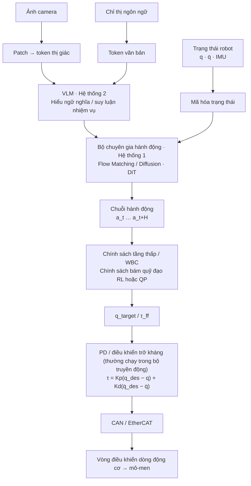

Số đọc của bộ mã hóa động cơ và IMU được phản hồi trở lại dưới dạng trạng thái Robot của nhịp tiếp theo, tạo thành một vòng khép kín.

| Liên kết | Độ lớn tần số điển hình (thay đổi tùy theo nền tảng) | Lớp nào của tuyến đường này |
|------|--------------------------|--------------|
| VLM Hiểu ngữ nghĩa (Hệ thống 2) | Chậm hơn; chạy tách rời khỏi tiêu đề hành động | L8/L10 |
| Đoạn tiêu đề hành động không hoạt động (Hệ thống 1) | Mạng đầu cuối thường có tần số 10–50 Hz; GR00T N1 báo cáo ngoài đoạn 120 Hz, π0 điều khiển khoảng 50 Hz | L9/L10 |
| Chính sách theo dõi cấp thấp / WBC | Kiểm soát cân bằng và lực yêu cầu 200–1000 Hz | L4.4 / L5.2 |
| Khớp PD / Vòng lặp hiện tại | Vòng kín tần số cao hơn trong trình điều khiển | L3/L12 |

> Số tần số đến từ các trang hiện có trên trang web: [Tách tần số điều khiển và suy luận](../wiki/concepts/control-inference-frequency-decoupling.md), [GR00T N1](../wiki/entities/paper-hrl-stack-34-gr00t_n1.md), [π0](../wiki/entities/paper-pi0.md). **Vấn đề không phải là con số cụ thể mà là "mô hình lớn chậm + bộ điều khiển cấp thấp nhanh" phải được xếp lớp** - đây là lý do tại sao cơ sở điều khiển của L3–L4 vẫn không thể bỏ qua trong kỷ nguyên VLA.

<a id="physical-ai-core-path"></a>

### Đường dẫn lõi AI vật lý (con đường ngắn nhất với thời gian có hạn)

Nếu thời gian học có hạn thì ưu tiên theo thứ tự sau, **không học hết một lúc**:

1. Robot Kinematics / Dynamics — [L1](#l1-机器人学骨架) · [L2](#l2-动力学与刚体建模)
2. PD / Kiểm soát mô-men xoắn — [L3: Chính sách ≠ Bộ điều khiển phía dưới](#policy-vs-low-level-controller)
3. MDP / Actor-Critic — [L5.1](#l5-1-rl-basics)
4. PPO — [PPO](../wiki/methods/ppo.md)
5. DeepMimic / AMP — [L5.3](#l5-3-imitation-learning)
6. Sim2Real — [L6](#l6-综合实战)
7. Transformer / Attention — [L8](#physical-ai-l8-transformer)
8. Diffusion Policy — [L9](#physical-ai-l9-action-generation)
9. Flow Matching / DiT — [L9](#physical-ai-l9-action-generation)
10. π0 / GR00T — [L10](#physical-ai-l10-vla)
11. World Model / Cosmos — [L11](#physical-ai-l11-world-model)
12. Deployment — [L12](#physical-ai-l12-deployment)

Nhịp điệu đề xuất: **Điều khiển → Học robot → Sim2Real → Máy biến áp → Tạo hành động → VLA → Mô hình thế giới**. Việc triển khai (L12) có thể được xen kẽ sau khi hoàn thành mô phỏng ở bất kỳ phần nào.

<a id="physical-ai-signal-vs-noise"></a>

### How to filter new Physical AI work（Signal vs Noise）

Khi bạn nhìn thấy một mẫu/giấy mới, trước tiên hãy hỏi:

1. **Mô-đun nào** của quy trình AI vật lý (8 lớp trên + hộp nào đang triển khai) có thay đổi không?
2. Đây là **cơ chế mới** hay chỉ là tên mẫu máy mới?
3. Nó có hợp lệ trên các robot/tác vụ không?
4. Có **giấy/mã/điểm chuẩn** không?
5. Khái niệm này có còn đáng biết **6–12 tháng sau** không?

> **If you cannot place a new work into the roadmap, do not learn it deeply yet.**

**Nguyên tắc lựa chọn tài liệu**: Khuyến nghị tối đa mỗi ý tưởng chính **1 bài viết chuẩn + 1 trang dự án chính thức + 1 GitHub + Ôm mặt tùy chọn**, bỏ qua nếu không có liên kết tương ứng; ưu tiên các nguồn chính thức và không chấp nhận các blog/trang tổng hợp cũ. "Các bài đọc được khuyến nghị" cho L8-L12 đều được viết theo quy tắc này.

---

<a id="l1-序言机器人技术栈全景--怎么读这条路线"></a>
## L−1 Lời nói đầu: Toàn cảnh về hệ thống công nghệ robot và cách đọc lộ trình này

**Phần này là “bước hạ cánh nhẹ nhàng” dành cho những độc giả chưa từng nhìn thấy robot trước đây. ** Người đọc nâng cao có thể chuyển thẳng đến [L0 Nguyên tắc cơ bản về Toán học và Lập trình](#l0-数学与编程基础) hoặc [Lộ trình học tập có thể thực thi tối thiểu](#最小可执行学习路径90-天版本).

<a id="30-秒看懂一台机器人在干嘛"></a>
### Hiểu rõ "Robot đang làm gì" trong 30 giây

Nếu bạn tách rời bất kỳ robot nào—máy quét, cánh tay robot, lái xe tự động, hình người—bạn sẽ thấy rằng tất cả chúng đều đang chạy 4 bước giống nhau trong một chu kỳ:

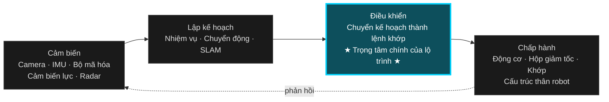

- **Nhận thức**: Camera / IMU / Bộ mã hóa / Force Sense / Radar → Cho robot biết "nó ở đâu và thế giới trông như thế nào".
- **Quyết định/Lập kế hoạch**: lập kế hoạch nhiệm vụ cấp cao, lập kế hoạch chuyển động, SLAM → quyết định "đi đâu và đi theo hướng nào".
- **Điều khiển**: Biến mục tiêu lập kế hoạch thành hướng dẫn ở cấp độ khớp → xác định "mỗi khớp sẽ tác dụng bao nhiêu lực/góc trong mili giây này".
- **Thực hiện**: động cơ, hộp giảm tốc, khớp, cấu trúc thân → biến hướng dẫn thành chuyển động cơ học.

> **Lộ trình này chỉ khoan hộp thứ ba: Kiểm soát. ** Ba hộp còn lại tập trung vào khả năng đọc viết ở [Cấp thoát L7](#l7-出口从运动控制看整个机器人技术栈), cung cấp cho bạn lối vào hướng dẫn phụ tương ứng.

### Tại sao lại dùng "hình người/hai chân" làm vật mang chính?

Hình người = **Mức độ tự do cao** (20+ khớp) + **Đế nổi** (không cố định với mặt đất) + **Chuyển tiếp điểm** (chân phải lần lượt tiếp đất) + **Không ổn định mạnh** (trọng tâm luôn muốn chạy ra ngoài).
Học cách điều khiển hình người và chuyển sang cánh tay robot, khung gầm bốn chân và bánh xe hầu như luôn giảm bớt khó khăn, nhưng điều ngược lại là không đúng. Vì vậy, hình hài con người chính là “người vận chuyển giáo lý tốt nhất” ở thời điểm hiện tại.

### Phương pháp đọc khác nhau dành cho ba người đọc

| Bạn là ai | Đề nghị đọc | Không có gì để làm |
|--------|---------|------------|
| **Cung cấp đầy đủ** (Nếu bạn muốn hiểu thuật ngữ, bạn có thể nói chuyện với các kỹ sư) | Chỉ cần đọc phần "ẩn dụ kịch bản/bạn có thể làm gì sau khi học/nên đọc những gì" của mỗi lớp L và "kiểm tra nhanh chữ viết tắt tiếng Anh" của từng lớp | Không cần viết dòng code, không cần làm bài tập |
| **Muốn tham gia vào ngành** (Lập trình viên / Sinh viên hiện tại) | Thực hiện theo [Đường dẫn thực thi tối thiểu 90 ngày](#最小可执行学习路径90-天版本) → Nhấn L0 → L7 để thực hiện theo toàn bộ quy trình, thực hiện "những việc nên làm" ở mỗi cấp độ | Không cần phải đọc tất cả các giấy tờ trước |
| **Học viên cao cấp** (Có kinh nghiệm liên quan, kiểm tra rò rỉ và lấp đầy các khoảng trống) | Chuyển thẳng đến L4/L5, tập trung vào “Những hiểu lầm thường gặp/Câu hỏi tự đánh giá” ở mỗi cấp độ; sử dụng [Độ sâu tùy chọn](#depth-optional-index) để chuyển sang hướng nghiên cứu | Không cần phải đọc lại Khái niệm cơ bản về L0–L2 |

### Cách sử dụng từng lớp

Mọi L (ngoại trừ L−1 / L7) đều có cùng định dạng:

1. **Phép ẩn dụ kịch bản** — một phép ẩn dụ một câu dành cho những người không chuyên
2. **Tại sao nó tồn tại/Hạn chế của lớp trước** — Giải thích tại sao không thể bỏ qua lớp này
3. **Kiến thức tiên quyết → Vấn đề cốt lõi → Nội dung nên đọc → Nội dung nên đọc → Kết quả đầu ra sau khi học** — Danh sách kiểm tra thực hiện kỹ thuật
4. **Những hiểu lầm thường gặp + Câu hỏi tự đánh giá** — Hiệu chỉnh nhanh cho người đọc có kinh nghiệm

### Ma trận chuyển sang phần dành cho độc giả cấp cao

Nếu bạn đã tiếp xúc với việc điều khiển robot tại nơi làm việc, bạn có thể chuyển thẳng sang chữ L tương ứng theo các câu hỏi bạn có thể trả lời. **Nhấp vào nút bên dưới để chuyển thẳng đến chương tương ứng:**

<div class="skip-to-buttons" style="display:grid; grid-template-columns:repeat(auto-fit, minmax(260px, 1fr)); gap:12px; margin:18px 0;">
<a class="btn-secondary" href="#l1-机器人学骨架" style="flex-direction:column; padding:14px 18px; text-align:center; border-radius:14px; line-height:1.5;"><strong> Tôi biết NumPy, nhưng tôi không hiểu SE(3)</strong><span style="opacity:0.7; font-size:0.85em;">→ L1 Bộ xương người máy </span></a>
<a class="btn-secondary" href="#l2-动力学与刚体建模" style="flex-direction:column; padding:14px 18px; text-align:center; border-radius:14px; line-height:1.5;"><strong> biết Pinocchio FK / Jacobian, không quen với RNEA / CRBA / ABA</strong><span style="opacity:0.7; font-size:0.85em;">→ L2 Mô hình động lực học và cơ thể cứng nhắc </span></a>
<a class="btn-secondary" href="#l4-人形运动控制主干" style="flex-direction:column; padding:14px 18px; text-align:center; border-radius:14px; line-height:1.5;"><strong> sẽ có động lực nghịch đảo cơ sở cố định và cơ sở nổi không chạm vào </strong><span style="opacity:0.7; font-size:0.85em;">→ L4 xương sống điều khiển chuyển động hình người </span></a>
<a class="btn-secondary" href="#l41-lip--zmp" style="flex-direction:column; padding:14px 18px; text-align:center; border-radius:14px; line-height:1.5;"><strong> quen thuộc với LQR / MPC, nhưng chưa học một cách có hệ thống LIP / Centroidal / WBC</strong><span style="opacity:0.7; font-size:0.85em;">→ L4.1 LIP / ZMP</span></a>
<a class="btn-secondary" href="#l52-rl-在人形运动控制里的应用" style="flex-direction:column; padding:14px 18px; text-align:center; border-radius:14px; line-height:1.5;"><strong> biết IsaacLab PPO, nhưng tôi không biết cách kết hợp nó với điều khiển truyền thống </strong><span style="opacity:0.7; font-size:0.85em;">→ L5.2 RL Ứng dụng trong điều khiển chuyển động hình người </span></a>
<a class="btn-secondary" href="#l6-综合实战" style="flex-direction:column; padding:14px 18px; text-align:center; border-radius:14px; line-height:1.5;"><strong> chạy qua mô phỏng RL, chưa bao giờ triển khai sim2real </strong><span style="opacity:0.7; font-size:0.85em;">→ L6 chiến đấu thực tế toàn diện </span></a>
<a class="btn-secondary" href="#l7-出口从运动控制看整个机器人技术栈" style="flex-direction:column; padding:14px 18px; text-align:center; border-radius:14px; line-height:1.5;"><strong> đã thực hiện điều khiển chuyển động và muốn xem toàn cảnh AI của robot hiện tại </strong><span style="opacity:0.7; font-size:0.85em;">→ Bản đồ biên giới và lối ra L7 </span></a>
</div>

**Không học hai dòng chính cùng lúc:**
- **Dòng chính điều khiển truyền thống (L0–L4 + L6):** OCP → LIP/ZMP → Centroidal → MPC → TSID/WBC → Ước tính trạng thái → Sim2Real
- **Dòng chính dựa trên học tập (L5): ** RL cơ bản → vận động RL → bắt chước học / chuyển động trước → nhắm mục tiêu lại chuyển động → giáo viên-học sinh
- Ưu tiên học đường chính truyền thống, sau đó kết nối RL/IL làm lớp mở rộng; mặt khác, rất dễ chỉ điều chỉnh các siêu tham số và không hiểu tại sao cấu trúc điều khiển lại được thiết kế theo cách này.

### Tìm kiếm nhanh các từ viết tắt tiếng Anh (L−1 cái nhìn toàn cảnh về toàn bộ tuyến đường)

| Viết tắt | Tên tiếng Anh đầy đủ | Mô tả ngắn gọn |
|------|----------|----------|
| DOF | Mức độ Tự do | Số hướng mà robot có thể di chuyển độc lập; phiên bản hình người là khoảng 25 DOF. |
| FK | Chuyển tiếp động học | Góc khớp → tư thế kết thúc. |
| IK | Động học nghịch đảo | Mục tiêu cuối → Góc khớp nghịch đảo. |
| CoM | Trung Tâm Thánh Lễ | Khối tâm của toàn bộ máy; một trong những trạng thái cốt lõi của việc kiểm soát sự cân bằng. |
| ZMP | Điểm không khoảnh khắc | Điểm trên bề mặt tiếp xúc tại đó tổng mômen bằng 0; nếu nó vẫn nằm trong đa giác hỗ trợ, nó sẽ không dễ bị đổ. |
| DCM | Thành phần chuyển động khác nhau | Thành phần chuyển động khác nhau; được sử dụng để hạ cánh và cân bằng nhìn về phía trước. |
| CP | Điểm chiếm giữ | Điểm hạ cánh dần dần dừng lại khi nhấn; thường bắt nguồn từ DCM. |
| MPC | Kiểm soát dự đoán mô hình | Giải bài toán điều khiển tối ưu trực tuyến trong miền thời gian lăn. |
| WBC | Kiểm soát toàn thân | Phân phối mô-men xoắn đa nhiệm trên toàn bộ cơ thể và xử lý hạn chế. |
| TSID | Động lực nghịch đảo không gian nhiệm vụ | Động lực nghịch đảo không gian nhiệm vụ; Khung triển khai chung WBC. |
| PID | Tỷ lệ–Tích phân–Đạo hàm | Kiểm soát phản hồi cổ điển; bảo lãnh chung duy nhất thường được sử dụng. |
| LQR | Bộ điều chỉnh bậc hai tuyến tính | Bộ điều chỉnh tối ưu bậc hai tuyến tính; đường cơ sở cân bằng. |
| RL | Học tăng cường | Chiến lược học tập thử và sai. |
| PPO | Tối ưu hóa chính sách gần nhất | Thuật toán RL theo chính sách thường được sử dụng. |
| IL | Học Bắt Chước | Chiến lược học tập từ dữ liệu trình diễn. |
| BC | Nhân bản hành vi | bắt chước có giám sát; dạng đơn giản nhất của IL. |
| Sim2Real | Mô phỏng thành hiện thực | Di chuyển chiến lược mô phỏng sang máy thật. |
| DR | Ngẫu nhiên tên miền | Mô phỏng các tham số ngẫu nhiên để cải thiện độ bền của máy thật. |
| URDF | Định dạng mô tả Robot hợp nhất | Định dạng mô tả XML cho các liên kết và khớp robot. |
| MJCF | Định dạng XML MuJoCo | Định dạng mô tả mô hình MuJoCo để mô phỏng. |
| IMU | Đơn Vị Đo Quán Tính | Đơn vị đo quán tính (gia tốc kế + con quay hồi chuyển, v.v.). |
| ĐẬP | Bản đồ hóa và Bản đồ hóa đồng thời | Bản địa hóa và lập bản đồ đồng thời. |
| VLA | Tầm nhìn–Ngôn ngữ–Hành động | Tầm nhìn–Ngôn ngữ–Hành động tích hợp lộ trình mô hình lớn. |
| ROS | Hệ điều hành Robot | Hệ sinh thái truyền thông và phần mềm trung gian robot (ROS2 là thế hệ mới). |

>Trước phần văn bản của mỗi lớp L cũng có một bảng viết tắt dành riêng cho lớp đó; giáo dân chỉ có thể quét bảng này trước để xây dựng trí nhớ cơ bắp về việc "nhận đúng số khi bạn nghe thấy".

<a id="一本贯穿全程的教材modern-robotics"></a>
### Sách giáo khoa xuyên suốt toàn bộ quá trình: Robot hiện đại

[Modern Robotics (Lynch & Park)](../wiki/entities/modern-robotics-book.md) là "sách ngữ pháp" cho L0–L4 của lộ trình này. **Nó không dạy cách vận động giống người, nhưng nó giải thích rõ ràng 'vị trí/tốc độ/lực/động lực' bằng ngôn ngữ xoắn/vít/cờ lê thống nhất. ** "Bài đọc được đề xuất" bên dưới mỗi cấp độ sẽ chỉ cho bạn các chương cụ thể. Ở đây, hãy nói về vị trí của nó trong toàn bộ quá trình để tránh việc tham chiếu lặp lại ở mỗi cấp độ:

| Chương Robot hiện đại | Bạn kết nối cấp độ nào với tuyến đường này |
|--------------------|----------------|
| Ch 2–3: Không gian cấu hình / Chuyển động của cơ thể cứng nhắc | L0–L1 (bảng chữ cái SE(3)) |
| Ch 4–6：Forward / Velocity / Inverse Kinematics | L1 |
| Ch 5、Ch 8：Statics / Dynamics of Open Chains | L2 |
| Ch 9：Trajectory Generation | L3 / L4.3 |
| Ch 11：Robot Control | L3 / L4.4 |

> Ch 7 (Kiểm soát lực lượng) và Ch 10 (Lập kế hoạch chuyển động) cũng có giá trị, nhưng tương đối lệch so với tuyến chính của tuyến này và là tùy chọn.

**Tài nguyên chính thức**: [Trang dự án](https://modernrobotics.northwestern.edu/) · [Sách PDF & Video (wiki Tây Bắc)](https://hades.mech.northwestern.edu/index.php/Modern_Robotics) · [Mã đồng hành NxRLab/ModernRobotics](https://github.com/NxRLab/ModernRobotics). **Không bắt buộc phải đọc toàn bộ cuốn sách** - Đối với lộ trình AI Vật lý, hãy tập trung vào việc hiểu biết thấu đáo về **SE(3), FK / IK, Jacobian và Dynamics** Bốn phần (Ch 2–6, Ch 8 trong bảng trên) là đủ.

---

<a id="最小可执行学习路径90-天版本"></a>
## Lộ trình học thực thi tối thiểu (phiên bản 90 ngày)

Nếu muốn “làm ít hơn nhưng giỏi hơn và chạy nhanh nhất có thể”, trước tiên bạn chỉ có thể làm 5 điều sau:

1. Chạy qua môi trường mô phỏng [Đầu máy](../wiki/tasks/locomotion.md) (đứng + di chuyển về phía trước).
2. Thực hiện một con lắc ngược [LQR](../wiki/formalizations/lqr.md) hoặc đơn giản là [MPC](../wiki/methods/model-predictive-control.md).
3. Chạy qua ví dụ tối thiểu [Điều khiển toàn thân](../wiki/concepts/whole-body-control.md) / [TSID](../wiki/concepts/tsid.md).
4. Sử dụng PPO để huấn luyện chiến lược cơ bản và đọc [WBC vs RL](../wiki/comparisons/wbc-vs-rl.md) để lựa chọn phương pháp.
5. Hoàn thành danh sách kiểm tra tối thiểu [Sim2Real](../wiki/concepts/sim2real.md) (ngay cả khi bạn chỉ thực hiện so sánh ngẫu nhiên tên miền trong mô phỏng).

> Làm xong 5 điều này quay lại lý thuyết bổ trợ L0-L6 bạn sẽ hiểu “tại sao cần học những điều này” nhanh hơn.

---

<a id="l0-数学与编程基础"></a>
## L0 Khái niệm cơ bản về toán học và lập trình

**Bạn không cần phải đi sâu vào phần này, nhưng bạn không thể bỏ qua nó.**

> **Cảnh ẩn dụ:** Bạn vừa có một con robot, nhưng bạn thậm chí không thể mô tả bằng mã "hướng cánh tay của nó" -L0 Cung cấp cho bạn "từ vựng cấp độ thấp nhất của thế giới robot": vectơ, ma trận, xoay, biến đổi.

> **Tại sao lớp này tồn tại:** Các công thức ở mỗi cấp độ tiếp theo coi "vị trí/vận tốc/lực" là tiếng lóng. KHÔNG L0, mỗi lần đọc một dòng công thức phải kiểm tra ngay tại chỗ.

### Kiểm tra nhanh chữ viết tắt tiếng Anh (L0）

| viết tắt | Tên tiếng Anh đầy đủ | Mô tả ngắn gọn |
|------|----------|----------|
| SE(3) | Nhóm Euclide đặc biệt trong không gian 3D | Nhóm toán học của các tư thế cơ thể cứng nhắc ba chiều (xoay + dịch chuyển). |
| SO(3) | Nhóm trực giao đặc biệt trong 3D | Một nhóm bao gồm các ma trận quay ba chiều;\(R^\top R=I,\ \det R=1\)。 |
| PoE | Sản phẩm của số mũ | Động học thuận được biểu diễn bằng ma trận nhân theo hàm mũ của các trục xoắn ốc. |
| FK | Chuyển tiếp động học | biến khớp → tư thế cuối (L0 Luôn luôn tiếp xúc với các khái niệm trước tiên,L1 đi sâu). |
| QP | Lập trình bậc hai | quy hoạch thứ cấp; theo dõi MPC / WBC dạng tối ưu hóa cơ bản. |
| SVD | Phân tách giá trị số ít | Phân rã giá trị số ít; thường được sử dụng khi hiểu thứ hạng Jacobian và sự dư thừa. |

### kiến thức tiên quyết
- Toán THPT + một chút trực giác tính toán
- Có thể viết Python (có thể đọc, sửa đổi và chạy)

### vấn đề cốt lõi
- Cách sử dụng đại số tuyến tính trong robot (ma trận, vectơ, phép biến đổi)
- Trực giác cho các vấn đề tối ưu hóa là gì?

### Những gì được khuyến khích
- Đặt Python/ NumPy / Pinocchio Một bộ mã môi trường có thể được chạy qua
- Không cần nghiên cứu câu hỏi nhưng cần có cảm nhận và trực giác
- sử dụng Modern Robotics Toàn bộ thư viện Python được hỗ trợ `MatrixExp3`、`MatrixExp6`、`FKinSpace` Đối với loại chức năng tối thiểu này, hãy xác nhận rằng bạn có thể kết nối chỉ số ma trận và chuyển đổi tư thế cơ thể cứng nhắc.

### Đọc gì
- **[Giám tuyển học đại số tuyến tính](../wiki/entities/linear-algebra-curriculum.md)**（L0 Cổng chính):[Georgia Tech *Đại số tuyến tính tương tác*](https://textbooks.math.gatech.edu/ila/) + [Axler *Đại số tuyến tính Thực hiện đúng* 4e（PDF）](https://linear.axler.net/LADR4e.pdf) + [3Blue1Brown trực giác hình học](https://www.3blue1brown.com/topics/linear-algebra);Tài liệu mở rộng (Strang 18.06, v.v.) xem trang giám tuyển
- [Modern Robotics](../wiki/entities/modern-robotics-book.md) Ch 2-3: Không gian cấu hình, Chuyển động cơ thể cứng nhắc
- [SE(3) thể hiện](../wiki/formalizations/se3-representation.md)
- [So sánh các phương pháp biểu diễn xoay (SO(3)）](../wiki/comparisons/so3-rotation-representations.md) — Euler/quaternion/ma trận/so(3) / Ưu nhược điểm 6D và lựa chọn
- [Pinocchio](../wiki/entities/pinocchio.md) / [Crocoddyl](../wiki/entities/crocoddyl.md)
- Nền bù đắp **Cánh tay công nghiệp/tự học không chuyên ngành**：[Hướng dẫn nghiên cứu robot nguồn mở (qqfly)](../wiki/entities/learn-robotics-qqfly-guide.md) Danh sách kiểm tra thực hành lập trình và bắt đầu của Craig

### Kết quả đầu ra sau khi học là gì
- Có thể được sử dụng NumPy Viết các phép toán ma trận đơn giản
- Có thể chạy qua bản demo động học chuyển tiếp của cánh tay robot

### Câu hỏi tự kiểm tra (có thể trả lời sau khi học)
- ma trận xoay \(R\) Tại sao chúng ta không thể thực hiện phép cộng/nội suy trực tiếp? Thay vào đó, bạn sẽ sử dụng cái gì để nội suy giữa hai hướng?
- được cho SE(3) yếu tố \(g = (R, p)\), vectơ \(v\) Biểu diễn trong hệ tọa độ mới là gì?
- chỉ số ma trận \(\exp([\omega]_\times)\) Những ưu điểm và nhược điểm của việc mô tả phép quay với góc/bậc bốn Euler là gì?

<details class="selftest-answers">
<summary>Câu trả lời tham khảo (bấm vào để mở rộng)</summary>

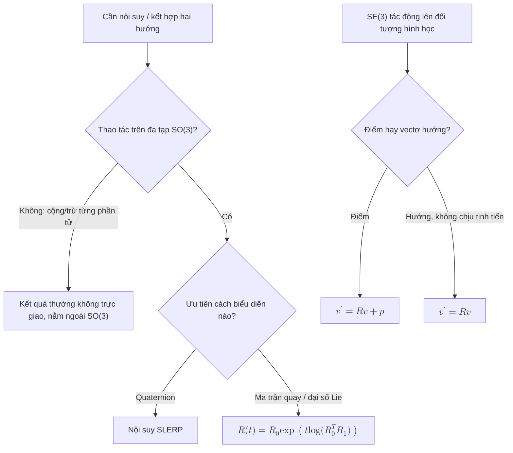

<ol>
<li><strong>Tại sao R không thể thêm/nội suy trực tiếp:</strong> Ma trận xoay thuộc về SO(3) đa dạng (\(R^\top R=I,\ \det R=1\)), không phải là không gian vectơ; sau khi cộng từng phần tử hoặc nội suy tuyến tính, nó thường không còn trực giao và sẽ nhảy ra ngoài SO(3). Hướng nội suy nên được thực hiện trên đa tạp: quaternion SLERP, hoặc trên đại số Lie \(R(t)=R_0\exp\!\big(t\log(R_0^\top R_1)\big)\)。</li>
<li><strong>SE(3) Hành động trên điểm/vectơ:</strong> Dưới tọa độ đồng nhất \(\tilde v' = g\,\tilde v\), khai triển đó là \(v' = Rv + p\)(điểm, có thể dịch); nếu như \(v\) là vectơ hướng tự do (không chịu sự dịch chuyển) thì nó chỉ quay \(v' = Rv\). Điều quan trọng là phải phân biệt giữa "điểm" và "hướng".</li>
<li><strong>Số mũ ma trận/góc Euler/bậc bốn:</strong> Ma trận quay + số mũ ma trận không có điểm kỳ dị, có thể được gộp trực tiếp và thống nhất với đại số xoắn / Lie (PoE、Jacobian dựa trên nó), nhưng 9 số + 6 ràng buộc là dư thừa; Góc Euler chỉ có 3 số, trực quan nhưng có tính kỳ dị khóa vạn năng, không duy nhất và sai phân nội suy; quaternion là 4 số, không có số kỳ dị, hợp số/ SLERP Hiệu quả và ổn định, nhưng độ phủ sóng gấp đôi (\(q\) Và \(-q\) đại diện cho cùng một phép quay). Các biểu thức bậc bốn và chuỗi được sử dụng để tính toán nội bộ trong kỹ thuật FK Chỉ sử dụng ma trận/chỉ số ma trận và góc Euler cho đầu vào và đầu ra mà con người có thể đọc được.</li>
</ol>
</details>

---

<a id="l1-机器人学骨架"></a>
## Bộ xương robot L1

**Bài viết này là nền tảng cho tất cả các nội dung tiếp theo. Nếu bỏ qua chắc chắn tôi sẽ bù lại sau. **

> **Ẩn dụ cảnh:** Nếu bạn nhìn chằm chằm vào những thay đổi trong góc khớp của cánh tay robot, bạn có thể đoán ra ngay quỹ đạo của phần cuối không? L1 dạy cho bạn trình dịch này: không gian chung ↔ không gian nhiệm vụ.

> **Hạn chế của lớp trước:** L0 cho phép bạn viết các phép toán ma trận, nhưng bạn vẫn chưa biết ánh xạ giữa "góc khớp của robot" và "tư thế cuối"; L1 thiết lập trình dịch này.

### Kiểm tra nhanh từ viết tắt tiếng Anh (L1)

| Viết tắt | Tên tiếng Anh đầy đủ | Mô tả ngắn gọn |
|------|----------|----------|
| FK | Chuyển tiếp động học | Góc khớp → tư thế kết thúc. |
| IK | Động học nghịch đảo | Mục tiêu cuối → góc khớp; Cánh tay 6R thường có nhiều bộ giải pháp. |
| DH | Denavit–Hartenberg | Tham số hóa thanh kết nối cổ điển; tuyến đường này khuyến nghị PoE/xoắn. |
| PoE | Sản phẩm của hàm mũ | Trục xoắn ốc + chỉ số ma trận mô tả chuỗi mở FK. |
| \(J\) / Jacobian | Bộ điều khiển Jacobian | Tốc độ khớp → ánh xạ tuyến tính của độ xoắn cuối. |
| Xoắn | Vận tốc không gian (6D) | Vận tốc tức thời của vật rắn (vận tốc góc + vận tốc tuyến tính). |
| Vít | Xoay + Cao độ | Chuyển động xoắn ốc; trục khớp trong PoE là trục vít. |
| Cờ lê | Lực lượng không gian (6D) | Lực tổng quát sáu chiều của lực + mô men. |
| Quảng cáo | Chuyển đổi phụ trợ | Ma trận \(6\times6\) biến đổi xoắn/cờ lê giữa các hệ tọa độ khác nhau. |

**Nên đi bộ cấp độ này theo ba bước, không hoàn thành nó trong một lần:**

1. **L1.1 SE(3), chuyển đổi chuyển động xoay và vật cứng** - mô tả rõ ràng "tư thế" bằng toán học (ma trận xoay, chuyển đổi đồng nhất, Trục xoắn/trục vít, chỉ số ma trận/PoE). Đây là bảng chữ cái cho mọi thứ tiếp theo.
2. **L1.2 Động học thuận và nghịch (FK / IK)** — góc khớp ↔ tư thế cuối. Trước tiên, hãy sử dụng công thức PoE để viết tay FK nhằm xác minh đầu ra của Pinocchio.
3. **L1.3 Jacobi và động học vận tốc** — tốc độ khớp ↔ tốc độ đầu cuối, hiệu giữa không gian Jacobian và vật thể Jacobian; đây là chìa khóa để kiểm soát không gian nhiệm vụ L4.

> Ba bước này có chung danh sách "những việc nên làm/nên đọc/nên ghi gì sau khi học" bên dưới. Chỉ cần tiến hành theo thứ tự trên.

### Kiến thức cần thiết
- Nội dung L0
- Một vật rắn quay như thế nào trong không gian ba chiều và mô tả hướng của nó như thế nào?

### Vấn đề cốt lõi
- Mối quan hệ giữa góc của từng khớp của robot và vị trí của cơ cấu tác động cuối là gì?
- Làm thế nào để mô tả điều này một cách toán học
- Động học thuận và động học nghịch đảo là gì?
- Tại sao phải xoắn, trục vít, PoE phù hợp để kết nối với Pinocchio/TSID/WBC sau hơn là chỉ ghi nhớ thông số D-H

### Nên làm gì?
- Sử dụng Pinocchio hoặc Robotics Toolbox để mô hình hóa một cánh tay robot đơn giản
-Viết mã động học thuận và động học nghịch
- Hiểu ma trận Jacobian là gì
- Sử dụng công thức PoE của Modern Robotics để viết tay `FKinSpace` / `JacobianSpace` cho cánh tay robot 2-3 bậc tự do, sau đó căn chỉnh nó với đầu ra Pinocchio

### Khuyến khích đọc
- [Modern Robotics](../wiki/entities/modern-robotics-book.md) Ch 4-6：Forward Kinematics、Velocity Kinematics、Inverse Kinematics
- [Động học chuyển tiếp](../wiki/formalizations/forward-kinematics.md) / [Động học nghịch đảo](../wiki/formalizations/inverse-kinematics.md) / [Ma trận Jacobian](../wiki/formalizations/robot-jacobian.md) ("Cơ bản về trí tuệ hiện thân" màu xanh đậm 08–10)
- [Stanford "Giới thiệu về Robot" (Bilibili)](https://www.bilibili.com/video/BV17T421k78T/)
- Hướng dẫn chính thức của Paotong Pinocchio
- [Humanoid Robot](../wiki/entities/humanoid-robot.md)
- [Floating Base Dynamics](../wiki/concepts/floating-base-dynamics.md)

### Kết quả sau khi học là gì
- Có thể tự mình mô hình hóa một robot đơn giản và tính toán động học thuận và động học nghịch đảo
- Có thể giải thích ma trận Jacobian là gì và công dụng của nó trong robot
- Có khả năng phân biệt không gian Jacobian với thân Jacobian và biết cách chúng nhập ánh xạ vận tốc/lực trong điều khiển không gian nhiệm vụ

### Câu hỏi tự kiểm tra (học xong có thể trả lời được)
- Cho không gian Jacobian \(J_s\), cách tính thân Jacobian \(J_b\)? Sự khác biệt giữa hai ứng dụng trong việc kiểm soát tốc độ không gian tác vụ là gì?
- Nhìn chung có bao nhiêu bộ giải pháp dành cho IK dành cho tay máy 6 bậc tự do? "Khuỷu tay lên/xuống khuỷu tay" đến từ đâu?
- Ưu điểm kỹ thuật lớn nhất của công thức PoE so với thông số D-H là gì? Tại sao Pinocchio/TSID đều được chế tạo theo dạng xoắn/vít?

<details class="selftest-answers">
Câu trả lời tham khảo <summary> (bấm để mở rộng) </summary>

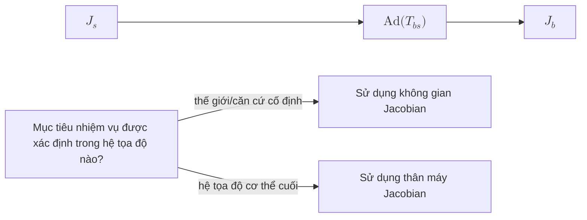

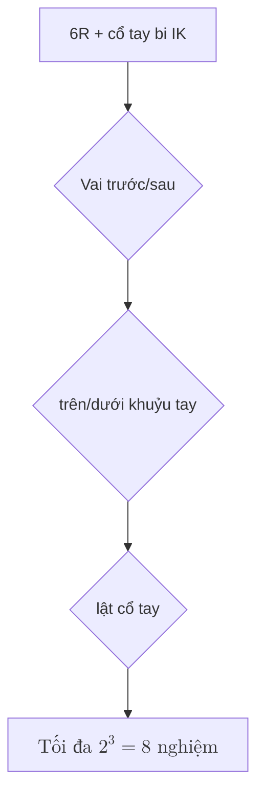

<ol>
<li><strong>space ↔ body Jacobian: </strong> \(J_b = [\mathrm{Ad}_{T_{bs}}]\,J_s\), trong đó \(T_{bs}=T_{sb}^{-1}\) và \([\mathrm{Ad}]\) là các ma trận liền kề 6×6. \(J_s\) ánh xạ vận tốc khớp tới độ xoắn cuối "được biểu thị trong hệ tọa độ cơ sở cố định" và \(J_b\) ánh xạ tới độ xoắn "được biểu thị trong hệ tọa độ thân đầu cuối". Hệ tọa độ nào mà mục tiêu được xác định tương ứng với Jacobian: \(J_b\) thường được sử dụng để điều khiển lực cuối/điều khiển trợ lực trực quan và \(J_s\) được sử dụng cho các mục tiêu hệ thống thế giới. </li>
<li><strong>IK Số lượng giải pháp: </strong> Cánh tay robot 6R với cổ tay bóng có tới 8 bộ giải pháp, từ ba lựa chọn nhị phân là vai trước/sau, khuỷu tay lên/xuống và lật cổ tay (\(2^3=8\)); Cổ tay không bóng nói chung 6R có thể có tới 16 nhóm. "Trên khuỷu tay/dưới khuỷu tay" xuất phát từ nghiệm bậc hai của \(\pm\) khi tìm góc khớp khuỷu tay - ở cùng một vị trí cuối, khuỷu tay có thể cong lên hoặc cong xuống. </li>
<li><strong>PoE So với D-H: </strong> PoE chỉ cần trục xoắn ốc + vị trí 0 của mỗi khớp, hình học rõ ràng và không cần đặt hệ tọa độ D-H trong mỗi liên kết (D-H nhạy cảm với lựa chọn vị trí/tọa độ 0 và không thân thiện đến hình dáng cây và gốc nổi); và PoE được thể hiện một cách tự nhiên bằng xoắn/vít, ngôn ngữ tương tự như động học vận tốc (các cột của Jacobian là các trục xoắn ốc biến đổi), cờ lê, nhóm Lie/đại số Lie và động lực học. Pinocchio / TSID dựa trên dây xoắn / cờ lê / SE(3) nên PoE có kết nối liền mạch. </li>
</ol>
</details>

---

<a id="l2-动力学与刚体建模"></a>
## L2 Động lực học và Mô hình hóa cơ thể cứng nhắc

**Từ động học đến động lực học, đây là bước nhảy quan trọng nhất để điều khiển robot. **

> **Ẩn dụ cảnh:** Nếu bạn cho robot một mô-men xoắn, nó sẽ chuyển động như thế nào? L2 nâng cấp “không gian hình học” thành “không gian cơ học” - chuyển từ mô tả tư thế sang mô tả mối quan hệ nhân quả của chuyển động và lực.

> **Hạn chế của lớp trước:** Động học L1 chỉ trả lời cách ánh xạ "vận tốc góc khớp ↔ vận tốc cuối" nhưng không thể trả lời "cần bao nhiêu mô-men xoắn để tạo ra gia tốc này". Nếu không có động lực, bạn chỉ có thể thực hiện điều khiển vị trí và nó sẽ sụp đổ khi gặp tiếp xúc, chuyển động tốc độ cao hoặc tương tác lực.

### Kiểm tra nhanh từ viết tắt tiếng Anh (L2)

| Viết tắt | Tên tiếng Anh đầy đủ | Mô tả ngắn gọn |
|------|----------|----------|
| RNEA | Thuật toán Newton–Euler đệ quy | Động lực đảo ngược: \((q,\dot q,\ddot q)\to\tau\), \(O(n)\). |
| CRBA | Thuật toán thân cứng tổng hợp | Ma trận chất lượng lắp ráp \(M(q)\), \(O(n^2)\). |
| ABA | Thuật toán cơ thể khớp nối | Động lực dương: \(\tau\to\ddot q\), \(O(n)\), thường được sử dụng trong mô phỏng. |
| FB | Đế Nổi | Đế không cố định; phần thân hình người là một đế nổi 6 bậc tự do. |
| CoM | Trung Tâm Thánh Lễ | Vị trí trung tâm của quần chúng; liên quan chặt chẽ với động lượng hướng tâm. |
| CMM | Ma trận động lượng hướng tâm | Vận tốc tổng quát → Ánh xạ 6D của động lượng tâm \(h_g=A_g\dot q\). |
| ID | Động lực học nghịch đảo | Tìm lực tổng quát cần thiết cho một chuyển động nhất định. |
| FD | Động lực chuyển tiếp | Tìm gia tốc cho một lực tổng quát. |

**Nên thực hiện cấp độ này theo hai bước:**

1. **L2.1 Động lực chuỗi mở cơ sở cứng đơn/cơ sở cố định** — Ma trận khối \(M(q)\), Thuật ngữ Coriolis/Trọng lực, Động lực thuận và nghịch đảo (RNEA / CRBA / ABA). Đầu tiên hãy chạy qua API của Pinocchio và xác minh nó với Modern Robotics Ch 8.
2. **L2.2 Động lực học tiếp xúc và đế nổi** — Mở rộng phương pháp cơ sở cố định cho robot hình người không có đế cố định + tiếp xúc không liên tục. Các điểm chính: biểu diễn trạng thái cơ sở động, cách viết các ràng buộc tiếp xúc dưới dạng Jacobian và ý nghĩa vật lý của Ma trận động lượng hướng tâm.

> Quan trọng: Phải hiểu rõ L2.2 trước khi vào L4, nếu không thì LIP/Cenroidal MPC/WBC đều là "ma thuật".

### Kiến thức cần thiết
- Nội dung L1 (Động học)
- Một chút trực giác về phép tính và các phương trình vi phân thông thường

### Vấn đề cốt lõi
- Mô-men xoắn khớp điều khiển chuyển động của robot như thế nào?
- Ma trận khối lượng, số hạng trọng lực và số hạng Coriolis là gì?
- Tại sao hệ thống đế nổi (thân của robot hình người) không thể sử dụng phương pháp đế cố định
- Cách cờ lê, chuyển vị Jacobian và nguyên lý làm việc ảo ánh xạ không gian tác vụ đến các khoảnh khắc chung

### Nên làm gì?
- Sử dụng Pinocchio để viết một bản demo động lực học thuận và nghịch đảo của vật rắn
- Hiểu được dạng cơ bản của động lực học hướng tâm
- Hiểu được các vấn đề biểu diễn trạng thái của hệ cơ sở nổi
- Sử dụng giao diện động lực chuỗi mở của Modern Robotics Ch 8 để chạy `InverseDynamics` / `MassMatrix` / `ForwardDynamics`, sau đó so sánh RNEA / CRBA / ABA với Pinocchio

### Khuyến khích đọc
- [Modern Robotics](../wiki/entities/modern-robotics-book.md) Ch 5、Ch 8：Statics、Dynamics of Open Chains
- Các chương liên quan đến Featherstone "Robot Dynamics"
- Phần trung tâm của tài liệu Pinocchio
- [Floating Base Dynamics](../wiki/concepts/floating-base-dynamics.md)
- [Bù trọng lực](../wiki/concepts/gravity-compensation.md) — Kiểm soát việc sử dụng $g(q)=\mathrm{RNEA}(q,0,0)$
- [Centroidal Dynamics](../wiki/concepts/centroidal-dynamics.md)
- [Contact Dynamics](../wiki/concepts/contact-dynamics.md) / [Contact Wrench Cone](../wiki/formalizations/contact-wrench-cone.md)

### Bổ sung phối cảnh AI vật lý: Ma sát · Thiết bị truyền động · Ước tính trạng thái

Mạng lưới thần kinh cuối cùng không điều khiển một "vật thể cứng lý tưởng", mà là một động cơ + truyền động có ma sát, độ trễ và bão hòa, và trạng thái mà nó nhìn thấy là giá trị ước tính chứ không phải giá trị thực. Ba điều này là nguồn chính của L6 sim2real khoảng cách. Thiết lập khái niệm đầu tiên ở L2:

- **Ma sát**: Coulomb + độ nhớt + Stribeck, bộ giảm tốc càng lớn thì càng rõ ràng → [Mô ​​hình ma sát chung](../wiki/concepts/joint-friction-models.md) / [Bù ma sát](../wiki/concepts/friction-compensation.md)
- **Bộ truyền động/Động cơ**: hằng số mô-men xoắn, độ bão hòa, băng thông, vòng lặp dòng điện; thường được lý tưởng hóa trong mô phỏng → [Mô ​​hình bộ truyền động rõ ràng/ngầm](../wiki/concepts/implicit-explicit-actuator-modeling.md) / [Mạng bộ truyền động](../wiki/methods/actuator-network.md)
- **Ước tính trạng thái**: Tư thế/vận tốc cơ sở nổi phụ thuộc vào sự kết hợp bộ mã hóa IMU +, chất lượng quan sát của chính sách phụ thuộc vào nó → [Ước tính trạng thái](../wiki/concepts/state-estimation.md)

### Kết quả sau khi học là gì
- Có thể giải thích được vai trò của động lực học thuận và nghịch trong điều khiển robot
- Có thể hiểu tại sao động lực học hướng tâm lại quan trọng
- Có trực giác về "mô-men xoắn này có thể tạo ra chuyển động gì cho robot"
- Mối quan hệ “lực không gian tác dụng/lực tiếp xúc → mô men khớp” có thể viết dưới dạng chuyển vị Jacobian

### Câu hỏi tự kiểm tra (học xong có thể trả lời được)
- Viết dạng chuẩn của phương trình động lực học robot chuỗi mở đế cố định và giải thích ý nghĩa vật lý lần lượt của \(M(q)\), \(C(q,\dot q)\dot q\) và \(g(q)\).
- Tại sao trạng thái của hệ thống cơ sở nổi lại yêu cầu \((q, \dot q, \text{base pose}, \text{base vel})\) mà không chỉ \((q, \dot q)\)?
- Cho điểm tiếp xúc Jacobian \(J_c\) và lực tiếp xúc \(f_c\), đồ thị từ lực tiếp xúc đến mô men khớp là gì? Tại sao đây là bước cốt lõi của WBC?
- RNEA / CRBA / ABA Họ đang tìm kiếm điều gì và sự khác biệt về độ phức tạp tính toán là gì? Bạn sẽ sử dụng cái nào cho vòng điều khiển 1 kHz điển hình trong Pinocchio?

<details class="selftest-answers">
Câu trả lời tham khảo <summary> (bấm để mở rộng) </summary>

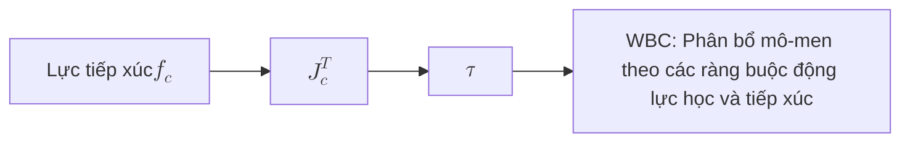

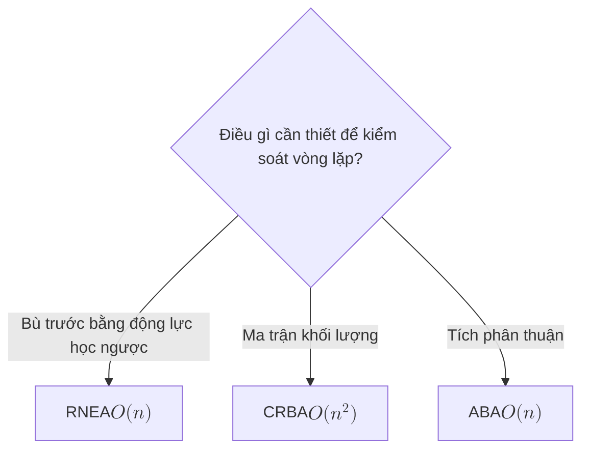

<ol>
<li><strong>Dạng chuẩn của động học bazơ cố định:</strong> \(M(q)\ddot q + C(q,\dot q)\dot q + g(q) = \tau\)。\(M(q)\): Ma trận khối lượng/quán tính xác định dương đối xứng, mô tả lực tổng quát (quán tính) cần thiết để tạo ra gia tốc;\(C(q,\dot q)\dot q\): Thuật ngữ Coriolis và ly tâm, bắt nguồn từ sự thay đổi quán tính theo cấu hình và khớp nối vận tốc;\(g(q)\): Lực hấp dẫn tổng quát.</li>
<li><strong>Tại sao cơ sở nổi cần trạng thái cơ sở:</strong>Thân đế nổi không có đế cố định và bản thân tư thế 6 chiều của nó là một biến tự do. Chỉ sử dụng khớp\((q,\dot q)\)Không thể biểu diễn quá trình tịnh tiến/vòng quay và động lượng của toàn bộ cỗ máy trên thế giới, cũng như không thể viết đượcCoM / ZMP/ Các ràng buộc liên hệ và các ràng buộc cân bằng khác, do đó trạng thái phải chứa tư thế cơ sở và vel cơ sở, và tổng kích thước xấp xỉ\((n+6)\)tư thế +\((n+6)\)tốc độ.</li>
<li><strong>Lực tiếp xúc với mômen khớp:</strong> \(\tau = J_c^\top f_c\)(Nguyên tắc làm việc ảo/Jacobianđược chuyển đổi). Đây làWBCBước cốt lõi: Điều duy nhất robot có thể điều khiển trực tiếp là mô-men xoắn khớp.\(\tau\), và sự cân bằng phụ thuộc vào lực tiếp xúc\(f_c\)；WBCTìm theo các ràng buộc động lực và liên hệ\((\ddot q, f_c, \tau)\)，\(J_c^\top\)Chính cây cầu này sẽ chuyển “lực tiếp xúc mong muốn” thành “mỗi khớp phải tác dụng bao nhiêu mô-men xoắn”.</li>
<li><strong>RNEA / CRBA / ABA：</strong> RNEATìm động năng nghịch đảo (cho bởi\(q,\dot q,\ddot q\)phải\(\tau\)），\(O(n)\)；CRBATìm ma trận khối lượng\(M(q)\)，\(O(n^2)\)；ABATìm động lực dương (cho bởi\(\tau\)phải\(\ddot q\)），\(O(n)\)。1 kHz WBCNhững gì vòng lặp yêu cầu là động lực nghịch đảo/truyền mô-men xoắn tiến, sử dụngRNEA(nhu cầu\(M\)cho ănQPKết hợp lại khi cần thiếtCRBA）；ABAChủ yếu được sử dụng để tích hợp về phía trước của trình mô phỏng.</li>
</ol>
</details>

---

<a id="l3-控制基础与最优化"></a>
## Điều khiển cơ bản và tối ưu hóa L3

**Không có lý thuyết điều khiển và không thể kết nối MPC / WBC / RL sau đây. **

> **Ẩn dụ cảnh:** Bạn đã có thể tính toán "mô-men xoắn ↔ gia tốc", nhưng câu hỏi bây giờ là: Cần tạo ra bao nhiêu mô-men xoắn tại mỗi thời điểm để robot có thể di chuyển theo quỹ đạo bạn muốn? L3 nâng cấp “thời điểm tính toán” thành “thời điểm ra quyết định trực tuyến”.

> **Các hạn chế của lớp trước:** Động lực L2 cho bạn biết mối quan hệ vật lý của "mô-men đầu vào → gia tốc đầu ra", nhưng không cho bạn biết "bây giờ nên nhập bao nhiêu mô-men xoắn" - đây là công việc của bộ điều khiển. L3 là cú pháp cơ bản cho tất cả các phương thức của L4 (LIP / MPC / WBC).

### Kiểm tra nhanh từ viết tắt tiếng Anh (L3)

| Viết tắt | Tên tiếng Anh đầy đủ | Mô tả ngắn gọn |
|------|----------|----------|
| OCP | Bài toán điều khiển tối ưu | Bài toán điều khiển tối ưu; vỏ toán học cho MPC / TrajOpt. |
| PID | Tỷ lệ–Tích phân–Đạo hàm | Phản hồi cổ điển; đảm bảo theo dõi cấp độ chung. |
| LQR | Bộ điều chỉnh bậc hai tuyến tính | Phản hồi tối ưu tuyến tính bậc hai trong miền thời gian vô hạn \(u=-Kx\). |
| MPC | Kiểm soát dự đoán mô hình | Tối ưu hóa cuộn miền thời gian hữu hạn; có thể chứa các ràng buộc. |
| QP | Lập trình bậc hai | Lập trình bậc hai; dạng giải pháp cốt lõi của WBC / lồi MPC. |
| HQP | Lập trình bậc hai phân cấp | QP phân cấp; Thực hiện ưu tiên nhiệm vụ với không gian bằng không. |
| PD | Tỷ lệ–Đạo hàm | Kiểm soát tỷ lệ-đạo hàm; thường được sử dụng kết hợp với mô-men xoắn tính toán. |
| CT | Kiểm soát mô-men xoắn tính toán | Theo dõi quỹ đạo mong muốn với động lực nghịch đảo tiến + phản hồi. |

### Kiến thức cần thiết
- Nội dung L2 (động lực)
- Một chút trực giác về tối ưu hóa số (xem [Chương trình giảng dạy tối ưu hóa số](../wiki/entities/numerical-optimization-curriculum.md))

### Vấn đề cốt lõi
- PID/LQR/MPC tương ứng giải quyết được những vấn đề gì?
- QP (lập trình bậc hai) là gì và tại sao nó lại có mặt ở mọi nơi trong điều khiển robot?
- Ý tưởng cốt lõi của điều khiển tối ưu là gì?
- Lớp nào của ngăn điều khiển được đặt ở vị trí tạo quỹ đạo, điều khiển phản hồi và tối ưu hóa ràng buộc?

### Nên làm gì?
- Dùng Python viết bộ điều khiển LQR cho con lắc ngược
- Chạy QP đơn giản với qpOASES hoặc OSQP
- Tìm hiểu ý tưởng miền thời gian lăn của MPC
- Tái tạo quỹ đạo chia tỷ lệ thời gian khối/năm của Robotics hiện đại Ch 9 và thêm PD/theo dõi mô-men xoắn được tính toán vào quỹ đạo cuối cánh tay robot

### Khuyến khích đọc
- [Modern Robotics](../wiki/entities/modern-robotics-book.md) Ch 9、Ch 11：Trajectory Generation、Robot Control
- [Underactuated Robotics](https://arxiv.org/abs/1709.10219)（TEDRAKE）
- "Robotics: Mô hình hóa, lập kế hoạch và điều khiển" - Các chương liên quan đến Siciliano
- [LQR](../wiki/formalizations/lqr.md)
- [Optimal Control](../wiki/concepts/optimal-control.md)
- [Model Predictive Control (MPC)](../wiki/methods/model-predictive-control.md) / [Trajectory Optimization](../wiki/methods/trajectory-optimization.md)
- [Điều khiển toàn thân](../wiki/concepts/whole-body-control.md) / [HQP](../wiki/concepts/hqp.md) / [Điều khiển không gian bằng không](../wiki/concepts/null-space-control.md)
- [Chương trình giảng dạy Tối ưu hóa Số](../wiki/entities/numerical-optimization-curriculum.md) (Bản đồ khóa học Tối ưu hóa Số L0+), [CMU Optimal Control 2025](../wiki/entities/cmu-optimal-control-curriculum.md) (16-745 giám tuyển video công khai)

<a id="policy-vs-low-level-controller"></a>

### Chính sách ≠ Bộ điều khiển phía dưới: từ q_target đến mômen động cơ

**Chính sách học tập và bộ điều khiển cấp thấp không giống nhau. ** Hầu hết các chiến lược RL / VLA hình người không trực tiếp xuất ra dòng điện mà xuất ra các mục tiêu chung và sau đó bộ điều khiển cơ bản sẽ đóng vòng lặp:

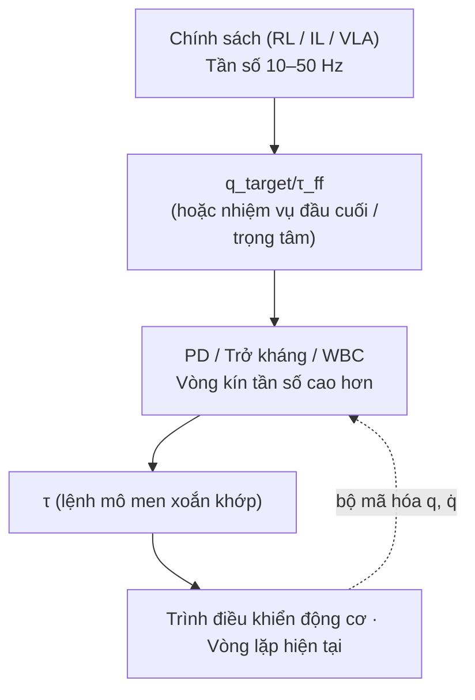

Lớp phổ biến nhất là PD chung ("PD kiểu MIT", thường được gọi là chế độ MIT: trình điều khiển nhận \(q_{des}, \dot q_{des}, K_p, K_d, \tau_{ff}\) năm số lượng cùng lúc và đóng vòng lặp trong trình điều khiển; dạng giao diện này được phổ biến với trình điều khiển nguồn mở [MIT Mini Cheetah](../wiki/entities/mit-mini-cheetah.md):

$$\tau = K_p\,(q_{des} - q) + K_d\,(\dot q_{des} - \dot q) + \tau_{ff}$$

| Chế độ điều khiển | Cấp trên mang lại điều gì | Sự phù hợp | Mối quan hệ với chính sách |
|---------|-----------|------|-----------------|
| **Kiểm soát vị trí** | \(q_{des}\) (mức tăng cao) | Cánh tay công nghiệp, định vị chính xác tốc độ chậm | Độ cứng cao, va đập tiếp xúc kém |
| **Kiểm soát vận tốc** | \(\dot q_{des}\) | Loại bánh xe, khung gầm | Khớp hình người hiếm khi được sử dụng |
| **Kiểm soát mô-men xoắn** | \(\tau\) | WBC / Kiểm soát lực / Động lực cao | Yêu cầu mô hình động lực và động cơ chính xác |
| **Trở kháng / PD (kiểu MIT)** | \(q_{des}, K_p, K_d, \tau_{ff}\) | Không gian hành động chủ đạo của hình người RL | Chính sách ra \(q_{des}\), \(K_p, K_d\) quyết “mềm và cứng” |
| **Kiểm soát toàn thân / QP / MPC** | Mục tiêu không gian nhiệm vụ | Đa liên lạc, đa tác vụ | Xem [L4](#l4-人形运动控制主干), cũng có thể được sử dụng làm lớp chính sách thấp hơn |

- Vấn đề không phải là đạo hàm công thức mà là: **Nếu bạn thay đổi chính sách tương tự thành \(K_p, K_d\) hoặc tần số điều khiển, hoạt động của máy thật sẽ thay đổi** - Đây là cạm bẫy đầu tiên của L6 sim2real.
- Tiện ích mở rộng: [Điều khiển PID](../wiki/methods/pid-control.md) · [Kiểm soát trở kháng](../wiki/concepts/impedance-control.md) · [Điều khiển mô-men xoắn được tính toán](../wiki/methods/computed-torque-control.md) · [Cách thiết lập mức tăng PD của hình người RL](../wiki/queries/legged-humanoid-rl-pd-gain-setting.md)

### Kết quả sau khi học là gì
- Có thể giải thích sự khác biệt giữa LQR và MPC
- Có thể hiểu QP giải quyết vấn đề gì trong WBC
- MPC người có thể tự mình xây dựng một mô hình đơn giản
- Có thể giải thích mối quan hệ giữa mô-men xoắn được tính toán, PD, điều khiển trở kháng và điều khiển tác vụ WBC tiếp theo

### Câu hỏi tự kiểm tra (học xong có thể trả lời được)
- Trong trường hợp nào các luật điều khiển được LQR và MPC giải quyết hoàn toàn tương đương nhau? Sau khi điều kiện nào bị phá vỡ, phải sử dụng MPC?
- Cho câu hỏi QP, làm thế nào để nhận biết nó có lồi hay không? Tại sao WBC lại ưu tiên QP lồi?
- Mức độ ưu tiên của HQP (QP phân cấp) được triển khai bằng toán học như thế nào (gợi ý: phép chiếu không gian rỗng)?
- Sự khác biệt cơ bản giữa kiểm soát trở kháng và kiểm soát tiếp nhận là gì? Khi nào dùng cái trước, khi nào dùng cái sau?

<details class="selftest-answers">
Câu trả lời tham khảo <summary> (bấm để mở rộng) </summary>

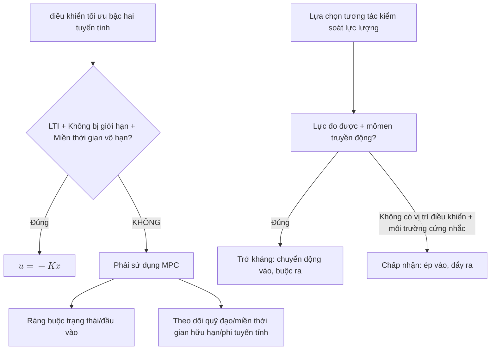

<ol>
<li><strong>LQRVàMPCKhi nào tương đương:</strong>Khi hệ thống tuyến tính và bất biến, chi phí là bậc hai, không có ràng buộc vàMPCKhi miền thời gian dự đoán có xu hướng tiến tới vô cùng,MPCGiải pháp là miền thời gian vô hạnLQRluật phản hồi\(u=-Kx\). Nó phải được sử dụng bất cứ khi nào có các ràng buộc trạng thái/đầu vào (phổ biến nhất), phi tuyến tính, miền thời gian hữu hạn/thay đổi theo thời gian hoặc khi cần theo dõi quỹ đạo tham chiếu.MPC。</li>
<li><strong>QPPhán đoán độ lồi:</strong>Hàm mục tiêu Hessian là nửa xác định dương (\(\tfrac12 x^\top P x\)ở giữa\(P\succeq 0\)), ràng buộc là một phương trình tuyến tính cộng với bất đẳng thức lồi (affine), là lồi.WBCƯu tiên lồiQP, bởi vì nó có giải pháp nhanh chóng, tối ưu toàn cầu và hội tụ xác định duy nhất, OSQP / qpOASES có thể được giải quyết trong thời gian thực ở tần số 1 kHz; không lồi sẽ có cực tiểu cục bộ, thời gian giải không thể kiểm soát được và không được chấp nhận để kiểm soát an toàn thời gian thực.</li>
<li><strong>Việc thực hiện toán học các ưu tiên HQP:</strong>Sử dụng phép chiếu khoảng trống: Giải quyết nhiệm vụ có mức độ ưu tiên cao nhất trước, mức độ ưu tiên thấp chỉ có thể được tối ưu hóa trong không gian trống mà không phá hủy mức độ ưu tiên cao——\(\dot q = J_1^{+}\dot x_1 + N_1 z\),TRONG\(N_1 = I - J_1^{+}J_1\)là phép chiếu không gian của Nhiệm vụ 1, từng lớp. Tương tự, nhiều lớpQPGiá trị tối ưu cấp cao hơn được sử dụng làm ràng buộc đẳng thức của cấp độ thấp hơn (giải pháp từ điển).</li>
<li><strong>Trở kháng và tiếp nhận:</strong>Bản chất là hướng nhân quả trái ngược nhau. Điều khiển trở kháng “chuyển động vào, lực ra”: Theo độ lệch vị trí/tốc độ\(F=K\Delta x + D\Delta\dot x\)Tạo lực (bộ điều khiển mô-men xoắn, nếu môi trường cứng thì sẽ linh hoạt); điều khiển tiếp nạp “lực vào, chuyển động ra”: tạo tham chiếu vị trí (bộ điều khiển vị trí) theo ngoại lực đo được. Trở kháng được sử dụng trong môi trường mềm/không xác định yêu cầu tuân thủ băng thông cao và an toàn va chạm (chân hình người); bộ truyền động chỉ có thể được sử dụng để điều khiển vị trí chính xác và khả năng tiếp nhận được sử dụng trong môi trường cứng nhắc đòi hỏi độ chính xác vị trí cao (lắp ráp công nghiệp).</li>
</ol>
</details>

---

<a id="l4-人形运动控制主干"></a>
## L4 xương sống điều khiển chuyển động hình người

**Đây là cốt lõi của tuyến đường này. **

> **Ẩn dụ cảnh:** Bạn đã có thể điều khiển vị trí của cánh tay robot, nhưng robot hình người không có chân đế cố định và phải đổi chân hỗ trợ bất cứ lúc nào - L4 dạy bạn tổ chức lại "lý thuyết điều khiển phổ quát" thành chuỗi phương pháp phân cấp "dành riêng cho hình người".

> **Hạn chế của lớp trước:** Phương pháp L3 (PID / LQR / MPC / QP) rất đơn giản trên robot có đế cố định, nhưng robot hình người là đế nổi + tiếp xúc ngắt quãng + thiếu dẫn động chiều cao nên không thể áp dụng trực tiếp; cần có một mô hình đơn giản hóa đặc biệt (LIP / Centroidal) và cấu trúc phân cấp (MPC + WBC).

### Cầu L4.0: Cách xâu chuỗi L1–L3 thành chuỗi phương thức L4

L4 là bậc dốc nhất trên tuyến đường. ** Trước khi vào L4.1, điều quan trọng hơn nhiều là thiết lập một mô hình tinh thần về "tại sao lại có thứ tự này" hơn là xem xét trực tiếp từng phương pháp phụ. **

Mâu thuẫn cốt lõi của điều khiển hình người là: **Kích thước động lực học toàn cơ thể quá cao, tính phi tuyến tính mạnh và chuyển đổi tiếp điểm cường độ cao** - không thể áp dụng trực tiếp vào LQR / MPC chung đã học trong L3. Giải pháp không phải là phát minh ra toán học mới mà là chia nó theo hai trục “mô hình từ thô đến tinh, điều khiển từ chậm đến nhanh”:

| Trục | Ý nghĩa | Ví dụ |
|---|---|---|
| **Mức độ chi tiết của mô hình** | Có bao nhiêu biến trạng thái được sử dụng để mô tả robot | LIP (3 chiều) → Hướng tâm (động lượng 6 chiều + lực tiếp xúc) → Động lực học toàn cơ thể (n+6 chiều) |
| **Tần số điều khiển** | Đưa ra quyết định ở quy mô thời gian nào | Bước chân / Lập kế hoạch cấp cao (1–10 Hz) → MPC (50–200 Hz) → WBC (1 kHz) |

Chuỗi phương thức của L4 là nối hai trục này thành chuỗi:

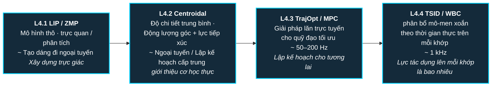

Khi học từng phương pháp phụ, hãy luôn sử dụng ba điều để kiểm tra xem bạn có thực sự hiểu nó hay không:

1. **Nguyên tắc**: Trạng thái, ràng buộc và hàm mục tiêu của phương pháp này là gì?
2. **Mã tối thiểu**: Bạn có thể sử dụng một ví dụ nhỏ để chạy qua vòng lặp cốt lõi không?
3. **Hạn chế**: Nó sẽ thất bại trong trường hợp nào? Tại sao chúng ta cần lớp phương pháp tiếp theo để kết nối nó?

**Địa điểm của Modern Robotics tại L4:**

- Ch 3–5 cung cấp một ngôn ngữ thống nhất cho tư thế không gian nhiệm vụ, xoắn, Jacobian và cờ lê
- Ch 8 giải thích động học chuỗi mở giúp hiểu thuật ngữ động học nghịch đảo trong Pinocchio/TSID
- Ch 9 giải thích việc tạo quỹ đạo, điểm vào chiều thấp để tối ưu hóa MPC / quỹ đạo
- Ch 11 giải thích mô-men xoắn tính toán, điều khiển chuyển động, điều khiển lực, là tài liệu tiên quyết để hiểu lớp tác vụ WBC

> Bản thân Robotics hiện đại không phải là sách giáo khoa về vận động hình người và không trực tiếp dạy LIP/ZMP, MPC trung tâm hoặc chuyển mạch tiếp xúc đế nổi; nó giống như một "cuốn sách ngữ pháp" cho lộ trình chính này hơn. Khi học L4, nếu gặp phải phép biến đổi tọa độ, Jacobian, cờ lê, động lực học nghịch đảo chưa rõ ràng, hãy quay lại các chương tương ứng để bổ sung.

#### Bảng so sánh phương pháp phả hệ (tổng quan L4 + L5)

Bảng này trả lời "Mối quan hệ giữa các danh từ này là gì và chúng có thể áp dụng cho trường hợp nào?" **Các lớp có thể xây dựng bản đồ tư duy trực tiếp từ đây và những độc giả có kinh nghiệm có thể sử dụng nó để kiểm tra phân loại của riêng họ. **

| Phương pháp | Mức độ chi tiết của Trạng thái/Mô hình | Những hạn chế chính | Người giải quyết | Tần số điển hình | Công dụng điển hình | Hạn chế điển hình |
|------|---------------|---------|--------|---------|---------|---------|
| **PID** | Lỗi góc khớp | — | Phân tích | 1 kHz+ | Vòng khép kín khớp đơn, bảo đảm cơ bản | Không thể xử lý khớp nối/nhiều ràng buộc |
| **LQR** | Không gian trạng thái tuyến tính hóa | — | Phương trình Riccati | 100Hz+ | Đường cơ sở kiểm soát cân bằng, hướng dẫn | Mô hình phải được tuyến tính hóa |
| **LIP / ZMP** | CoM 3D + ZMP | Hỗ trợ đa giác | Kiểm soát/Phân tích Xem trước | Ngoại tuyến / 100 Hz | dáng đi phẳng phiu, tiêu chí thăng bằng | Bỏ qua xung lượng góc, bỏ qua sự thay đổi độ cao |
| **Điểm nắm bắt / DCM** | CoM + động lượng loại phân kỳ | Hỗ trợ đa giác | Phân tích | 100Hz | Tiêu chí cân bằng thời gian thực, ra quyết định điểm cuối | Tương tự như giả thuyết LIP |
| **Động lực học trung tâm** | CoM Động lượng 6D + Lực tiếp xúc | Liên hệ Lực nón | QP / NLP | 50–200 Hz | Model MPC cấp trung | Vẫn chưa toàn thân, cần WBC |
| **Tối ưu hóa quỹ đạo** | Quỹ đạo trạng thái toàn thân | Động lực đầy đủ + liên hệ | DDP / iLQR / IPOPT | Ngoại tuyến / Chậm | Tạo quỹ đạo tham chiếu ngoại tuyến / Parkour | Không theo thời gian thực, giá trị ban đầu nhạy cảm |
| **MPC** | Mô hình đơn giản / Centroidal | Bị hạn chế hoàn toàn | OSQP / qpOASES / Crocoddyl | 50–500 Hz | dáng đi trực tuyến + lập kế hoạch lực lượng tiếp xúc | Lỗi đơn giản hóa mô hình, thách thức thời gian thực |
| **TSID / WBC** | Tăng tốc khớp toàn thân | Liên hệ + giới hạn chung + ưu tiên nhiệm vụ | HQP / nhiều lớp QP | 1 kHz | Thả tham chiếu MPC vào từng khoảnh khắc khớp | Dựa vào động lực học chính xác |
| **PPO** (RL) | Chiến lược mạng lưới thần kinh | phần thưởng + giáo trình + DR | dữ liệu mô phỏng + gradient | đào tạo chậm / triển khai nhanh | dáng đi từ đầu đến cuối, parkour, địa hình phức tạp | khoảng cách sim2real, không thể giải thích được |
| **BC / IL** | Chiến lược mạng lưới thần kinh | Dữ liệu được giám sát | SGD | Đào tạo chậm / triển khai nhanh | Vận hành, di chuyển hành động phức tạp | lỗi gộp |
| **DAgger** | BC + truy vấn tương tác | Tương tự như BC + sửa lỗi trực tuyến | SGD + truy vấn mô phỏng | luyện tập chậm | giảm bớt sự kết hợp BC | cần chuyên gia có thể truy vấn |
| **AMP / Chuyển động trước** | RL + bộ phân biệt đối xử | phần thưởng + phân biệt đối xử phong cách | độ dốc + đối nghịch | đào tạo chậm / triển khai nhanh | hành động cách điệu, bắt chước MoCap | chi phí thu thập dữ liệu cao |
| **Chính sách phổ biến** | Mạng lưới thần kinh tạo ra chuỗi hành động | Dữ liệu được giám sát | Khử nhiễu | Đào tạo chậm / triển khai trung bình | Hoạt động đa phương thức, thu thập dữ liệu | Độ trễ suy luận, yêu cầu dữ liệu huấn luyện cao |

**Cách đọc bảng này**:
- Nửa trên (PID → WBC) = theo mô hình, xếp theo thứ tự từ dày đến mỏng, từ chậm đến nhanh
- Nửa dưới (từ PPO) = dựa trên học tập, thường bổ sung cho các phần khó của dựa trên mô hình (tính chiều cao, khó mô hình hóa rõ ràng, cách điệu)
- Các hệ thống thực tế thường sử dụng **sử dụng hỗn hợp**: MPC + WBC + RL chính sách trước + Khởi tạo dữ liệu IL

<a id="l41-lip--zmp"></a>
### L4.1 LIP / ZMP

> **Ẩn dụ cảnh:** Hãy tưởng tượng bạn đang đi trên một sợi dây - trọng tâm của cơ thể bạn phải luôn nằm trong tấm đỡ nhỏ dưới chân để tránh bị ngã. LIP/ZMP chỉ giải quyết vấn đề này bằng toán học.

> **Hạn chế của lớp trước:** L3 cung cấp cho bạn các công cụ chung LQR / MPC, nhưng động lực hình người có hàng tá biến trạng thái và tính phi tuyến mạnh nên quá nặng để áp dụng trực tiếp. LIP / ZMP là một **mô hình cực kỳ đơn giản** (coi toàn bộ máy như một "con lắc ngược di chuyển"), cho phép bạn hiểu được bước đi và giữ thăng bằng với ít giả định nhất.

#### Kiểm tra nhanh từ viết tắt tiếng Anh (L4.1)

| Viết tắt | Tên tiếng Anh đầy đủ | Mô tả ngắn gọn |
|------|----------|----------|
| LIP | Con lắc ngược tuyến tính | Mô hình con lắc ngược tuyến tính có khối tâm cố định có chiều cao. |
| ZMP | Điểm không khoảnh khắc | Điểm tiêu chí cân bằng trong đa giác hỗ trợ. |
| DCM | Thành phần chuyển động khác nhau | \(\xi=x+\dot x/\omega\); Chế độ không ổn định |
| CP | Điểm chiếm giữ | Một điểm hạ cánh có thể dần dần dừng lại khi bước lên. |
| CoM | Trung Tâm Thánh Lễ | Khối tâm; LIP xung quanh nơi diễn ra động lực ngang. |
| CoP | Trung tâm áp lực | Tâm áp lực ở lòng bàn chân. |
| SP | Hỗ trợ đa giác | Hỗ trợ đa giác; ZMP phải ở trong đó. |

**Kiến thức tiên quyết:** [Mô hình động lực học và cơ thể cứng L2](#l2-动力学与刚体建模) + [Cơ bản về điều khiển và tối ưu hóa L3](#l3-控制基础与最优化)

**Câu hỏi cốt lõi:** Làm thế nào để robot hai chân đi trên mặt đất mà không bị ngã?

**Việc nên làm được đề xuất:**
- Triển khai thế hệ dáng đi ZMP đơn giản nhất
- Sử dụng mô hình LIP để tạo quỹ đạo tâm

**Đề nghị đọc:**
- Kajita et al., "Biped walking pattern generation by using preview control of zero-moment point"
- [LIP / ZMP](../wiki/concepts/lip-zmp.md)
- [Capture Point / DCM](../wiki/concepts/capture-point-dcm.md)
- [Chính thức hóa ZMP / LIP](../wiki/formalizations/zmp-lip.md)

** Kết quả đầu ra sau khi học:**
- Có thể giải thích mối quan hệ giữa ZMP và đa giác hỗ trợ
- Có thể sử dụng mô hình LIP để tạo quỹ đạo đi bộ đơn giản

**Câu hỏi tự kiểm tra:**
- Tại sao model LIP cần giả định chiều cao của CoM là cố định? Giả định này bị phá vỡ như thế nào khi nhảy/lên xuống cầu thang?
- Khi nào ZMP rời khỏi đa giác hỗ trợ trong khi đi bộ? Làm thế nào để bạn khám phá điều này từ dữ liệu trong kỹ thuật?
- DCM/Capture Point giải quyết được vấn đề gì so với ZMP?

<details class="selftest-answers">
Câu trả lời tham khảo <summary> (bấm để mở rộng) </summary>

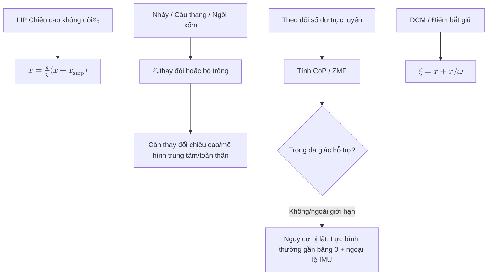

<ol>
<li><strong>LIP Tại sao giả sử rằng chiều cao CoM là cố định: Chiều cao </strong> \(z_c\) Động lực ngang ở độ cao không đổi được tuyến tính hóa thành \(\ddot x = \tfrac{g}{z_c}\,(x - x_{\mathrm{zmp}})\), có thể giải được về mặt phân tích và CoM có mối quan hệ tuyến tính với ZMP. Khi nhảy, độ cao của CoM thay đổi mạnh mẽ hoặc thậm chí ở trên không (lực tiếp xúc bằng 0). Khi lên xuống cầu thang/ngồi xổm, \(z_c\) tiếp tục thay đổi. Mối quan hệ tuyến tính này không hợp lệ và cần có một mô hình chiều cao thay đổi hoặc động lực học trung tâm/toàn bộ cơ thể. </li>
<li><strong>ZMP Rời khỏi đa giác hỗ trợ: </strong> ZMP Chạm/vượt quá đa giác hỗ trợ và sắp lật (chân xoay quanh mép, tiếp xúc một bên), lúc này lực bình thường của lòng bàn chân ở phía bên đó sẽ bằng 0. Trong kỹ thuật, mảng lực/mô men hoặc áp suất duy nhất được sử dụng để tính toán CoP trong thời gian thực (ZMP=CoP trong khi tiếp xúc) để xem liệu nó có chạm vào ranh giới hay không; hoặc nó có thể phát hiện lực pháp tuyến ở một bên của đế tiến tới 0 và chồng lên IMU để gây ra gia tốc góc bất ngờ. </li>
<li><strong>DCM / Điểm chụp Những gì được giải quyết thêm: </strong> Nó giải quyết chế độ phân kỳ không ổn định trong LIP riêng biệt: \(\xi = x + \dot x/\omega\). Nó chủ động trả lời "bước ở đâu nếu bạn muốn dừng lại trong một bước" (Capture Point là điểm hạ cánh mà CoM sẽ dừng tiệm cận khi bước lên) và tập trung điều khiển vào chế độ thứ nhất không ổn định duy nhất. Nó phù hợp hơn cho việc lập kế hoạch điểm hạ cánh theo thời gian thực và phục hồi nhiễu loạn so với ZMP vốn chỉ xác định "liệu nó hiện có ổn định hay không". </li>
</ol>
</details>

---

<a id="l42-centroidal-dynamics"></a>
### L4.2 Centroidal Dynamics

> **Ẩn dụ cảnh:** LIP Hãy coi hình dạng con người như một "cây cột đi bộ". Nhưng trên thực tế, việc vẫy tay, vặn eo và giơ chân lên đều sẽ tạo ra xung lượng góc, điều mà mô hình cột không thể giải thích được - L4.2 cung cấp cho bạn một mô hình trung gian “không quá nặng cũng không quá nhẹ”.

> **Các hạn chế của lớp trước:** LIP của L4.1 đơn giản hóa xung lượng góc, bỏ qua khối lượng xoay của chân và coi đa giác hỗ trợ là một ràng buộc tĩnh; những điều này không thể bị bỏ qua khi máy thật hoạt động. Centroidal Dynamics chiếu toàn bộ máy vào không gian động lượng 6D của CoM - chính xác hơn LIP, nhưng đơn giản hơn động lực học toàn thân.

#### Kiểm tra nhanh từ viết tắt tiếng Anh (L4.2)

| Viết tắt | Tên tiếng Anh đầy đủ | Mô tả ngắn gọn |
|------|----------|----------|
| CMM | Ma trận động lượng hướng tâm | \(h_g=A_g(q)\dot q\); Bản đồ động lượng hướng tâm 6D. |
| CoM | Trung Tâm Thánh Lễ | Đại lượng cốt lõi của khối tâm và trạng thái động lượng. |
| LÀ | Động lượng góc | Xung lượng góc; LIP bị bỏ qua, trọng tâm được giữ lại một cách rõ ràng. |
| LM | Động lượng tuyến tính | Động lượng tuyến tính. |
| MOR | Giảm đơn hàng mẫu | Giảm thứ tự mô hình; định vị trung tâm so với động lực học toàn cơ thể. |
| Cờ lê | Cờ lê tiếp xúc không gian | Điểm tiếp xúc Lực/mô-men xoắn 6D; thúc đẩy sự thay đổi động lượng. |

**Kiến thức tiên quyết:** [L4.1 LIP / ZMP](#l41-lip--zmp)

**Câu hỏi cốt lõi:** LIP Sự đơn giản hóa quá khắc nghiệt. Làm thế nào để mô tả sự cân bằng và lực tiếp xúc của một hình người thực sự?

**Việc nên làm được đề xuất:**
- Mô hình robot hình người sử dụng động lực học hướng tâm
- Hiểu được ma trận động lượng hướng tâm là gì

**Đề nghị đọc:**
- Orin et al., "Centroidal dynamics of a humanoid robot"
- [Centroidal Dynamics](../wiki/concepts/centroidal-dynamics.md)
- [Contact Dynamics](../wiki/concepts/contact-dynamics.md)

** Kết quả đầu ra sau khi học:**
- Có thể giải thích sự khác biệt giữa động lực học hướng tâm và LIP
- Hiểu được vai trò của động lượng tuyến tính và động lượng góc trong điều khiển cân bằng

**Câu hỏi tự kiểm tra:**
- Ma trận xung lượng trung tâm \(A_g(q)\) có kích thước như thế nào? Không gian trống của nó có ý nghĩa gì về mặt vật lý?
- Tại sao Centroidal Dynamics là kiểu “giảm bậc mô hình”? Nó bị mất thông tin gì về động lực học toàn cơ thể ban đầu?
- Khi sử dụng Động lực học trung tâm và Động lực học toàn cơ thể trong MPC, độ trễ của giải pháp sẽ có độ chênh lệch như thế nào?

<details class="selftest-answers">
Câu trả lời tham khảo <summary> (bấm để mở rộng) </summary>


<ol>
<li><strong>CMM Kích thước và không gian rỗng: </strong> \(A_g(q)\) là 6×(n+6) (đế nổi, n khớp + đế 6 chiều) và vận tốc tổng quát được ánh xạ tới động lượng tâm 6 chiều (3 động lượng tuyến tính + 3 động lượng góc): \(h_g = A_g(q)\dot q\). Không gian bằng không của nó là chuyển động tự chuyển động bên trong "không làm thay đổi động lượng tuyến tính/góc của toàn bộ máy" (chẳng hạn như các chuyển động cánh tay đối xứng triệt tiêu lẫn nhau, tái thiết bên trong xung quanh CoM), tức là mức độ tự do dưới sự bảo toàn động lượng. </li>
Tại sao giảm thứ tự mô hình <li><strong>: </strong> Nó chiếu động lực học toàn bộ chiều \((n+6)\) vào không gian động lượng khối tâm 6 chiều, chỉ giữ lại "kết quả lực/mô-men xoắn bên ngoài = tốc độ thay đổi động lượng" \(\big(\dot h_g = \textstyle\sum \text{wrench} + mg\big)\) và sử dụng một số ít trạng thái để ghi lại đại lượng quan trọng nhất để cân bằng. Những gì bị mất là cấu hình cụ thể/phân bổ cấp độ khớp của từng chi (có thể nhận ra cùng một động lượng bằng cấu hình vô hạn), giới hạn khớp và va chạm - những điều này được bù đắp bởi lớp WBC bên dưới. </li>
<li><strong> Sự khác biệt về độ trễ của giải pháp là gì: </strong> trung tâm (6 chiều + lực tiếp xúc, lồi quy mô trung bình QP / NLP) giải pháp một bước dưới một phần nghìn giây đến vài mili giây, 50–200 Hz trực tuyến; động lực học toàn cơ thể MPC (OCP phi tuyến bị ràng buộc hoàn toàn theo chiều \((n+6)\)) thường mất hàng chục đến hàng trăm mili giây và sự khác biệt giữa hai loại này là khoảng 1–2 bậc độ lớn. Do đó, các mô hình trung tâm/đơn giản hóa chủ yếu được sử dụng trong lớp trực tuyến và động lực học toàn cơ thể chủ yếu được sử dụng trong chuyển động ngoại tuyến hoặc tần số thấp. </li>
</ol>
</details>

---

<a id="l43-trajectory-optimization--mpc"></a>
### L4.3 Trajectory Optimization / MPC

> **Ẩn dụ cảnh:** Tôi thấy chân mình trượt ở giây cuối cùng - tôi có thể dự đoán vị trí sẽ bước trong 2 giây tiếp theo và thay đổi dáng đi của mình trong thời gian thực không? MPC là toán học của vấn đề này: biến "khoảng thời gian ngắn trong tương lai" thành một vấn đề tối ưu hóa luân phiên.

> **Hạn chế của lớp trước:** Động lực học trung tâm của L4.2 cung cấp cho bạn một bộ phương trình, nhưng **việc sử dụng các phương trình này để lập kế hoạch quỹ đạo CoM và lực tiếp xúc trực tuyến yêu cầu một lớp tối ưu hóa bổ sung (Tối ưu hóa quỹ đạo hoặc MPC). Đây là quá trình chuyển đổi từ "mô hình" sang "bộ điều khiển".

#### Kiểm tra nhanh từ viết tắt tiếng Anh (L4.3)

| Viết tắt | Tên tiếng Anh đầy đủ | Mô tả ngắn gọn |
|------|----------|----------|
| MPC | Kiểm soát dự đoán mô hình | Kiểm soát tối ưu miền thời gian lăn; chỉ phân đoạn điều khiển đầu tiên được thực thi ở mỗi bước. |
| TrajOpt | Tối ưu hóa quỹ đạo | Tối ưu hóa toàn bộ hoặc quỹ đạo kiểm soát trạng thái dài hạn. |
| OCP | Bài toán điều khiển tối ưu | Xây dựng bài toán tối ưu của động lực + chi phí + ràng buộc. |
| NLP | Lập trình phi tuyến | Lập trình phi tuyến; toàn thân không lồi TrajOpt thường được sử dụng. |
| DDP | ​Lập trình động vi phân | Lập trình động vi sai; phương pháp TrajOpt cục bộ. |
| iLQR | Bộ điều chỉnh bậc hai tuyến tính lặp | Lặp lại LQR; tuyến tính hóa cục bộ TrajOpt. |
| RH | Chân trời rút lui | Miền thời gian lăn; những ý tưởng chính của MPC và TrajOpt trực tuyến. |

**Kiến thức tiên quyết:** [L4.2 Động lực học hướng tâm](#l42-centroidal-dynamics) + [Cơ bản về điều khiển và tối ưu hóa L3](#l3-控制基础与最优化)

**Câu hỏi cốt lõi:** Cách lập kế hoạch cho toàn bộ tâm quỹ đạo khối lượng và lực tiếp xúc, cách thực hiện trực tuyến tại MPC

**Việc nên làm được đề xuất:**
- Triển khai MPC trung tâm bằng CasADi hoặc Crocoddyl
- Chạy mô hình đi bộ hai chân MPC trong mô phỏng

**Đề nghị đọc:**
- "Convex MPC for Bipedal Locomotion" (Bellicoso et al.)
- [Trajectory Optimization](../wiki/methods/trajectory-optimization.md)
- [Model Predictive Control (MPC)](../wiki/methods/model-predictive-control.md)
- [Hướng dẫn điều chỉnh tham số MPC](../wiki/queries/mpc-tuning-guide.md)
- [Lựa chọn bộ giải MPC](../wiki/queries/mpc-solver-selection.md)

** Kết quả đầu ra sau khi học:**
- Có thể triển khai phiên bản đơn giản của MPC hướng tâm
- Có thể giải thích các ý tưởng về miền thời gian dự đoán, thiết kế hàm chi phí và xử lý ràng buộc

**Câu hỏi tự kiểm tra:**
- Với MPC khi chạy không ổn định (chẳng hạn như dáng đi run rẩy), trình tự khắc phục sự cố đầu tiên của bạn là gì?
- Sự khác biệt chính giữa Tối ưu hóa quỹ đạo và MPC là gì? Tại sao hai thuật ngữ này thường được sử dụng thay thế cho nhau ở dạng người?
- MPC lồi và MPC phi tuyến phù hợp với những nhiệm vụ nào? Làm thế nào để đối phó với việc chuyển đổi liên lạc?

<details class="selftest-answers">
Câu trả lời tham khảo <summary> (bấm để mở rộng) </summary>

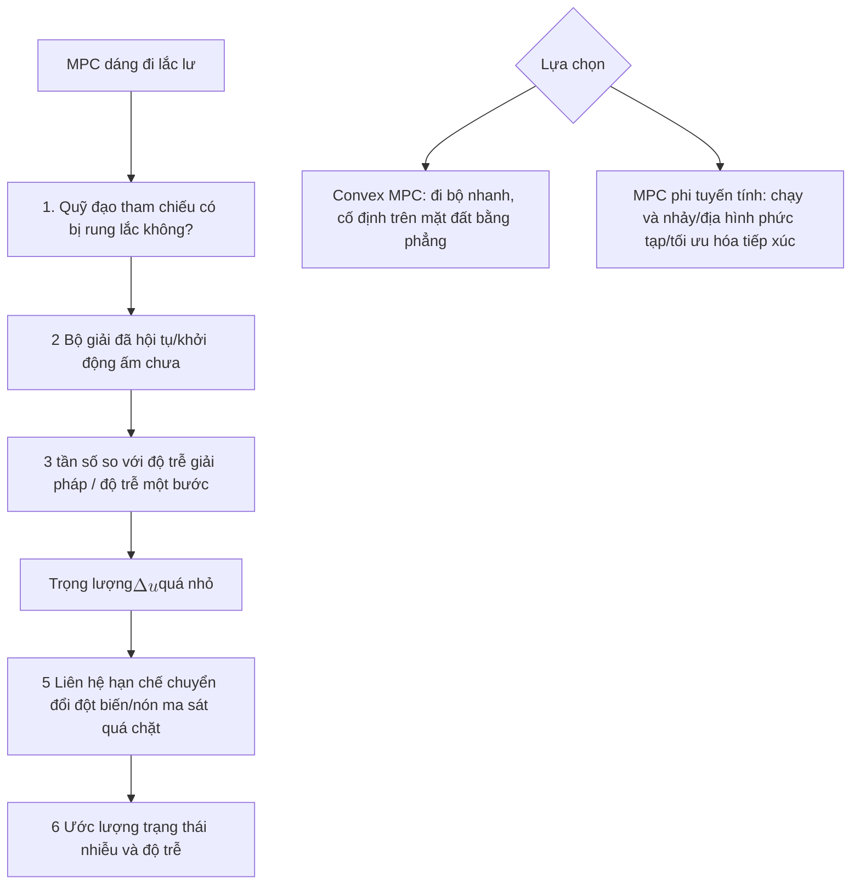

<ol>
<li><strong>MPC Trình tự khắc phục sự cố jitter: </strong> từ ngoài vào trong - ① Liệu bản thân tham chiếu có bị rung hay không (bước chân ngược dòng / quỹ đạo CoM không liên tục); ② Bộ giải có thực sự hội tụ/ chạm giới hạn trên của phép lặp hay không, có khởi động khởi động hay không; ③ Thời gian: tần số điều khiển, độ trễ giải pháp, có bù cho độ trễ một bước hay không; ④ Trọng lượng: theo dõi quá cứng và trơn tru/sự đều đặn quá mềm, gây ra dao động tần số cao của đại lượng điều khiển, cộng thêm hình phạt \(\Delta u\); ⑤ Mô hình/ràng buộc: đột biến ràng buộc khi chuyển đổi tiếp điểm, hình nón ma sát/ràng buộc ZMP quá chặt; ⑥ ước tính trạng thái nhiễu/độ trễ tạo ra hiện tượng jitter phản hồi. </li>
Sự khác biệt giữa <li><strong>TrajOpt và MPC: </strong> Tối ưu hóa quỹ đạo chủ yếu là ngoại tuyến, tìm quỹ đạo tối ưu cho toàn bộ miền thời gian cùng một lúc (có thể được sử dụng cho động lực học toàn cơ thể, miền thời gian dài và độ nhạy giá trị ban đầu); MPC đang cuộn trực tuyến - giải quyết miền thời gian ngắn trong mỗi chu kỳ OCP, chỉ thực hiện bước đầu tiên rồi lập kế hoạch lại (đường chân trời rút dần), dựa vào phản hồi để chống nhiễu. Chúng thường được sử dụng thay thế cho nhau trong hình người vì hạt nhân MPC giải quyết tối ưu hóa quỹ đạo nhỏ ở mỗi bước. Dạng toán học (OCP) giống nhau và điểm khác biệt duy nhất là "cuộn ngoại tuyến một lần so với cuộn trực tuyến + liệu đó có phải là thời gian thực hay không". </li>
<li><strong>Convex vs Phi tuyến MPC: </strong> Convex MPC (mô hình tuyến tính/lồi + ràng buộc lồi) giải quyết nhanh chóng và dứt khoát, thích hợp cho việc đi bộ trên mặt phẳng định kỳ và thời gian thực tần số cao, chuyển đổi liên hệ dựa trên lịch trình liên hệ và liên hệ cho trước lực bị ràng buộc tuyến tính bởi hình nón ma sát; MPC phi tuyến tính (động lực hoàn toàn/phi tuyến tính) phù hợp để chạy và nhảy, địa hình phức tạp và yêu cầu tối ưu hóa đồng thời lực tiếp xúc và tư thế. Chuyển mạch tiếp điểm có thể được thực hiện với thời gian xác định trước hoặc các ràng buộc bổ sung/tối ưu hóa pha, với cái giá phải trả là không lồi, chậm và độ nhạy giá trị ban đầu. </li>
</ol>
</details>

---

### L4.4 TSID / Whole-Body Control

> **Ẩn dụ cảnh:** MPC đã cho bạn biết "CoM nên ở đâu, bàn chân nên ở đâu và tư thế thân mình nên thay đổi như thế nào" - nhưng trong số 25 khớp của hình người, ai di chuyển trước và ai di chuyển sau cùng? Ai nhường đường cho sự kiềm chế an toàn? WBC là trọng tài này và mỗi chu kỳ điều khiển sẽ giải quyết QP / HQP để phân phối mô-men xoắn của từng khớp.

> **Các hạn chế của lớp trước:** MPC của L4.3 xuất ra CoM/tham chiếu lực tiếp xúc/tác vụ kết thúc, **không trực tiếp cho bạn biết mỗi khớp tạo ra bao nhiêu mô-men xoắn**. WBC là bước cuối cùng để "bỏ kế hoạch cấp trên xuống thực hiện cấp thấp hơn".

#### Tra cứu nhanh từ viết tắt tiếng Anh (L4.4)

| Viết tắt | Tên tiếng Anh đầy đủ | Mô tả ngắn gọn |
|------|----------|----------|
| TSID | Động lực nghịch đảo không gian nhiệm vụ | Tìm khung không gian nhiệm vụ của \(\tau,f\) dưới các ràng buộc động và tiếp xúc. |
| WBC | Kiểm soát toàn thân | Phân phối mô-men xoắn theo thời gian thực để thực hiện đa tác vụ và đa ràng buộc trên toàn bộ cơ thể. |
| HQP | Lập trình bậc hai phân cấp | Hệ thống phân cấp dành cho mức độ ưu tiên nhiệm vụ nghiêm ngặt QP. |
| QP | Lập trình bậc hai | Hạt nhân được tối ưu hóa lồi có trọng số cho WBC. |
| ID | Động lực học nghịch đảo | Cho \(\ddot q\), tìm \(\tau\); WBC như một phần của ràng buộc đẳng thức. |
| IC | Kiểm soát trở kháng | Định hình mối quan hệ lực-chuyển động; an toàn khi tiếp xúc luôn được ưu tiên hàng đầu. |

**Kiến thức tiên quyết:** [L4.3 Tối ưu hóa quỹ đạo / MPC](#l43-trajectory-optimization--mpc)

**Câu hỏi cốt lõi:** Làm thế nào mà quỹ đạo tham chiếu do lớp trên lên kế hoạch trở thành lực mà mỗi khớp phải tác dụng?

**Việc nên làm được đề xuất:**
- Triển khai bộ điều khiển tác vụ toàn thân bằng thư viện TSID
- Xử lý đồng thời tính năng ổn định cốp xe, theo dõi chân và hạn chế tiếp xúc

**Đề nghị đọc:**
- Del Prete et al., "Prioritized motion-force control of constrained fully-actuated robots"
- [TSID](../wiki/concepts/tsid.md)
- [TSID Formulation](../wiki/formalizations/tsid-formulation.md)
- [Whole-Body Control](../wiki/concepts/whole-body-control.md)
- [Hướng dẫn triển khai WBC](../wiki/queries/wbc-implementation-guide.md)
- [Hướng dẫn điều chỉnh tham số WBC](../wiki/queries/wbc-tuning-guide.md)

** Kết quả đầu ra sau khi học:**
- Khả năng triển khai WBC ưu tiên nhiều lớp bằng khung TSID
- Có thể giải thích cách ánh xạ các mục tiêu trong không gian nhiệm vụ tới các khoảnh khắc chung

**Câu hỏi tự kiểm tra:**
- Các ràng buộc điển hình trong TSID QP (viết 2 phương trình/bất đẳng thức mỗi phương trình) là gì? Hàm mục tiêu thường trông như thế nào?
- Điều gì xảy ra khi đầu ra tham chiếu CoM của lớp trên MPC xung đột với các ràng buộc tiếp xúc của WBC? Làm thế nào để sử dụng mức độ ưu tiên của nhiệm vụ?
- Tại sao điều khiển trở kháng thường được đặt ở mức ưu tiên cao hơn trong tác vụ WBC?

<details class="selftest-answers">
Câu trả lời tham khảo <summary> (bấm để mở rộng) </summary>

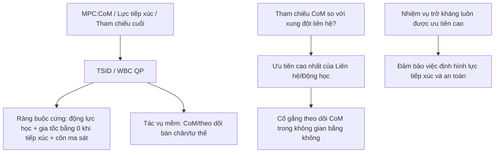

<ol>
Các ràng buộc và mục tiêu QP của <li><strong>TSID: </strong> Phương trình như sau: ① Tính nhất quán động cơ sở nổi \(M\ddot q + h = S^\top \tau + J_c^\top f\); ② Gia tốc không tiếp xúc cứng nhắc \(J_c\ddot q + \dot J_c\dot q = 0\). Các bất đẳng thức như: ① Lực tiếp xúc nằm trong hình nón ma sát; ② Giới hạn mô men/vị trí/tốc độ khớp (hoặc ZMP nằm trong đa giác hỗ trợ). Hàm mục tiêu thường là tổng các lỗi theo dõi bậc hai có trọng số của từng nhiệm vụ \(\sum_i w_i\lVert J_i\ddot q + \dot J_i\dot q - \ddot x_i^{\mathrm{des}}\rVert^2\) (CoM, đầu chân, tư thế thân, điều chỉnh tư thế) cộng với việc chính quy hóa \(\tau,f\). </li>
Tham chiếu <li><strong>CoM xung đột với các ràng buộc tiếp xúc: </strong> Nếu tính nhất quán của tiếp điểm/động được đặt thành các ràng buộc cứng, WBC sẽ ưu tiên đảm bảo rằng liên hệ đó khả thi và tham chiếu CoM chỉ được theo dõi "càng nhiều càng tốt", dẫn đến trạng thái ổn định lỗi hoặc cắt bớt. Xử lý: Sử dụng mức độ ưu tiên của nhiệm vụ - liên hệ/động lực để đặt mức cao nhất (ràng buộc cứng), theo dõi CoM và đặt các nhiệm vụ mềm có mức ưu tiên thấp hơn, xấp xỉ tối ưu trong không gian bằng 0 không vi phạm liên hệ; HQP được phân lớp, có trọng số nghiêm ngặt QP sử dụng các trọng số lớn để phân lớp gần đúng; khi cần thiết, lớp trên MPC sẽ điều chỉnh tham chiếu dựa trên phản hồi. </li>
Tại sao trở kháng <li><strong> luôn có mức độ ưu tiên cao: Trở kháng/tuân thủ </strong> liên quan trực tiếp đến độ ổn định của tiếp điểm và an toàn tương tác. Nếu bị bao phủ bởi các nhiệm vụ vị trí có mức độ ưu tiên thấp sẽ dễ dẫn đến mất ổn định lực tiếp xúc, va chạm cứng hoặc nhảy tiếp xúc; việc đặt hành vi trở kháng tiếp xúc/đầu cuối lên lớp cao hơn có thể đảm bảo rằng cho dù lớp dưới có tối ưu hóa tư thế như thế nào thì lực tiếp xúc luôn được định hình tốt, do đó tương tác với môi trường một cách an toàn và tuân thủ. </li>
</ol>
</details>

---

<a id="l5-强化学习与模仿学习"></a>
## Học tăng cường L5 và học bắt chước

**Sau khi học L4, bạn phải hiểu đầy đủ về điều khiển dựa trên mô hình. L5 là một cách khác: dựa trên học tập. **

> **Ẩn dụ kịch bản:** L4 là “Tôi đã biết vật lý + biết mục tiêu” để tính luật điều khiển; L5 thì ngược lại - hãy để robot **thử ** (RL) hoặc **bắt chước con người và học hỏi** (IL) một chiến lược.

> **Hạn chế của lớp trước:** Điều khiển truyền thống của L4 yêu cầu mô hình hóa chính xác + hàm mục tiêu rõ ràng; đối với các nhiệm vụ có chuyển đổi tiếp xúc chuyên sâu và khó ghi mục tiêu vào các hàm chi phí (chạy, nhảy, địa hình phức tạp, vận hành), chu kỳ phát triển kéo dài. RL / IL Sử dụng dữ liệu để điền vào phần này - nhưng nó không thể thay thế sự hiểu biết về cấu trúc của L4, nếu không bạn sẽ chỉ điều chỉnh các siêu tham số.

Cạm bẫy dễ gặp nhất ở giai đoạn này là coi RL / IL là lối tắt để "bỏ qua mô hình hóa". Một cách học ổn định hơn là:
- Hãy coi RL / IL như một **lớp mở rộng khả năng**, không phải là khóa chính thay thế tất cả các cấu trúc điều khiển
- Luôn đặt câu hỏi: Chiến lược học tập này là đưa ra quyết định ở cấp độ cao, theo dõi ở cấp độ thấp hay cả hai được kết hợp với nhau?
- Khi gặp vấn đề về sim2real, chuyển đổi liên hệ và khả năng diễn giải, hãy quay lại quan điểm mô hình và ràng buộc của L4 và xem xét lại câu hỏi

### Cầu L5.0: Vòng khép kín nhỏ nhất từ ​​"biển báo" đến mã chạy được

Trước khi vào điều chỉnh tham số PPO, bạn nên sử dụng **50 dòng tập lệnh** để căn chỉnh [MDP quintuple](../wiki/formalizations/mdp.md) với bước mô phỏng - xem [Vòng kín tối thiểu RL được thể hiện](../wiki/concepts/embodied-rl-minimal-closed-loop.md) để biết chi tiết.

**Trực giác chiến lược (ẩn dụ ngã ba đường)**: Tác nhân không có nhãn câu trả lời tiêu chuẩn và chỉ dựa vào sự lặp lại phản hồi của môi trường; biển báo "Đi bên phải, tỷ lệ thắng 501/1000" là **Chiến lược** $\pi(a|s)$. Nước đi là **hành động rời rạc**; mô-men xoắn/mục tiêu khớp hình người là **hành động liên tục** - cùng một vật mang nhưng không gian hành động khác nhau. Hầu hết các chiến lược kỹ thuật là mạng lưới thần kinh, được cập nhật với các gradient như PPO/SAC.

**MDP và POMDP**:

| Yếu tố | Ý nghĩa thể hiện | Chú ý máy thật |
|------|----------|----------|
| $S$ | IMU, góc khớp, đám mây độ sâu/điểm, v.v. | Thường ồn ào và trì hoãn |
| $A$ | Thông số mô men, mục tiêu chung, dáng đi | Chủ yếu là các vectơ liên tục |
| $R$ | Tiến lên, giữ thăng bằng, tóm thành công, ngã phạt | Đòn bẩy chính định hình hành vi |
| $P$ | Mô phỏng hoặc động lực học máy thật | PyBullet / MuJoCo / Isaac khác nhau |
| $\gamma$ | Chuyển tiếp phần thưởng giảm giá | Tác động của “cận thị” so với “lâu dài” |

MDP tiêu chuẩn giả định rằng toàn bộ trạng thái có thể quan sát được; Hầu hết các triển khai máy thực đều là [POMDP](../wiki/formalizations/pomdp.md) - sử dụng tầm nhìn đa khung + RNN/Transformer để mã hóa các trạng thái ẩn rồi thực hiện hành động.

**PPO vs SAC Identity Worker (Kiểm tra ban đầu nhanh)**:

| Thuật toán | Kịch bản ưu tiên | Cơ chế cốt lõi |
|------|----------|----------|
| [PPO](../wiki/methods/policy-optimization.md) | Đi bộ bằng bốn chân/hình người, mô phỏng song song quy mô lớn | Clip giới hạn phạm vi cập nhật chính sách, đào tạo ổn định |
| [SAC](../wiki/comparisons/ppo-vs-sac.md) | Bàn tay khéo léo, khả năng nắm bắt tinh tế, những công việc nhạy cảm | Quy tắc entropy tối đa, khám phá đầy đủ hơn |

Tiêu chí chung: **Chiến lược không thể nhảy quá nhiều trong một lần lặp**, nếu không hành vi đã học sẽ sụp đổ. Các hoạt động thưởng thưa thớt có thể xếp chồng lên nhau [HER](../wiki/methods/her.md).

**Thử nghiệm vòng kín tối thiểu (thứ tự được đề xuất)**:

1. [PyBullet](../wiki/entities/pybullet.md) Điểm cố định cánh tay KUKA: viết tay $S,A,R$ + `stepSimulation` để triển khai $P$ (chưa kết nối RL).
2. Môi trường đồ chơi tập thể dục + PPO, chính sách quen thuộc API.
3. Huấn luyện song song hình người Isaac Lab (xem L5.2).

Cột "Cơ bản về trí thông minh thể hiện" của Deep Blue, Phần 4, mở rộng bối cảnh trên dành cho người mới bắt đầu, bổ sung cho dòng hình học/điều khiển chính của L0-L4, xem [bản đồ cột](../wiki/overview/shenlan-embodied-ai-fundamentals-series.md).

<a id="l5-1-rl-basics"></a>

### L5.1 Cơ bản về Học tăng cường

> **Phép ẩn dụ kịch bản:** Ném rô-bốt vào trình mô phỏng, đưa ra quy tắc khen thưởng ("Tiến +1, giảm -10"), để rô-bốt thử và sai nhiều lần - rô-bốt có thể học được chiến lược. L5.1 dạy cho bạn khuôn khổ "đào tạo thử và sai" này.

> **Hạn chế của lớp trước:** Các phương pháp L4 đều dựa vào động lực chính xác + mục tiêu rõ ràng; khi mô hình không chính xác hoặc khó ghi mục tiêu dưới dạng hàm chi phí, RL sử dụng các phương pháp dựa trên dữ liệu để bỏ qua mô hình hóa.

#### Tra cứu nhanh các từ viết tắt tiếng Anh (L5.1)

| Viết tắt | Tên tiếng Anh đầy đủ | Mô tả ngắn gọn |
|------|----------|----------|
| RL | Học tăng cường | Sự tương tác giữa tác nhân và môi trường tối đa hóa phần thưởng tích lũy. |
| MDP | Quy trình Quyết định Markov | Chính thức hóa quyết định tuần tự tiêu chuẩn cho RL. |
| PPO | Tối ưu hóa chính sách gần nhất | tỷ lệ quan trọng của clip, cập nhật chính sách ổn định. |
| SẮC | Diễn viên mềm-Nhà phê bình | Chính sách tắt entropy tối đa; hiệu suất lấy mẫu thường cao hơn. |
| PG | Độ dốc chính sách | Một nhóm các phương pháp tối ưu hóa trực tiếp các tham số chính sách. |
| VF | Hàm giá trị | Ước tính lợi nhuận dài hạn của một trạng thái hoặc hành động trạng thái. |
| TRPO | Tối ưu hóa chính sách khu vực tin cậy | Tối ưu hóa chính sách khu vực tin cậy; ý tưởng tiền thân của PPO. |

**Kiến thức tiên quyết:** Nội dung L2 + L3 (trực giác tối ưu hóa)

**Câu hỏi cốt lõi:** RL Cách làm cho robot hình người học cách tự đi lại

**Việc nên làm được đề xuất:**
- Lần đầu tiên chạy qua [vòng kín tối thiểu RL được thể hiện](../wiki/concepts/embodied-rl-minimal-closed-loop.md): [PyBullet](../wiki/entities/pybullet.md) Nhiệm vụ điểm cố định KUKA, căn chỉnh $S,A,R,P$ với `stepSimulation` (có thể được kiểm soát bằng tốc độ viết tay, không cần phải tăng lên trước) PPO)
- Sử dụng PPO để rèn luyện chiến lược trong môi trường đơn giản (phòng tập thể dục); [Vấn đề về Cartpole](../wiki/concepts/cartpole.md) So sánh sự khác biệt về hành động/phần thưởng/chấm dứt giữa `CartPole-v1` và `Isaac-Cartpole-v0`
- Hiểu ý nghĩa của việc định hình phần thưởng, độ dốc chính sách và hàm giá trị
- So sánh năm bộ [MDP](../wiki/formalizations/mdp.md) và có thể nói rõ ràng từng bộ $S,A,R,P,\gamma$ trong môi trường của riêng bạn

**Đề nghị đọc:**
- [Học tăng cường thực hành (Sách về nấm)](../wiki/entities/hands-on-rl-book.md) — Kiến thức cơ bản về RL tiếng Trung và Thực hành PPO/SAC ([Sách trực tuyến](https://hrl.boyuai.com/) / [Bài học video](https://www.boyuai.com/elites/course/xVqhU42F5IDky94x))
- Spinning Up (OpenAI)
- [Reinforcement Learning](../wiki/methods/reinforcement-learning.md)
- [Policy Optimization](../wiki/methods/policy-optimization.md)
- [PPO vs SAC](../wiki/comparisons/ppo-vs-sac.md)
- [POMDP](../wiki/formalizations/pomdp.md) — phải đọc trước khi triển khai trên thiết bị thực

**Chuỗi khái niệm xương sống RL (từ góc độ AI vật lý, bạn chỉ cần hiểu kỹ về chuỗi này):**

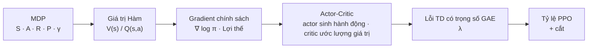

PPO 8 khái niệm cần thực sự hiểu trong một lần lặp: **quỹ đạo** (triển khai môi trường song song) → **phần thưởng** → **lỗi TD** \(\delta_t = r_t + \gamma V(s_{t+1}) - V(s_t)\) → **GAE** → **Ưu điểm** \(\hat A_t\) → **tỷ lệ** \(r_t = \pi_\theta / \pi_{old}\) → **cắt** \(\mathrm{clip}(r_t, 1-\epsilon, 1+\epsilon)\) → **cập nhật chính sách** (minibatch nhiều kỷ nguyên).

| Khái niệm | Giấy Canonical | Thẻ trang web |
|------|----------------|---------|
| PPO | [Proximal Policy Optimization Algorithms（arXiv:1707.06347）](https://arxiv.org/abs/1707.06347) | [PPO](../wiki/methods/ppo.md) |
| GAE | [High-Dimensional Continuous Control Using Generalized Advantage Estimation（arXiv:1506.02438）](https://arxiv.org/abs/1506.02438) | [GAE](../wiki/methods/gae.md) |

Tài liệu tham khảo triển khai kỹ thuật: [rsl_rl](https://github.com/leggedrobotics/rsl_rl) (legged_gym / Isaac Lab PPO triển khai thường được sử dụng trong huấn luyện hình người và chân).

** Kết quả đầu ra sau khi học:**
- Có thể giải thích ý tưởng cốt lõi của PPO
- Có thể thiết kế phần thưởng RL đơn giản và huấn luyện nó

**Câu hỏi tự kiểm tra:**
- Giải thích tại sao cơ chế cắt của PPO có thể tránh được việc cập nhật chính sách quá mức; vấn đề gì sẽ xảy ra nếu ngưỡng clip quá lớn/quá nhỏ?
- Trong cùng một khối lượng dữ liệu, mẫu nào hiệu quả hơn, theo chính sách (PPO) hay ngoài chính sách (SAC)? Tại sao RL hình người chính thống vẫn sử dụng PPO?
- Cho chức năng thưởng (tiến kỳ + cân bằng + trơn), nếu robot học cách "nhảy về phía trước" thay vì "đi bộ" thì bạn sẽ thay đổi phần thưởng như thế nào?

<details class="selftest-answers">
Câu trả lời tham khảo <summary> (bấm để mở rộng) </summary>

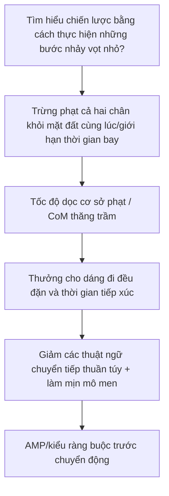

<ol>
Việc cắt <li><strong>PPO: </strong> sử dụng tỷ lệ quan trọng \(r=\pi_\theta/\pi_{\mathrm{old}}\) và mục tiêu là \(\min\!\big(r\hat A,\ \mathrm{clip}(r,1-\epsilon,1+\epsilon)\hat A\big)\). Khi bản cập nhật một bước khiến \(r\) lệch quá nhiều so với 1, clip sẽ cắt bớt lợi thế để các bản cập nhật ngoài vùng tin cậy không nhận được phần thưởng bổ sung, từ đó ngăn chặn việc nhảy chính sách quá mức (vùng tin cậy gần đúng). \(\epsilon\) quá lớn: các ràng buộc quá lỏng lẻo, cập nhật quá mức và dễ bị sập; quá nhỏ: quá trình cập nhật quá thận trọng, độ hội tụ chậm và mức sử dụng mẫu thấp. </li>
Hiệu suất mẫu <li><strong> và lý do PPO vẫn được sử dụng: SAC ngoài chính sách </strong> lưu nhiều mẫu hơn (có lịch sử sử dụng lặp lại bộ đệm phát lại) với cùng một lượng dữ liệu, trong khi dữ liệu PPO theo chính sách sẽ bị loại bỏ sau khi sử dụng. Tuy nhiên, xu hướng chủ đạo của RL hình người vẫn sử dụng PPO, vì mô phỏng song song quy mô lớn (IsaacGym hàng chục nghìn môi trường) làm cho các mẫu trở nên "rẻ", điểm nghẽn là đồng hồ treo tường chứ không phải số lượng mẫu và PPO dễ triển khai, có siêu tham số mạnh mẽ, phù hợp với lấy mẫu chính sách song song, ổn định trong đào tạo và dễ sử dụng thêm chương trình giảng dạy/DR. </li>
<li><strong> Cách thay đổi phần thưởng "nhảy nhỏ về phía trước": </strong> chủ yếu là hack phần thưởng (điểm chuyển tiếp không bị hạn chế khi tiếp xúc/bay). Bạn có thể: ① đồng thời bổ sung các hình phạt đối với các chân không chạm đất hoặc hạn chế thời gian bay của chân và yêu cầu hỗ trợ định kỳ bằng một chân; ② trừng phạt tốc độ dọc cơ sở / dao động lên xuống CoM; ③ khen thưởng dáng đi đều đặn (tần số bước, quỹ đạo bàn chân, thời gian tiếp xúc); ④ giảm trọng lượng của thuật ngữ chuyển tiếp thuần túy, thêm hình phạt làm mịn mô-men xoắn / năng lượng để ngăn chặn sự nảy nổ; ⑤ sử dụng AMP / chuyển động trước Bị hạn chế theo kiểu "đi". </li>
</ol>
</details>

---

<a id="l52-rl-在人形运动控制里的应用"></a>
### Ứng dụng L5.2 RL trong điều khiển chuyển động hình người

> **Ẩn dụ cảnh:** Thuật toán RL chung thường không thể học được khi áp dụng trực tiếp cho hình người - nó cần được trao "phần thưởng/quan sát/không gian hành động thích hợp + một loạt thủ thuật huấn luyện". L5.2 là một chi tiết kỹ thuật giúp môi trường đồ chơi của L5.1 trở nên vận động như đời thực.

> **Hạn chế của lớp trước:** L5.1 cho phép bạn chạy qua PPO trên [CartPole](../wiki/concepts/cartpole.md); chiều không gian trạng thái của cơ sở nổi 25 DOF + hình người cao hơn nhiều bậc, đòi hỏi các kỹ năng chuyên biệt như định hình phần thưởng, chương trình giảng dạy, chấm dứt sớm, thông tin đặc quyền, giáo viên-học sinh, v.v.

#### Kiểm tra nhanh từ viết tắt tiếng Anh (L5.2)

| Viết tắt | Tên tiếng Anh đầy đủ | Mô tả ngắn gọn |
|------|----------|----------|
| DR | Ngẫu nhiên tên miền | Mô phỏng ngẫu nhiên hóa các tham số vật lý/cảm biến để giảm khoảng cách sim2real. |
| PD | Tỷ lệ–Đạo hàm | Theo dõi vị trí chung ở cấp độ thấp nhất; RL thường xuất ra mục tiêu PD. |
| AMP | Ưu tiên chuyển động đối nghịch | Chiến lược hạn chế phân biệt đối xử gần với phong cách MoCap. |
| ET | Chấm dứt sớm | Kết thúc tập phim sớm để tiết kiệm thời gian luyện tập nếu bạn bị ngã. |
| Riêng tư. | Thông tin đặc quyền | Trạng thái bổ sung chỉ hiển thị với giáo viên mô phỏng. |
| T–S | Giáo Viên-Học Sinh | Giáo viên quan sát đầy đủ Chưng cất học sinh quan sát hạn chế. |
| Loco | Đầu máy | Kỹ năng vận động/đi bộ. |

**Kiến thức tiên quyết:** L5.1 + L4.3/4.4

**Câu hỏi cốt lõi:** Cách kết hợp RL với MPC / WBC, cách thực hiện với sim2real

**Việc nên làm được đề xuất:**
- Luyện tập chiến lược đi bộ giống người với IsaacGym/IsaacLab
- Thử framework kết hợp RL + WBC

**Đề nghị đọc:**
- "DeepMimic" (Peng et al.)
- "AMP: Adversarial Motion Priors"
- legged_gym / IsaacGymEnvs
- [legged_gym](../wiki/entities/legged-gym.md)
- [Isaac Gym / Isaac Lab](../wiki/entities/isaac-gym-isaac-lab.md)
- [WBC vs RL](../wiki/comparisons/wbc-vs-rl.md)
- [MPC vs RL](../wiki/comparisons/mpc-vs-rl.md)
- [Truy vấn: Điều hướng dự án điều khiển chuyển động nguồn mở](../wiki/queries/open-source-motion-control-projects.md)

**Bốn nhánh của PPO trên hình dạng con người:**

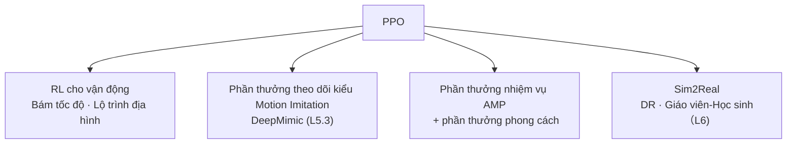

- Nền tảng đào tạo: [Isaac Lab](../wiki/entities/isaac-lab.md) (mô phỏng song song GPU + khung tác vụ RL); để biết cấu trúc phần thưởng của AMP, hãy xem [Phần thưởng AMP](../wiki/methods/amp-reward.md).

** Kết quả đầu ra sau khi học:**
- Có thể huấn luyện chiến lược RL đi bộ hình người trong mô phỏng
- Có thể giải thích được ưu điểm, hạn chế tương ứng của RL và WBC

**Câu hỏi tự kiểm tra:**
- Không gian hành động nào giữa vị trí/vận tốc/mômen xoắn thường được sử dụng cho RL dạng người? Tại sao IsaacLab chọn tùy chọn này theo mặc định?
- Chính xác thì “Thông tin đặc quyền” trong giáo viên-học sinh là gì? Tại sao học sinh không thể có được nó?
- AMP / DeepMimic Ưu điểm kỹ thuật lớn nhất của loại phương pháp chuyển động trước này so với PPO thuần túy là gì?

<details class="selftest-answers">
Câu trả lời tham khảo <summary> (bấm để mở rộng) </summary>

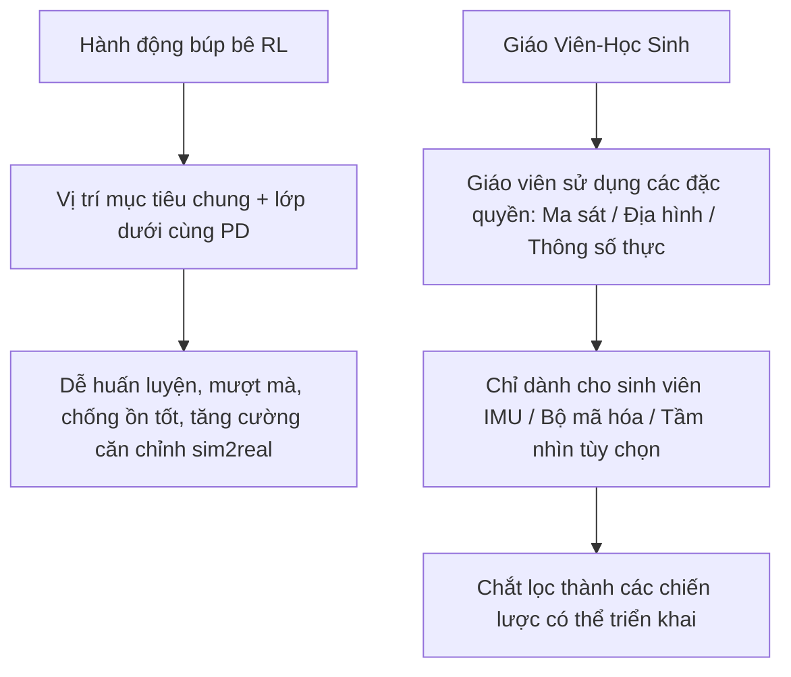

<ol>
Lựa chọn không gian hành động <li><strong>: </strong> hình người RL vị trí chính (vị trí mục tiêu chung đầu ra/độ lệch so với tư thế mặc định, được chuyển sang theo dõi PD bên dưới). IsaacLab mặc định điều này vì PD theo dõi ở tần số cao, mang lại cho chiến lược một giao diện mượt mà và dễ học ở tần số thấp, với tính năng giảm chấn và ổn định tích hợp, đồng thời có khả năng chống nhiễu đầu ra mạng mạnh mẽ. Khi sử dụng sim2real, chỉ cần căn chỉnh mức tăng PD; mô-men xoắn trực tiếp dễ bị dao động ở tần số cao và nhạy cảm với độ trễ, gây khó khăn cho việc huấn luyện và di chuyển. </li>
<li><strong> Thông tin đặc quyền: </strong> đề cập đến các đại lượng chính xác có thể thu được bằng mô phỏng nhưng không thể thu được bằng cách triển khai máy thực: ma sát mặt đất/lực tiếp xúc thực, bản đồ độ cao địa hình, khối lượng/quán tính của robot, nhiễu bên ngoài, tốc độ cơ sở chính xác, v.v. Giáo viên sử dụng nó để đào tạo nhanh chóng và tốt; học sinh chỉ có thể sử dụng khả năng nhận biết có sẵn trên máy thật (IMU, bộ mã hóa, lịch sử) cùng với tầm nhìn tùy chọn và học chiến lược trong điều kiện quan sát hạn chế thông qua việc chắt lọc/bắt chước của giáo viên - vì không có cảm biến đặc quyền này khi được triển khai. </li>
Ưu điểm kỹ thuật của <li><strong> trước chuyển động: </strong> AMP / DeepMimic sử dụng chuyển động tham chiếu (MoCap) làm chuyển động trước. Ưu điểm lớn nhất là nó loại bỏ nhu cầu thiết kế các phần thưởng phức tạp theo cách thủ công - phong cách/sự tự nhiên được cung cấp tự động bởi người phân biệt đối xử hoặc lỗi bắt chước, tiết kiệm rất nhiều phần thưởng định hình và điều chỉnh các thông số để có được dáng đi tự nhiên và có thể chuyển đổi; đồng thời, không gian khám phá bị giảm đi, sự hội tụ được tăng tốc và tránh được dáng đi kỳ lạ mà PPO thuần túy học được. </li>
</ol>
</details>

---

<a id="l5-3-imitation-learning"></a>

### L5.3 Học bắt chước

> **Ẩn dụ tình huống:** Thay vì để robot liên tục thử và mắc lỗi, tốt hơn nên để nó "xem mọi người làm gì" - dữ liệu MoCap và hoạt động từ xa được đưa vào và robot trực tiếp đưa ra các hành động tương tự.

> **Hạn chế của lớp trước:** RL thuần túy cực kỳ tốn kém để khám phá các hành động phức tạp (nhảy múa, vận hành, parkour) và phần thưởng cực kỳ khó viết. IL sử dụng dữ liệu trình diễn của con người để đưa ra **điểm khởi đầu tốt**; nhưng bản thân IL có lỗi gộp và thường cần phải xếp chồng lên nhau với RL hoặc DAgger để ổn định.

#### Kiểm tra nhanh từ viết tắt tiếng Anh (L5.3)

| Viết tắt | Tên tiếng Anh đầy đủ | Mô tả ngắn gọn |
|------|----------|----------|
| IL | Học Bắt Chước | Chiến lược học tập từ quỹ đạo chuyên gia. |
| BC | Nhân bản hành vi | Học tập có giám sát \(\pi(s)\approx a_{\mathrm{expert}}\). |
| DAgger | Tổng hợp tập dữ liệu | Xin chuyên gia đánh dấu lại trạng thái truy cập chính sách. |
| MoCap | Chụp chuyển động | Dữ liệu ghi lại chuyển động của con người/đối tượng. |
| Nhắm mục tiêu lại | Nhắm mục tiêu lại theo chuyển động | Ánh xạ bộ xương demo tới robot mục tiêu. |
| ASE | Nhúng kỹ năng đối nghịch | Một trong các khung IL / RL để nhúng kỹ năng tổng hợp. |
| Cov. Thay đổi | Dịch chuyển đồng biến | Phân phối trạng thái đào tạo và triển khai không nhất quán; Độ khó cốt lõi của BC. |

**Kiến thức tiên quyết:** L5.1

**Câu hỏi cốt lõi:** Sử dụng dữ liệu hành động của con người để dạy robot thực hiện hành động

**Việc nên làm được đề xuất:**
- Sử dụng dữ liệu MoCap để nhắm mục tiêu lại theo chuyển động (để biết chi tiết, xem [L5.4 Nhắm mục tiêu lại theo chuyển động](#l54-动作重定向))
- Thử nhân bản hành vi + DAgger

**Đề nghị đọc:**
- "ASE: Adversarial Skill Embeddings"
- "DeepMimic"
- [Imitation Learning](../wiki/methods/imitation-learning.md)
- [Behavior Cloning](../wiki/methods/behavior-cloning.md)
- [DAgger](../wiki/methods/dagger.md)
- [Motion Retargeting](../wiki/concepts/motion-retargeting.md)

**Phả hệ học tập bắt chước (từ giám sát đến "hành động tham khảo + mô phỏng vật lý + RL"): **

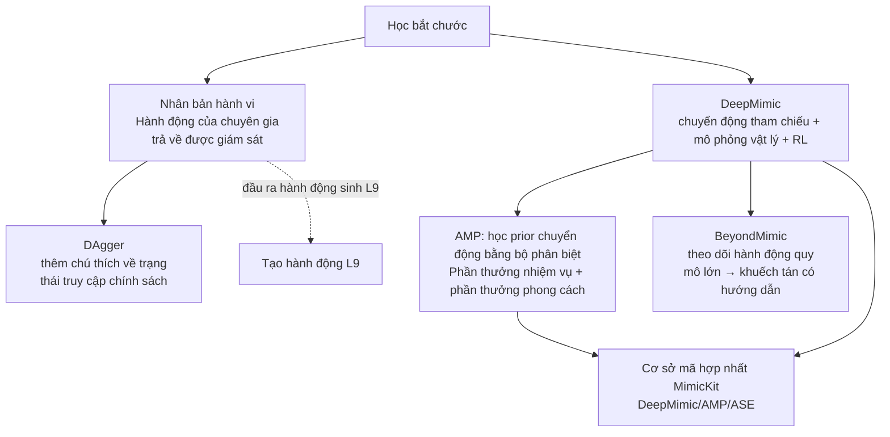

| Phương pháp | Tập trung vào những điểm chính trong một câu | Giấy Canonical | Dự án | Mã | Thẻ trang web |
|------|-------------|-----------------|---------|------|---------|
| **DeepMimic** | chuyển động tham chiếu + mô phỏng vật lý + RL: Phần thưởng theo dõi cho phép tái tạo các nhân vật vật lý trong chụp chuyển động | [arXiv:1804.02717](https://arxiv.org/abs/1804.02717) | [Trang dự án](https://xbpeng.github.io/projects/DeepMimic/) | [xbpeng/DeepMimic](https://github.com/xbpeng/DeepMimic) | [DeepMimic](../wiki/methods/deepmimic.md) |
| **AMP** | người phân biệt đối xử học chuyển động trước, tổng phần thưởng = phần thưởng nhiệm vụ + phần thưởng phong cách, không còn theo dõi từng khung hình | [arXiv:2104.02180](https://arxiv.org/abs/2104.02180) | [Trang dự án](https://xbpeng.github.io/projects/AMP/) | [MimicKit · AMP](https://github.com/xbpeng/MimicKit/blob/main/docs/README_AMP.md) | [Phần thưởng AMP](../wiki/methods/amp-reward.md) · [Đánh giá phả hệ AMP](../wiki/overview/humanoid-amp-motion-prior-survey.md) |
| **BeyondMimic** | Theo dõi chuyển động quy mô lớn của hình người thật + kỹ năng kết hợp với khuếch tán có hướng dẫn | [arXiv:2508.08241](https://arxiv.org/abs/2508.08241) | [Trang dự án](https://beyondmimic.github.io/) | [whole_body_tracking](https://github.com/HybridRobotics/whole_body_tracking) | [BeyondMimic](../wiki/methods/beyondmimic.md) |
| **MimicKit** | Khung mô phỏng chuyển động mô-đun của nhóm Peng, một bộ mã có thể chạy nhiều thuật toán | [arXiv:2510.13794](https://arxiv.org/abs/2510.13794) | — | [xbpeng/MimicKit](https://github.com/xbpeng/MimicKit) | [MimicKit](../wiki/entities/mimickit.md) |
| **DAgger** | Chú thích tương tác để giảm bớt lỗi gộp của BC | [arXiv:1011.0686](https://arxiv.org/abs/1011.0686) | — | — | [DAgger](../wiki/methods/dagger.md) |

> Mục nhập mã được cung cấp trên trang dự án chính thức của AMP là kho DeepMimic/MimicKit. Tuyến đường này sử dụng tài liệu AMP trong MimicKit làm liên kết mã.

** Kết quả đầu ra sau khi học:**
- Khả năng di chuyển một phần dữ liệu MoCap sang robot hình người
- Có thể giải thích tại sao DAgger tốt hơn BC thuần túy

**Câu hỏi tự kiểm tra:**
- Lỗi gộp của BC có ý nghĩa gì về mặt toán học (gợi ý: độ lệch phân bố trạng thái)?
- DAgger Tại sao có thể giảm bớt lỗi gộp? Cần thêm chi phí gì?
- Trong quá trình Nhắm mục tiêu lại chuyển động, tỷ lệ xương + giới hạn khớp khác nhau sẽ gây ra vấn đề gì? Làm thế nào để giảm bớt nó trong kỹ thuật?

<details class="selftest-answers">
Câu trả lời tham khảo <summary> (bấm để mở rộng) </summary>

```mermaid
flowchart TD
  BC[BC chỉ đào tạo về phân phối trạng thái chuyên gia] --> Drift[Lỗi chiến lược dẫn đến trạng thái trôi dạt]
  Drift --> O1["$$O(\epsilon T^2)$$"]
  DAg[DAgger] --> Roll[triển khai trạng thái truy cập chính sách]
  Roll --> Label[Chuyên gia dán nhãn lại và tổng hợp dữ liệu]
  Label --> O2["$$O(\epsilon T)$$"]
  Ret[Nhắm mục tiêu lại theo chuyển động] --> R1[Các tỷ lệ khác nhau: đầu/tiếp điểm khớp IK]
  Ret --> R2[Các giới hạn khác nhau: cắt xén + tối ưu hóa ràng buộc]
```

<ol>
Lỗi tổng hợp của <li><strong>BC: Đào tạo </strong> chỉ xem phân phối trạng thái được các chuyên gia truy cập. Lỗi nhỏ của chính chiến lược trong quá trình triển khai sẽ đưa nó đến trạng thái không thể nhìn thấy và lỗi tích lũy theo thời gian (sự thay đổi đồng biến/sự trôi dạt phân phối trạng thái). Về mặt toán học, nếu lỗi ở mỗi bước là \(\epsilon\) thì tổng lỗi sẽ là \(O(\epsilon T^2)\) trong miền thời gian \(T\). Một khi nó đi chệch hướng, phân bố trạng thái tiếp theo sẽ không khớp với phân bố huấn luyện và lỗi sẽ tự tăng cường. </li>
<li><strong>DAgger Tại sao giảm thiểu và tốn kém: </strong> DAgger Hãy để chiến lược triển khai trên các trạng thái mà nó truy cập, sau đó yêu cầu chuyên gia đánh dấu các hành động chính xác cho các trạng thái này và tổng hợp chúng vào vòng lặp tập dữ liệu, để phân phối đào tạo dần dần bao phủ các trạng thái mà chính sách thực sự gặp phải, loại bỏ dịch chuyển đồng biến và giảm lỗi từ \(O(\epsilon T^2)\) bị hạ cấp xuống \(O(\epsilon T)\). Chi phí: Nó yêu cầu một chuyên gia trực tuyến, người có thể được truy vấn bất cứ lúc nào để chú thích liên tục (chi phí cao) và chiến lược triển khai chưa hoàn thiện trên máy thực có thể không an toàn. </li>
Hai loại vấn đề với <li><strong>Motion Retargeting: </strong> Tỷ lệ xương khác nhau - sao chép các góc khớp sẽ khiến các đầu (tay/bàn chân) bị lệch và bàn chân xuyên xuống đất/trượt. Bạn nên chia tỷ lệ chúng theo tỷ lệ và sử dụng IK để khớp các đầu/điểm chính tiếp xúc thay vì sao chép các góc khớp; giới hạn chung là khác nhau - tác động của nguồn có thể vượt quá giới hạn vật lý và trở nên không khả thi/bão hòa. Nó nên được cắt bớt/ánh xạ lại thành phạm vi khả thi hoặc nên thêm các ràng buộc giới hạn trong quá trình tối ưu hóa và phân phối lại. IK + nhắm mục tiêu lại được tối ưu hóa (khớp với CoM / tiếp xúc chân / quỹ đạo cuối) thường được sử dụng trong kỹ thuật và các ràng buộc giới hạn và tiếp xúc chồng chất. </li>
</ol>
</details>

---

<a id="l54-动作重定向"></a>
### L5.4 Chuyển hướng hành động

> **Ẩn dụ cảnh:** "Người" trong ghi hình chuyển động và robot của bạn không phải là một bộ xương giống nhau - tỷ lệ chiều dài chân khác nhau, có ít khớp hơn và các hạn chế chặt chẽ hơn. Nếu sao chép trực tiếp góc khớp của con người, bàn chân của robot sẽ bị trượt, xuyên xuống đất và tư thế của nó sẽ bị biến dạng. L5.4 chính là “cổng dịch” này: dịch các hành động của con người thành các quỹ đạo tham chiếu mà robot có thể thực hiện.

> **Hạn chế của lớp trước:** L5.3 mặc định là "dữ liệu trình diễn đã là hành động mà robot có thể thực hiện". Trên thực tế, hầu hết các cuộc trình diễn đều đến từ con người (mô hình ghi chuyển động/video một mắt/mô hình được tạo), trước tiên phải được ánh xạ qua bộ xương vào quỹ đạo tham chiếu của robot, sau đó có thể căn chỉnh phần thưởng theo dõi và nhãn BC. Lỗi ở bước này sẽ được chuyển không thay đổi sang chiến lược xuôi dòng và tiếp tục được khuếch đại trong giai đoạn sim2real của L6.

#### Kiểm tra nhanh từ viết tắt tiếng Anh (L5.4)

| Viết tắt | Tên tiếng Anh đầy đủ | Mô tả ngắn gọn |
|------|----------|----------|
| Nhắm mục tiêu lại | Nhắm mục tiêu lại theo chuyển động | Ánh xạ chuyển động của con người/động vật tới bộ xương robot mục tiêu. |
| MoCap | Chụp chuyển động | Nguồn chuyển động tham chiếu phổ biến nhất. |
| SMPL | Mô hình tuyến tính nhiều người bị lột da | Mô hình tham số cơ thể con người thường được sử dụng; đầu vào điển hình cho chuyển hướng. |
| IK | Động học nghịch đảo | Góc khớp nghịch đảo sử dụng mục tiêu cuối/điểm khóa. |
| QP | Lập trình bậc hai | Viết chuyển hướng như một dạng giải pháp phổ biến của lập trình bậc hai bị ràng buộc. |
| GMR | Nhắm mục tiêu lại chuyển động chung | Đường cơ sở nhắm lại mục tiêu động học của các điểm chính IK + QP. |
| NMR | Nhắm mục tiêu lại chuyển động thần kinh | Ánh xạ toàn bộ phân đoạn dựa trên học tập, được đào tạo bằng dữ liệu ghép nối được mô phỏng cố định. |
| WBT | Theo dõi toàn thân | Chuyển hướng người tiêu dùng sản phẩm ở hạ nguồn: đào tạo theo dõi toàn cơ thể. |
| AMP | Chuyển động đối nghịch trước | Ràng buộc phần thưởng phân biệt đối xử theo kiểu chính sách RL bằng các chuyển động tham chiếu. |

**Kiến thức tiên quyết:** L1 (FK / IK, SE(3)) + L2 (đế nổi và tiếp điểm) + L5.3

**Câu hỏi cốt lõi:** Cách dịch "cách con người di chuyển" sang quỹ đạo tham chiếu của "robot có thể đi theo"

**Việc nên làm được đề xuất:**
- Trước tiên, hãy thực hiện một thí nghiệm phản ví dụ: lấy một phần hành động [AMASS](../wiki/entities/amass.md) / [LAFAN1](../wiki/entities/lafan1-dataset.md), sao chép trực tiếp các góc khớp của cơ thể con người sang URDF hình người để phát lại và đo độ trượt của bàn chân, độ xuyên qua của đế và hạn chế tiếp cận quá mức - thiết lập trực giác trực tiếp về "tại sao không thể thực hiện chuyển hướng"
- Chạy qua đường cơ sở động học: các điểm chính IK + QP ([GMR](../wiki/methods/motion-retargeting-gmr.md) một loại công cụ), coi tiếp xúc đầu/chân là chi phí và giới hạn khớp là ràng buộc cứng
- Thêm kiểm soát truy cập chất lượng vào sản phẩm: tốc độ trượt chân, độ sâu xuyên thấu, tốc độ khớp/đỉnh gia tốc, độ lệch quỹ đạo gốc, lọc trước rồi vào tập huấn luyện
- Kết nối sản phẩm chuyển hướng với chiến lược theo dõi ([DeepMimic](../wiki/methods/deepmimic.md) / [Phần thưởng AMP](../wiki/methods/amp-reward.md)) và sử dụng "liệu chiến lược có thể tuân theo hay không" để xác minh chất lượng chuyển hướng.

**Đề nghị đọc:**
- [Nhắm mục tiêu lại theo chuyển động](../wiki/concepts/motion-retargeting.md) — Lối vào chính của khái niệm
- [Đường dẫn nhắm mục tiêu lại chuyển động](../wiki/concepts/motion-retargeting-pipeline.md) — Chuyển đổi → Căn chỉnh → Giải quyết → Liên kết đầu cuối được lọc
- [Mục tiêu nhắm mục tiêu lại chuyển động](../wiki/formalizations/motion-retargeting-objective.md) — Chính thức hóa các chức năng mục tiêu và các ràng buộc
- [GMR vs NMR vs ReActor](../wiki/comparisons/gmr-vs-nmr-vs-reactor.md) — Lựa chọn ba tuyến đường
- [Khả thi về mặt động học và khả thi về mặt động](../wiki/concepts/kinematic-vs-dynamic-feasibility.md) — Cạm bẫy nhận thức dễ dàng nhất trong phần này
- [Chất lượng dữ liệu chuyển động](../wiki/concepts/motion-data-quality.md), [So sánh tập dữ liệu chuyển động tham chiếu hình người](../wiki/comparisons/humanoid-reference-motion-datasets.md)
- Muốn đi sâu hơn: [Tuyến đường sâu: Chuyển hướng hành động](depth-motion-retargeting.md) (Dòng dõi hoàn chỉnh Giai đoạn 0–6, bao gồm đường nhánh bốn nhánh và chuỗi công cụ chỉnh sửa quỹ đạo)

** Kết quả đầu ra sau khi học:**
- Có thể chuyển hướng MoCap công khai sang một mô hình hình người cụ thể và cung cấp báo cáo chất lượng định lượng về khả năng trượt/xâm nhập/hạn chế của chân
- Có thể giải thích rõ ràng sự cân bằng giữa ba lộ trình tối ưu hóa động học, lập bản đồ học tập và nhận thức vật lý, đồng thời đưa ra các lựa chọn riêng biệt cho "điều hành từ xa theo thời gian thực" và "tạo dữ liệu đào tạo hàng loạt ngoại tuyến"
- Có thể đưa các sản phẩm chuyển hướng vào chương trình đào tạo theo dõi và xác định xem lỗi là do vấn đề dữ liệu hay vấn đề chiến lược

**Câu hỏi tự kiểm tra:**
- Chức năng đích của redirect thường bao gồm những mục nào? Điều nào trong số này phải được viết dưới dạng những ràng buộc cứng rắn hơn là hình phạt, và tại sao?
- Một kết quả chuyển hướng "trông rất giống con người", nhưng chiến lược theo dõi dù có được huấn luyện chăm chỉ đến đâu cũng không thể tuân theo. Những lý do có thể là gì?
- Vận hành từ xa toàn cơ thể theo thời gian thực so với sản xuất hàng loạt dữ liệu huấn luyện BFM ngoại tuyến. Nên chọn loại tuyến chuyển hướng nào trong hai trường hợp?

<details class="selftest-answers">
Câu trả lời tham khảo <summary> (bấm để mở rộng) </summary>

```mermaid
flowchart TD
  Src[Tham chiếu cơ thể con người: MoCap / Video / Tạo] --> Align[Bộ xương căn chỉnh theo tọa độ]
  Align --> Opt[IK/QP: tư thế tương tự + tiếp xúc đầu cuối + trơn tru]
  Opt --> Hard[Hạn chế cứng: giới hạn khớp/tự va chạm/đế không xuyên đất]
  Hard --> QC[Cổng chất: Trượt chân/Thâm nhập/Tăng tốc/Trôi gốc]
  QC --> Track[Theo dõi đào tạo: DeepMimic / AMP / WBT]
  Track -->|Nếu không theo kịp thì quay lại sửa lại để tham khảo.| Opt
```

<ol>
<li><strong>Hàm mục tiêu và các ràng buộc cứng:</strong>Hình thức điển hình là tổng có trọng số - thuật ngữ tương tự về tư thế (căn chỉnh vị trí góc khớp/điểm then chốt), thuật ngữ kết thúc và tiếp xúc (vị trí tay và chân, độ trượt bằng 0 của chân đỡ), thuật ngữ cân bằng (CoM / ZMPnằm trong miền hỗ trợ), các thuật ngữ làm trơn (vận tốc/độ đều đặn của khớp), cộng với các giới hạn khớp và tự va chạm. Trong số đó, **giới hạn khớp, tự va chạm và đế không xuyên thủng là những hạn chế về tính khả thi và phải được viết dưới dạng ràng buộc cứng**: Khi được viết dưới dạng điều khoản phạt, người giải sẽ "mua" hình phạt để giảm lỗi tư thế, tạo ra một tham chiếu không thể thực hiện được về mặt vật lý và các lỗi sẽ trực tiếp đi vào tập huấn luyện; trong khi sự tương đồng và mượt mà là những ưu tiên, phù hợp để cân nhắc các điều khoản chi phí.</li>
<li><strong>"Nó rất giống" nhưng tôi không thể theo dõi được:</strong>đặc trưng<strong>khả thi về mặt động học ≠ khả thi về mặt động học</strong>. Việc định hướng lại chỉ căn chỉnh hình học (sai số điểm chính là nhỏ), nhưng không hạn chế sự phân bổ khối lượng và lực tiếp xúc: sự phân bổ khối lượng của robot và giới hạn trên của mô-men xoắn/tốc độ của bộ truyền động khác với con người và gia tốc trong tham chiếu có thể vượt quá khả năng chung; thời gian tiếp xúc của chân đỡ bị kéo dài hoặc có độ xuyên thấu/trượt chân ở mức milimet và giải pháp lực tiếp xúc phân kỳ trong quá trình theo dõi; quỹ đạo gốc (chiều cao/hướng cơ sở) được tạo ra do sự trôi dạt của dữ liệu nguồn, khiến bản thân tham chiếu trở nên "không thể bảo vệ được". Trình tự kiểm tra: Trước tiên, hãy tham khảo các chỉ số vật lý của riêng bạn (mô-men xoắn yêu cầu,CoM/ZMP(Có phải là ngoài miền hỗ trợ, tốc độ trượt chân), sau đó xem phần thưởng và lợi ích của chiến lược theo dõi; sử dụng chuyển hướng nhận thức vật lý (vòng kín trong mô phỏng) hoặc thực hiện xử lý hậu kỳ động trên tham chiếu có nhiều triệu chứng hơn là tiếp tục điều chỉnh các siêu tham số theo dõi.</li>
<li><strong>Lựa chọn hai kịch bản:</strong> <strong>điều hành từ xa theo thời gian thực</strong>Đối với mức mili giây, đầu vào khung đơn/cửa sổ trượt và khả năng thay đổi mô hình bất kỳ lúc nào → chọn lộ trình tối ưu hóa động học (kiểu GMRIK + QP, CPU thời gian thực, không cần đào tạo), tính khả thi về mặt vật lý được để lại cho hạ lưuWBC/ Theo dõi các chiến lược.<strong>Tạo hàng loạt dữ liệu đào tạo BFM/WBT ngoại tuyến</strong>Không có ngân sách thời gian thực nhưng cần có sự nhất quán về mặt vật lý và quy mô lớn → Chọn ánh xạ toàn bộ phân đoạn dựa trên học tập (loại NMR, sử dụng dữ liệu ghép nối neo mô phỏng để huấn luyện mạng chuyển tiếp, thông lượng cao) hoặc chuyển hướng nhận thức vật lý (loại ReActor/SPIDER, cùng tối ưu hóa các chiến lược tham chiếu và theo dõi trong mô phỏng). Đổi lại, sự tiếp xúc và tự va chạm được nội sinh hóa trong giai đoạn dữ liệu và quá trình đào tạo ở hạ nguồn không cần phải làm sạch nhiều lần.</li>
</ol>
</details>

---

<a id="l6-综合实战"></a>
## L6 chiến đấu thực tế toàn diện

**Tại thời điểm này, bạn đã có hiểu biết về cả điều khiển vận động và học tập. Bước cuối cùng là thực sự xâu chuỗi chúng lại với nhau. **

> **Ẩn dụ cảnh:** Dù bạn trông đẹp đến đâu trong mô phỏng, bạn sẽ rơi vào tình trạng tồi tệ nhất trên máy thật - L6 dạy bạn cách lấp đầy khoảng cách giữa "mô phỏng và thực tế".

> **Hạn chế của lớp trước:** L4 / L5 đều giả định tính lý tưởng trong mô phỏng: cảm biến không có tiếng ồn, bộ truyền động không có độ trễ và động lực học hoàn toàn được biết đến. Cả ba điều này đều không đúng trong một máy thực, đòi hỏi các công nghệ bắc cầu chuyên dụng như nhận dạng hệ thống + ngẫu nhiên miền + giáo viên-học sinh.

### Kiểm tra nhanh từ viết tắt tiếng Anh (L6)

| Viết tắt | Tên tiếng Anh đầy đủ | Mô tả ngắn gọn |
|------|----------|----------|
| Sim2Real | Mô phỏng thành hiện thực | Triển khai chiến lược đào tạo mô phỏng trên máy thật. |
| SysID | Nhận dạng hệ thống | Xác định các thông số thực như chất lượng, ma sát, độ trễ, v.v. |
| DR | Ngẫu nhiên tên miền | Thời gian huấn luyện được chọn ngẫu nhiên để che đậy sự không chắc chắn của máy thật. |
| T–S | Giáo Viên-Học Sinh | Đặc quyền giáo viên Triển khai chưng cất học sinh. |
| Khoảng cách | Khoảng cách giữa Sim và Real | Sự khác biệt về động lực/cảm biến giữa mô phỏng và máy thật. |
| Lạt. | Độ trễ của bộ truyền động | Thiết bị truyền động và độ trễ truyền thông; Chính sách RL đặc biệt nhạy cảm. |

### Kiến thức cần thiết
- L4 đầy đủ quy trình
- Hoạt động cơ bản của L5 RL và IL

### Vấn đề cốt lõi
- Cách hình thành một vòng khép kín từ đào tạo đến triển khai
- Cách chuyển kết quả huấn luyện mô phỏng sang robot thật
- Cách thiết kế một đường ống RL + WBC hoàn chỉnh

### Nên làm gì?
- Thiết kế và huấn luyện đường ống RL + WBC hình người hoàn chỉnh
- Thực hiện di chuyển sim2real
- Điều chỉnh các tham số ngẫu nhiên miền để quan sát hiệu quả

### Khuyến khích đọc
- [Sim2Real](../wiki/concepts/sim2real.md)
- [System Identification](../wiki/concepts/system-identification.md)
- [Domain Randomization](../wiki/concepts/domain-randomization.md)
- [Danh sách kiểm tra Sim2Real](../wiki/queries/sim2real-checklist.md) (bao gồm [Kiểm tra triển khai nhanh](../wiki/queries/sim2real-checklist.md#快速部署检查))
- [Hướng dẫn gỡ lỗi chiến lược robot](../wiki/queries/robot-policy-debug-playbook.md)

<a id="l6-sim2real-chain"></a>

### Chuỗi chính Sim2Real: 10 cấp độ từ mô phỏng đến máy thật

Sim2Real không phải là một nút nhỏ của RL, mà là một liên kết kỹ thuật độc lập:

```mermaid
flowchart TB
  Sim["Mô phỏng"] --> DR["Ngẫu nhiên hóa tên miền"]
  DR --> ON["Tiếng ồn quan sát"]
  ON --> Lat["Độ trễ"]
  Lat --> Act["Mô hình thiết bị truyền động"]
  Act --> SID["Nhận dạng hệ thống"]
  SID --> TS["Giáo Viên-Học Sinh"]
  TS --> Val["Xác thực chính sách"]
  Val --> S2S["Sim2Sim<br/> Thay đổi công cụ vật lý và thử lại"]
  S2S --> Real["Robot thật"]
  Real -. phân tích nguyên nhân thất bại .-> SID
```

**Các nguồn phổ biến gây ra lỗi chính sách thiết bị thực** (theo thứ tự điều tra, mức độ ưu tiên càng cao thì càng "cấp thấp" và phổ biến hơn):

| Nguồn | Triệu chứng điển hình | Lối vào khắc phục sự cố |
|------|---------|---------|
| **đặt hàng chung** | Co giật khi tăng sức mạnh / hoán đổi chân trái và chân phải | [Công cụ kiểm tra đơn hàng chung của Robot trực tuyến](https://imchong.github.io/Robot_Joint_Order_Check_Tool_Online/): So sánh song song thứ tự chung của URDF/MJCF trong Isaac Gym, Isaac Lab, MuJoCo, ros2_control, v.v. |
| **quan sát không khớp** | Thứ nguyên quan sát/hệ tọa độ/đơn vị/chuẩn hóa không phù hợp với đào tạo | [Robot Learning IO Board Online](https://imchong.github.io/Robot_Learning_IO_Board_Online/): So sánh đầu vào quan sát và đầu ra hành động của trạng thái đào tạo và trạng thái triển khai của SONIC / BeyondMimic và các dự án khác · [Đầu vào quan sát chiến lược hình người](../wiki/concepts/humanoid-policy-observation-inputs.md) |
| **chia tỷ lệ hành động** | Phạm vi hành động quá lớn/quá nhỏ và tư thế mặc định bị lệch | Tương tự như trên: Kiểm tra thang đo hành động và vị trí chung mặc định so với định nghĩa đầu ra hành động của dự án tham chiếu |
| **tần số điều khiển** | Số thập phân mô phỏng không phù hợp với chu trình điều khiển máy thực | [Tách tần số điều khiển và suy luận](../wiki/concepts/control-inference-frequency-decoupling.md) |
| **độ trễ** | Dao động tần số cao, độ trễ pha | [Mô hình độ trễ vòng điều khiển](../wiki/formalizations/control-loop-latency-modeling.md) |
| **mẫu động cơ** | Bão hòa mô-men xoắn, băng thông không đủ, hành vi của PD khác với mô phỏng | [Mạng thiết bị truyền động](../wiki/methods/actuator-network.md) · [Nhận dạng hệ thống](../wiki/concepts/system-identification.md) |
| **tiếng ồn cảm biến** | IMU Jitter do trôi và nhiễu bộ mã hóa | [Ngẫu nhiên hóa miền](../wiki/concepts/domain-randomization.md) · [Ước tính trạng thái](../wiki/concepts/state-estimation.md) |
| **liên hệ không khớp** | Tác động trượt và tiếp đất khác với mô phỏng | [Liên hệ Dynamics](../wiki/concepts/contact-dynamics.md) · Xác thực chéo Sim2Sim |

- **Sim2Sim có trước Sim2Real**: được đào tạo trong Isaac và phát lại và xác minh trong MuJoCo, nó có thể lọc hầu hết các lỗi trình tự/tỷ lệ/tần số trước khi chuyển sang máy thật. Bản demo trực tuyến: [Robot Learning Sim2Sim Online](https://imchong.github.io/Robot_Learning_Sim2Sim_Online/) (MuJoCo + ONNX suy luận trên trình duyệt).
- **Giáo viên-Học sinh**: Thông tin đặc quyền của giáo viên → triển khai học sinh quan sát, xem [Giáo viên-Học sinh / DAgger Training](../wiki/methods/teacher-student-dagger-training.md).
- Để triển khai có hệ thống, hãy xem [Lộ trình chuyên sâu Sim2Real](depth-sim2real.md); để biết lý luận/giao tiếp/thời gian thực phía triển khai, hãy xem [L12](#physical-ai-l12-deployment).

### Kết quả sau khi học là gì
- Một hình người có thể chạy chiến lược RL (trong mô phỏng)
- Bản ghi thử nghiệm di chuyển sim2real
- Hiểu tài liệu cho toàn bộ đường ống

### Câu hỏi tự kiểm tra (học xong có thể trả lời được)
- Đưa ra chính sách PPO được đào tạo bằng mô phỏng, liệt kê 5 việc phải làm trước khi triển khai trên máy thật.
- Vấn đề gì sẽ xảy ra nếu phạm vi Domain Randomization quá lớn hoặc quá nhỏ? Làm thế nào để bạn thiết lập ranh giới DR?
- Tại sao độ trễ của người thực thi lại gây tổn hại nhiều hơn đến chiến lược RL trong sim2real so với MPC truyền thống?

<details class="selftest-answers">
Câu trả lời tham khảo <summary> (bấm để mở rộng) </summary>

```mermaid
flowchart TD
  PPO[Đã đào tạo mô phỏng PPO] --> S1[1 ID hệ thống]
  S1 --> S2[2 Bộ truyền động: Bộ giới hạn/Độ trễ/Băng thông]
  S2 --> S3[3 Căn chỉnh quan sát: nhiễu/hệ tọa độ/lọc]
  S3 --> S4[4 Độ trễ tiêm luyện tập + DR]
  S4 --> S5[5 Lên máy bay an toàn: giới hạn tốc độ/dừng khẩn cấp/dự phòng]
  DR[Ngẫu nhiên hóa tên miền] --> Big[Quá lớn: quá bảo thủ hoặc không thể học hỏi]
  DR --> Small[Quá nhỏ: khe hở vẫn còn và máy sẽ bị lỗi khi bạn thử.]
  Big --> Tune[Dần dần mở rộng với SysID làm trung tâm + phản hồi máy thật]
  Small --> Tune
```

<ol>
<li><strong> 5 điều bạn phải làm trước khi triển khai máy thực: </strong>
<ol>
<li><strong>Nhận dạng hệ thống: </strong> xác định khối lượng/quán tính thực, ma sát khớp, độ lợi PD, đường cong dòng mô-men xoắn. </li>
Mô hình bộ truyền động <li><strong>: </strong> bổ sung bộ giới hạn mô-men xoắn, độ trễ truyền/băng thông và độ trễ bậc nhất của động cơ. </li>
Căn chỉnh quan sát <li><strong>: Độ nhiễu/độ lệch/độ trễ của cảm biến </strong>, hệ tọa độ và đơn vị, quá trình lọc phù hợp với những gì trong quá trình huấn luyện. </li>
Độ mạnh mẽ của bên đào tạo <li><strong>: </strong> đưa độ trễ/tiếng ồn/nhiễu từ bên ngoài vào trong quá trình đào tạo và thực hiện Chọn ngẫu nhiên miền để cải thiện độ mạnh mẽ. </li>
<li><strong> Học máy an toàn và tiến bộ: Giới hạn tốc độ </strong>, độ bão hòa mô-men xoắn, dừng khẩn cấp, nâng/phân cấp dần dần và bộ điều khiển dự phòng sẵn sàng. </li>
</ol>
</li>
<li><strong>DR Phạm vi quá lớn/quá nhỏ: </strong> quá lớn - nhiệm vụ quá khó và chiến lược được học quá thận trọng (cúi người thấp, chuyển động chậm) gây tổn hại đến hiệu suất hoặc thậm chí không thể học được (tín hiệu bị át bởi tiếng ồn); quá nhỏ - các thông số của máy thật không được bao phủ, khoảng cách sim2real vẫn còn lớn và chiến lược sẽ thất bại trên máy (mô phỏng quá mức). Xác định ranh giới: Căn giữa giá trị nhận dạng, đặt phạm vi theo độ không chắc chắn của phần cứng (cảm biến/lắp ráp/hao mòn) và dần dần mở rộng nó (chương trình giảng dạy), sử dụng điều chỉnh phản hồi xác minh máy thực/dự trữ và cố gắng bao quát phân phối thực trong khi vẫn có thể hội tụ. </li>
Tại sao độ trễ của người thực thi <li><strong> lại nghiêm trọng hơn đối với RL: </strong> Chiến lược RL là một ánh xạ phản ứng với băng thông cao, cực kỳ phù hợp với thời gian hành động quan sát và thường ngầm giả định độ trễ bằng 0; độ trễ gây ra độ trễ pha, biến phản hồi chặt chẽ đã học được trong quá trình đào tạo thành dao động/Phản hồi tích cực không thể giải thích được và không có điều chỉnh biên pha rõ ràng. MPC / WBC truyền thống có một mô hình rõ ràng có thể kết hợp độ trễ vào các dự đoán (mô hình độ trễ thời gian, bộ dự đoán Smith) và có khái niệm lề ổn định, tương đối dễ kiểm soát hơn. </li>
</ol>
</details>

---

<a id="l7-出口从运动控制看整个机器人技术栈"></a>
## L7 Lối ra: nhìn toàn bộ hệ sinh thái robot từ điều khiển chuyển động

**Lớp này không dạy bạn viết mã. Mục đích của nó là: sau khi bạn đọc xong L0-L6, nó sẽ cung cấp cho bạn mảnh ghép cuối cùng của câu đố "robot full stack", để bạn có thể nói chuyện với các kỹ sư ở bất kỳ hướng nào trong lĩnh vực này. **

Sau khi đọc xong, bạn đã biết "hộp điều khiển" làm nhiệm vụ gì. Phần này cung cấp ba hộp còn lại trong [L−1 ảnh toàn cảnh 30 giây](#30-秒看懂一台机器人在干嘛), cũng như các hướng thực sự tích cực nhất trong năm 2024–2026. Mỗi phần không chuyên sâu, chỉ có: **Nó là gì → và cách kết nối với điều khiển chuyển động → Đề xuất 1 trang nhập**.

### L7.1 Lớp nhận thức (Nhận thức/SLAM/Ước tính trạng thái)

#### Tra cứu nhanh các từ viết tắt tiếng Anh (L7.1)

| Viết tắt | Tên tiếng Anh đầy đủ | Mô tả ngắn gọn |
|------|----------|----------|
| SE | Ước tính Tiểu bang | Tích hợp IMU, bộ mã hóa, tầm nhìn, v.v. để ước tính tư thế và tốc độ. |
| ĐẬP | Bản đồ hóa và Bản đồ hóa đồng thời | Lập bản đồ và định vị đồng thời trong môi trường không xác định. |
| IMU | Đơn Vị Đo Quán Tính | Đo quán tính; cảm biến chuyển động cơ thể tần số cao. |
| RGB-D | RGB + Độ sâu | Camera màu cộng độ sâu; đầu vào chung cho nhận thức 3D. |
| VÕ | Đo thị giác | Ước tính trực quan thuần túy về chuyển động của máy ảnh/cơ thể. |
| SEM | Phân đoạn ngữ nghĩa | Ngữ nghĩa cấp pixel; lối vào sự hiểu biết cảnh. |

**Nó là gì**: Để rô-bốt ước tính "tư thế của chính nó + hình học thế giới + thuộc tính vật thể" từ các cảm biến như máy ảnh/IMU/ra-đa/bộ mã hóa/cảm biến lực. Các tiểu lĩnh vực cốt lõi:
- **Ước tính trạng thái**: Tích hợp IMU + bộ mã hóa + tầm nhìn để ước tính tư thế 6D và tốc độ của cơ thể robot trên thế giới.
- **SLAM**: Lập bản đồ + định vị đồng thời, cho phép robot biết nó đang ở đâu trong môi trường không xác định.
- **Nhận thức 3D/Nhận dạng đối tượng/Phân đoạn ngữ nghĩa**: Biến RGB-D/đám mây điểm thành "Có một cái hộp trên mặt đất, cách tôi 0,5 m".

**Cách kết nối với điều khiển chuyển động**:
- Điều khiển chuyển động yêu cầu **trạng thái cơ thể chính xác** (góc khớp, tư thế thân và liệu bàn chân có ở trên mặt đất hay không). Tình trạng được ước tính là tệ hơn một chút và WBC / MPC ở hạ lưu hoàn toàn rối tung. TSID/WBC của L4 thực sự phụ thuộc rất nhiều vào công cụ ước tính trạng thái có độ trễ thấp.
- Phần lớn lỗ hổng trong máy thật sim2real (L6) xuất phát từ **mô hình truyền động không chính xác** + **nhiễu ước tính trạng thái**.

**Trang nhập**: [Ước tính trạng thái](../wiki/concepts/state-estimation.md) · [Ngăn xếp tự động điều hướng và SLAM](../wiki/overview/navigation-slam-autonomy-stack.md)

### L7.2 Lớp lập kế hoạch và ra quyết định (Kế hoạch chuyển động/Lập kế hoạch nhiệm vụ)

#### Tra cứu nhanh từ viết tắt tiếng Anh (L7.2)

| Viết tắt | Tên tiếng Anh đầy đủ | Mô tả ngắn gọn |
|------|----------|----------|
| nghị sĩ | Lập kế hoạch chuyển động | Lập kế hoạch đường đi/quỹ đạo dưới các ràng buộc hình học hoặc động. |
| RRT | Cây ngẫu nhiên khám phá nhanh chóng | Lập kế hoạch lấy mẫu; thường được sử dụng trong không gian nhiều chiều. |
| CHOMP | Tối ưu hóa Hamilton hiệp biến cho quy hoạch chuyển động | Lập kế hoạch chuyển động tối ưu hóa quỹ đạo. |
| HTN | Mạng nhiệm vụ phân cấp | Lập kế hoạch phân rã nhiệm vụ theo cấp bậc. |
| PDDL | Ngôn ngữ định nghĩa miền quy hoạch | Ngôn ngữ tiêu chuẩn lập kế hoạch nhiệm vụ mang tính biểu tượng. |
| FP | Kế hoạch bước chân | Lập kế hoạch thời gian và điểm hạ cánh hình người. |

**Nó là gì**: Trên bản đồ do nhận thức tạo ra, hãy trả lời "Đi đâu trước, đi đâu tiếp theo và sử dụng hành động nào để đến đó." Các tiểu lĩnh vực cốt lõi:
- **Lập kế hoạch chuyển động**: A*/RRT/RRT*/CHOMP/TrajOpt → cung cấp quỹ đạo không va chạm.
- ** Lập kế hoạch nhiệm vụ / HTN / PDDL**: Phân tách “đặt cốc lên bàn” thành “tiếp cận → lấy → di chuyển → đặt”.
- **Lập kế hoạch bước chân** (dành riêng cho hình người): Xác định điểm hạ cánh của bước tiếp theo và thời gian đi bộ.

**Cách kết nối với điều khiển chuyển động**:
- Lớp quy hoạch đưa ra **quỹ đạo tham chiếu** (vị trí chân, quỹ đạo CoM, mục tiêu chung) và MPC / WBC của L4 hạ lưu chịu trách nhiệm theo dõi.
- Việc tối ưu hóa quỹ đạo của L4.3 có nhiều điểm trùng lặp với quy hoạch chuyển động truyền thống. Sự khác biệt nằm ở chỗ **liệu vấn đề có bị ràng buộc động không** và **liệu vấn đề đó có được giải quyết trực tuyến** hay không.

**Trang nhập**: [Tối ưu hóa quỹ đạo](../wiki/methods/trajectory-optimization.md) · [Bản đồ nhiệm vụ vận động](../wiki/tasks/locomotion.md)

### L7.3 Lớp vận hành (Thao tác / Nắm bắt)

#### Kiểm tra nhanh từ viết tắt tiếng Anh (L7.3)

| Viết tắt | Tên tiếng Anh đầy đủ | Mô tả ngắn gọn |
|------|----------|----------|
| EE | Tác dụng cuối cùng | Bộ phận tác động cuối (kẹp, dụng cụ, v.v.). |
| Nắm bắt | Nắm bắt | Nắm bắt và giữ ổn định. |
| CRM | Thao tác phong phú liên hệ | Các hoạt động giàu liên hệ, dựa trên lực tương tác. |
| DP | Chính sách phổ biến | Mô hình khuếch tán tạo ra chuỗi hành động; hoạt động đa phương thức thường được sử dụng. |
| HÀNH ĐỘNG | Phân đoạn hành động với Transformers | Một trong những kiến ​​trúc học tập bắt chước để dự đoán hành động theo khối. |
| WBC | Kiểm soát toàn thân | Nhiệm vụ vận hành ở cấp độ thấp nhất vẫn thường dựa vào khả năng điều khiển toàn thân. |
| LoCo-Manip | Thao tác đầu máy | Hoạt động đồng thời trong khi di chuyển (đi bộ + di chuyển). |

**Nó là gì**: Tương tác tinh tế giữa tay/bộ phận tác động cuối và đồ vật, bao gồm nắm, đặt, lắp ráp, phối hợp hai tay và các thao tác tinh tế có nhiều tiếp xúc (vặn, cắm và rút phích cắm).

**Cách kết nối với điều khiển chuyển động**:
- Chia sẻ hoạt động và vận động **cùng một bộ điều khiển trở kháng / WBC / mô hình tiếp xúc** thông tin cơ bản.
- Thao tác giàu tiếp xúc hiện đại chủ yếu tuân theo **Lộ trình học giả** (ACT / Chính sách khuếch tán), nhưng việc kiểm soát công suất cơ bản vẫn đến từ điều khiển truyền thống; đây là lý do tại sao WBC của L4 cũng là nền tảng trong các nhiệm vụ vận hành.

**Trang nhập**: [Bản đồ nhiệm vụ thao tác](../wiki/tasks/manipulation.md) · [Lộ trình chuyên sâu về hoạt động phong phú của liên hệ](depth-contact-manipulation.md)

<a id="l7-4-system-stack"></a>

### Ngăn xếp phần mềm và hệ thống L7.4 (ROS/middleware/triển khai)

#### Tra cứu nhanh các từ viết tắt tiếng Anh (L7.4)

| Viết tắt | Tên tiếng Anh đầy đủ | Mô tả ngắn gọn |
|------|----------|----------|
| ROS | Hệ điều hành Robot | Nút robot, chủ đề, hệ sinh thái phần mềm trung gian dịch vụ. |
| RT | Kiểm soát thời gian thực | Vòng điều khiển thời gian thực cứng cấp độ mili giây. |
| CAN | Mạng khu vực điều khiển | Các giao thức bus động cơ phổ biến. |
| EtherCAT | Ethernet cho công nghệ tự động hóa điều khiển | Ethernet thời gian thực công nghiệp; trình điều khiển có độ trễ thấp. |
| HAL | Lớp trừu tượng phần cứng | Trừu tượng hóa phần cứng; mô phỏng thống nhất và giao diện máy thực. |
| Gazebo | Trình mô phỏng Gazebo | Một trong những trình mô phỏng hỗ trợ ROS cổ điển. |

**Nó là gì**: Cơ sở hạ tầng kỹ thuật cần thiết để kết nối tất cả các mô-đun trên và chạy chúng trên máy thực.
- **ROS / ROS2**: Phần mềm trung gian tin nhắn, hệ thống trừu tượng hóa nút và hệ thống khởi chạy được sử dụng phổ biến nhất cho robot.
- **Vòng điều khiển thời gian thực**: Vòng điều khiển thời gian thực có độ trễ thấp (1–2 kHz), liên lạc đa tốc độ đến lập kế hoạch cấp cao (10–100 Hz).
- **Trình giả lập**: MuJoCo / Isaac Sim / Gazebo / Drake, mỗi trình giả lập đều có kịch bản áp dụng riêng.
- **Tóm tắt phần cứng**: URDF/MJCF/Giao diện trình điều khiển thực, CAN/EtherCAT.

**Cách kết nối với điều khiển chuyển động**:
- TSID / WBC của L4 thường chạy trong **quy trình thời gian thực** (1 kHz) và lớp trên MPC chạy trong **quy trình phi thời gian thực** (50–500 Hz), được truyền bởi ROS2 / bộ nhớ dùng chung. Việc hiểu lớp kiến ​​trúc này có thể giải thích "tại sao một thuật toán dường như hoạt động lại gặp sự cố trên máy tính thực".
- Toàn bộ liên kết sim2real của L6 dựa vào căn chỉnh độ trễ truyền thông/bộ điều khiển/URDF.

**Trang nhập**: [Pinocchio](../wiki/entities/pinocchio.md) · [Isaac Gym / Isaac Lab](../wiki/entities/isaac-gym-isaac-lab.md) · Để biết chuỗi triển khai hoàn chỉnh xuất chiến lược sang xe buýt, hãy xem [Triển khai L12](#physical-ai-l12-deployment)

### Bản đồ biên giới L7.5 2024–2026 (từ khóa bạn sẽ thấy đi gặp lại)

#### Tra cứu nhanh từ viết tắt tiếng Anh (L7.5)

| Viết tắt | Tên tiếng Anh đầy đủ | Mô tả ngắn gọn |
|------|----------|----------|
| VLA | Tầm nhìn–Ngôn ngữ–Hành động | Chiến lược có điều kiện về Ngôn ngữ-Tầm nhìn; chẳng hạn như RT-2, π0. |
| WM | Người Mẫu Thế Giới | Động lực môi trường học tập để tưởng tượng triển khai. |
| E2E | Từ đầu đến cuối | Mạng đơn từ cảm biến đến hành động, ít phân lớp hơn. |
| FM | Mô Hình Nền Tảng | Một mô hình chung được tinh chỉnh sau khi đào tạo trước trên quy mô lớn. |
| BFM | Mô hình nền tảng hành vi | Hướng mô hình cơ bản cho hành vi của robot. |
| HFM | Mô hình Tổ chức Hình người | Mô hình lớn hình người phổ quát/hướng chiến lược cơ bản. |
| LfWM | Học từ các Mô hình Thế giới | Đào tạo hoặc lập kế hoạch theo mô hình thế giới. |
| Xúc giác | Cảm biến xúc giác | Xúc giác; thường được sử dụng trong các vòng khép kín lắp ráp tốt. |

Robot AI đã được định hình lại nhanh chóng trong ba năm qua và các hướng sau đây đang phát triển song song; chúng không thay thế điều khiển truyền thống của L4 mà **thêm một lớp "tổng quát hóa/từ đầu đến cuối"** bên trên điều khiển truyền thống:

| Hướng | Các vấn đề chính | Công việc đại diện / Từ khóa | Đọc mở rộng |
|------|---------|----------------|-----------|
| **Mô hình nền tảng hình người** | Một mô hình lớn điều khiển nhiều loại robot hình người | GR00T (NVIDIA), Helix (Hình), Astribot | [Bản đồ nhiệm vụ vận động](../wiki/tasks/locomotion.md) |
| **VLA（Tầm nhìn-Ngôn ngữ-Hành động)** | Sử dụng ngôn ngữ hướng dẫn để điều khiển robot hoàn thành các thao tác | RT-2, OpenVLA, π0, Pi-0,5 | [Học giả](../wiki/methods/imitation-learning.md) |
| **Mô hình thế giới về robot** | Hãy để robot huấn luyện trong “thế giới tưởng tượng” | Dreamer-V3, UniSim, GAIA-1 | (Đọc mở rộng) |
| **Giáo viên-Học sinh quy mô lớn**| Sử dụng các giáo viên có đặc quyền để đào tạo học sinh triển khai sim2real | "Học cách đi bộ trong vài phút", ANYmal, Unitree, v.v. | [Sim2Real](../wiki/concepts/sim2real.md) |
| **AMP / Chuyển động trước** | Sử dụng tổn thất đối nghịch để chắt lọc chuyển động MoCap thành chiến lược RL | AMP, ASE, BÌNH TĨNH, PHC | [Lộ trình học sâu bắt chước](depth-imitation-learning.md) |
| **Đầu máy từ đầu đến cuối**| Tầm nhìn + khả năng cảm nhận → Chuyển động khớp từ đầu đến cuối RL | [Parkour cực đỉnh](../wiki/entities/extreme-parkour.md), BẤT KỲ Parkour nào, [DreamWaQ++](../wiki/entities/dreamwaq-plus.md) | [Tuyến đường sâu RL](depth-rl-locomotion.md) |
| **Thao tác định vị toàn thân** | Hoạt động đồng thời khi đi bộ (di chuyển hộp, đẩy cửa) | HumanPlus, OmniH2O, OKAMI | [Bản đồ nhiệm vụ thao tác](../wiki/tasks/manipulation.md) |
| **Phân lớp LLM + RL** | Mô hình lớn của lớp ngữ nghĩa/tác vụ + lớp dưới cùng RL Thực thi kiểm soát lực | Nhiều loại VLA + ngăn xếp chiến lược cấp thấp | [VLA](../wiki/methods/vla.md) · [Vòng kín tối thiểu RL được thể hiện](../wiki/concepts/embodied-rl-minimal-closed-loop.md) |
| **Khám phá phần thưởng nội tại** | Đào tạo trước tự lái mà không cần phần thưởng thủ công | RND, DIAYN, v.v. | [Đào tạo trước phần thưởng nội tại](../wiki/overview/bfm-category-03-intrinsic-reward-pretraining.md) |
| **Vòng khép kín xúc giác / lực** | Phản hồi xúc giác tần số cao để lắp ráp tốt | Dòng DIGIT, GelSight | (Đọc mở rộng) |

> Phần này không mở rộng theo bất kỳ hướng nào - bất kỳ hướng nào trong số đó cũng đủ để mở một tuyến chính khác. Sau khi đọc phần này, bạn có thể **hiểu từng mục** đang giải quyết vấn đề gì. Đây là mục đích của L7.

> Trong số đó, ba hướng **VLA / Mô hình Tổ chức Hình người / Mô hình Thế giới** được chia thành các lớp có thể học được theo quy trình AI Vật lý trong [L8–L11](#physical-ai-l8-transformer); việc triển khai được triển khai trong [L12](#physical-ai-l12-deployment).

### Bạn có thể làm gì sau khi học lộ trình này

Quay lại góc nhìn “ba độc giả” của L-1:

- **Layman**: Có thể nói tại bàn ăn "Tại sao robot hình người lại khó đi lại", "VLA và PPO là những thứ ở các cấp độ khác nhau", "Khoảng cách sim2real chủ yếu đến từ đâu".
- **Muốn gia nhập ngành**: Nếu bạn có ít nhất một dự án có thể chạy PPO + WBC trong mô phỏng, bạn có thể phỏng vấn các vị trí mô phỏng/điều khiển robot.
- **Học viên cao cấp**: Hãy xâu chuỗi kinh nghiệm rải rác thành một chỉ mục tinh thần, biết mỗi tờ giấy mới nên treo ở đâu trong L0-L12 và đâu là điểm kết nối với các phương pháp đã biết của bạn.

---

## Biến áp L8 và biểu diễn: từ token đến VLM

<a id="physical-ai-l8-transformer"></a>

**L0–L7 là đường chính điều khiển chuyển động; L8–L12 bắt đầu từ đây là phân đoạn mở rộng toàn bộ ngăn xếp AI vật lý. L8 là cầu nối từ việc học robot truyền thống đến Mô hình nền tảng. **

> **Ẩn dụ cảnh:** Hình ảnh, ngôn ngữ và góc khớp vốn là ba "ngôn ngữ". Trước tiên, Transformer dịch chúng thành cùng một "từ" (mã thông báo), sau đó cho phép mỗi từ kiểm tra xem các từ khác có liên quan như thế nào với chính nó.

> **Các hạn chế của lớp trước:** Các chiến lược L5–L6 chủ yếu là MLP và đầu vào là vectơ trạng thái bản thể luận có chiều cố định. Sau khi thêm hình ảnh camera, lệnh ngôn ngữ và lịch sử nhiều khung hình vào đầu vào, cần có một cấu trúc có thể biến các phương thức khác nhau thành cùng một chuỗi và cho phép chúng "truy vấn" lẫn nhau.

### Tra cứu nhanh từ viết tắt tiếng Anh (L8)

| Viết tắt | Tên tiếng Anh đầy đủ | Mô tả ngắn gọn |
|------|----------|----------|
| Mã thông báo | Mã thông báo | Một đơn vị trong một chuỗi: một hình ảnh, một từ phụ hoặc một vectơ trạng thái. |
| QKV | Truy vấn/Khóa/Giá trị | Ba bộ dự báo chú ý: sử dụng Q để đối sánh với K và trọng số V tùy theo mức độ phù hợp. |
| MHA | Chú ý nhiều đầu | Nhiều nhóm QKV chạy song song, mỗi nhóm chú ý đến các mối quan hệ khác nhau và sau đó ghép chúng lại với nhau. |
| ViT | Máy biến áp tầm nhìn | Cắt hình ảnh thành các miếng vá và gửi mã thông báo tới Transformer. |
| VLM | Mô hình Ngôn ngữ Tầm nhìn | Bộ mã hóa tầm nhìn + mô hình ngôn ngữ; xương sống "hiểu biết" của VLA. |
| MLP | Perceptron nhiều lớp | Lớp chuyển tiếp mã thông báo theo mã thông báo sau sự chú ý trong khối Transformer. |

### Kiến thức cần thiết
- Trực giác huấn luyện mạng nơ-ron L5 (MLP, hàm mất mát, giảm độ dốc)
- Đại số tuyến tính: nhân ma trận, softmax

### Cấu trúc cốt lõi

```mermaid
flowchart TB
  Img["Hình ảnh"] --> Patch["Bản vá → Mã thông báo trực quan"]
  Lang["Ngôn ngữ"] --> Txt["Mã thông báo văn bản"]
  State["Trạng thái robot"] --> Emb["Nhúng"]
  Patch --> TF["Transformer<br/>Self-Attention / Cross-Attention · MLP · Kết nối dư"]
  Txt --> TF
  Emb --> TF
  TF --> Out["Biểu diễn ngữ cảnh <br/>→ Tiêu đề hành động L9"]
```

Khối Máy biến áp: `x → LayerNorm → Multi-Head Attention → +x（residual）→ LayerNorm → MLP → +x（residual）`, trong đó sự chú ý là \(\mathrm{softmax}(QK^\top/\sqrt{d_k})\,V\).

### Chỉ cần thực sự hiểu rõ nội dung sau

**Không cần đọc toàn bộ bài viết. ** Chỉ cần thực sự hiểu:

- **mã thông báo/nhúng**: Bất kỳ đầu vào nào trước tiên đều được chuyển thành một chuỗi vectơ
- **QKV và ma trận chú ý**: Hàng ma trận \(i\) = Trọng số chú ý của mã thông báo \(i\) cho tất cả các mã thông báo
- **tự chú ý và chú ý chéo**: Nhìn nhau trong cùng một chuỗi so với một chuỗi (chẳng hạn như mã thông báo hành động) để truy vấn một chuỗi khác (chẳng hạn như mã thông báo VLM)
- **multi-head attention**、**residual**、**MLP**、**transformer block**
- **ViT**: Bản vá hình ảnh được sử dụng làm mã thông báo; **VLM**: Mã thông báo trực quan được kết nối với mô hình ngôn ngữ

### Khuyến khích đọc
- Giấy Canonical: [Chú ý là tất cả những gì bạn cần (arXiv:1706.03762)](https://arxiv.org/abs/1706.03762) · Thẻ trang web [Trang giấy](../wiki/entities/paper-attention-is-all-you-need.md)
- [Transformer](../wiki/concepts/transformer.md) · [Chú ý nhiều đầu](../wiki/concepts/multi-head-attention.md) · [Chú ý đa phương thức](../wiki/formalizations/cross-modal-attention.md)
- [Vision Transformer](../wiki/concepts/vision-transformer.md)（canonical：[An Image is Worth 16x16 Words（arXiv:2010.11929）](https://arxiv.org/abs/2010.11929)）
- VLM: [PaliGemma](../wiki/entities/paper-rcl-2407-07726-paligemma-a-versatile-3b-vlm-for-transfer.md) (VLM xương sống của π0)·[VLM / VLA / So sánh phân loại mô hình thế giới](../wiki/comparisons/vlm-vln-vla-vlx-world-model-taxonomy.md)
- Cách thay đổi mã thông báo đa phương thức: [Mã thông báo VLA](../wiki/formalizations/vla-tokenization.md)
- Nếu bạn muốn chọn xương sống của hệ thống: [Model Architecture Depth Route](depth-model-architecture.md)

### Kết quả sau khi học là gì
- Có thể viết tay một đầu chú ý sử dụng 30 dòng NumPy/PyTorch và giải thích ý nghĩa từng dòng của ma trận chú ý
- Có thể vẽ luồng dữ liệu của "hình ảnh + ngôn ngữ + trạng thái → mã thông báo → Máy biến áp" và giải thích từng mã thông báo đến từ đâu

### Câu hỏi tự kiểm tra (học xong có thể trả lời được)
- Q, K, V của sự tự chú ý và chú ý chéo đến từ đâu? Tại sao đầu hành động của VLA thường được đọc là VLM nhưng lại bị nhiều người chú ý?
- Tại sao điểm chú ý phải chia cho \(\sqrt{d_k}\)?
- Trạng thái robot (góc khớp, IMU) thường trở thành mã thông báo như thế nào? Nó khác với mã thông báo vá hình ảnh như thế nào?

<details class="selftest-answers">
Câu trả lời tham khảo <summary> (bấm để mở rộng) </summary>

<ol>
<li><strong>self vs cross: Q, K và V của sự tự chú ý của </strong> đều xuất phát từ cùng một trình tự; Q của sự chú ý chéo đến từ một chuỗi (chẳng hạn như mã thông báo hành động ồn ào) và K và V đến từ một chuỗi khác (chẳng hạn như mã thông báo đầu ra VLM). Đầu hành động sử dụng tính năng chú ý chéo để đọc VLM, cho phép mạng tạo hành động duy trì ở quy mô nhỏ và chạy độc lập ở tần số cao, đồng thời "truy vấn" thông tin ngữ nghĩa và hình ảnh theo yêu cầu. </li>
<li><strong> chia cho \(\sqrt{d_k}\): Phương sai của sản phẩm chấm </strong> tăng theo kích thước \(d_k\). Khi không chia tỷ lệ, softmax dễ bị bão hòa đến mức xấp xỉ một điểm nóng, độ dốc trở nên nhỏ hơn và quá trình huấn luyện không ổn định. </li>
Mã thông báo trạng thái <li><strong>: </strong> Một lớp MLP/tuyến tính nhỏ thường được sử dụng để chiếu toàn bộ trạng thái bản thể luận (hoặc từng khớp) vào một phần nhúng có cùng kích thước với các mã thông báo khác; nó không có cấu trúc vá không gian, có chiều thấp và tần số cao và thường được sử dụng làm đầu vào có điều kiện trực tiếp cho đầu hành động. </li>
</ol>
</details>

---

## Tạo hành động L9: Action Chunk · Khuếch tán · Flow Matching · DiT

<a id="physical-ai-l9-action-generation"></a>

> **Ẩn dụ cảnh:** Thay vì hỏi "phải làm gì tiếp theo" ở mỗi bước, tốt hơn hết bạn nên lập kế hoạch cho toàn bộ hành động trong nửa giây tiếp theo tại một thời điểm và sau đó thực hiện theo nhịp.

> **Hạn chế của lớp trước:** L8 cung cấp một biểu diễn có thể hiểu hình ảnh, ngôn ngữ và trạng thái cùng một lúc, nhưng "làm thế nào để rút ra các hành động từ biểu diễn" vẫn chưa được giải quyết. BC của L5.3 sử dụng MSE để trả về một hành động duy nhất: khi trình diễn là đa phương thức (cảnh giống nhau diễn ra cả bên trái và bên phải), nó sẽ được tính trung bình thành một "cú đánh thẳng"; đầu ra một bước cũng rất nhạy cảm với độ trễ suy luận.

### Kiểm tra nhanh từ viết tắt tiếng Anh (L9)

| Viết tắt | Tên tiếng Anh đầy đủ | Mô tả ngắn gọn |
|------|----------|----------|
| BC | Nhân bản hành vi | Hồi quy có giám sát của các hành động chuyên môn; điểm khởi đầu cho việc tạo ra hành động. |
| DP | Chính sách phổ biến | Sử dụng khuếch tán khử nhiễu để tạo ra một chuỗi hành động. |
| FM | Flow Matching | Tìm hiểu trường vận tốc và tích hợp tiếng ồn dọc theo ODE vào hành động. |
| DiT | Máy biến áp khuếch tán | Sử dụng Transformer để tạo mạng trường khử nhiễu/vận tốc. |
| HÀNH ĐỘNG | Phân đoạn hành động với Transformers | Một kiến ​​trúc học tập bắt chước dự đoán các hành động bước H cùng một lúc. |
| H | Chân trời | Độ dài của đoạn hành động (có bao nhiêu bước được xuất ra cùng một lúc). |

### So sánh trước: chính sách truyền thống và đầu hành động VLA hiện đại

```mermaid
flowchart TB
  subgraph Old["chính sách truyền thống"]
    O1["quan sát"] --> A1["một hành động a_t"]
  end
  subgraph New["Đầu hành động VLA hiện đại"]
    O2["hình ảnh + ngôn ngữ + trạng thái"] --> AC["đoạn hành động<br/>a_t, a_t+1, …, a_t+H"]
  end
```

### Chính sách phổ biến: Khử nhiễu một phần hành động

```mermaid
flowchart TB
  N["quỹ đạo hành động ồn ào<br/> Nhiễu Gauss"] --> C["điều kiện quan sát<br/>đặc điểm hình ảnh/trạng thái"]
  C --> D["Khử nhiễu lặp lại<br/>K bước"]
  D --> S["trình tự hành động"]
```

Lợi ích: Nó có thể thể hiện sự phân bổ hành động đa phương thức, toàn bộ chuỗi hành động nhất quán và việc huấn luyện là khử nhiễu và hồi quy nên ổn định; Chi phí: Suy luận yêu cầu khử nhiễu nhiều bước và độ trễ cao.

### Khuếch tán → Flow Matching → DiT: Tại sao nó phù hợp với robot

- **Flow Matching**: Không còn mô phỏng quá trình ngẫu nhiên "loại bỏ tiếng ồn bổ sung", mà trực tiếp tìm hiểu trường vận tốc và tích hợp tiếng ồn vào các hành động dọc theo ODE gần với một đường thẳng. **Tầm quan trọng đối với robot không phải là toán học mà là kỹ thuật**: giữ được khả năng biểu đạt đa phương thức khuếch tán, nhưng có ít bước tích hợp hơn (giấy π0 sử dụng 10 bước) → độ trễ thấp, giúp bắt kịp tần số điều khiển dễ dàng hơn; mục tiêu đào tạo là hồi quy đơn giản, dễ đào tạo với xương sống VLM.
- **DiT**: Thay đổi mạng khử nhiễu từ U-Net sang Transformer. Trong robot, mã thông báo trở thành từng bước thời gian của đoạn hành động và các điều kiện quan sát được đưa vào thông qua chú ý chéo / AdaLN → có thể được kết nối trực tiếp với mã thông báo VLM của L8.
- **Chuyên gia hành động**: Tên của π0 - một tập hợp riêng biệt gồm các trọng số Transformer nhỏ hơn ngoài VLM, xử lý cụ thể các mã thông báo trạng thái và hành động ồn ào, đồng thời sử dụng tính năng khớp luồng để tạo các khối hành động; đầu hành động DiT của GR00T N1 đóng vai trò tương tự (xem L10).
- **Chi phí của phân đoạn hành động**: Phân đoạn được thực thi trong vòng lặp mở và phản ứng chậm với các nhiễu loạn đột ngột, do đó cần có chiến lược kết nối như tập hợp theo thời gian hoặc [Phân đoạn thời gian thực](../wiki/entities/paper-real-time-chunking.md).

### Khuyến khích đọc

| Khái niệm | Giấy Canonical | Dự án | Mã | Thẻ trang web |
|------|----------------|---------|------|---------|
| Chính sách phổ biến | [arXiv:2303.04137](https://arxiv.org/abs/2303.04137) | [Trang dự án](https://diffusion-policy.cs.columbia.edu/) | [real-stanford/diffusion_policy](https://github.com/real-stanford/diffusion_policy) | [Chính sách phổ biến](../wiki/methods/diffusion-policy.md) |
| Action Chunking（ACT） | [arXiv:2304.13705](https://arxiv.org/abs/2304.13705) | — | [tonyzhaozh/act](https://github.com/tonyzhaozh/act) | [Action Chunking](../wiki/methods/action-chunking.md) |
| Flow Matching | [arXiv:2210.02747](https://arxiv.org/abs/2210.02747) | — | — | [Kết hợp luồng trong chiến lược thể hiện](../wiki/concepts/flow-matching-embodied-policy.md) |
| DiT | [arXiv:2212.09748](https://arxiv.org/abs/2212.09748) | — | [facebookresearch/DiT](https://github.com/facebookresearch/DiT) | [Trang giấy DiT](../wiki/entities/paper-dit-scalable-diffusion-transformers.md) · [Biến áp khuếch tán](../wiki/concepts/diffusion-transformer.md) |

- Mở rộng hệ thống: [Tuyến chuyên sâu về chiến lược khuếch tán và kết hợp dòng chảy](depth-robotics-diffusion-dit-flow.md) · Khóa học: [MIT Flow Matching & Khuếch tán 2026](../wiki/overview/mit-flow-matching-diffusion-2026.md)

### Kết quả sau khi học là gì
- Chạy Chính sách khuếch tán trên tác vụ đồ chơi 2D (chẳng hạn như Push-T) và so sánh sự khác biệt về hành vi giữa H=1 và H=16
- Có thể giải thích tại sao MSE-BC không thành công khi trình diễn đa phương thức nhưng kết hợp khuếch tán/dòng chảy thì không

### Câu hỏi tự kiểm tra (học xong có thể trả lời được)
- Đoạn hành động mang lại hai lợi ích và một chi phí gì?
- Với cùng khả năng biểu đạt đa phương thức, tại sao việc khớp luồng lại phù hợp để điều khiển robot tần số cao hơn là khuếch tán kiểu DDPM?
- DiT Có thể đưa các điều kiện quan sát/ngôn ngữ vào tiêu đề hành động theo những cách nào?

<details class="selftest-answers">
Câu trả lời tham khảo <summary> (bấm để mở rộng) </summary>

<ol>
Lợi ích của đoạn hành động <li><strong>: </strong> là ① Toàn bộ chuỗi hành động nhất quán, giảm hiện tượng jitter từng bước và lỗi kết hợp của BC; ② Suy luận có thể chậm hơn so với điều khiển và lớp bên dưới tiếp tục thực thi các khối hiện có trong khi chờ lần suy luận tiếp theo. Giá là vòng lặp mở trong khối, phản ứng chậm với những xáo trộn đột ngột và nhu cầu kết nối khối thời gian/khối thời gian thực. </li>
<li><strong>so khớp luồng Nhanh hơn: </strong> Nó tìm hiểu trường vận tốc ODE xác định gần với đường thẳng và có thể thu được các mẫu chất lượng cao chỉ với một vài bước tích hợp; Khuếch tán kiểu DDPM thường yêu cầu nhiều bước khử nhiễu hơn. Ít bước hơn → Độ trễ thấp cho mỗi suy luận → Dễ dàng đáp ứng tần số điều khiển hơn. </li>
<li><strong>Tiêm có điều kiện:</strong>Ba loại phổ biến: chú ý chéo (mã thông báo hành động dưới dạng quan sát truy vấn Q /VLMmã thông báo), AdaLN (sử dụng vectơ điều kiện để điều chỉnh tỷ lệ và độ lệch của LayerNorm,DiTCách làm của bài gốc), đánh vần trực tiếp các câu điều kiện thành chuỗi để tự chú ý.</li>
</ol>
</details>

---

## L10 VLA/Chính sách nền tảng: Dòng π với GR00T

<a id="physical-ai-l10-vla"></a>

> **Ẩn dụ cảnh:** Đặt "mắt + hiểu ngôn ngữ" của L8 và "kỹ năng thực hành" của L9 vào cùng một bộ não, sau đó huấn luyện chúng cùng nhau bằng dữ liệu từ nhiều robot và nhiều nhiệm vụ.

> **Hạn chế của lớp trước:** Đầu hành động của L9 chỉ có thể "tạo ra hành động dựa trên quan sát" và khả năng hiểu của nó phụ thuộc vào bộ mã hóa trước đó; Chính sách phổ biến một nhiệm vụ yêu cầu thu thập lại dữ liệu và đào tạo lại khi thay đổi nhiệm vụ. VLA kết hợp VLM được đào tạo trước (với kiến ​​thức ngữ nghĩa ở quy mô Internet) và các đầu hành động, đồng thời huấn luyện với dữ liệu đa nhiệm vụ và nhiều robot.

**Lớp này chỉ theo dõi một số hệ thống đại diện: chuỗi π của Physical Intelligence và GR00T của NVIDIA. ** Khác VLA Hãy xem qua [Tín hiệu và Nhiễu](#physical-ai-signal-vs-noise) trước khi quyết định có đi sâu hay không; xem [Tuyến đường chuyên sâu của VLA](depth-vla.md) để có chế độ xem đầy đủ.

### Kiểm tra nhanh từ viết tắt tiếng Anh (L10)

| Viết tắt | Tên tiếng Anh đầy đủ | Mô tả ngắn gọn |
|------|----------|----------|
| VLA | Tầm nhìn–Ngôn ngữ–Hành động | Một mô hình trực tiếp đưa ra các hành động trong điều kiện ngôn ngữ-tầm nhìn. |
| VLM | Mô hình Ngôn ngữ Tầm nhìn | Nền tảng hiểu biết của VLA (PaliGemma cho π0, Eagle-2 cho GR00T N1). |
| Hệ thống 2 / Hệ thống 1 | Hệ thống kép | Phân công lao động theo hệ thống kép để suy luận ngữ nghĩa chậm/tạo hành động nhanh. |
| DiT | Máy biến áp khuếch tán | Cấu trúc mạng đầu hành động của GR00T N1. |
| FM | Flow Matching | Mục tiêu tạo hành động chung π0 và GR00T N1. |
| WBC | Kiểm soát toàn thân | Vẫn cần kiểm soát toàn bộ cơ thể ở mức độ thấp trong VLA. |

### π series: sự tiến hóa trên cùng một kiến ​​trúc

```mermaid
flowchart TB
  In["hình ảnh + ngôn ngữ + trạng thái robot"] --> VLM["VLM<br/> (xương sống PaliGemma)"]
  VLM --> AE["Chuyên gia hành động<br/>Flow Matching"]
  AE --> AC["Đoạn hành động"]
```

```mermaid
flowchart LR
  P0["π0<br/>VLM + khớp luồng<br/>Chuyên gia hành động"] --> P05["π0.5<br/> Đồng đào tạo dữ liệu không đồng nhất <br/> tổng quát hóa thế giới mở"]
  P05 --> PL["Mô hình π tiếp theo <br/> (chẳng hạn như π0.7)"]
```

- **π0**: Thiết lập bộ xương của "VLM + Action Expert + Flow Matching → Action Chunk"; mã thông báo hành động đọc mã thông báo VLM thông qua sự chú ý.
- **π0,5**: Thêm đồng đào tạo dữ liệu không đồng nhất (nhiều robot, dữ liệu trang web, nhiệm vụ ngữ nghĩa cấp cao) vào cùng một khung. Các nhiệm vụ con ngữ nghĩa được tạo trước tiên, sau đó các khối hành động được tạo với tần suất cao. Mục tiêu là khái quát hóa môi trường mở.
- **Mô hình π tiếp theo**: Tiếp tục thay đổi cách căn chỉnh dữ liệu và nhắc nhở trên cùng một khung (chẳng hạn như nhắc nhở đa phương thức của π0.7). **Phương pháp học: Mỗi khi một mô hình π mới được ra mắt, chỉ cần hỏi xem nó đã thay đổi phần nào của bộ xương. **

| Người mẫu | Giấy | Dự án / Blog | Mã | Thẻ trang web |
|------|-------|---------------|------|---------|
| π0 | [arXiv:2410.24164](https://arxiv.org/abs/2410.24164) | [pi.website/blog/pi0](https://www.pi.website/blog/pi0) | [Physical-Intelligence/openpi](https://github.com/Physical-Intelligence/openpi) | [π0](../wiki/entities/paper-pi0.md) |
| π0,5 | [arXiv:2504.16054](https://arxiv.org/abs/2504.16054) | [pi.website/blog/pi05](https://www.pi.website/blog/pi05) | openpi (giống như trên) | [π0,5](../wiki/entities/paper-pi05-open-world-vla.md) |
| π0.7 | [arXiv:2604.15483](https://arxiv.org/abs/2604.15483) | [pi.website/blog/pi07](https://www.pi.website/blog/pi07) | — | [π0.7](../wiki/methods/pi07-policy.md) |

### GR00T: hai hệ thống System 2 / System 1

```mermaid
flowchart TB
  V["Tầm nhìn"] --> VLM["VLM · Hệ thống 2<br/> Hiểu/lý luận ngữ nghĩa"]
  L["Ngôn ngữ"] --> VLM
  VLM --> R["đại diện<br/> (Mã thông báo lớp giữa VLM)"]
  R -->|sự chú ý chéo| DiT["DiT · Hệ thống 1<br/>Flow Matching Khử nhiễu"]
  S["Trạng thái robot"] --> DiT
  DiT --> AC["Đoạn hành động"]
```

- **Hệ thống 2 ≈ lý luận/hiểu ngữ nghĩa**: VLM Nhìn hình và đọc hướng dẫn, chậm nhưng hiểu ngữ nghĩa.
- **Hệ thống 1 ≈ tạo hành động động cơ nhanh**: Đầu hành động DiT tạo ra các khối hành động ở tần số cao hơn (GR00T N1 báo cáo khoảng 120 Hz).
- **Mối quan hệ của năm từ**: Biểu diễn đầu ra VLM → **DiT** là cấu trúc mạng của đầu hành động → **Chú ý chéo** là DiT đọc biểu diễn VLM → **Flow Matching** là Mục tiêu huấn luyện/lấy mẫu của DiT → **Action Chunk** là dạng đầu ra.
- **GR00T không thay thế điều khiển cấp thấp**: Cân bằng toàn bộ cơ thể hình người vẫn được chuyển giao cho bộ điều khiển cấp thấp (chẳng hạn như [GR00T-WholeBodyControl](../wiki/entities/gr00t-wholebodycontrol.md)) - quay lại [Phân lớp L3](#policy-vs-low-level-controller).

| Bài dự thi | Giấy | Dự án | Mã | Ôm Mặt | Thẻ trang web |
|------|-------|---------|------|--------------|---------|
| GR00T N1 | [arXiv:2503.14734](https://arxiv.org/abs/2503.14734) | [Trang nghiên cứu của NVIDIA](https://research.nvidia.com/labs/lpr/publication/gr00tn1_2025/) | [NVIDIA/Isaac-GR00T](https://github.com/NVIDIA/Isaac-GR00T) | [nvidia/GR00T-N1-2B](https://huggingface.co/nvidia/GR00T-N1-2B) | [GR00T N1](../wiki/entities/paper-hrl-stack-34-gr00t_n1.md) · [Nền tảng Isaac GR00T](../wiki/entities/isaac-gr00t.md) · [GR00T N1.5](../wiki/entities/paper-gr00t-n1-5.md) |

- Thẻ khái niệm: [VLA](../wiki/methods/vla.md) · [Chính sách nền tảng](../wiki/concepts/foundation-policy.md)

### Kết quả sau khi học là gì
- Vẽ được luồng dữ liệu của π0 và GR00T N1, đồng thời chỉ ra điểm giống và khác nhau giữa hai luồng trên giao diện "VLM → Action Head"
- Khi có GPU, sử dụng ví dụ openpi hoặc Isaac-GR00T để chạy suy luận ngoại tuyến và ghi lại thời gian thực hiện cho một lần suy luận.

### Câu hỏi tự kiểm tra (học xong có thể trả lời được)
- Làm thế nào để Action Expert của π0 và DiT của GR00T N1 đọc thông tin của VLM tương ứng?
- Tại sao lớp WBC / PD vẫn cần thiết trên hình người sau khi VLA xuất hành động?
- Một mô hình π mới đã được phát hành. Bạn đánh giá thế nào về việc có nên tìm hiểu thêm về nó hay không?

<details class="selftest-answers">
Câu trả lời tham khảo <summary> (bấm để mở rộng) </summary>

<ol>
Phương pháp đọc <li><strong>: </strong> π0 Đặt VLM và Action Expert trong cùng một chuỗi Transformer (hai bộ trọng số), mã thông báo hành động nhìn trực tiếp vào mã thông báo VLM thông qua sự chú ý; DiT của GR00T N1 Đây là một mạng độc lập và sử dụng sự chú ý chéo để đọc đầu ra mã thông báo bởi lớp giữa VLM. Cả hai đều sử dụng tính năng khớp luồng để tạo ra các khối hành động. </li>
<li><strong> vẫn yêu cầu điều khiển mức thấp: </strong> VLA tần số hành động (hàng chục đến hơn một trăm Hz) thấp hơn nhiều so với tần số cần thiết để kiểm soát cân bằng và lực, đồng thời nó xuất ra các mục tiêu chung/mục tiêu cuối mà không phân phối lực tiếp xúc và xử lý bão hòa mô-men xoắn; những thứ này vẫn được điều khiển bởi WBC / PD / Vòng lặp hiện tại của trình điều khiển đã hoàn thành (xem L3, L4.4). </li>
<li><strong> Xác định mô hình mới: </strong> Đặt lại bộ xương π0 (VLM / Chuyên gia hành động / Dữ liệu / Mục tiêu đào tạo / Phương pháp suy luận) để xem phần nào đã thay đổi, sau đó xem qua 5 câu hỏi Tín hiệu so với Tiếng ồn; nếu bạn không thể đặt bộ xương và không có mã và điểm chuẩn, trước tiên đừng nghiên cứu sâu về nó. </li>
</ol>
</details>

---

## Mô hình thế giới L11 và Nền tảng AI vật lý

<a id="physical-ai-l11-world-model"></a>

> **Phép ẩn dụ kịch bản:** Phi công đầu tiên bay hàng nghìn giờ trong trình mô phỏng. Mô hình Thế giới là một "trình mô phỏng có thể học được" dành cho robot: với thế giới hiện tại và một hành động, hãy dự đoán những gì nó sẽ thấy tiếp theo.

> **Hạn chế của lớp trước:** VLA yêu cầu dữ liệu lớn, đa dạng và có chú thích hành động; Bộ sưu tập thiết bị thực đắt tiền và chậm, gây khó khăn cho việc thực hiện các kịch bản dài hạn. Đánh giá thiết bị thực trên mỗi điểm kiểm tra cũng tốn kém.

### Kiểm tra nhanh từ viết tắt tiếng Anh (L11)

| Viết tắt | Tên tiếng Anh đầy đủ | Mô tả ngắn gọn |
|------|----------|----------|
| WM | Người Mẫu Thế Giới | Tìm hiểu mô hình môi trường "trạng thái + hành động → tương lai". |
| WFM | Mô hình Quỹ Thế giới | Đào tạo trước video quy mô lớn, một mô hình thế giới phổ quát có thể được đào tạo ở cấp độ tiếp theo. |
| SDG | Tạo dữ liệu tổng hợp | Tạo dữ liệu đào tạo từ mô phỏng hoặc mô hình thế giới. |
| WAM | Mô hình hành động thế giới | Một mô hình dự đoán đồng thời những thay đổi và hành động của thế giới. |
| Sim | Mô phỏng | Mô phỏng dựa trên động cơ vật lý (chẳng hạn như Isaac Sim). |

### Định nghĩa cốt lõi

```mermaid
flowchart LR
  S["tình hình thế giới hiện nay"] --> WM["Người mẫu thế giới"]
  A["hoạt động"] --> WM
  WM --> F["dự đoán trong tương lai<br/> khung hình/trạng thái video"]
```

- **Mô hình Thế giới**: động lực của môi trường học tập; **Mô hình Tổ chức Thế giới**: mô hình thế giới chung được đào tạo trước trên các video quy mô lớn; **Mô hình thế giới video**: sử dụng khung hình video làm đối tượng dự đoán; **Dữ liệu tổng hợp**: dữ liệu được tạo bởi mô phỏng hoặc mô hình thế giới; **Dữ liệu AI vật lý**: dữ liệu thực/tổng ​​hợp với các chú thích hành động và tương tác vật lý.

### Tại sao khách hàng cần lớp này?

World Model không phải là nhãn hiệu "AI mới nhất". Nó giải quyết bốn điểm nghẽn cụ thể khi VLA được triển khai:

1. **Dữ liệu**: Dữ liệu vận hành từ xa của máy thực là điểm nghẽn → Sử dụng mô phỏng + tăng cường mô hình thế giới (thay đổi ánh sáng, kết cấu, cảnh, phối cảnh).
2. **Đánh giá**: Việc kiểm tra từng điểm kiểm tra trên máy thực là quá tốn kém → Trước tiên hãy sàng lọc trong mô hình mô phỏng/thế giới.
3. **Đuôi dài**: Các kịch bản thất bại hiếm gặp, khó tái hiện trong thực tế → được tổng hợp để đào tạo và thử nghiệm.
4. **Lập kế hoạch**: Một số phương pháp sử dụng mô hình thế giới để "hình dung" hậu quả của các hành động trước khi chọn hành động (xem [WAM Depth Route](depth-wam.md)).

### Phân công lao động nền tảng: mỗi mô-đun nằm trong lưới quy trình nào

```mermaid
flowchart TB
  Cos["Mô hình nền tảng Cosmos<br/>World"] --> Data["dữ liệu tổng hợp / thế giới"]
  IS["Isaac Sim<br/>Mô phỏng vật lý·Kết xuất"] --> Data
  IS --> IL["Học robot Isaac Lab<br/>robot（RL / IL）"]
  Data --> G["GR00T<br/>chính sách nền tảng cho robot"]
  IL --> G
  G --> J["Jetson<br/> suy luận biên · triển khai"]
  J --> R["Tích hợp ROS2<br/>robot"]
```

> Ngăn xếp NVIDIA được sử dụng làm ví dụ ở đây vì nó có các thành phần công khai trong mỗi lưới; **Có các lựa chọn thay thế trong mỗi lưới** (mô phỏng: MuJoCo/Genesis; đào tạo: LeRobot; chiến lược: openpi; điện toán biên: các ban phát triển khác). Thứ bạn cần học là “mạng lưới” chứ không phải sản phẩm.

### Khuyến khích đọc

| Nhập cảnh | Giấy | Chính thức | Mã | Ôm Mặt | Thẻ trang web |
|------|-------|------|------|--------------|---------|
| Vũ trụ | [arXiv:2501.03575](https://arxiv.org/abs/2501.03575) | [nvidia.com/ai/cosmos](https://www.nvidia.com/en-us/ai/cosmos/) | [NVIDIA/Cosmos](https://github.com/NVIDIA/Cosmos) | [Bộ sưu tập Cosmos-Predict2](https://huggingface.co/collections/nvidia/cosmos-predict2) | [NVIDIA Cosmos](../wiki/entities/nvidia-cosmos.md) · [Trang giấy](../wiki/entities/paper-sa-2501-03575-cosmos-world-foundation-model-platform-for-physi.md) |
| Isaac Lab | [arXiv:2511.04831](https://arxiv.org/abs/2511.04831) | [Tài liệu](https://isaac-sim.github.io/IsaacLab/) | [isaac-sim/IsaacLab](https://github.com/isaac-sim/IsaacLab) | — | [Isaac Lab](../wiki/entities/isaac-lab.md) |
| Isaac Sim | — | [developer.nvidia.com/isaac/sim](https://developer.nvidia.com/isaac/sim) | — | — | [Isaac Sim](../wiki/entities/isaac-sim.md) |

- Khái niệm mô hình thế giới: [Phân loại chức năng mô hình thế giới](../wiki/concepts/functional-taxonomy-world-models.md) · [Mô hình thế giới sáng tạo](../wiki/methods/generative-world-models.md) ·[Mô hình hành động thế giới](../wiki/concepts/world-action-models.md)
- Mặt dữ liệu: [Cosmos Transfer](../wiki/entities/cosmos-transfer.md) · [Bộ dữ liệu AI vật lý NVIDIA](../wiki/entities/nvidia-physical-ai-datasets.md) ·[Tuyến độ sâu dữ liệu được thể hiện](depth-embodied-data.md) ·[Tuyến độ sâu Real2Sim](depth-real2sim.md)

### Kết quả sau khi học là gì
- Có thể sử dụng hình ảnh để giải thích: dữ liệu của dự án VLA đến từ đâu (máy thật/mô phỏng/mô hình thế giới/video con người) và mỗi vấn đề giải quyết được vấn đề gì
- Có thể phân biệt được những ưu điểm và tính năng tương ứng không thể thay thế của “mô phỏng vật lý” và “mô hình thế giới video”

### Câu hỏi tự kiểm tra (học xong có thể trả lời được)
- Ưu nhược điểm của mô phỏng vật lý (Isaac Sim/MuJoCo) và mô hình thế giới video (Cosmos) trong huấn luyện robot là gì?
- Rủi ro lớn nhất khi sử dụng dữ liệu tổng hợp mô hình thế giới để huấn luyện chiến lược là gì? Làm thế nào để giảm bớt nó?

<details class="selftest-answers">
Câu trả lời tham khảo <summary> (bấm để mở rộng) </summary>

<ol>
Trình mô phỏng <li><strong> so với mô hình thế giới video: Trình mô phỏng vật lý </strong> có tính chất vật lý rõ ràng, có thể tương tác và có thể song song với RL, có thể cung cấp trạng thái giá trị thực và lực tiếp xúc, nhưng hình thức hiện thực và chi phí tài sản là những thiếu sót; mô hình thế giới video tìm hiểu hình thức và các hiện tượng vật lý phổ biến từ video thực, đồng thời có tính hiện thực trực quan mạnh mẽ và sự đa dạng của cảnh, nhưng tính nhất quán vật lý không được đảm bảo, khó đưa ra giá trị thực như lực tiếp xúc và chi phí lý luận cao. Một cách tiếp cận phổ biến là cả hai bổ sung cho nhau: cấu trúc và chuyển động được mô phỏng, đồng thời mô hình thế giới được di chuyển và mở rộng về diện mạo. </li>
<li><strong> Rủi ro của dữ liệu tổng hợp: </strong> Tương lai được tạo ra không phù hợp với vật lý thực tế (độ xuyên vật thể, khối lượng không được bảo toàn) và chiến lược học "vật lý trong mô hình". Giảm thiểu: Sử dụng dữ liệu thực để hiệu chỉnh và trộn, sử dụng mô phỏng vật lý để tạo cấu trúc, sau đó sử dụng mô hình thế giới để chỉ thay đổi diện mạo và tiến hành đánh giá cuối cùng trên máy thật hoặc mô phỏng có độ chính xác cao. </li>
</ol>
</details>

---

## Triển khai L12: Từ chiến lược được đào tạo đến động cơ máy thật

<a id="physical-ai-l12-deployment"></a>

> **Ẩn dụ cảnh:** Sau khi huấn luyện mô hình, nó chỉ là "công thức được viết"; Việc triển khai là mang bát đĩa đến bàn đúng giờ với nhịp độ cố định - nếu muộn, robot có thể bị ngã.

> **Hạn chế của lớp trước:** Quá trình đào tạo L5–L11 hoàn toàn diễn ra trên máy chủ GPU; sức mạnh tính toán, bộ nhớ và mức tiêu thụ năng lượng của máy thật bị hạn chế và suy luận phải được đồng bộ hóa với vòng điều khiển, bus và trình điều khiển thời gian thực. Lộ trình phải đi đến robot thật chứ không dừng lại ở mô hình.

### Kiểm tra nhanh từ viết tắt tiếng Anh (L12)

| Viết tắt | Tên tiếng Anh đầy đủ | Mô tả ngắn gọn |
|------|----------|----------|
| ONNX | Trao đổi mạng thần kinh mở | Định dạng trao đổi mô hình đa khung. |
| ORT | Thời gian chạy ONNX | Công cụ suy luận ONNX đa nền tảng. |
| TRT | TensorRT | Tối ưu hóa suy luận và thời gian chạy trên GPU NVIDIA. |
| ROS 2 | Hệ điều hành Robot 2 | Phần mềm trung gian nút/chủ đề/dịch vụ robot. |
| RT | Thời gian thực | Thực hiện có thời hạn; PREEMPT_RT là bản vá thời gian thực của Linux. |
| CAN | Mạng khu vực điều khiển | Xe buýt có động cơ thông thường. |
| EtherCAT | Ethernet cho công nghệ tự động hóa điều khiển | Độ trễ thấp, đồng bộ hóa mạnh mẽ Ethernet thời gian thực công nghiệp. |

### Triển khai chuỗi chính

```mermaid
flowchart TB
  P["chính sách được đào tạo<br/>PyTorch"] --> E["Xuất chính sách"]
  E --> O["ONNX"]
  O --> RT["TensorRT / ONNX Runtime<br/>Jetson hoặc GPU x86"]
  RT --> N["Nút ROS2<br/> tập hợp quan sát · suy luận · xử lý hậu kỳ hành động"]
  N --> C["bộ điều khiển robot<br/>ros2_control / Vòng lặp thời gian thực tự phát triển <br/>Real-Time Linux (PREEMPT_RT)"]
  C --> B["CAN / EtherCAT"]
  B --> D["Trình điều khiển động cơ<br/>PD / Vòng lặp hiện tại"]
  D --> M["Động cơ → Robot thật"]
```

### Các khái niệm kỹ thuật chính

| Khái niệm | | là gì | Tại sao máy thật lại hỏng |
|------|-------|------------------|
| **tần số suy luận** | Mạng suy luận bao nhiêu lần mỗi giây | Thấp hơn tần suất chính sách trong quá trình đào tạo → Các hành động trở nên thưa thớt và biến dạng hành vi |
| **tần số điều khiển** | Tần số vòng điều khiển mức thấp | Không nhất quán với số thập phân mô phỏng → PD Hành vi và huấn luyện là khác nhau |
| **độ trễ** | Quan sát thu thập tổng độ trễ trước khi mô-men xoắn có hiệu lực | Độ trễ pha → dao động (xem [Tự kiểm tra L6](#l6-综合实战)) |
| **bồn chồn** | Độ giật thời gian chu kỳ | Độ trễ trung bình là bình thường nhưng thỉnh thoảng hết thời gian chờ sẽ khó tái tạo hơn và nguy hiểm hơn |
| **trì hoãn quan sát** | Dữ liệu cảm biến đã lỗi thời khi đạt chính sách | Không lập mô hình trong quá trình đào tạo → Ước tính trạng thái không khớp với thực tế |
| **độ trễ hành động** | Độ trễ hành động từ đầu ra đến khi trình điều khiển có hiệu lực | Xếp hàng xe buýt, chồng chất chu kỳ tài xế |
| **đồng bộ hóa phần cứng** | Nhiều trình điều khiển/cảm biến lấy mẫu và thực thi cùng lúc | Mỗi khớp không đồng bộ → Sự phối hợp toàn cơ thể bị biến dạng; Đồng hồ phân tán EtherCAT được sử dụng để giải quyết nó |

### Khuyến khích đọc
- Xuất và suy luận: [ONNX](../wiki/entities/onnx.md)([onnx.ai](https://onnx.ai/))·[ONNX Runtime](../wiki/entities/onnxruntime.md)([onnxruntime.ai](https://onnxruntime.ai/))· [TensorRT](../wiki/entities/tensorrt.md)([Chính thức](https://developer.nvidia.com/tensorrt))·[So sánh công cụ suy luận](../wiki/comparisons/onnxruntime-vs-mnn-vs-tensorrt.md)
- Phần mềm trung gian và bộ điều khiển: [Thông tin cơ bản về ROS2](../wiki/concepts/ros2-basics.md)([Tài liệu ROS 2](https://docs.ros.org/en/rolling/))·[ros2_control](../wiki/entities/ros2-control.md)([control.ros.org](https://control.ros.org/))· [Hướng dẫn phần mềm trung gian điều khiển thời gian thực](../wiki/queries/real-time-control-middleware-guide.md)
- Sức mạnh tính toán: [NVIDIA Jetson](../wiki/entities/nvidia-jetson.md) · [Lựa chọn bảng phát triển triển khai](../wiki/comparisons/robot-policy-deployment-dev-board-selection.md)
- Hệ thống thời gian thực: [PREEMPT_RT (Linux Foundation Realtime wiki)](https://wiki.linuxfoundation.org/realtime/start)
- Xe buýt và trình điều khiển: [EtherCAT](../wiki/concepts/ethercat-protocol.md) · [CAN](../wiki/concepts/can-bus-protocol.md) · [CAN vs EtherCAT](../wiki/comparisons/can-vs-ethercat-joint-bus.md) · [Phần mềm điều khiển động cơ và bus giao thức](../wiki/overview/motor-drive-firmware-bus-protocols.md)
- Hướng dẫn kịch bản: [Điều kiện triển khai thực tế sim2 của chính sách RL](../wiki/queries/rl-sim2real-deployment-conditions.md) · [Hướng dẫn triển khai VLA](../wiki/queries/vla-deployment-guide.md)

### Kết quả sau khi học là gì
- Xuất chiến lược được Isaac Lab đào tạo dưới dạng ONNX, trước tiên hãy xác minh chiến lược đó trong MuJoCo sim2sim, sau đó suy ra ở tần số cố định trong nút ROS2
- Đo phân bố độ trễ từ đầu đến cuối (trung bình + P99) và jitter chu kỳ điều khiển và ghi chúng vào bản ghi triển khai
- Sau khi sử dụng máy thật, nhấn [L6 Sim2Real main chain](#l6-sim2real-chain) để kiểm tra từng bảng nguồn lỗi.

### Câu hỏi tự kiểm tra (học xong có thể trả lời được)
- Làm thế nào để kết nối các hành động khi tần số suy luận nhỏ hơn tần số điều khiển?
- Tại sao hiện tượng giật thường nguy hiểm hơn độ trễ trung bình?
- Sau khi xuất ONNX/TensorRT, làm cách nào để xác nhận kết quả suy luận phù hợp với PyTorch?

<details class="selftest-answers">
Câu trả lời tham khảo <summary> (bấm để mở rộng) </summary>

<ol>
<li><strong> Kết nối tần số: </strong> Một cách tiếp cận phổ biến là tách luồng suy luận khỏi luồng điều khiển: luồng điều khiển đọc hành động mới nhất trong mỗi chu kỳ, lấy giá trị của đoạn hành động theo chỉ số thời gian hoặc nội suy/duy trì giữa các mục tiêu liền kề; vị trí khớp mục tiêu sau đó được theo dõi bởi PD tần số cao. </li>
<li><strong>jitter nguy hiểm hơn: </strong> Độ trễ cố định có thể được mô hình hóa trong quá trình huấn luyện (độ trễ ngẫu nhiên) hoặc được bù trong bộ điều khiển; jitter là khoảng thời gian chờ ngẫu nhiên và rời rạc, khó có thể khắc phục được trong quá trình huấn luyện. Một thời gian dài có thể làm mất ổn định bộ điều khiển cân bằng và khó tái tạo và xác định vị trí. </li>
Xác minh tính nhất quán của <li><strong>: </strong> sử dụng cùng một loạt đầu vào cố định (bao gồm các giá trị biên) để chạy PyTorch, ONNX Runtime và TensorRT tương ứng, đồng thời so sánh sai số tuyệt đối tối đa của đầu ra; sau khi lượng tử hóa FP16 / INT8, phải đặt một dung sai riêng và trong sim2sim Xác minh lại hành vi trong vòng lặp kín. </li>
</ol>
</details>

---

<a id="depth-optional-index"></a>

## Độ sâu tùy chọn (trang lộ trình độc lập)

Con đường chính là “ổn định một trục chính trước”, nhưng khi thực sự nghiên cứu hay làm dự án, bạn luôn phải đào sâu hơn theo một hướng phụ nào đó. Hai mươi bảy đường dẫn chuyên sâu sau** là mỗi trang lộ trình độc lập**, được kết nối từ một giai đoạn nhất định của lộ trình chính (được sắp xếp theo thời gian của các mốc điểm xuất phát theo từng hướng):

| Đường dẫn sâu | Ai phù hợp với | Điểm kết nối đường chính |
|---------|------|-----------|
| [Nếu mục tiêu là điều khiển từ xa (điều khiển từ xa toàn cơ thể hình người + điều khiển từ xa bằng ngón tay → dữ liệu trình diễn/tiếp quản theo thời gian thực)](depth-teleoperation.md) | Nếu bạn muốn mọi người điều khiển hình người trong thời gian thực và thu thập dữ liệu trình diễn chất lượng cao | Mặt dữ liệu: L2 có thể được nhập từ phía sau và L5 có thể được kết nối nối tiếp |
| [Nếu mục tiêu là thiết kế động cơ điều khiển mô-men xoắn (chỉ báo → nhiệt điện từ → vòng kín mô-men xoắn FOC → mô-đun khớp)](depth-torque-motor-design.md) | Muốn đạt được mô-đun vòng kín mô-men xoắn có thể chấp nhận được cho động cơ khớp từ các chỉ báo nhiệm vụ | Cơ sở phần cứng: có thể nhập ở bất kỳ giai đoạn nào, nên nhập trước và sau L2 |
| [Nếu mục tiêu là điều khiển mô hình truyền thống (LIP/ZMP → MPC → WBC)](depth-classical-control.md) | Muốn ghi xương sống dựa trên mô hình vào bộ điều khiển có thể chạy được | L2 → L4 |
| [Nếu mục tiêu là thiết kế phần cứng máy hoàn chỉnh hình người (ngân sách chỉ báo → cơ khí → điện → giao tiếp → chấp nhận máy hoàn chỉnh)](depth-humanoid-hardware-design.md) | Muốn biến các yêu cầu của nhiệm vụ thành một cỗ máy hoàn chỉnh có thể bật nguồn, chạy và điều khiển và có thể được chuyển giao | Cơ sở phần cứng máy hoàn chỉnh: có thể được nhập ở bất kỳ giai đoạn nào, nên nhập trước và sau L2 |
| [Nếu mục tiêu là kiểm soát an toàn (CLF / CBF / Safe RL)](depth-safe-control.md) | Muốn thêm các ràng buộc an toàn có thể chứng minh được vào WBC / MPC / RL | L4.4/L5 nào |
| [Nếu mục tiêu là RSI (tự cải thiện đệ quy)](depth-rsi.md) | Tôi muốn "cơ chế cải tiến" được tự động cải tiến và vòng khép kín rơi vào chiến lược máy thật | Cấp độ meta ngoài L7 (về mặt quy trình nghiên cứu và phát triển, L5/L6 sẽ được nhập sau khi đánh giá và nền tảng máy thật) |
| [Nếu mục tiêu là tiếp xúc với các nhiệm vụ vận hành phong phú](depth-contact-manipulation.md) | Nếu bạn muốn thực hiện các thao tác tiếp xúc tinh xảo như lắp ráp, cắm và phối hợp hai tay | Sau L4.4 / L5.3 |
| [Nếu mục tiêu là điều hướng (SLAM → Nav2 → VLN → Điều hướng VLA)](depth-navigation.md) | Bạn muốn robot biết nó đang ở đâu và nên đi đâu | L7.1 / L7.2 Mở rộng |
| [Nếu mục tiêu là kiến ​​trúc mô hình (cây họ xương sống → mã hóa nhận thức → đầu hành động → cơ sở đa phương thức → triển khai quy mô lớn)](depth-model-architecture.md) | Tôi muốn chọn cấu trúc mạng cho chiến lược thay vì sao chép bài báo mỗi lần Phương thức | Crosscut L5–L7 (chỉ cần sử dụng một MLP nhỏ để vượt qua trước L5) |
| [Nếu mục tiêu là học bắt chước và chuyển giao kỹ năng](depth-imitation-learning.md) | Muốn thể hiện kỹ năng robot điều khiển dữ liệu từ con người | Sau L5.3 |
| [Nếu mục tiêu là điều khiển chuyển động RL](depth-rl-locomotion.md) | Tôi muốn sử dụng RL để tạo ra bước đi hình người, nhưng tôi không muốn bắt đầu lại từ đầu với lý thuyết điều khiển | L3 → L5.2 |
| [Nếu mục tiêu là Thao tác định vị (hoạt động di động)](depth-loco-manipulation.md) | Bạn muốn robot làm mọi việc trong khi đang đi bộ (di chuyển hộp, mở cửa, khiêng pallet) | Sau L4 + L5 |
| [Nếu mục tiêu là một quả bóng đá hình người (đi đa hướng → cảm nhận cú đá → chiến thuật nhiều máy)](depth-humanoid-soccer.md) | Muốn robot đuổi bóng, bắn và chơi hết trận | Sau L5 |
| [Nếu mục tiêu là chuyển hướng hành động (hành động của con người → quỹ đạo tham chiếu của robot)](depth-motion-retargeting.md) | Muốn xây dựng một đường dẫn dữ liệu về "hành động của con người → tham chiếu thực thi của robot" | Mở rộng L5.4 (FK/IK của L2 là giao diện người dùng) |
| [Nếu mục tiêu là màn trình diễn điều khiển nhóm hình người (đồng bộ vũ điệu nhóm → chuyển động đội hình → các pha nguy hiểm của nhóm)](depth-humanoid-swarm-performance.md) | Nếu bạn muốn một nhóm hình người nhảy trên cùng một sân khấu, thay đổi đội hình và thực hiện các pha nguy hiểm phối hợp | Sau L5.3 |
| [Nếu mục tiêu là Sim2Real (chân dung khác biệt miền → căn chỉnh bộ truyền động → đào tạo mạnh mẽ → triển khai máy thực)](depth-sim2real.md) | Muốn chuyển giao ổn định các chiến lược được đào tạo trong mô phỏng sang máy thật | L5.2 → L6 (phiên bản mở rộng của L6) |
| [Nếu mục tiêu là quyền anh hình người (theo dõi chuyển động → kỹ năng không gian tiềm ẩn → tự chơi đối đầu)](depth-humanoid-boxing.md) | Tôi muốn hai người máy chiến đấu như con người trên võ đài | Sau L5.3 |
| [Nếu mục tiêu là ICL (học tập ngữ cảnh thể hiện)](depth-icl.md) | Bạn muốn robot thực hiện một nhiệm vụ mới sau khi đọc phần trình diễn và trọng lượng sẽ không thay đổi | Sau L5.3 (phía dữ liệu trình diễn được kết nối chuyên sâu bằng thao tác từ xa) |
| [Nếu mục tiêu là BFM (Mô hình hành vi cơ bản của hình người)](depth-bfm.md) | Muốn sử dụng trạm kiểm soát để kiểm soát toàn bộ cơ thể của hình người | Sau L5.3 |
| [Nếu mục tiêu là đánh giá mô hình được thể hiện (nhận thức → mô hình thế giới → tỷ lệ thành công của chiến lược → chỉ số kiểm soát hoạt động → hiệu chuẩn sim↔real)](depth-embodied-eval.md) | Muốn chứng minh/sai liệu một mô hình thể hiện (bao gồm cả mô hình điều khiển vận hành) có tốt hay không | Mặt chấp nhận L2–L5, mặt kết luận L6/L7 |
| [Nếu mục tiêu là Vận động nhận thức](depth-perceptive-locomotion.md) | Bạn muốn robot quan sát địa hình và leo cầu thang, vượt chướng ngại vật và parkour | Sau L5 |
| [Nếu mục tiêu là tạo hành động (văn bản/đa phương thức → hành động hình người)](depth-motion-generation.md) | Muốn sử dụng mô hình tổng quát để tạo ra cơ thể con người/hành động hình người | Sau L5.3 |
| [Nếu mục tiêu là chiến lược phù hợp với dòng chảy và khuếch tán (Chính sách khuếch tán → DiT → Flow Matching VLA)](depth-robotics-diffusion-dit-flow.md) | Muốn đọc DP/DiT-Block/RDT/π₀/GR00T/Dita | Sau L5.3 (phiên bản mở rộng của thế hệ hành động L9) |
| [Nếu mục tiêu là VLA (mô hình hành động ngôn ngữ trực quan)](depth-vla.md) | Bạn muốn robot hiểu hướng dẫn và làm việc | Sau L5.3 |
| [Nếu mục tiêu là Real2Sim (thế giới thực → nội dung/kịch bản/cặp song sinh có thể mô phỏng)](depth-real2sim.md) | Muốn nén thế giới thực thành tài sản mô phỏng có thể đào tạo/đánh giá được | L6/L7 (phiên bản mở rộng của tài sản L6/L7 và đánh giá) |
| [Nếu mục tiêu là dữ liệu được thể hiện (phân lớp kim tự tháp → bộ sưu tập → chú thích làm sạch → tổng hợp định dạng → tổng hợp khuếch đại → bánh đà phù hợp)](depth-embodied-data.md) | Muốn xây dựng một đường dẫn cung cấp dữ liệu có thể cung cấp cho các mô hình được thể hiện | L5/L7 (phiên bản mở rộng của hạ tầng dữ liệu và đầu vào đào tạo) |
| [Nếu mục tiêu là WAM (Mô hình hành động thế giới)](depth-wam.md) | Bạn muốn chiến lược dự đoán rõ ràng thế giới sẽ thay đổi như thế nào trước khi hành động | Sau L5.3 |

Mỗi trang chuyên sâu có phần Giai đoạn 0–N riêng, có thể đọc độc lập; nếu gặp điểm vướng mắc về mặt lý thuyết, hãy quay lại chương tương ứng của lộ trình chính để bù đắp.


## Điểm kẹt thường gặp

### 1. Tôi đã học được rất nhiều lý thuyết nhưng không biết cách kết nối chúng lại với nhau.
Cách giải: Thực hiện theo thứ tự L0 → L6 ở trên. Mỗi giai đoạn có các đối tượng đầu ra. Đừng chỉ xem và thực hành.

### 2. RL đào tạo không ổn định và tôi không biết cách điều chỉnh.
Giải pháp: Bắt đầu từ IL và khởi tạo RL (đưa ra chính sách tốt trước), ổn định hơn nhiều so với đào tạo RL thuần túy từ đầu.

### 3. Không biết mô hình của bạn có đúng không?
Giải pháp: Trước tiên, hãy sử dụng các phương pháp dựa trên mô hình như WBC / MPC làm đường cơ sở. Kết quả của RL cần được so sánh để biết nó có tốt hay không.

### 4. Sim2Real Khoảng cách quá lớn
Giải pháp: Trước tiên hãy thực hiện Nhận dạng hệ thống, sau đó sử dụng Ngẫu nhiên tên miền để mở rộng phạm vi nhiễu loạn và cuối cùng xem xét việc điều chỉnh trực tuyến.

### 5. Tôi đã đọc xong Modern Robotics nhưng không biết làm thế nào để kết nối nó với điều khiển hình người.
Giải pháp: Xem phần "Người máy hiện đại đóng vai trò gì trong lộ trình này" của [L−1](#一本贯穿全程的教材modern-robotics). MR là ngôn ngữ toán học + nền tảng robot cơ sở cố định; sau khi nhập vào hình dạng con người, [Động lực học cơ sở nổi](../wiki/concepts/floating-base-dynamics.md), [Động lực học trung tâm](../wiki/concepts/centroidal-dynamics.md), [Động lực học tiếp xúc](../wiki/concepts/contact-dynamics.md) và [Điều khiển toàn cơ thể](../wiki/concepts/whole-body-control.md) phải được thêm vào.

### 6. VLA / Có quá nhiều bài viết mới về mô hình thế giới nên không theo kịp.
Giải pháp: Trước tiên hãy sử dụng [Cách lọc công việc AI vật lý mới](#physical-ai-signal-vs-noise) để đặt nó vào một lưới nhất định trong Lớp 8 + Triển khai; nếu không đưa vào được và không có giấy/mã/điểm chuẩn thì trước tiên đừng tìm hiểu thêm về nó.

---

## Đọc thêm

- Tài liệu giảng dạy xuyên suốt toàn bộ quá trình: [Modern Robotics](../wiki/entities/modern-robotics-book.md)
- Phần bổ sung về cạm bẫy kỹ thuật: [Bí quyết điều khiển chuyển động của robot hình người](../wiki/overview/humanoid-motion-control-know-how.md) - trải nghiệm máy thực tế về tiếng ồn cảm biến, quản lý nhiệt động cơ và thích ứng địa hình
- Nếu bạn muốn đào sâu hơn theo hướng khác: xem ở trên [độ sâu tùy chọn](#depth-optional-index)
