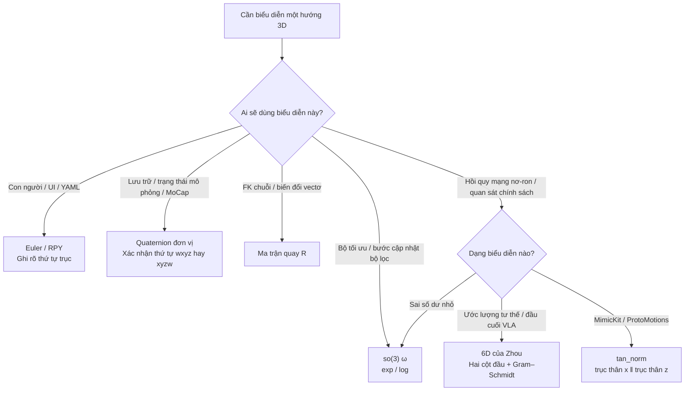

# So sánh các phương pháp biểu diễn xoay (SO(3)）

**Lựa chọn trong một câu:** Phép quay giống nhau thuộc về đa tạp $SO(3)$, được sử dụng trong kỹ thuật **tọa độ khác nhau** Mọi người đều làm việc riêng của mình——**góc Euler**Cho người khác xem,**đơn vị quaternion**lưu trữ với SLERP，**ma trận xoay**Thực hiện ghép chuỗi,**Vì thế(3) / góc trục**Thực hiện các bước tăng tối ưu hóa,**6D/tân_chuẩn mực** Cung cấp cho mạng hồi quy không bị ràng buộc. Áp dụng một biểu diễn cho toàn bộ ngăn xếp sẽ đồng thời vi phạm khóa phổ quát, phạm vi bao phủ kép và tính không trực giao.

## định nghĩa một câu

**Đối tượng pháp lý của phép quay ba chiều là nhóm Lie $SO(3)$; Góc Euler, bậc bốn, ma trận quay, ánh xạ góc/lũy trục và biểu diễn liên tục 6D đều là các tham số hóa của nó. Sự khác biệt là về chiều, điểm kỳ dị, tính duy nhất và liệu nó có phù hợp với hồi quy mạng thần kinh hay không.**

## Kiểm tra nhanh chữ viết tắt tiếng Anh

| viết tắt | Tên tiếng Anh đầy đủ | Mô tả ngắn gọn |
|------|----------|----------|
| SO(3) | Nhóm trực giao đặc biệt trong 3D | Nhóm xoay ba chiều:$R^\top R=I$，$\det R=1$ |
| RPY | Cuộn-Pitch-Yaw | Thứ tự góc Tait–Bryan Euler phổ biến nhất (các quy ước khác nhau tùy theo thư viện) |
| SLERP | Nội suy tuyến tính hình cầu | Nội suy vận tốc góc không đổi trên một quả cầu bậc bốn đơn vị |
| 6D | Xoay liên tục 6D | Chu CVPR 2019: Lấy $R$ Gram–Schmidt cho hai cột đầu tiên |
| IMU | Đơn vị đo quán tính | Đầu ra thái độ chủ yếu là quaternion hoặc RPY |

## Tại sao nó quan trọng

"Hướng giống nhau" trong ngăn xếp robot sẽ là **UI, đĩa, trạng thái mô phỏng, trình tối ưu hóa, mạng chính sách** Chuyển đổi giữa các định dạng. Hậu quả điển hình của việc lựa chọn sai:

- Nội suy góc Euler → vặn tư thế trung gian, khóa vạn năng và mất bậc tự do;
- Đệ tứ trực tiếp L2 → $q$ Và $-q$ Được coi là hai câu trả lời;
- Trung bình theo phần tử ma trận xoay → nhảy ra $SO(3)$；
- Hồi quy mạng Euler/Quaternion → Không gian tham số không liên tục và độ dốc bùng nổ tại điểm nhảy.

Trang này chỉ so sánh **quay(SO(3)）**; tư thế $T=(R,t)$ Nhìn thấy [SE(3) đặt ra đại diện](../formalizations/se3-representation.md). Xem công thức bậc bốn và thứ tự vô hướng [đơn vị quaternion](../formalizations/unit-quaternion-so3.md); Xem liên kết exp/log [trang của Lý Quẩn](../formalizations/lie-group-rigid-body-motions.md)。

## Nguyên tắc cốt lõi

### Đối tượng pháp lý so với tham số hóa

$$
SO(3)=\bigl\{R\in\mathbb{R}^{3\times 3}\ \big|\ R^\top R=I,\ \det R=1\bigr\}
$$

$SO(3)$ Đúng **đa dạng 3D**. bất kì $\mathbb{R}^n$ Tham số hóa hoặc **sự dư thừa**（$n>3$ thêm các ràng buộc) hoặc **Có những điểm kỳ dị/điểm gián đoạn**（$n=3$ Không thể phủ sóng toàn cầu một cách trơn tru). Đây là lý do hình học để lựa chọn, không phải là ưu tiên triển khai.

### Bảy biểu thức thường được sử dụng

| thể hiện | Kích thước | Những hạn chế/sự mơ hồ | số ít hoặc không liên tục | Tổng hợp/Nội suy | Thuận lợi | Nhược điểm | Cảnh mặc định |
|------|------|-------------|--------------|-------------|------|------|----------|
| **ma trận xoay** $R$ | 9 | $R^\top R=I$，$\det=1$(6 hạn chế) | Không có điểm kỳ dị tôpô; các giá trị sẽ trôi ra khỏi tính trực giao | Phép nhân ma trận; lerp theo yếu tố **bất hợp pháp** | vectơ hành động $Rv$ trực tiếp; xích FK thiên nhiên | Dư thừa, yêu cầu trực giao và chiếm băng thông | Hỗn hợp động học, đường ống đồ họa, lỗi trắc địa $\arccos((\mathrm{tr}R^\top\hat R-1)/2)$ |
| **Euler / RPY** | 3 | 12 loại trình tự trục; nhiều bộ góc có thể được sử dụng trong cùng một tư thế | **khóa đa năng**(Trục trung gian $\pm 90^\circ$ Mất 1 DoF); Bọc $2\pi$ không liên tục | lerp kênh phụ **Vòng quay của vật rắn không được duy trì** | Con người đọc, 3 số,UI / nhật ký | Vụ nổ hứa hẹn; Thái độ phạm vi rộng và mối nguy hiểm khác biệt tự động | Chỉ giao diện người-máy; chuyển đổi nội bộ thành quaternion hoặc $R$ |
| **Góc trục/vectơ xoay** $\theta n$ | 3 | $\theta$ Và $\theta+2\pi$ Cùng một vòng quay;$\theta=0$ Trục tùy ý | $\theta=\pi$ điểm kỳ dị logarit gần đó; qua $2\pi$ Nhiều giá trị | Rodrigues / điểm kinh nghiệm; xấp xỉ góc nhỏ là tốt | Không có ràng buộc về đơn vị; trực quan "đi vòng quanh bao nhiêu" | mất ổn định góc lớn; không phù hợp để tích hợp tọa độ toàn cầu lâu dài | sự xáo trộn nhỏ,IMU Véc tơ gia tăng, xoay trong giấy (Diebel) |
| **Vì thế(3) ánh xạ hàm mũ** $\omega$ | 3 | Tương tự như vectơ xoay $\mathbb{R}^3$;bởi vì $\exp([\omega]_\times)$ Quay lại nhóm | Góc đồng trục:$\|\omega\|=\pi$ gần log số ít | $R\leftarrow R\exp([\delta\omega]_\times)$ | **Các biến tối ưu hóa không bị ràng buộc**;với vòng xoắn / PoE thống nhất | có nghĩa **Tăng**, không phải là định dạng lưu trữ dài hạn | tạo dáng chụp ảnh,TO、WBC/MPC tuyến tính hóa |
| **đơn vị quaternion** $q$ | 4 | $\|q\|=1$；**$q\equiv -q$ bảo hiểm gấp đôi** | Không có khóa vạn năng;$\mathbb{R}^4\to SO(3)$ Lập bản đồ gián đoạn (Chu) | sản phẩm Hamilton;**SLERP** | Nhỏ gọn, ổn định về số lượng, tiêu chuẩn hoạt hình/MoCap | thứ tự vô hướng; độ trôi chiều dài mô-đun; không có hồi quy không giới hạn | Mô phỏng đế nổi,IMU Trạng thái, lưu trữ khung hình chính |
| **Chu 6D** | 6 | Không có ràng buộc bóng đơn vị; Gram–Schmidt khi giải mã | Phản xạ liên tục (trừ số đo 0); giải mã không ổn định khi hai cột thẳng hàng | Đầu tiên trực giao thành $R$ Quay lại với nhau một lần nữa | Mạng là $\mathbb{R}^6$ hồi quy trên **liên tục** | Nhiều hơn 2 chiều; cần phải trực giao; ngữ nghĩa là "hai cột đầu tiên bất kỳ" | đánh giá thái độ,VLA cuối về phía đầu |
| **rám nắng_chuẩn mực** | 6 | Tương tự như dòng liên tục 6D;$[R t_0\| R n_0]$ | Tương tự như 6D; trục tham chiếu cố định | Khôi phục trước $R$ | không có $q\equiv -q$; trục x/z có thể đọc được | Thuật ngữ không được sử dụng trong văn học; giống như Chu 6D **Đừng trộn lẫn** | [Bắt chướcKit](../entities/mimickit.md) /Khối quan sát ProtoMotions |

Góc trục, vectơ quay, v.v.(3) Trong tọa độ nó luôn luôn là **Vectơ 3D tương tự**;Sự khác biệt là **Ngữ nghĩa**: Khi sử dụng tư thế chung, nó sẽ va chạm. $2\pi$ đa giá trị khi **tăng cục bộ** Sử dụng là mặc định được tối ưu hóa.

### quyết định lựa chọn

### tính liên tục (tại sao DL Không thích Euler và quaternions)

Chu và cộng sự. CVPR 2019: Nếu $f:\mathbb{R}^n\to SO(3)$ Trong không gian tham số Euclide **không liên tục**, những thay đổi nhỏ trong đầu ra mạng có thể tương ứng với các đột biến tư thế.

| tham số hóa | $\mathbb{R}^n\to SO(3)$ liên tục? | nguyên nhân gốc rễ |
|--------|-------------------------------|------|
| góc Euler | KHÔNG | Khóa đa năng + quay lại chu kỳ góc |
| Đệ tứ | KHÔNG | Độ che phủ kép: cùng một điểm căn chỉnh $R$ |
| Góc trục (toàn cầu) | KHÔNG | $2\pi$ đa giá trị;$\pi$ tại nhật ký lạ |
| ma trận xoay / 6D / tan_chuẩn mực | Có (sau khi giải mã) | Thay thế tính liên tục bằng các chiều bổ sung và sau đó trực giao trở lại nhóm |

**Vẫn khuyến nghị tính toán tổn thất trong nhóm**: khoảng cách trắc địa $\arccos((\mathrm{tr}(R\hat R^\top)-1)/2)$, thay vì trực tiếp L2 Góc Euler hoặc bậc bốn của các dấu không thẳng hàng.

## thực hành kỹ thuật

### Phân công lao động mặc định đầy đủ

| lớp | gợi ý | lý do |
|----|------|------|
| Hồ sơ / RViz / Mẫu giấy | RPY，**Nêu thứ tự trục**(giống ZYX nội tại) | Mọi người đọc |
| MuJoCo / Pinocchio / Căn cứ nổi Isaac | Đệ tứ; thận trọng $n_q\neq n_v$ | Nhỏ gọn, không có khóa gimbal; vận tốc góc không $\dot q_{quat}$ |
| FK / biến đổi điểm | $R$ hoặc $T\in SE(3)$ | phép nhân ma trận |
| Ceres / g2o / Ipopt / MPC | Vì thế(3) hoặc se(3) Tăng | Không gian tiếp tuyến Jacobi, không bị ràng buộc |
| Hoạt hình khung hình chính | Đệ tứ SLERP | vận tốc góc không đổi, duy trì $\|q\|=1$ |
| cái đầu thái độ học tập | 6D hoặc rám nắng_chuẩn mực | Hồi quy liên tục; tính tổn thất trắc địa sau khi giải mã |

### Danh sách kiểm tra thực hiện

1. **trình tự trục**：`xyz` / `zyx` / Nội tại và bên ngoài phải được ghi vào giao diện; Diebel liệt kê 12 nhóm, đừng dựa vào "RPY"Đoán.
2. **Thứ tự bậc bốn**:Diebel/DeepMimic thường được sử dụng $(w,x,y,z)$；Pinocchio / scipy `Rotation` Thường được sử dụng $(x,y,z,w)$。
3. **bảo hiểm gấp đôi**：SLERP Nếu trước đây $q_1\cdot q_2<0$, lật một bên; sử dụng mất hồi quy $\min(\|q-\hat q\|,\|q+\hat q\|)$ Hoặc đổi sang 6D.
4. **chiếu hậu hội nhập**: bậc bốn `normalize`;ma trận SVD /Gram–Schmidt rút lui $SO(3)$。
5. **chiều quan sát**: Nếu khớp cầu dùng tan_định mức, mỗi khớp là **6** Không phải 4.

## Hạn chế và rủi ro

- **Không có “loại tốt nhất”**: Tọa độ toàn cục 3 chiều phải là số ít; hồi quy liên tục phải dư thừa. Việc lựa chọn là **Biểu diễn theo lớp**, không phải là một cuộc chiến tranh tôn giáo.
- **6D không thay thế đại số Lie**:6D Đã giải quyết **trở lại liên tục**;Tối ưu hóa bị ràng buộc, xoắn,PoE vẫn vậy(3)/se(3). Nhìn thấy [Những hiểu lầm thường gặp về trang của Lý Qun](../formalizations/lie-group-rigid-body-motions.md)。
- **rám nắng_định mức ≠ giấy 6D**: Cả hai đều thuộc họ 6 chiều liên tục, nhưng trục mã hóa và trực giao hóa khác nhau; trộn giải mã sẽ gây ra lỗi. $R$。
- **Góc Euler "đủ cho một phạm vi nhỏ"**: Trình diễn là được; một khi sân đã gần $\pm 90^\circ$ Hoặc mạng đang truyền ngược và khóa vạn năng sẽ đột ngột xuất hiện.
- **Cộng/trung bình ma trận xoay**: Các kết quả nhìn chung không trực giao. Thái độ được tính trung bình bằng cách sử dụng quaternions (cùng bán cầu) hoặc trong không gian tiếp tuyến $\exp(\frac1N\sum\log)$。

## Các trang liên quan

- [SE(3) đặt ra đại diện](../formalizations/se3-representation.md) — Vị trí + thái độ; trang này chỉ xóa vòng xoay
- [đơn vị quaternion và SO(3)](../formalizations/unit-quaternion-so3.md) — Sản phẩm Hamilton,SLERP, bậc vô hướng
- [Nhóm Lie, đại số Lie và phép quay vật rắn](../formalizations/lie-group-rigid-body-motions.md) — Phân công lao động giữa exp/log và lưu trữ/tối ưu hóa
- [rám nắng_quan sát vòng quay định mức](../formalizations/tan-norm-rotation.md) — Quan sát 6D mặc định của MimicKit
- [Chuyển đổi tọa độ đồng nhất](../formalizations/homogeneous-coordinates-transform.md) — $T$ bên trong $R$
- [Động lực cơ sở nổi](../concepts/floating-base-dynamics.md) — $n_q=7$、$n_v=6$
- [Modern Robotics Sách giáo khoa](../entities/modern-robotics-book.md) — Ch 3

## Nguồn tham khảo

- [Diebel 2006 Tham số hóa thái độ](../../sources/papers/diebel_2006_representing_attitude_quaternions.md) — Bảng chuyển đổi vectơ Euler/quaternion/véc tơ quay
- [Thợ đóng giày 1985 SLERP](../../sources/papers/shoemake_1985_quaternion_curves_siggraph.md)
- [Chu và cộng sự. CVPR 2019](../../sources/papers/zhou_2019_cvpr_continuity_rotation_representations.md) - 6D liên tục
- [Modern Robotics Trích từ Ch 3 Quaternions](../../sources/papers/modern_robotics_ch3_unit_quaternion.md)
- [Trí thông minh thể hiện của Deep Blue: Nhóm Lie, đại số Lie, bậc bốn](../../sources/blogs/wechat_shenlan_lie_group_lie_algebra_quaternion.md)
- [MimicKit tan_trích đoạn chuẩn mực](../../sources/repos/mimickit_tan_norm.md)

## Đề nghị đọc tiếp

- [Thái độ quỷ quái PDF](https://www.astro.rug.nl/software/kapteyn-beta/_downloads/attitude.pdf) — 12 bộ góc Euler và đạo hàm
- [Chu và cộng sự. CVPR 2019](https://arxiv.org/abs/1812.07035) - Bằng chứng về tính liên tục của biểu diễn xoay vòng mạng
- [Modern Robotics Ch 3 PDF](https://hades.mech.northwestern.edu/images/7/7f/MR.pdf) — với sự xoắn / PoE ngôn ngữ lý thuyết nhóm thống nhất
- [tuyến điều khiển chuyển động L0](../../roadmap/motion-control.md) — Trang so sánh các câu hỏi tự kiểm tra về "Ưu điểm và nhược điểm của số mũ ma trận/Euler/Quaternion"
