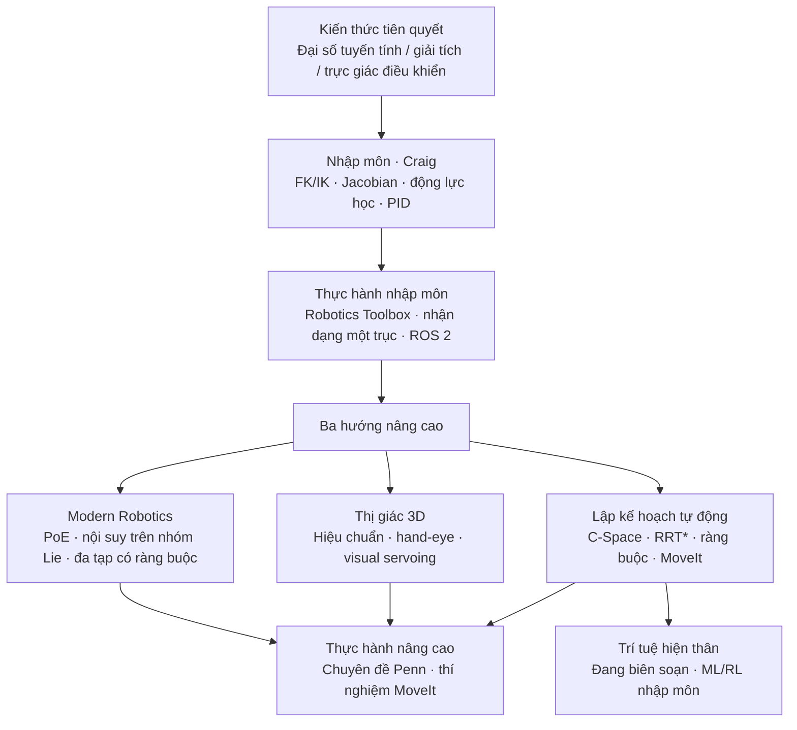

# Hướng dẫn nghiên cứu robot nguồn mở (qqfly)

**Trong một câu:** [learn-robotics.qqfly.net](https://learn-robotics.qqfly.net/) Nó được duy trì bởi qqfly **CC BY Cẩm nang tự học tiếng Trung 4.0**, dành cho các kỹ sư đại lục và sinh viên tốt nghiệp có "nền tảng không chuyên ngành": sử dụng **Cánh tay công nghiệp Craig** Đáy rồi có kinh **Modern Robotics Ngôn ngữ nhóm nói dối**、**Tầm nhìn 3D** Và **Cấu hình quy hoạch chuyển động không gian** Ba dòng hướng tới quy định độc lập; mỗi chương được trang bị Matlab/Python/ có thể thực thi đượcROS luyện tập. Phần tình báo hiện thân vẫn đang được sắp xếp.

## Kiểm tra nhanh chữ viết tắt tiếng Anh

| viết tắt | Tên tiếng Anh đầy đủ | Mô tả ngắn gọn |
|------|----------|----------|
| DH | Denavit–Hartenberg | Hệ tọa độ liên kết và mô hình bốn tham số, thường được sử dụng trong động học chuyển tiếp cánh tay công nghiệp |
| IK | Động học nghịch đảo | Cho tư thế cuối cùng, tìm góc khớp nghịch đảo |
| PoE | Sản phẩm của số mũ | Động học chuyển tiếp spinor/tích số mũ,Modern Robotics ngôn ngữ chính |
| Không gian C | Không gian cấu hình | Không gian cấu hình bao gồm các góc khớp là cơ sở lý thuyết cho việc lập kế hoạch chuyển động. |
| SE(3) | Nhóm Euclide đặc biệt trong không gian 3D | Nhóm tư thế cơ thể cứng nhắc ba chiều; sự tham gia trực quan bên ngoài vào việc hiệu chỉnh tay-mắt |
| TOPP | Tham số đường dẫn tối ưu theo thời gian | Tìm đường cong tốc độ tối ưu theo thời gian dọc theo đường hình học |
| MPC | Kiểm soát dự đoán mô hình | Kiểm soát tối ưu hóa ràng buộc miền thời gian lăn, giao điểm của ranh giới lập kế hoạch và kiểm soát |
| ROS 2 | Hệ điều hành Robot 2 | Phần mềm trung gian robot phi tập trung; cuốn sách này được khuyến khích để học trực tiếp ROS 2 |
| RL | Học tăng cường | Học chiến lược dựa trên dữ liệu; chương về trí thông minh thể hiện chỉ là phần giới thiệu tạm thời |

## Tại sao nó quan trọng

1. **Lấp đầy những khoảng trống trong “giáo dục có hệ thống”**: Lời nói đầu chỉ ra rằng nhiều sinh viên chế tạo robot trong nước mới chỉ thực hiện các dự án và thiếu đào tạo vòng kín về giải pháp/lập kế hoạch/điều khiển ngược; cuốn sách này **Trình tự tự học + bài tập phải làm** Viết cùng nhau sẽ dễ thực hiện hơn so với các giấy tờ/video rải rác.
2. **Ngăn xếp truyền thống của cánh tay công nghiệp → quy định độc lập**: Bắt đầu với Craig (DH, giá trị Jacobian IK、PID + Nhận dạng tiếp liệu, hiệu chuẩn); điền vào Lynch-Park để nâng cao **thái độ/tốc độ góc** pit, sau đó nhận C-Space và MoveIt của Choset/LaValle - và thư viện này [Modern Robotics](./modern-robotics-book.md) ngôn ngữ toán học,[PythonRobotics](./python-robotics.md) Hình thành hoạt hình thuật toán **Tường thuật tiếng Trung + tiếng Anh cổ điển + xác minh mã** tam giác.
3. **với thư viện này [tuyến điều khiển chuyển động](../../roadmap/motion-control.md) Phân công lao động**：thư viện này L0–L7 qua **búp bê / đế nổi / WBC–RL–Sim2Real** Trục chính; cuốn sách này thiên vị **Bộ điều khiển cơ sở cố định + giảng dạy công nghiệp → lập kế hoạch nhận thức**, phù hợp với L−1–L3 Người đọc xây dựng cái nhìn toàn cảnh song song về quy định và kiểm soát, sau đó chuyển sang chủ đề hình người.
4. **Nguồn mở và có thể bảo trì**: mã nguồn [github.com/qqfly/how-to-learn-robotics](https://github.com/qqfly/how-to-learn-robotics), trang MkDocs với PR Quá trình này rõ ràng; một chiếc gương tiếng Anh sẽ có vào năm 2026-07.

## Tổng quan về quy trình (thứ tự đọc được đề xuất)

| sân khấu | Chương trang web | đầu ra phím | Đọc thêm trong thư viện này |
|------|---------|---------|-------------|
| Điều kiện tiên quyết | điều kiện tiên quyết | Tạo dòng lạ, điều khiển Brian Douglas, kiến ​​thức cơ bản về Linux/C | [Giám tuyển đại số tuyến tính](./linear-algebra-curriculum.md) |
| bắt đầu | bắt đầu | Sáu trục DH Giải pháp thuận và nghịch, Jacobi IK, động lực học ba trục, tiến thẳng PID | [Modern Robotics](./modern-robotics-book.md) Điều khiển Ch 4–8 |
| luyện tập | tay bẩn | Câu trả lời về Hộp công cụ Corke,ROS 2 Hướng dẫn chính thức | [ROS 2 điều cơ bản](../concepts/ros2-basics.md)、[PythonRobotics](./python-robotics.md) |
| robot hiện đại | robot hiện đại | Nội suy nhóm, tư thế Bezier, R(3)⊕SO(3) hạn chế xây dựng | [Nhóm nằm và chuyển động cơ thể cứng nhắc](../formalizations/lie-group-rigid-body-motions.md) |
| Tầm nhìn 3D | tầm nhìn 3d | Hiệu chuẩn OpenCV,AX=XB Vòng khép kín bằng tay, trực quan | [ước tính trạng thái](../concepts/state-estimation.md) |
| lập kế hoạch độc lập | lập kế hoạch chuyển động | C-Space, lập kế hoạch lấy mẫu/tối ưu hóa, không gian bằng không,TOPP | [tối ưu hóa quỹ đạo](../methods/trajectory-optimization.md)、[Di chuyển nó 2](../entities/moveit2.md) |
| trí thông minh thể hiện | hiện thân-ai | Sutton RL、ML Chuỗi công cụ (chương đang được xây dựng lại) | [học tăng cường](../methods/reinforcement-learning.md) |
| Thực hành nâng cao | thực hành nâng cao | Dự án đặc biệt của Penn Robotics, MoveIt mười thí nghiệm so sánh quy hoạch | [điều khiển chuyển động](../../roadmap/motion-control.md) L4+ |

## Cấu trúc/cơ chế cốt lõi

**Lập trường tường thuật:** Từ “mã tổ tiên, chỉ có điểm chung được công bố,PID Bắt đầu từ sự nhầm lẫn về "ở đâu", nhấn mạnh **Tự học dựa trên dự án đại lục** Và **Các khóa học hệ thống ở Hồng Kông và Đài Loan/ở nước ngoài** Nếu có lỗ hổng, hãy sử dụng hướng dẫn nguồn mở để sửa đường dẫn.

**Trục bắt đầu (Craig):** Đã sửa đổi DH → Phép nhân chuỗi lời giải thuận → Giải pháp nghịch đảo phân tích/số → Lưỡng tính lực/vận tốc Jacobi → Newton-Euler (ba trục đầu tiên và sau đó mở rộng) → PID + Quỹ đạo T/S → Hiệu chuẩn Động học/Kinematics và phát hiện va chạm cánh tay cộng tác.

**Trục nâng cao (ba dòng):**
- **toán học:** PoE Nội suy thống nhất với ⊕/⊖ để giải thích khóa Gimbal, xoay trung bình, chuyển đổi thái độ Bezier;
- **Sự nhận thức:** Mô hình lỗ kim + vòng hiệu chỉnh tay-mắt, ước tính tư thế từ mẫu đến ICP, servo trực quan giúp loại bỏ lỗi tích lũy;
- **ra quyết định:** Không gian C và lời nguyền của chiều, bốn loại bản đồ thuật toán để tìm kiếm/tối ưu hóa/lấy mẫu/học tập đồ thị, đa tạp bị ràng buộc và không gian rỗng, cũng như bản đồ đường đi thực nghiệm cho môi trường bán cấu trúc công nghiệp.

**Danh sách kiểm tra thực hành (Trích):** tự viết FK/Jacobian/giá trị số IK So sánh với hộp công cụ; Nhóm Slerp vs Lie Đường cong vận tốc góc Bezier; OpenCV + `calibrateHandEye`;MoveIt Lập kế hoạch cho cùng một nhiệm vụ mười lần để trải nghiệm tính ngẫu nhiên.

## Những cạm bẫy hoặc hạn chế phổ biến

- **Lầm tưởng: Sau khi đọc cuốn sách này = biết hình dạng con người WBC/RL** —Chương về trí thông minh thể hiện vẫn đang được sắp xếp; dòng chính của cuốn sách là **Cánh tay robot cơ sở cố định + bộ điều chỉnh**, để vào hình dạng con người, bạn cần truy cập vào thư viện. [điều khiển chuyển động](../../roadmap/motion-control.md) L4 sau đó.
- **Chuyện hoang đường: Craig Vs. Modern Robotics Chọn một** - Tác giả rõ ràng **Đầu tiên DH/lại là trực giác công nghiệp PoE/Lý Quần**;Với thư viện này "L0 Tạo dòng → MR Ch 2–3" có thể chạy song song mà không bị xung đột.
- **Hạn chế: Không sâu sắc như một cuốn sách chuyên khảo** - động lực học,SLAM、MPC Hầu hết đều là lộ trình + từ khóa, chi tiết vẫn cần quay lại Craig/Khalil/Choset/LaValle và trang phương pháp của thư viện này.
- **Hạn chế: Phiên bản tiếng Anh là AI Hỗ trợ dịch thuật** — Đánh giá kỹ thuật phải tuân theo trang web Trung Quốc và GitHub.

## Nguồn tham khảo

- [nguồn/khóa học/tìm hiểu_người máy_qqfly_hướng dẫn.md](../../sources/courses/learn_robotics_qqfly_guide.md)
- [Hướng dẫn nghiên cứu robot nguồn mở (trang tiếng Trung)](https://learn-robotics.qqfly.net/)
- [Hướng dẫn học tập về robot nguồn mở（Tiếng Anh）](https://en.learn-robotics.qqfly.net/)
- [github.com/qqfly/how-to-learn-robotics](https://github.com/qqfly/how-to-learn-robotics)

## Các trang liên quan

- [Modern Robotics(Sách giáo khoa Lynch-Park)](./modern-robotics-book.md) — Tài liệu chính của chương nâng cao “Robot hiện đại”
- [PythonRobotics](./python-robotics.md) — Hoạt hình thuật toán robot di động và các thí nghiệm giới thiệu
- [Giám tuyển học đại số tuyến tính](./linear-algebra-curriculum.md) — L0 Nền tảng toán học, bám sát lộ trình Lạ của chương tiên quyết
- [Tối ưu hóa quỹ đạo](../methods/trajectory-optimization.md) — Phòng Kế hoạch Độc lập TOPP Giao diện tối ưu hóa quỹ đạo
- [Di chuyển nó 2](../entities/moveit2.md) — Bài tập nâng cao thử nghiệm MoveIt xếp chồng tương ứng
- [Lộ trình phát triển điều khiển chuyển động](../../roadmap/motion-control.md) — Tuyến đường chính của người/hai chân, bổ sung cho hướng dẫn này
- [Ngân hàng câu hỏi phỏng vấn tần số cao thông minh được thể hiện](./embodied-interview-qa.md) - Kiểm tra nhanh cuộc phỏng vấn xin việc thể hiện (VLA/RL/chân và bàn chân); cuốn sách này tập trung vào việc tự nghiên cứu về quy định và kiểm soát dựa trên cơ sở cố định
- [Phỏng vấn mã hóa Đại học](./coding-interview-university.md) — Lộ trình xử lý câu hỏi/thuật toán chung của Dachang; bổ sung CS Cơ sở phỏng vấn

## Đề nghị đọc tiếp

- [Giới thiệu về Người máy (Craig)](https://learn-robotics.qqfly.net/references.html) - Sách giáo khoa giới thiệu
- [Khóa học Modern Robotics Đặc biệt](https://www.coursera.org/specializations/modernrobotics) — PoE bài học video
- [Chuyên ngành Robot của Penn (Coursera)](https://www.coursera.org/specializations/robotics) — Hệ thống các khóa học mở được đề xuất trong Chương Thực hành nâng cao
