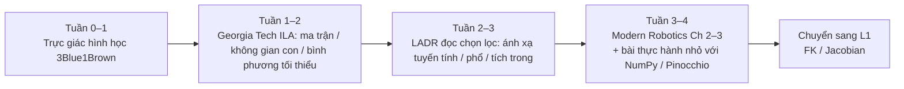

---

type: entity
tags: [textbook, linear-algebra, education, foundational, kinematics, control, georgia-tech]
status: complete
updated: 2026-09-11
related:
  - ../formalizations/eigenvalues-eigenvectors.md
  - ../formalizations/se3-representation.md
  - ../formalizations/lie-group-rigid-body-motions.md
  - ../formalizations/lqr.md
  - ./modern-robotics-book.md
  - ./pinocchio.md
  - ../../roadmap/motion-control.md
sources:
  - ../../sources/courses/gatech_interactive_linear_algebra.md
  - ../../sources/courses/gatech_ila_sec5_1_eigenvalues_eigenvectors.md
  - ../../sources/courses/axler_linear_algebra_done_right_4e.md
  - ../../sources/courses/axler_ladr4_ch5_eigenvalues_invariant_subspaces.md
  - ../../sources/courses/strang_mit_18_06_ila5_eigenvalues.md
  - ../../sources/courses/linear_algebra_teaching_materials_curated.md
summary: "运动控制 L0 线性代数策展：Georgia Tech 交互教材、Axler LADR4e 与 Strang/3Blue1Brown 等互补入口，按机器人矩阵语言（变换、子空间、最小二乘、谱）组织精读地图。"
---

# Giám tuyển học đại số tuyến tính (Robotics L0）

**Trong một câu:** Điều khiển chuyển động của robot ghi tư thế, tốc độ và lực dưới dạng vectơ và ma trận; trang này mô tả [Georgia Tech ILA](https://textbooks.math.gatech.edu/ila/)、[Axler *Đại số tuyến tính Thực hiện đúng* 4e](https://linear.axler.net/LADR4e.pdf) và các tài liệu hỗ trợ xuất sắc phổ biến, được tổ chức thành các tài liệu có thể thực thi được **L0 lộ trình đại số tuyến tính**, và nhận [Lộ trình phát triển điều khiển chuyển động](../../roadmap/motion-control.md) Giai đoạn nền tảng toán học.

## Kiểm tra nhanh chữ viết tắt tiếng Anh

| viết tắt | Tên tiếng Anh đầy đủ | Mô tả ngắn gọn |
|------|----------|----------|
| LQR | Bộ điều chỉnh bậc hai tuyến tính | Bộ điều khiển phản hồi tối ưu theo chi phí bậc hai cho hệ thống tuyến tính |
| API | Giao diện lập trình ứng dụng | giao diện lập trình ứng dụng |
| IK | Động học nghịch đảo | Giải quyết nghịch đảo động học của các góc khớp thỏa mãn các ràng buộc cuối/thái độ |
| iLQR | Bộ điều chỉnh bậc hai tuyến tính lặp | Phương pháp tối ưu hóa quỹ đạo cho giải pháp tuyến tính hóa lặp của hệ phi tuyến |
| QP | Lập trình bậc hai | Sẽ WBC/Bài toán điều khiển được viết dưới dạng nghiệm chuẩn của quy hoạch bậc hai |

## Tại sao nó quan trọng?

1. **L0 Không thể bỏ qua**: Không có ngôn ngữ ma trận và tôi không thể hiểu được nó. SE(3)、Jacobian、LQR Đệ quy Riccati.
2. **Các tài liệu giảng dạy bổ sung cho nhau nên bạn không cần phải mua chỉ một cuốn sách.**: Trực giác hình học (3Blue1Brown / ILA) + tiên đề ánh xạ tuyến tính (LADR) + Bốn không gian con chính (Strang) của đồ án bao gồm các điểm mắc kẹt chung của robot.
3. **Và [Modern Robotics](./modern-robotics-book.md) Phân công lao động rõ ràng**: Trang này bổ sung thêm "Đại số tuyến tính phổ quát";Modern Robotics Được sử dụng từ Ch 3 SE(3) / vặn vẹo nói**Chỉ có thân cứng**ngôn ngữ.

## Lộ trình học tập được đề xuất (L0, khoảng 2–4 tuần song song)

| sân khấu | Vật liệu | Đầu ra liên quan đến robot |
|------|------|----------------|
| trực giác | [Bản chất của đại số tuyến tính](https://www.3blue1brown.com/topics/linear-algebra) | Hiểu phép biến đổi tuyến tính = biến dạng không gian; báo trước rằng phép quay "không thể nội suy tuyến tính" |
| Tính toán + Hình học | [Đại số tuyến tính tương tác](https://textbooks.math.gatech.edu/ila/) | Tính toán bằng tay/hiểu biết tương tác về không gian cột, bình phương nhỏ nhất,QR |
| kết cấu | [LADR 4e PDF](https://linear.axler.net/LADR4e.pdf) | Bó Jacobian, hệ thống tuyến tính hóa được coi là ánh xạ tuyến tính + phổ |
| ngôn ngữ cơ thể cứng nhắc | [Modern Robotics](./modern-robotics-book.md) Ch 2–3 | SE(3), chỉ số ma trận,PoE Và [SE(3) thể hiện](../formalizations/se3-representation.md) |
| Cảm giác mã | [Pinocchio](./pinocchio.md) nhỏ nhất FK Thử nghiệm | Các phép toán ma trận rơi vào thư viện API |

## Sơ đồ chương: Chủ đề sách giáo khoa → Trang thư viện

| Chủ đề đại số tuyến tính | Nó tương ứng với cái gì trong robot? | Đọc thêm trong thư viện này |
|-------------|-------------------|-------------|
| Phép nhân ma trận, thành phần biến đổi tuyến tính | Chuỗi chuyển đổi đồng nhất, tầng tham số bên ngoài cảm biến | [SE(3) thể hiện](../formalizations/se3-representation.md) |
| Ma trận trực giao, duy trì độ dài | quay \(R\in SO(3)\) | [Nhóm nằm và chuyển động cơ thể cứng nhắc](../formalizations/lie-group-rigid-body-motions.md) |
| Không gian cột/thứ hạng/không gian rỗng | cánh tay thừa IK, liệu các ràng buộc có độc lập hay không | [Kiểm soát toàn thân](../concepts/whole-body-control.md)(Trực giác xếp chồng nhiệm vụ) |
| Bình phương tối thiểu, giả nghịch đảo,QR | giá trị số IK, ước tính trạng thái, hiệu chuẩn bình phương tối thiểu theo lô | [Tối ưu hóa quỹ đạo](../methods/trajectory-optimization.md) |
| Giá trị riêng, ma trận đối xứng,SVD | sự ổn định của hệ thống tuyến tính,LQR, bệnh hoạn Jacobi | [Giá trị riêng và vectơ riêng](../formalizations/eigenvalues-eigenvectors.md) · [LQR / iLQR](../formalizations/lqr.md) |
| Sản phẩm bên trong, hình chiếu trực giao | chiếu không gian nhiệm vụ,QP Ý nghĩa hình học của lời giải | [Kiểm soát tối ưu](../concepts/optimal-control.md) |

## Cách chọn 3 bộ tài liệu chính (không cần phải đọc hết)

| nền tảng của bạn | Sự kết hợp được đề xuất |
|---------|---------|
| Chỉ biết ma trận cấp cao, không có trực giác hình học | 3Blue1Brown → GT ILA Nửa đầu → Modern Robotics Ch 3 |
| Chuyên ngành kỹ thuật đã học được cách tạo dòng phiên bản xác định nhưng rất khó đọc công thức của robot | Bỏ qua 3b1b hoặc tốc độ gấp đôi;GT ILA không gian con + bình phương tối thiểu;LADR Chương 3–5 Bài đọc chọn lọc |
| Khoa Toán / Muốn bù đắp cho sự khắt khe | LADR Chúa;GT ILA Làm bài tập tính toán; Trefethen & Bau đang nghiên cứu các giá trị số IK Đã đến lúc bù đắp |

**Vật liệu mở rộng**(Strang 18.06, Toán nhập vai, tạo dòng số, v.v.) Xem trang quản lý nguồn [tuyến tính_đại số_giảng dạy_nguyên vật liệu_giám tuyển.md](../../sources/courses/linear_algebra_teaching_materials_curated.md)。

## Những hiểu lầm phổ biến

- **Hiểu lầm 1: Coi ma trận quay như ma trận thông thường cho phép nội suy cộng** → nên dùng SO(3) Ánh xạ hàm mũ trên / quaternion slerp (xem L0 Câu hỏi tự kiểm tra và [SE(3) thể hiện](../formalizations/se3-representation.md)）。
- **Hiểu lầm 2: Chỉ trả lời câu hỏi mà không làm mã robot** → L0 Đầu ra phải là NumPy + một FK Bản demo, không phải là sách bài tập ghi điểm đầy đủ.
- **Chuyện lầm tưởng 3: Trong L0 Tìm hiểu sâu hơn về tensor/hàm** → búp bê L4 Trước đây, không gian con + bình phương tối thiểu + phổ + SE(3) Đủ; tensor sẽ được điền vào sau khi đọc tiêu đề hành động học sâu.

## Các trang liên quan

- [Lộ trình phát triển điều khiển chuyển động (L0）](../../roadmap/motion-control.md#l0-数学与编程基础) — Điểm gắn kết chính cho việc quản lý này
- [Modern Robotics Sách](./modern-robotics-book.md) — L0 Thân “cuốn sách ngữ pháp” cứng nhắc tiếp theo
- [SE(3) đại diện](../formalizations/se3-representation.md)
- [Giá trị riêng và vectơ riêng](../formalizations/eigenvalues-eigenvectors.md)
- [LQR / iLQR](../formalizations/lqr.md)
- [Pinocchio](./pinocchio.md)
- [Giáo trình tối ưu hóa số](./numerical-optimization-curriculum.md) — L0+ Tối ưu hóa số (QP / NMPC /Thuật toán TrajOpt)

## Nguồn tham khảo

- [nguồn/khóa học/gatech_tương tác_tuyến tính_đại số.md](../../sources/courses/gatech_interactive_linear_algebra.md)
- [nguồn/khóa học/axler_tuyến tính_đại số_xong_Phải_4e.md](../../sources/courses/axler_linear_algebra_done_right_4e.md)
- [nguồn/khóa học/tuyến tính_đại số_giảng dạy_nguyên vật liệu_giám tuyển.md](../../sources/courses/linear_algebra_teaching_materials_curated.md)
- [nguồn/khóa học/gatech_ila_giây5_1_giá trị riêng_eigenvectors.md](../../sources/courses/gatech_ila_sec5_1_eigenvalues_eigenvectors.md)
- [nguồn/khóa học/axler_chàng trai4_ch5_giá trị riêng_bất biến_không gian con.md](../../sources/courses/axler_ladr4_ch5_eigenvalues_invariant_subspaces.md)
- [nguồn/khóa học/lạ_với_18_06_ila5_giá trị riêng.md](../../sources/courses/strang_mit_18_06_ila5_eigenvalues.md)

## Khuyến khích đọc tiếp (bên ngoài)

- [Đại số tuyến tính tương tác](https://textbooks.math.gatech.edu/ila/)
- [Đại số tuyến tính đúng 4e（PDF）](https://linear.axler.net/LADR4e.pdf)
- [MIT 18.06 Đại số tuyến tính（OCW）](https://ocw.mit.edu/courses/18-06-linear-algebra-spring-2010/)
